

<h1 style="text-align: center;">Medousa</h1>

<strong>Turn chaotic life into stone.</strong>

Medousa is a permanent AI workspace that lives on your devices. It remembers what you tell it, verifies what it tells you, and keeps working even when you close the window.

Talk from the app, Discord, Telegram, Slack, or WhatsApp. Send the big job to the background. Wake up to finished guides in your vault — not chat that disappears.

<em>One brain, your PC, your phone, your scheduled work, your memory — always here, always yours.</em>

<strong>Local-first. No Medousa subscription. Answers you can trace.</strong>

  <a href="https://releases.entasislabs.com/medousa/stable/installer-bootstrap.json"><strong>Download Medousa</strong></a>
  · Mac · Windows · Linux · iOS &amp; Android companion

---

## What you can do with it

| You need to… | So you… |
|---|---|
| Remember where you left off | Ask Medousa. It keeps your history — and who you are — across days. |
| Stop re-introducing yourself | Tell it once. Your preferences, your people, your rhythms. It builds a picture of you that gets sharper over time. |
| Switch context on one engine | **Profiles** are hats on one brain (`work`, `home`, …) — not separate accounts. |
| Wear a different voice on command | Switch to a **specialty** — morning brief, research deep-dive, or a skill you imported from Cursor, Hermes, or OpenClaw. |
| Get answers you can trust | For live facts it goes out, gathers sources, and shows you the trail — including a thinking trace when the model provides one. |
| Keep finished work as artifacts | **Presentations** and HTML guides land in **Library** — readable, exportable, not buried in scrollback. |
| Browse and save the web | Built-in **Web** surface: tabs, bookmarks, save a page to your vault, hand off to the agent when needed. |
| Automate what actually matters | Schedule a check-in, a report, or a full working session. Medousa runs it while you sleep. The answer finds you. |
| Hand off the heavy lifting | Send the big job to the background. One clear answer comes back — not a pile of half-finished threads. |
| Connect nearby workshops | **Peers** — discover trusted engines on your LAN (or over the tunnel), share turns, inbox between your machines. |
| Plug in what you already use | Connect the tools and services you rely on. Medousa learns what they can do — and asks before it acts. |
| Reach it from anywhere | Discord, Telegram, Slack, WhatsApp. Text `/brief` on Telegram and your morning summary starts. |
| Use your phone as a portal | iOS and Android pair to a desktop running the engine (QR). Your phone is the window — not a second brain host. |
| Pin your own pages | Ask Medousa to build **custom views** — braindumps, studios, live dashboards — in the sidebar (**Settings → Canvas**). |
| Get checked in on | Turn on proactive nudges. Medousa reaches out on a rhythm you choose — with reasoning, not noise. |
| Run it fully offline | **Private brain** on your device — Gemma, local. Your hardware. Your rules. (Cloud models are optional — bring your own keys.) |
| Start fresh on a new device | Run **Medousa Installer** or open the app, welcome flow, land in chat. About ninety seconds. No terminal. |

Screenshots in [`assets/screenshots/`](assets/screenshots/). Recapture with `npm run assets:capture` in **medousa-landing** when UI changes.

### Chat — memory and thinking trace
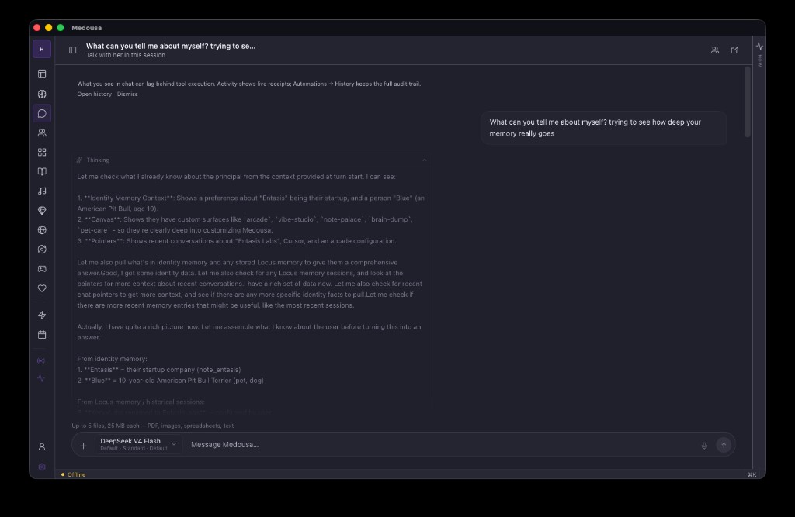

### Vault — notes you keep
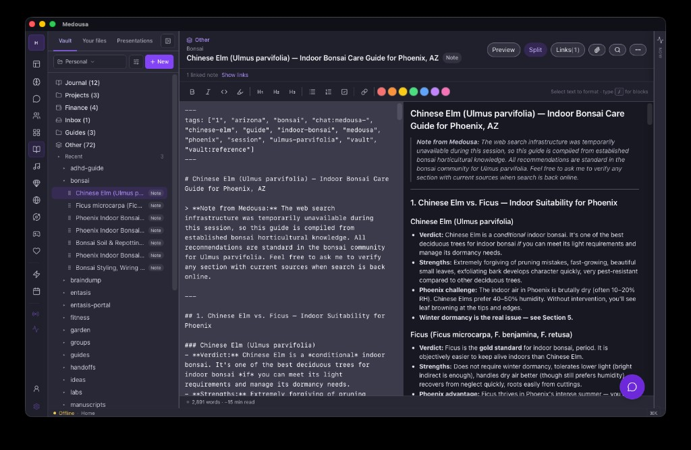

### Presentations — sandbox artifacts in Library
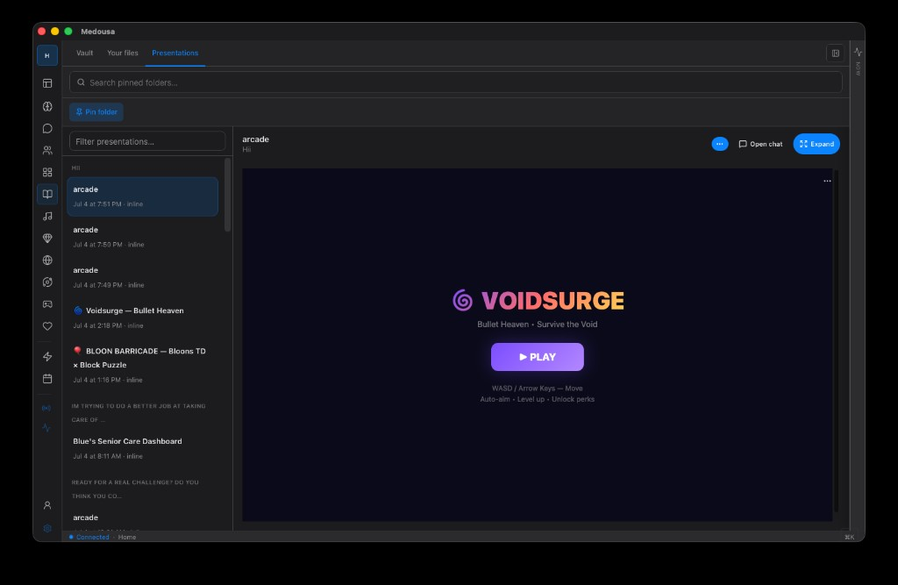

### Custom canvas — dashboards you pin
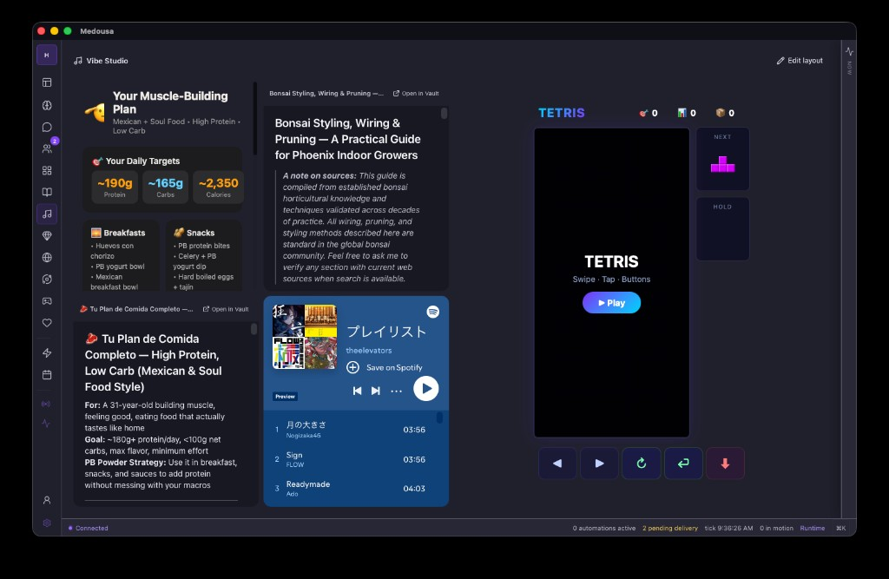

### Automations — flows and schedules
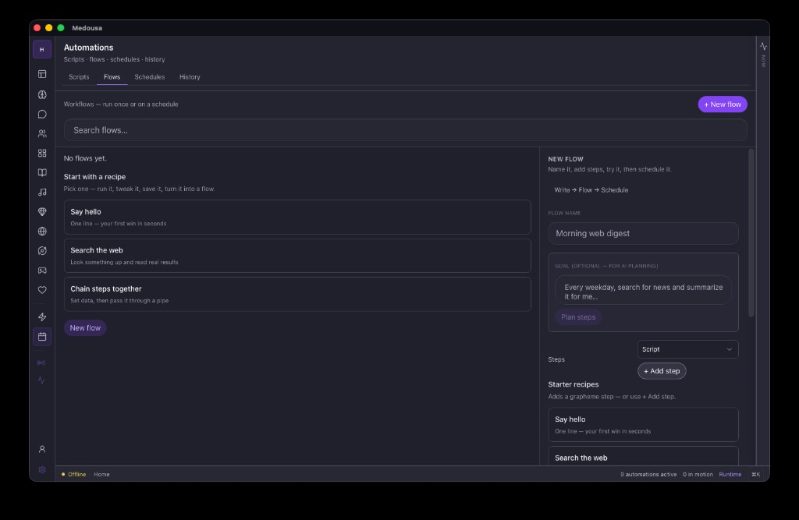

### Peers — inbox between your machines
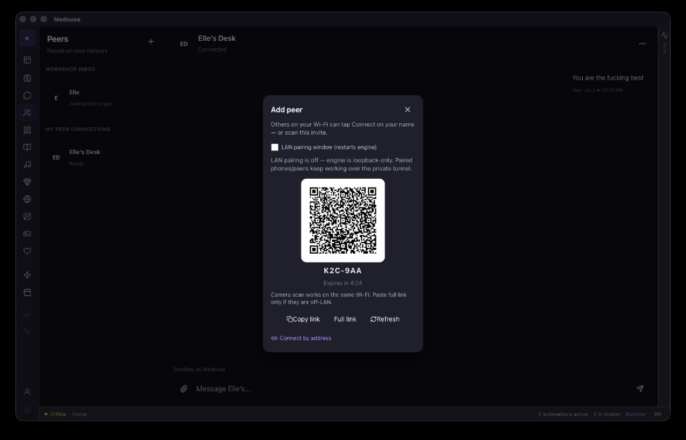

### LAN pairing — QR invite
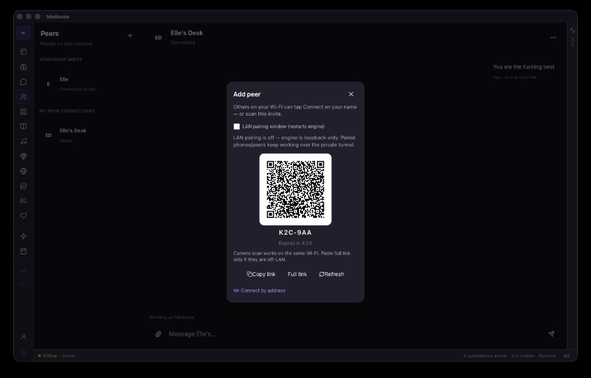

### Messaging — Telegram, Discord, Slack, WhatsApp
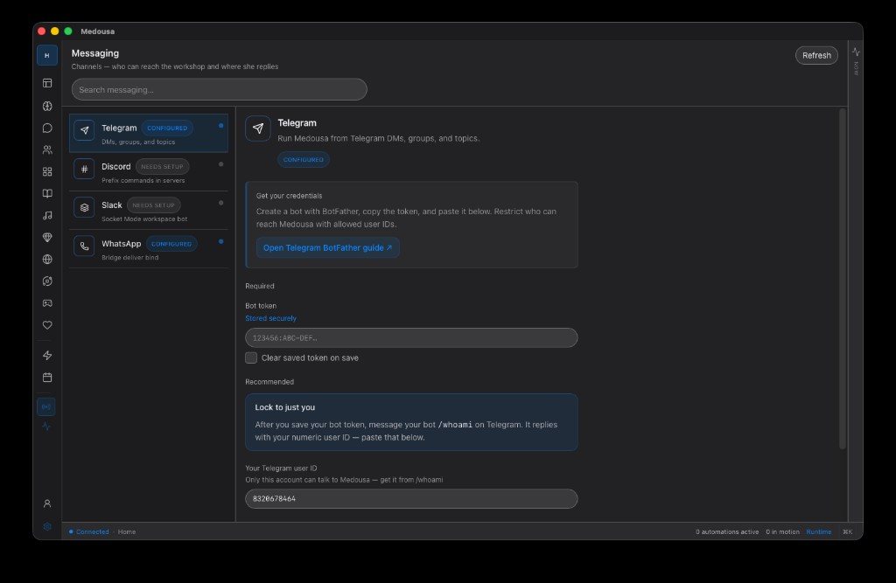

### Identity — who she knows you as
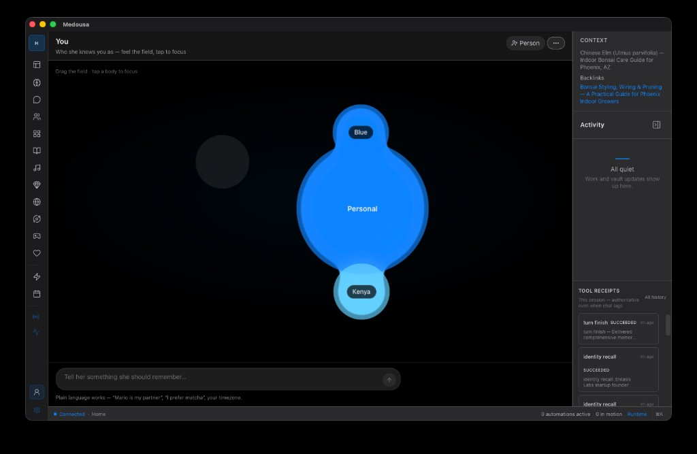

### Settings — room, memory, models, reach
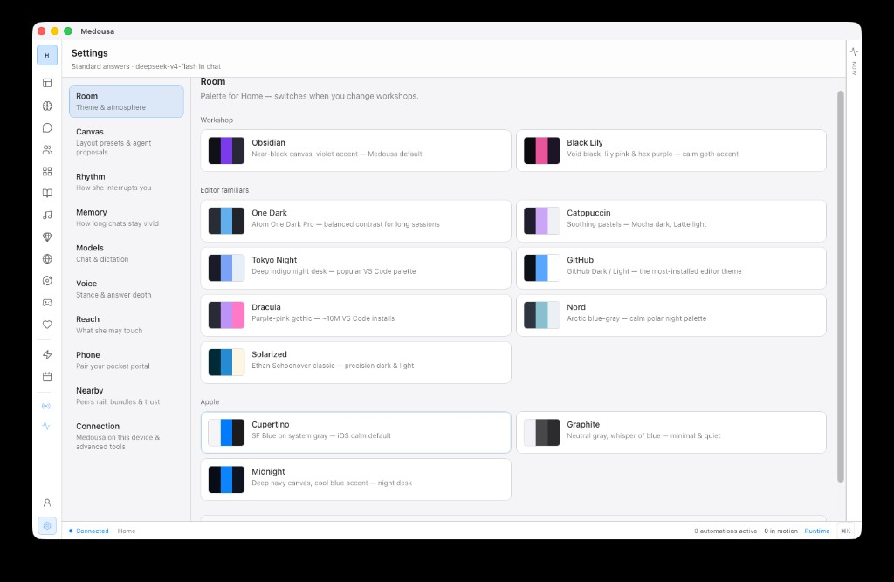

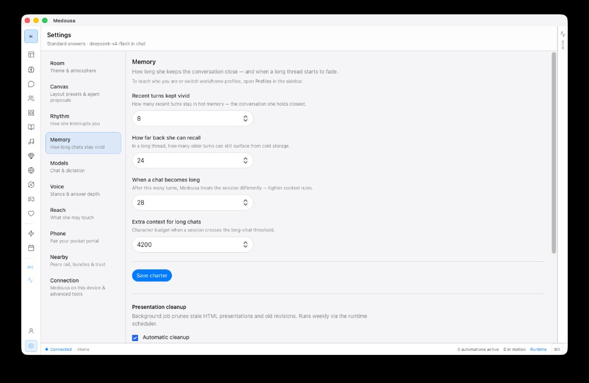

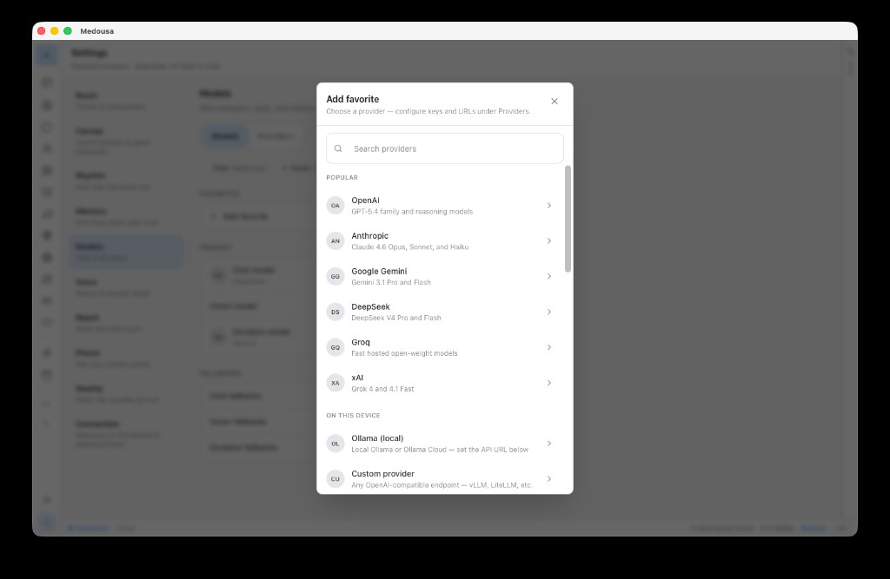

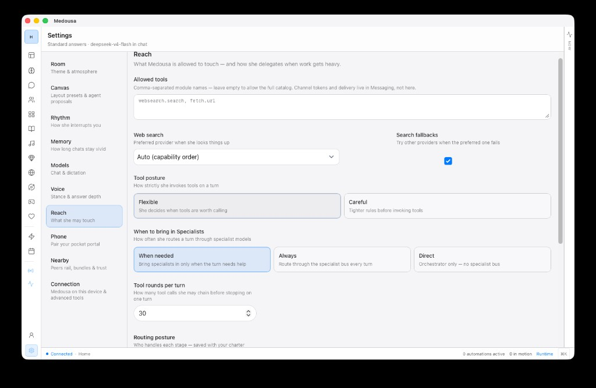

---

## What makes it reliable

You are not watching Medousa when it works. That is the point.

When you send a message or schedule a check-in, Medousa turns it into work that cannot be lost. If your laptop goes to sleep, if the network drops, if the engine restarts — that work waits. It retries. It picks up where it left off.

You never have to wonder whether something finished. If Medousa accepted it, it ran.

---

## What makes it safe

When Medousa runs a script — processing a spreadsheet, fetching a page, transforming a file — it runs inside a sealed environment. That script cannot touch your documents, your passwords, or your other applications unless you explicitly say it can.

When it reaches outside — sending a message, calling an external service — it can ask you first.

You do not have to trust the script. You only have to trust the seal.

---

## What makes it remember

Most assistants amnesia every time you open them. Medousa doesn't.

It remembers **what happened** — the texture of your weeks, compressed and searchable.

It remembers **who you are** — how you take your coffee, who Mario is, what you care about this quarter. The essentials surface at the start of every turn. Ask for more when you need it.

You can export that picture as markdown. Edit it. Hand it back. Or teach Medousa one fact at a time when you want to.

---

## Specialties

Some jobs deserve their own voice. A **specialty** (manuscript) is a pack with its own tone, boundaries, and optional schedule — morning brief, research deep-dive, memory ritual. Run it in chat, delegate it to the background, or schedule it to land in Telegram.

Shipped example: **morning-brief** — one command on Telegram, your day summarized.

Coming from **Hermes**, **OpenClaw**, or **Cursor**? Import `SKILL.md` skills as specialties — same format, one runtime. Details: **[skills and specialties](docs/cookbook/skills-and-specialties.md)**.

---

## Medousa Engine (developers)

The app is a client. The engine is the product underneath — durable jobs, HTTP API, local inference, MCP, channel ingest. Run it headless. Call it from your stack. Same runtime the app uses on every platform.

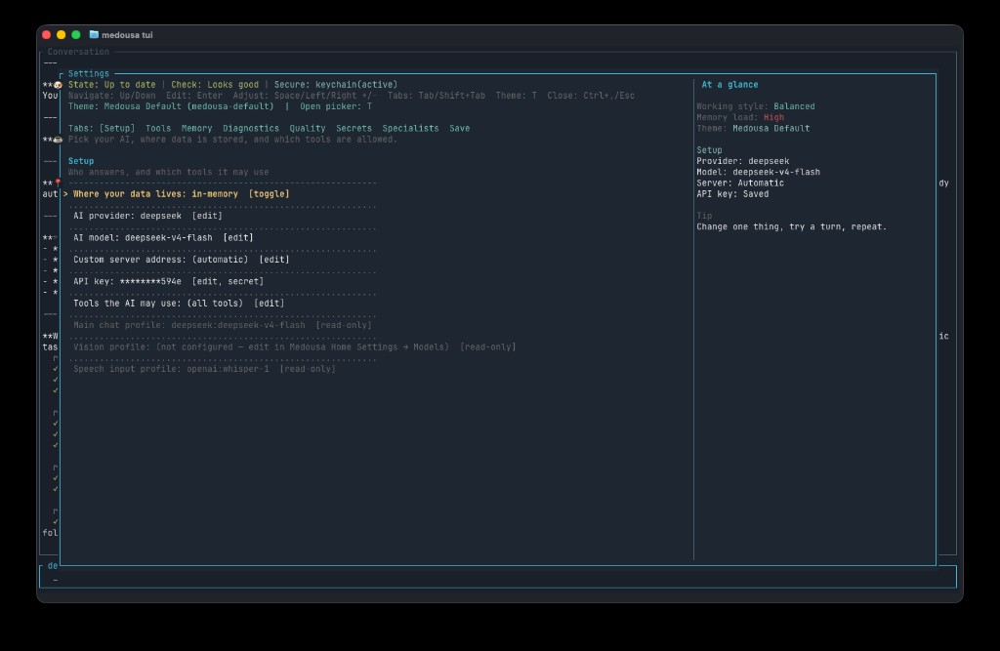

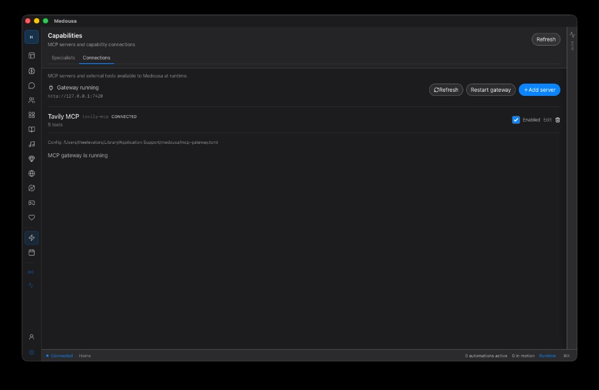

**[Developer docs →](docs/README.md)** · CLI and TUI for power users — not required for the welcome flow.

---

## Get Medousa

**[Download →](https://releases.entasislabs.com/medousa/stable/installer-bootstrap.json)** (picks the installer for your platform)

Or browse [GitHub Releases](https://github.com/EntasisLabs/Medousa/releases) · [install & self-host](docs/cookbook/install-and-self-host.md)

**Medousa Installer** — desktop + engine + optional adapters and private brain in one flow. **Medousa** app — Mac, Windows, Linux. **iOS / Android** — companion; pairs to a desktop engine via QR.

Open it. Pick your model path in the welcome flow. If you chose private mode, the model downloads to your device. Land in chat. About ninety seconds.

---

## Built on Stasis, Locus, and Resonantia

Medousa is not a chat wrapper pretending to be durable. **[Stasis](https://github.com/EntasisLabs/stasis)** makes work finish and survive restarts. **[Locus](https://github.com/EntasisLabs/locus)** makes memory structured and retrievable. **[Resonantia](https://resonantia.me)** is the sibling surface — same foundation, memory made visible as terrain.

---
