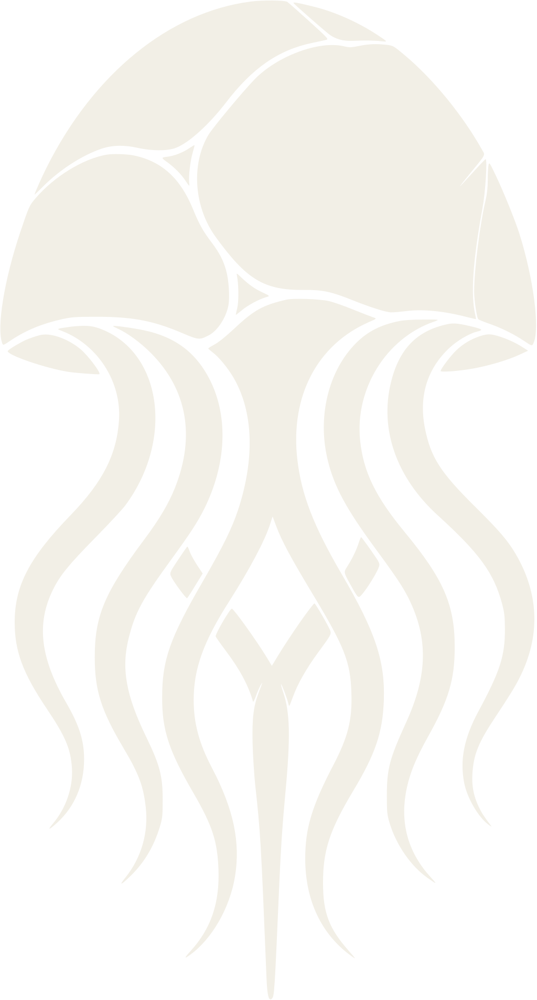
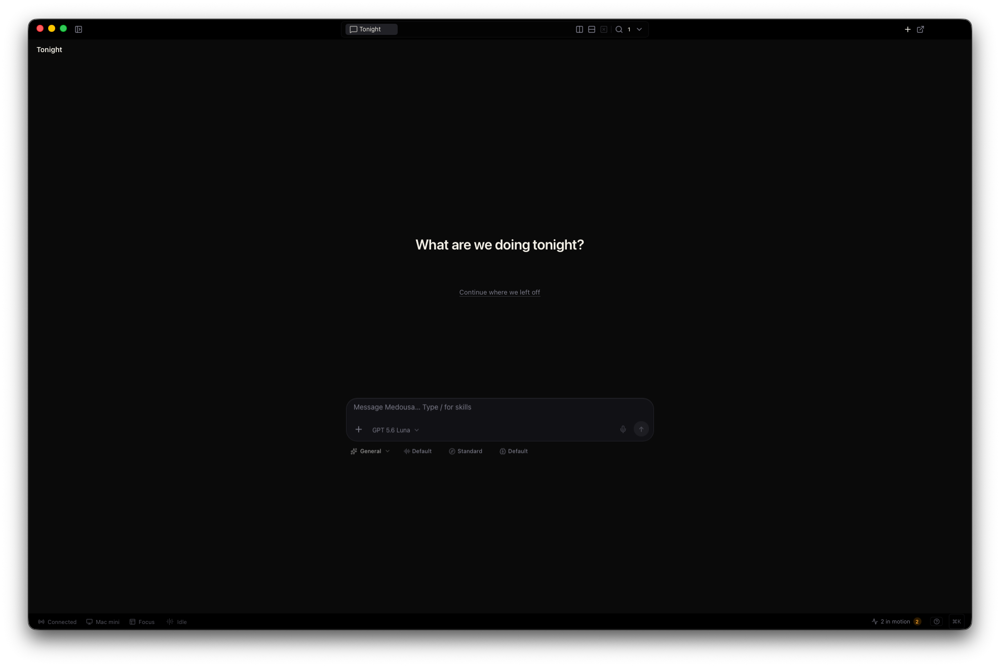
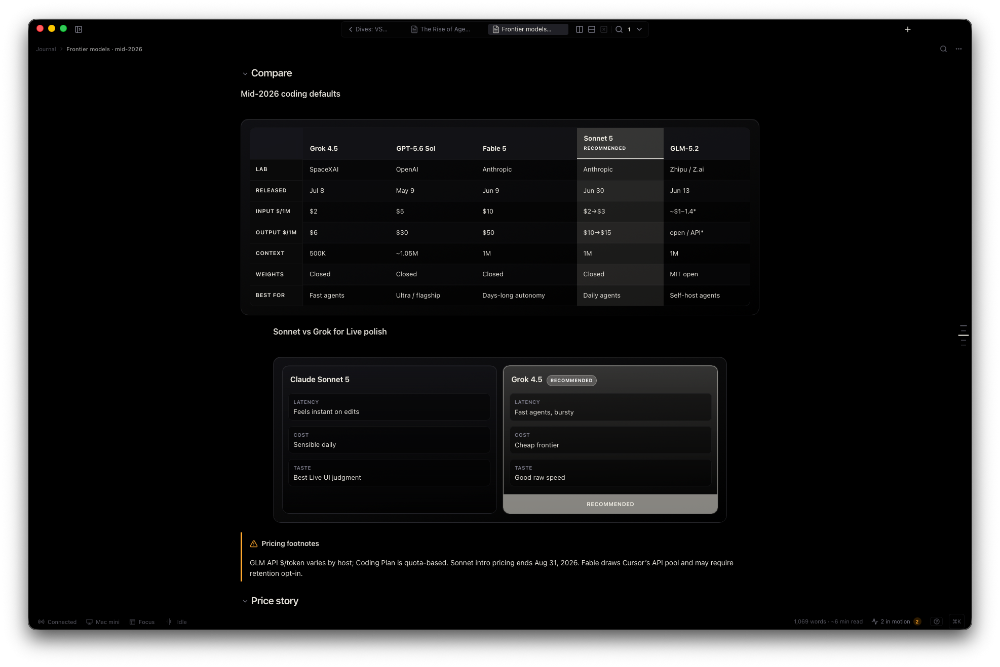
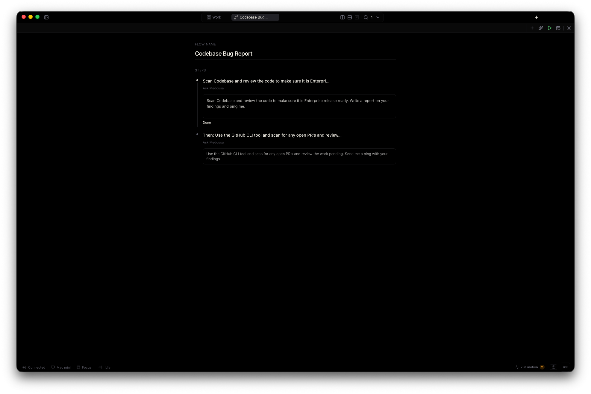
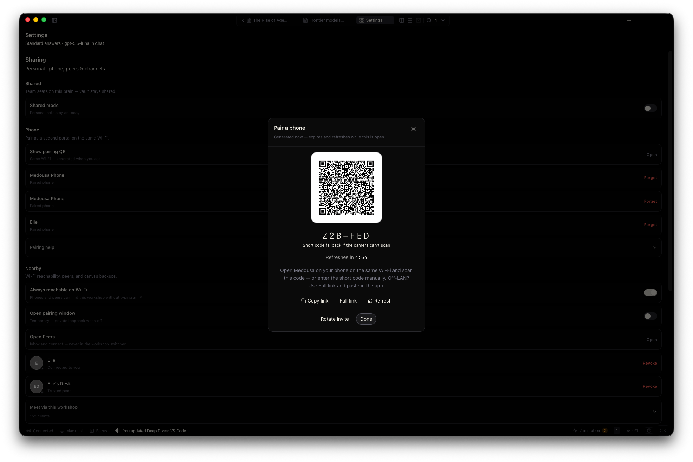

<div align="center">



</div>

<h1 style="text-align: center;">Medousa</h1>

<p align="center"><strong>Your continuum - Carry less of yourself from place to place, while more of your life remains available to you.</strong></p>

Medousa keeps your conversations, memory, projects, tools, and ongoing work available wherever you use it. Open it on another device, in VS Code, or from Slack and continue where you left off. The point is not to begin again. It is to arrive as yourself.

<p align="center">
  <a href="https://releases.entasislabs.com/medousa/stable/installer-bootstrap.json"><strong>Download Medousa</strong></a>
  ·
  <a href="docs/guides/getting-started.md"><strong>Get started</strong></a>
  · Mac · Windows · Linux · iOS &amp; Android companion
</p>

---

## The place changes. You don't.

### Pick up where you left off

Medousa keeps the thread close so you can return to it days later without reconstructing your own life from fragments.



### Turn the thread into something real

A conversation can become a note, a guide, a presentation, a dashboard, or anything else worth keeping. The result does not vanish when the chat scrolls away. It becomes part of your workspace.



### Let the work continue without you

Hand Medousa something that needs time. A report, a research pass, a scheduled check-in, a morning brief. Close the window. Go to sleep. The work waits, retries, and finds you when it is ready.



### Bring the whole thing with you

The app, your phone, messaging channels, editors, and connected workspaces are not separate products to keep in sync. They are different ways into the same world.



---

## One continuum, many surfaces

Presentations, code, workflows, the vault, canvas, messaging, and integrations all remain useful even with chat closed.

The surface changes to fit the moment; your context does not.

Use the same workshop from the [Medousa app](docs/guides/getting-started.md), [VS Code](docs/guides/vscode.md), [Neovim](docs/guides/neovim.md), your [phone](docs/guides/phone-pairing.md), or the [channels where people already reach you](docs/guides/channels.md).

Connect trusted workspaces across your LAN or through a tunnel. Your home machine, your laptop, and the devices around you can become part of one peer mesh without turning each doorway into a new account or a new beginning.

## Less to carry. More available.

Medousa is built around the user, not around a particular model, application, or device. 

The goal is simple: reduce the amount of context you have to hold in your head, and make more of your own world available when you need it.

## Bring your agents

Import `SKILL.md` skills from **Hermes**, **OpenClaw**, or **Cursor** as specialties and run them in the same workspace. Details: **[skills and specialties](docs/cookbook/skills-and-specialties.md)**.

A specialty (manuscript) gives an imported skill its own tone, boundaries, and optional schedule—a morning briefer, deep-dive researcher, or memory manager.

## Download from the terminal

```bash
curl -fsSL https://raw.githubusercontent.com/EntasisLabs/Medousa/main/scripts/install-app.sh | bash
```

That script reads our release CDN bootstrap and opens the right installer for your OS. Or **[download via bootstrap JSON](https://releases.entasislabs.com/medousa/stable/installer-bootstrap.json)**.


For the rest of the platform:

- **[Using Medousa](docs/guides/README.md)** — phone, peers, memory, channels, workspaces, and automations.
- **[Engine and self-hosting](docs/cookbook/install-and-self-host.md)** — run the durable runtime yourself.
- **[Developer docs](docs/README.md)** — HTTP, SDKs, MCP, artifacts, vault, canvas, and integrations.

## For builders

The app is one surface of Medousa. The engine underneath provides durable jobs, HTTP APIs, local inference, MCP, channel ingest, memory, and the shared session model used by the app, VS Code, Neovim, and other clients.

Run it headless. Call it from your stack. Integrate it into your existing context.

**[Developer docs →](docs/README.md)**

---

## License

Dual-licensed under **MIT OR Apache-2.0**. See [LICENSE](LICENSE), [LICENSE-MIT](LICENSE-MIT), and [LICENSE-APACHE](LICENSE-APACHE).

Security reports: [SECURITY.md](SECURITY.md) · Contributing: [CONTRIBUTING.md](CONTRIBUTING.md)

---

## Built on Stasis, Locus, and Resonantia

Medousa treats your entire workspace as one durable place.ß **[Stasis](https://github.com/EntasisLabs/stasis)** makes work finish and survive restarts. **[Locus](https://github.com/EntasisLabs/locus)** makes memory structured and retrievable. **[Resonantia](https://resonantia.me)** is the sibling surface — same foundation, memory made visible as terrain.

## Built with

Medousa and its stack stand on a few heavyweight open-source crates and apps:

| Stack | Role in Medousa |
|-------|-----------------|
| **[Tauri](https://tauri.app)** | Desktop + mobile shell — Home and Installer |
| **[Iroh](https://www.iroh.computer)** | Encrypted P2P transport for phone pairing and peer workspaces |
| **[genai](https://github.com/jeremychone/rust-genai)** | Multi-provider model client (cloud + local backends) |
| **[SurrealDB](https://surrealdb.com)** | Embedded store for durable runtime state |
| **[Axum](https://github.com/tokio-rs/axum)** + **[Tokio](https://tokio.rs)** | Local HTTP engine and async runtime |

Grateful to the maintainers — Medousa wouldn’t ship without them.
