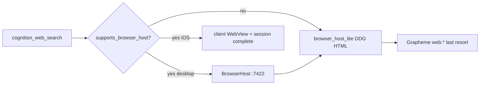

# Agent Browser Host

**Status:** Accepted (shared v1 plus daemon-owned isolated driver)

## Problem

Normie-friendly web search without API keys, Docker, or Grapheme discovery friction. Telegram/TUI must not advertise browser-only tools. CAPTCHA and rate limits need human handoff, not turn failure spirals.

## Decision

Browser is a **provider backend + client UX**, not a parallel tool ecosystem:

| Tool | Visibility |
|------|------------|
| `cognition_web_search` | All surfaces (binding chain differs) |
| `cognition_browser_fetch` | `supports_browser_host=true` only |
| `cognition_browser_snapshot` | `supports_browser_host=true` only |
| `cognition_browser_act` | `supports_browser_host=true` only (0.7.0) |
| CAPTCHA handoff | SSE `browser_challenge` + UI panel (not a tool) |

Gating mirrors `TurnSurfaceContext.supports_ui_artifacts`: clients advertise `supports_browser_host`; the daemon never infers from channel name.

## Execution chain (`mode=search`)

```mermaid
flowchart LR
  A[cognition_web_search] --> B{supports_browser_host?}
  B -->|no| D[browser_host_lite DDG HTML]
  B -->|yes desktop| C[BrowserHost :7422]
  B -->|yes iOS| E[client WebView + session complete]
  C --> D
  D --> F[Grapheme web.* last resort]
```

1. **BrowserHost** — Home desktop in-process HTTP on `127.0.0.1:7422`
2. **Client-executed** — `home-ios`: daemon session + SSE navigate/challenge → WebView → `POST /v1/browser/sessions/{id}/complete`
3. **Lite fallback** — `medousa-browser-lite` DDG HTML parse + 30m cache (daemon, always available)
4. **Grapheme** — existing capability bindings (discovery ops filtered from fallback chain)

## Daemon-owned isolated worlds

An authorized profile may create an isolated Chromium world on the selected
workshop through `/v1/browser/worlds/isolated`. The daemon owns the browser
process and its profile directory; Home is only an optional view attachment.
An ephemeral profile is removed with the world, while a named persistent
profile is retained unless cleanup explicitly requests its deletion. One
persistent profile may be attached to only one world at a time.

The returned `driver.driver_id` is the exact selection token. A caller places
that id in `TurnSurfaceContext.browser_driver_id`; browser snapshot and act
tools then dispatch to the daemon-local driver instead of Home's shared
BrowserHost. No fallback silently moves a turn between shared and isolated
browser identities.

The isolated driver uses Chromium's loopback CDP endpoint, but CDP is only a
mechanical adapter beneath world authority. The daemon admits and revalidates
short-lived permits, keeps stable opaque DOM references within a document,
redacts sensitive inputs from semantics and pixels, and checks control plus
state at every batch boundary. Human takeover permanently fences older agent
permits. A detached Home client does not stop the world.

Catalog records recover across daemon restart. Processes themselves are not
assumed to survive a daemon crash: a previously active world recovers as
`stopped` and must be resumed explicitly against the same profile.

## Session model

- Daemon stores in-memory `BrowserSession` records (`src/browser_sessions.rs`)
- Challenge: tool returns `challenge_required`; SSE emits `browser_challenge` with `browser_session_id` + `browser_challenge_url`
- Resume:
  - **home-desktop (reattached):** operator solves CAPTCHA in human webview → `resumeBrowserChallenge()` snapshots page HTML → `POST /v1/browser/sessions/{id}/complete`
  - **home-ios / home-android:** client WebView → daemon `POST /v1/browser/sessions/{id}/complete`
  - **Legacy fallback:** BrowserHost lite DDG retry (no shared cookies — avoid when human webview is active)

## Desktop human webview reattach

Home desktop now uses the **embedded human browser webview** as the operator-facing surface (see [`shared-browser-workspace.md`](shared-browser-workspace.md)):

| Concern | Implementation |
|---------|----------------|
| Navigate on agent SSE | [`openInBrowser.ts`](Medousa/apps/medousa-home/src/lib/utils/openInBrowser.ts) |
| Control handoff | [`browser.svelte.ts`](Medousa/apps/medousa-home/src/lib/stores/browser.svelte.ts) + `BrowserControlHandoff` |
| CAPTCHA complete | [`resumeBrowserChallenge.ts`](Medousa/apps/medousa-home/src/lib/utils/resumeBrowserChallenge.ts) + `human_browser_snapshot_*` |
| Fetch/snapshot tools | BrowserHost `/v1/fetch` + `browser_bridge_snapshot` prefer human webview when URL matches |

Read-only DOM snapshot shares session cookies with the visible tab.

## Agent act (`cognition_browser_act`, 0.7.0)

Agents can click/type/scroll/select/wait in the **shared human webview** — same cookie jar as today.

|||
|---|---|
| Daemon tool | `src/browser_act_tools.rs` (`cognition_browser_act`) |
| Desktop exec | BrowserHost `POST /v1/tab-groups/{id}/act` → `human_browser::browser_act_embed` (eval JS in embed webview) |
| iOS exec | Client-executed session (mirrors search): daemon session + SSE → `human_browser_ios::human_browser_act` → `POST /v1/browser/sessions/{id}/complete-act` |

Safety:
- Act is **blocked unless `control === agent`** on the tab group; `awaiting_operator` (CAPTCHA/verification) blocks act until the operator hands control back.
- High-risk targets (submit/password/checkout/delete-like selectors) require `allow_high_risk=true` at the tool layer.
- Human navigation while the agent has control flips control back to `user` (`agentBrowserCoord.ts`), so the human always wins.

## Surfaces

| Surface | `supports_browser_host` | Browser execution |
|---------|-------------------------|-------------------|
| `home-desktop` | true when `:7422/health` ok | Local BrowserHost + Tauri child webview |
| `home-ios` | true | UIKit WKWebView overlay + `human_browser_snapshot_*` |
| `home-android` | true (iframe v1) | iframe + local tab groups; native WebView overlay deferred |
| `telegram`, `tui`, ingest | false | Lite + Grapheme only |

## Out of scope (v1)

- Separate browser sidecar binary
- Playwright/BiDi parity, SearXNG, Google-first SERP, full form-recording macros
- A polished Home isolated-world picker and streamed remote viewport (Phase 4 follow-up)

## References

- Shared lite crate: `crates/medousa-browser-lite`
- Home service: `apps/medousa-home/src-tauri/src/browser_host.rs`
- Daemon routes: `src/browser_handlers.rs`
- Tool gating: `src/agent_runtime/turn_worker/registry.rs`, `src/tool_bootstrap.rs`
