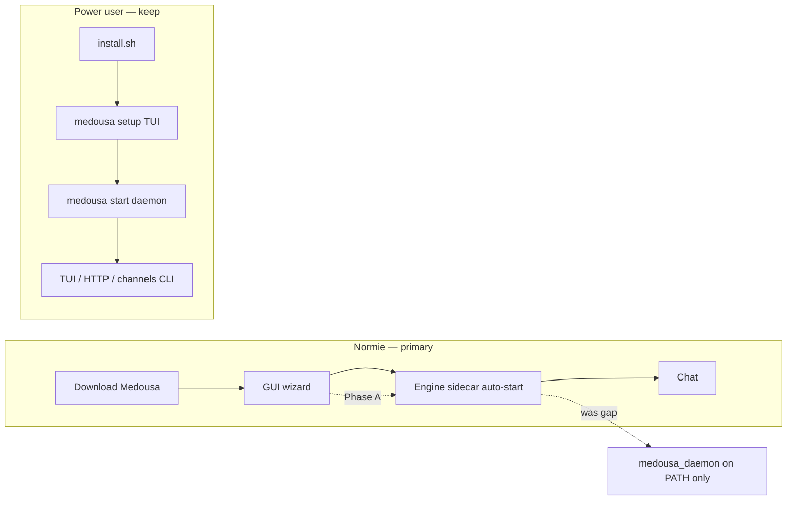

# First-run product gap analysis

> **Status:** Complete — Phases A–D shipped (2026-06-07); next work → [ROADMAP.md](../ROADMAP.md)  
> **Date:** 2026-06-12  
> **Audience:** Product + engineering  
> **Related:** [first-run-and-lan-pairing-plan.md](first-run-and-lan-pairing-plan.md), [session-catalog-index-plan.md](session-catalog-index-plan.md), [medousa-home-product-ux-plan.md](medousa-home-product-ux-plan.md)

## The pitch vs. the product

**Pitch:** Download Medousa. Talk to it in 90 seconds. It remembers. Optional: phone on the same brain.

**Reality today:** Download the app → maybe find an engine → pick a provider → wonder why it says offline → learn what a daemon is → give up or become a power user by accident.

The **vision is right** (see [first-run-and-lan-pairing-plan.md](first-run-and-lan-pairing-plan.md)). **Packaging and path consistency** still need polish: we built a workshop for builders and wrapped a welcome screen around it.

---

## Core insight

> non-devs don’t fail on features. They fail when the product asks them to understand our architecture before their first sentence.

Every time we say *daemon*, *workshop*, *ingest*, *Surreal*, or show a 47-row settings panel, we ask them to join the engineering team.

---

## Golden path vs. reality

| Stage | Jobs version | Today (2026-06-12) | Phase A target |
|-------|--------------|-------------------|----------------|
| **Install** | One download, engine inside app | App often doesn’t ship `medousa_daemon`; release may lack private brain | Sidecar in Tauri bundle; inference feature in release build |
| **First open** | Wizard → engine starts → chat | Wizard good; engine can fail silently and still advance | Fail closed; block Continue until connected |
| **First message** | Type, send, reply | Composer works while offline; tiny error on send | Offline gate on chat; one recovery action |
| **Phone** | Scan QR, done | Desktop QR exists; mobile = paste IP | Unchanged in A (Phase B/C) |
| **Never terminal** | Guaranteed | README/dev still reference manual daemon | Copy + bundling only in A |

---

## Scorecard

| Dimension | Before | After Phase A (target) | After all phases |
|-----------|--------|------------------------|------------------|
| First 90s (desktop app) | 6/10 | 8/10 | 9/10 |
| First 90s (mobile) | 4/10 | 5/10 | 8/10 |
| Offline / errors | 3/10 | 8/10 | 9/10 |
| Language | 5/10 | 7/10 | 9/10 |
| Channels in app | 5/10 | 5/10 | 8/10 |
| One product feeling | 4/10 | 6/10 | 9/10 |

---

## Phase A — “It just works” (shipped)

**Goal:** A normie can download, complete the wizard, and send a first message without terminal, jargon, or silent failure.

### A1. Bundle inference-enabled engine in app releases

- [x] Tauri `externalBin` sidecar for `medousa_daemon`
- [x] `prepare-engine-sidecar.sh` — build with `embedded-inference-metal` on Apple targets
- [x] Wire into `beforeBuildCommand` / `npm run tauri:build`
- [x] Release `build.sh` — `medousa_local` via `--with-local-brain` (replaces deprecated `--with-inference` on daemon)
- [x] Normie-friendly error if sidecar missing (dev fallback to PATH)

### A2. Wizard: fail closed, honest steps, land on Chat

- [x] Don’t advance wizard when `coreReady === false`
- [x] Step label: “Step 1 of 2” (model → optional phone → done)
- [x] Remove dead account step from Settings rerun copy
- [x] On wizard finish: open **Chat** on mobile (not Pulse)
- [x] Completion screen: block desktop finish until connected; preview labeled

### A3. Offline = blocking state + one recovery action

- [x] Shared `connection` store (health from `connectWorkshop`)
- [x] Chat offline gate overlay when not connected
- [x] Desktop: “Start Medousa” + retry
- [x] Mobile: “Connection settings”

### A4. Vocabulary pass (Medousa Home, user-visible)

- [x] Primary pass: Pulse, PhonePairPanel, SessionSidebar rename, Settings “Connection” tab
- [x] Remaining grep sweep (StatusBar, PhonePairPanel advanced copy)

---

## Phase B — “First magic in 60 seconds”

- [x] Post-wizard suggested first messages (3 tappable chips)
- [x] Auto-title sessions from first user turn (fix `(empty session)` previews via parts)
- [x] Mobile: QR connect from phone wizard (pairing link paste → daemon URL)
- [x] Mobile default tab = Chat after first-run (Phase A wizard finish)

---

## Phase C — “Phone & channels without terminal”

- [x] Messaging save starts/stops channel adapters (no `medousa start telegram`)
- [x] Telegram “only me” UX with `/whoami` helper
- [x] Engine auto-start on login (launchd on macOS)
- [x] `--public` pairing story + one-click toggle in Connection settings

---

## Phase D — “Scale without fear” (shipped 2026-06-07)

**Goal:** Scale session discovery and polish normie/power-user boundaries without architectural jargon.

### D1. Session catalog search API

- [x] `GET /v1/sessions?q=&cursor=` — case-insensitive substring on display name, preview, session id
- [x] `next_cursor` pagination token in response
- [x] Home session sidebar debounced server search

### D2. Normie vs power-user docs

- [x] Product README hero stays app-first; engine section labeled for developers
- [x] TUI `/help` — five essential commands; shorter unknown-command hint

### D3. Wizard cleanup + garage funnel

- [x] Removed unused `WizardAccountScreen`, `WizardPhoneScreenMobile`
- [x] Garage import wizard opens after desktop product wizard finish (first run)
- [x] `VaultGarageImportWizard` mounted in `AppShell` (not Vault-only)

---

## What’s already great (protect)

- Desktop wizard Screen 1 — plain language, local-first, Advanced tucked away
- Mobile connection wizard — Wi‑Fi help, test connection
- Migration splash — “Everything is still here”
- Optional phone pairing with Skip
- Garage copy — “Bring your mess”
- Chat empty states — “Say one thing” / “What are you working on?”
- Fast session list (catalog index)
- Platform-neutral wizard language

---

## Two-audience map

---

## Verification (Phase A done when)

1. Fresh `.app` install → wizard → first chat message **without terminal**
2. Engine stop → chat shows offline gate, not empty composer failure
3. Wizard does **not** advance if engine failed to start
4. Mobile post-wizard lands on **Chat** tab
5. No user-visible “daemon” / “workshop offline” / “Basement” in Home primary flows
6. `curl` session list still fast (unchanged)

---

## What's next (not UX polish — operator surface)

Product layout, Work Hub manifestations, nav tiers, chat presentation, and onboarding Phases A–D are **done**. Remaining blockers for “extend Medousa without editing files”:

| Track | Doc |
|-------|-----|
| Env + paths catalog | [docs/configuration-reference.md](../docs/configuration-reference.md) |
| Provider picker + API keys in UI | [ROADMAP.md](../ROADMAP.md) |
| MCP server add/edit in UI | [ROADMAP.md](../ROADMAP.md) |
| Capabilities toggles in UI | [ROADMAP.md](../ROADMAP.md) |

Deferred: Phase E cloud auth, Phase F accessibility/packaging.

---

## Changelog

| Date | Change |
|------|--------|
| 2026-06-07 | Phases A–D marked complete; pointer to ROADMAP.md |
| 2026-06-12 | Initial gap analysis + Phase A kickoff |
