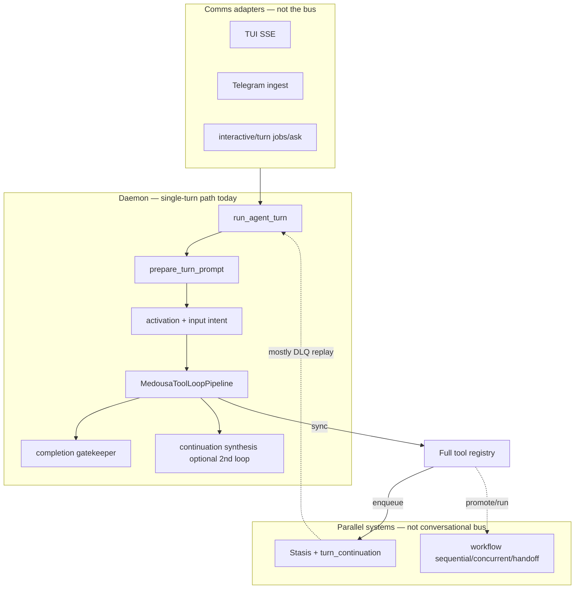
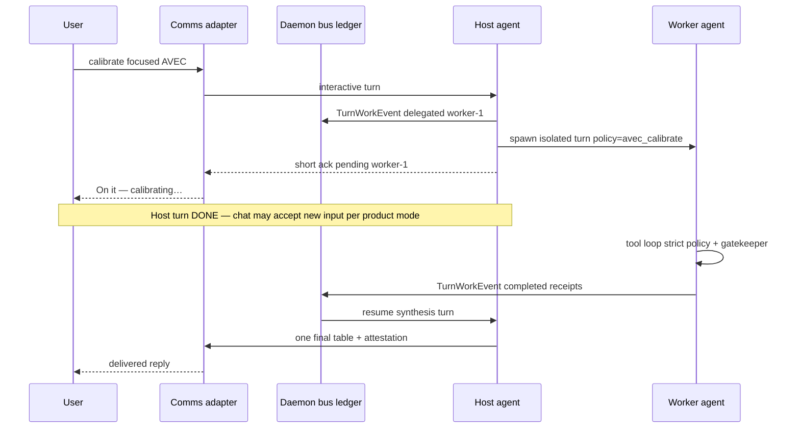

# Turn worker bus (host / worker architecture)

## Status

**Phase 0** — [turn-ledger-phase0.md](turn-ledger-phase0.md). **Phase 1** — [turn-worker-phase1.md](turn-worker-phase1.md). **Phase 2** — [turn-worker-phase2.md](turn-worker-phase2.md). Phases 3+ below remain planning.

**Context / scratchpad track (planned):** [context-lanes-and-scratchpad-plan.md](context-lanes-and-scratchpad-plan.md) — tiered pools for user vs tool lanes, worker handoff, classification ROI before Locus prompt versioning.

## Thesis

The **interface agent should be a bus, not a kitchen that also cooks every dish.**

Medousa already has the kitchen (tool loop, Stasis jobs, MCP) and an inspector (completion gatekeeper, receipt checklist). What is missing is a **ticket system** the host agent, session history, and every comms adapter can read: explicit delegation, pending work, completion, and synthesis.

---

## Critical scope: daemon bus, not TUI feature

| Layer | Owns what | Examples |
|-------|-----------|----------|
| **Daemon agent runtime (bus)** | Turn roles (host / worker), work records, pending/completed events, resume/synthesis turns, tool policy per role | `MedousaAgentRuntime`, `run_agent_turn`, session ledger, Stasis correlation |
| **Comms medium (adapter)** | How humans see and send messages; transport only | TUI SSE, Telegram ingest, Discord, `POST /v1/interactive/turn`, `POST /v1/jobs/ask`, CLI |
| **Presentation (per adapter)** | Bubbles, typing indicators, scratch slots, push notifications | TUI `AgentScratchReset`, Telegram typing + single reply, outbox push |

**Do not implement the bus inside `medousa_tui`.** The TUI is one subscriber to the same event stream the daemon already exposes (`AgentStreamSink`, notices, final `agent_response`). Telegram and API paths must get pending/delegation/completion semantics without TUI-specific code paths.

Naming in conversation: “TUI = bus” is a useful mental model for **one** adapter (chat feels like the control room). In architecture docs and code, say **UI/comms medium = adapter**, **daemon runtime = bus**.

---

## Problem statement (why monolithic turns fail)

Three stacked failures appear in production today:

| Symptom | Likely cause in current design |
|--------|--------------------------------|
| Runs until **max tool rounds** | Gatekeeper/heuristics say **continue** (missing ritual, stutter) but the model emits **text-only** rounds without new tools; nothing in the LLM `messages` transcript says “stop, you failed.” |
| Model acts unaware the **turn ended** | Tool-loop `messages` ≠ persisted session history ≠ CoR/obs events. Interim text is scratch-only; there is no durable `pending` / `completed` phase in what the model reads on the next round. |
| **History vs events** mismatch | Adapters show streaming `◈` and tool payloads in observability; session file gets **one** assistant blob at `agent_response`. The performer does not see a clean job lifecycle. |

Polishing finalize heuristics and scratch replace (see [turn-completion-gatekeeper.md](turn-completion-gatekeeper.md), [tool-loop-interim-text-fix.md](tool-loop-interim-text-fix.md)) improves **presentation** and **when to stop** inside a single loop. It does not change the shape: **one synchronous monologue** with the **full tool catalog** until something external says stop.

---

## Current runtime (as-is)

**Gold path today:** adapter delivers user text → one `ToolLoopPipeline` → optional second LLM pass ([`src/agent_runtime/continuation.rs`](../src/agent_runtime/continuation.rs)) → one `agent_response` → session append.

**Not present:** host delegates while conversation stays open; worker runs with scoped tools; bus events visible to the next host turn on any adapter.

---

## Related mechanisms (reuse vs replace)

| Mechanism | What it is | What it is *not* |
|-----------|------------|------------------|
| [`turn_continuation`](../src/turn_continuation.rs) | Parent–child **Stasis job** links; can spawn a **second full** `run_agent_turn` after DLQ replay or turn error | Mid-turn worker while host chat continues; normal async child **success** rarely resumes host today |
| [`workflow.medousa.handoff` / `concurrent`](../src/workflow.rs) | Multi-step **batch** workflows with `$handoff.context` | Interactive sub-agent with chat pending state |
| `cognition.job.enqueue` / grapheme promote | Durable background work | Same — out of band from host transcript |
| Adapter `tokio::spawn` | Non-blocking **transport** | Still **one** blocking tool loop per user message inside the turn |
| Input intent classifier | **INPUT** routing (tools vs chat) | **OUTPUT** delegation |
| Completion gatekeeper | **OUTPUT** finalize veto | Worker lifecycle |
| `cognition_turn_prepare_final` | Model requests curtain | Host/worker split signal (worker should use aggressively) |

See also: [dlq-replay-turn-continuation-plan.md](dlq-replay-turn-continuation-plan.md), [centralized-agent-runtime-roadmap.md](centralized-agent-runtime-roadmap.md), [enterprise-architecture-and-flow-guide.md](enterprise-architecture-and-flow-guide.md).

**There is no hidden “sub-agent mode” switch** — there is job continuation and workflow handoff. This plan adds a **first-class worker run** type and **bus events** in the daemon runtime, then unifies with Stasis where jobs are long-lived.

---

## Target architecture: host, worker, bus

### Roles

| Role | Responsibility | Tool surface | Turn budget |
|------|----------------|--------------|-------------|
| **Host (bus / conductor)** | User-facing tone, planning, delegation, synthesis when worker completes | Small: `spawn_turn_worker`, `turn_worker_status`, `cancel_turn_worker`, `cognition_turn_prepare_final`, maybe read-only status | Low rounds; few tools |
| **Worker (specialist)** | Execute intent with receipts; no casual user prose until done | Subset per **capability policy** (memory, grapheme, MCP, etc.) | Higher rounds; same gatekeeper + prepare_final on worker stream |
| **Bus (session + runtime ledger)** | Append-only **turn work events** every adapter can map to UX | Not LLM tools — daemon persistence + `AgentStreamSink` notices | N/A |

### Target sequence (conceptual)

### Product modes (choose per phase)

| Mode | UX | Complexity | Suggested default |
|------|-----|------------|-------------------|
| **A. Block host until worker done** | Like today, cleaner inner loop | Medium | Phase 1 dev only |
| **B. True async chat** | User messages while worker runs; merge/cancel rules | High | Defer |
| **C. Async notify + synthesis** | Host turn ends; completion triggers host synthesis (or user’s next message) | Medium | **Ship first** — fits Telegram/outbox |

Default: **Phase 1 in-process worker + Phase 0 ledger**, product mode **C**.

---

## Bus event model (daemon-owned)

Events must be serializable into **host** `prior_messages` at synthesis time and emitted on **`AgentStreamSink`** so every adapter can render them differently.

Proposed event types (names illustrative):

| Event | Meaning | Host sees | Adapter may show |
|-------|---------|-----------|------------------|
| `work_delegated` | Host spawned worker `{id}` with intent + policy | Pending ticket in session ledger | “Working on …” / typing |
| `work_progress` | Optional milestone from worker | Notice only | `◈` line / log |
| `work_completed` | Worker finished; result blob + tool receipt summary | Triggers synthesis turn | Final reply or follow-up push |
| `work_failed` | Worker error or max rounds | Host explains; user retry | Error bubble / outbox |
| `work_cancelled` | User or host cancelled | Close ticket | Dismiss pending UI |

**Session ledger** ([`session.rs`](../src/session.rs)): extend or sidecar `TurnWorkRecord` keyed by `session_id` + `turn_correlation_id` / `worker_id`. This is the source of truth the host model reads — not TUI scratch buffers.

**Stream sink** ([`events.rs`](../src/events.rs)): new notice kinds or structured events adapters already reduce (TUI event reducer, ingest sink, SSE clients).

---

## How this reframes looping and gatekeeper

| Today | With host / worker |
|-------|-------------------|
| One loop: tools + user copy + finalize | **Worker** loop = tools + finalize; **Host** = delegate + synthesize |
| Gatekeeper on same stream as stutter tables | Gatekeeper primarily on **worker**; host sees **result JSON** + receipt summary |
| CoR/obs ≠ model transcript | Bus events **injected** into host context at synthesis |
| Continuation synthesis = 2nd full host loop | **Short host synthesis** only after worker terminal state |

Worker system prompt (sketch): *Use tools until the ritual is complete; do not emit user-facing prose until `cognition_turn_prepare_final`; then one final answer.*

Host system prompt (sketch): *You are the bus. Delegate heavy work. Do not claim receipts the worker has not produced. Synthesize worker results for the user.*

---

## Phased implementation plan

### Phase 0 — Loop discipline (monolithic path; bus prep) ✅

Implemented in `turn_ledger.rs` + tool loop wiring ([turn-ledger-phase0.md](turn-ledger-phase0.md)).

1. **Structured turn ledger** — JSONL per session; kinds `tool_round`, `gatekeeper_continue`, `receipt_missing`, `finalized`, `stuck`.
2. **`[MEDOUSA_TURN_CONTROL]` system messages** injected on continue so the model sees gatekeeper/heuristic reasons.
3. **Stuck detector** — 3 text-only continues without new tools → user-visible stop (`stuck_text_only_continue`).
4. **Receipt checklist** — AVEC + pull/preset requires moods + calibrate before end.

Deliverable: same adapters, fewer runaway turns, ledger schema stable for Phase 1.

### Phase 1 — In-process worker profile (sub-agent v1) ✅

Implemented — see [turn-worker-phase1.md](turn-worker-phase1.md). Summary:

All logic in **daemon agent runtime** (`agent_runtime/`, `medousa_tool_loop.rs`, `turn_worker` module):

| Piece | Host | Worker |
|-------|------|--------|
| System prompt | Bus, delegation | Tools-only until prepare_final |
| Tool registry | spawn / status / cancel | Policy-filtered subset |
| Execution | `run_agent_turn` ends after delegate + ack | `tokio::spawn` worker turn; private mini-transcript |
| Completion | Bus `work_completed` → spawn **host synthesis** turn | Writes result on `TurnWorkRecord` |

**Correlation:** extend `TurnContinuationScope` / records with `WorkerRun` status — do not fork a third parallel story beside Stasis children.

**Adapters:** no new business logic in TUI/Telegram — they consume new sink events and pending state from daemon responses.

### Phase 2 — Slim host + capability policy ✅

Implemented — see [turn-worker-phase2.md](turn-worker-phase2.md). Heuristic host routing, `MEDOUSA_TURN_HOST_BUS=auto|force|off`, host round cap, per-intent worker budgets.

### Phase 3 — Durable worker (Stasis)

For long grapheme / MCP work:

- Worker = Stasis job type (e.g. `workflow.medousa.worker_turn`) or enriched continuation with `await_mode: worker`.
- **Success** path resumes host synthesis (today `should_resume()` is DLQ-biased — extend for normal worker success).
- Telegram: worker complete → [outbox](outbox-channel-delivery-roadmap.md) push → optional host synthesis.

### Phase 4 — Adapter presentation (optional polish)

Per medium mapping of the **same** bus events:

| Bus event | TUI | Telegram | API/SSE |
|-----------|-----|----------|---------|
| `work_delegated` | Pending badge / side notice | Typing + short ack | SSE event `worker_pending` |
| `work_completed` | Scratch reset + synthesis bubble | Second message or edit | SSE `worker_done` + final chunk |
| `work_failed` | Error state | User-visible error | HTTP/job terminal |

TUI scratch reset remains **presentation only** — not the bus.

---

## Daemon integration points (implementation checklist)

When coding starts, touch these anchors — **not** `medousa_tui` core logic:

| Area | File(s) | Change |
|------|---------|--------|
| Turn entry | [`daemon_interactive_turn.rs`](../src/agent_runtime/daemon_interactive_turn.rs), ingest ask path | Host vs worker turn kinds |
| Orchestration | [`turn_orchestrator.rs`](../src/agent_runtime/turn_orchestrator.rs) | Synthesis turn after worker |
| Tool loop | [`medousa_tool_loop.rs`](../src/medousa_tool_loop.rs) | Worker-scoped rounds; ledger injection |
| Gatekeeper | [`turn_completion.rs`](../src/agent_runtime/turn_completion.rs) | Primary on worker stream |
| Continuation | [`turn_continuation.rs`](../src/turn_continuation.rs), [`continuation.rs`](../src/agent_runtime/continuation.rs) | Unify worker complete → resume; avoid duplicate 2nd loops |
| Session | [`session.rs`](../src/session.rs) | `TurnWorkRecord` + events |
| Stream contract | [`events.rs`](../src/events.rs) | Structured bus events for all sinks |
| API | [`daemon_api.rs`](../src/daemon_api.rs) | Expose pending workers in turn/job status if needed |
| Docs | [component-daemon.md](component-daemon.md), [interaction-and-state-model.md](interaction-and-state-model.md) | Bus domain vs adapter domain |

---

## Tradeoffs

**Pros**

- Matches product mental model (async delegation, policy per intent).
- Reuses orchestrator, gatekeeper, prepare_final, Stasis.
- Naturally caps host tool rounds; any comms medium benefits equally.

**Cons / risks**

- Two LLM roles → latency and cost unless worker uses a smaller route.
- Mode **B** needs concurrency rules (cancel, queue, fork session).
- Must not duplicate `turn_continuation` + worker + workflow handoff — **one** correlation id story.

---

## Success criteria

1. **Telegram** user gets pending ack and later synthesis without TUI-only code.
2. **TUI** shows pending/completed via same SSE notices as daemon emits.
3. **API** `interactive/turn` can poll or stream worker state from daemon ledger.
4. Host turn tool count ≪ worker turn tool count for ritual flows (AVEC/calibrate).
5. Runaway max-round failures drop; when they occur, session ledger explains why.

---

## References

- [turn-completion-gatekeeper.md](turn-completion-gatekeeper.md)
- [tool-loop-interim-text-fix.md](tool-loop-interim-text-fix.md)
- [dlq-replay-turn-continuation-plan.md](dlq-replay-turn-continuation-plan.md)
- [centralized-agent-runtime-roadmap.md](centralized-agent-runtime-roadmap.md)
- [component-daemon.md](component-daemon.md)
- [interaction-and-state-model.md](interaction-and-state-model.md)
