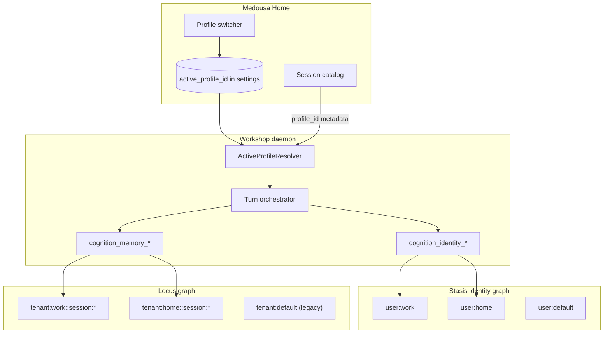

# User profiles — switchable world models (work / home / …)

> **Status:** Phase 0 ✅ · Phase 1 ✅ · Phase 2 ✅ · Phase 3 ✅ · Phase 4 ✅ (Home UI)  
> **Date:** 2026-06-07  
> **Related:** [cognitive-identity-memory-plan.md](cognitive-identity-memory-plan.md), [context-lanes-and-scratchpad-plan.md](context-lanes-and-scratchpad-plan.md), [medousa-home-m11-settings-charter-plan.md](medousa-home-m11-settings-charter-plan.md), [session-catalog-index-plan.md](session-catalog-index-plan.md)

## Product promise

**One operator, multiple contexts — switch without losing either world.**

Example: “Work you” remembers colleagues, sprint prefs, and work chat memory. “Home you” remembers family, hobbies, and personal plans. Same daemon, same device, same app — **active profile** selects which relational identity graph and which Locus tenant bucket apply.

This is **not** multi-login (different people on one workshop). It is **multi-profile** for a single principal — like browser profiles or Focus modes, not account separation.

---

## Why this fits the existing stack

Medousa already has two memory tiers with different isolation keys:

| Tier | Store | Isolation key today | Profile mapping |
|------|-------|---------------------|-----------------|
| **Relational** | Stasis identity graph | `user_id` (`UserEntity`) | Profile id **is** identity `user_id` |
| **Episodic** | Locus STTP graph | `tenant_id` + `session_id` in DB | Profile id **is** Locus tenant (via scoped session keys) |

**Identity:** Stasis seeds `user:default` and supports multiple `UserEntity` rows. `resolve_identity_user_id` + `MEDOUSA_IDENTITY_USER_ID` already exist for env override; ingest channels map external senders to distinct ids.

**Locus:** `locus-core-rs` 0.3 persists `tenant_id` on `temporal_node` and derives it from session key convention — **no SDK upgrade required for v1**:

```text
tenant:{tenant}::session:{localSessionId}
```

Plain `session_id` → tenant `"default"` (legacy bucket).

**Stasis Locus adapters** (`MemoryScope`, `MemoryStoreRequest`) expose only `session_id` today — tenant is implicit in the session string. Profiles can ship by encoding tenant into session ids at the Medousa boundary.

---

## Current gaps (baseline)

| Issue | Symptom | Root cause |
|-------|---------|------------|
| Wrong identity principal on daemon turns | `cognition_identity_remember` → `identity user not found: daemon-agent-runtime` | `assemble_tui_runtime(..., "daemon-agent-runtime", ...)` registers identity tools against an unseeded id |
| Drawer vs agent mismatch | Identity drawer shows prefs; agent writes elsewhere | Home `getIdentityContext` reads `user:default`; tools use `daemon-agent-runtime` |
| `session_id` overloaded | `TurnSurfaceContext.user_id = session_id` | Ambient surface field reused for conversation id, not identity principal |
| Locus unscoped | All workshop chat memory in tenant `default` | Memory tools use raw chat `session_id` with no `tenant:` prefix |
| No operator control | Single implicit principal | No profile registry or switcher |

**Invariant to establish before profiles:** one **active identity principal** per interactive surface, distinct from **chat session id**.

---

## Architecture



### Naming conventions (locked for v1)

| Concept | Format | Example |
|---------|--------|---------|
| Profile id | `user:{slug}` | `user:work`, `user:home`, `user:default` |
| Display name | Free text in profile registry | “Work”, “Home” |
| Locus scoped session | `tenant:{slug}::session:{chatSessionId}` | `tenant:work::session:abc-123` |
| Locus tenant (derived) | `{slug}` from scoped key | `work` |
| Legacy unscoped session | plain uuid / slug | tenant `default` (unchanged) |

**Reserved slugs (do not use for operator profiles):**

| Slug / prefix | Purpose |
|---------------|---------|
| `default` | Legacy single-user bucket |
| `medousa-prompts-*` | System prompt pools ([context-lanes Phase 6](context-lanes-and-scratchpad-plan.md)) |
| `daemon-agent-runtime` | Retired — never seed as profile |

Profile slugs must match `^[a-z][a-z0-9_-]{0,31}$`.

### Profiles vs true multi-user

| | Profiles | Ingest multi-user (Telegram, Slack, …) |
|--|----------|----------------------------------------|
| Who | One operator, context switch | Different external senders |
| Auth boundary | None (convenience) | Channel allowlists + sender id |
| Id source | Home settings `active_profile_id` | `IngestRequest.user_id` |
| Coexist | Yes — ingest maps to its own identity ids; workshop uses active profile |

---

## Phases

### Phase 0 — Principal alignment (prerequisite)

**Goal:** Single workshop operator resolves to one seeded identity user before profile UX exists.

**Status:** ✅ Complete

| Task | Detail | Status |
|------|--------|--------|
| 0.1 | Register daemon/home identity tools with `resolve_identity_user_id(None)` → `user:default` (not `daemon-agent-runtime`) | ✅ `resolve_tool_identity_user_id(..., workshop_operator=true)` |
| 0.2 | Stop setting `TurnSurfaceContext.user_id` to chat `session_id` for identity semantics; use `None` or explicit `identity_user_id` when added | ✅ Home turn/ticket paths |
| 0.3 | Home identity API: pass active principal explicitly once resolver exists; until then align drawer + tools on `user:default` | ✅ drawer uses default context request |
| 0.4 | TUI: document that `resolve_identity_user_id(Some(session_id))` is session-scoped identity (power-user) — out of scope for Home v1 | ✅ via `workshop_operator_identity=false` |
| 0.5 | Tests: `cognition_identity_remember` + drawer read same user on daemon interactive turn | ✅ unit tests on resolver |

**Exit:** Remember tool persists to seeded user; drawer matches agent writes; no `daemon-agent-runtime` in identity error paths.

**Code anchors:** `src/agent_runtime/runtime.rs`, `src/tui/runtime_services.rs`, `src/identity_tools.rs`, `apps/medousa-home/src-tauri/src/daemon/mod.rs`, `apps/medousa-home/src-tauri/src/daemon/session.rs`, `apps/medousa-home/src/lib/stores/identity.svelte.ts`

---

### Phase 1 — Profile registry + seeding

**Goal:** Data model for named profiles; create/list/switch without full UI polish.

**Status:** ✅ Complete — `user_profiles.json`, daemon routes, CLI.

| Task | Detail | Status |
|------|--------|--------|
| 1.1 | `ProfileRecord`: `{ profile_id, display_name, created_at, is_default }` persisted in workshop settings | ✅ `~/.local/share/medousa/user_profiles.json` |
| 1.2 | Bootstrap: ensure `user:default` profile exists (“Personal”) | ✅ `UserProfileRegistry::load_or_bootstrap` |
| 1.3 | `POST /identity/profiles`, `GET /identity/profiles`, `PUT /identity/profiles/active` daemon routes | ✅ `/v1/identity/profiles` |
| 1.4 | On profile create: seed baseline `UserEntity` (+ persona/channel edges) | ✅ `seed_workshop_profile_user` |
| 1.5 | `ActiveProfileResolver`: env `MEDOUSA_IDENTITY_USER_ID` overrides settings | ✅ `resolve_active_user_id` + daemon context default |
| 1.6 | CLI: `medousa identity profiles list\|create\|use` | ✅ `medousa identity-profiles …` |

**Exit:** Can create `user:work` via API/CLI; switching active profile changes resolved `user_id` for identity context reads.

**Non-goals:** Locus scoping, session catalog filtering, mobile sync.

---

### Phase 2 — Runtime wiring (identity path) ✅

**Goal:** Every identity touchpoint uses active profile.

| Task | Detail | Status |
|------|--------|--------|
| 2.1 | Identity tools resolve active profile at invoke time (`workshop_dynamic` on daemon) | ✅ |
| 2.2 | Turn-start relational digest compiled for active profile | ✅ |
| 2.3 | `GET /identity/context?user_id=` defaults to active profile | ✅ (Phase 1) |
| 2.4 | Interactive turn request: optional `identity_user_id` override (internal/debug); default = active profile | ✅ |
| 2.5 | Heartbeat / recurring jobs: inherit active profile at turn time via `resolve_workshop_identity_user_id()` | ✅ |
| 2.6 | STTP bridge on identity commit: scoped Locus session under profile tenant (Phase 3 encoding) | deferred |

**Implementation notes:**

- `init_workshop_profile_registry(Arc<RwLock<UserProfileRegistry>>)` shares daemon registry with runtime paths.
- `resolve_workshop_identity_user_id()` / `resolve_workshop_identity_user_id_for_turn()` — env override, then active profile.
- `CognitionIdentityContextTool` / `Recall` / `Remember` — `workshop_dynamic: true` on daemon re-reads active profile each invoke.
- `prepare_turn_prompt` — `identity_user_id` drives `identity_context_probe` + `channel_policy_probe`.

**Exit:** Switch profile → next turn’s digest + remember/recall identity tools target new `UserEntity`.

---

### Phase 3 — Locus tenant scoping (reuse existing core) ✅

**Goal:** Episodic memory isolated per profile using **scoped session keys** — no Stasis `MemoryScope.tenant_id` dependency for v1.

| Task | Detail | Status |
|------|--------|--------|
| 3.1 | `scoped_locus_session(profile_slug, chat_session_id)` in `src/locus_memory.rs` | ✅ |
| 3.2 | Memory tool default session: scoped key from active profile + turn session | ✅ |
| 3.3 | Recall/find: scoped to current chat session within profile tenant (v1 policy) | ✅ |
| 3.4 | Session catalog: `profile_id` metadata; list filtered by active profile | ✅ |
| 3.5 | Migration: legacy sessions stay in tenant `default` (plain session keys) | ✅ |
| 3.6 | `derive_locus_tenant_id` regression tests mirroring locus-core-rs | ✅ |

**Implementation notes:**

- Default profile (`user:default`) keeps **plain** chat session ids → Locus tenant `default` (legacy data untouched).
- Other profiles use `tenant:{slug}::session:{chatSessionId}`.
- Memory tools read chat session from `turn_scope` (set on every daemon turn) + `resolve_workshop_locus_session`.
- Turn-start cheap recall uses scoped session id.
- Identity STTP bridge stores under profile-scoped `medousa-identity` session.

**Exit:** Work profile chat stores/recalls only under `tenant:work::session:*`; home profile under `tenant:home::session:*`; legacy sessions unchanged.

**Code anchors:** `src/memory_tools.rs`, `src/locus_memory.rs`, `src/runtime/memory_bundle.rs`, session catalog paths

---

### Phase 4 — Home UI ✅

**Goal:** Operator-facing profile switcher and settings.

| Task | Detail | Status |
|------|--------|--------|
| 4.1 | Profile switcher in utility rail / Settings → Memory (charter M11) | ✅ |
| 4.2 | Create profile (rename/delete/archive deferred — no daemon HTTP yet) | partial ✅ |
| 4.3 | Session list shows only active profile’s sessions | ✅ (daemon filter + refresh on switch) |
| 4.4 | Identity drawer: display name + profile label; hide raw `user_id` | ✅ |
| 4.5 | Switch profile mid-session: reload identity + sessions + new-chat nudge | ✅ |
| 4.6 | Empty state copy | ✅ |

**Implementation notes:**

- `userProfiles.svelte.ts` store + Tauri `identity_list_profiles` / `create` / `set_active`
- `UserProfilesPanel.svelte` in Settings → Memory; rail User icon opens Memory section
- `IdentityDrawer` shows active profile name; raw `user_id` only when engine details enabled
- Profile switch toast in `ChatPanel` with “New chat” action

**Exit:** Normie can create Work/Home profiles and switch without CLI; chat + identity feel coherent.

**Code anchors:** `apps/medousa-home/src/lib/stores/`, Settings routes, `IdentityDrawer.svelte`

---

### Phase 5 — Mobile + transport parity ✅

**Goal:** Paired phone uses same active profile as desktop (eventual consistency acceptable v1).

| Task | Detail |
|------|--------|
| 5.1 | Persist `active_profile_id` in workshop settings readable over daemon API | ✅ `/health` + `/runtime/defaults` |
| 5.2 | Mobile Home: profile switcher (compact) or read-only badge + link to desktop Settings | ✅ `ProfileSwitcherCompact` on Pulse + Chat |
| 5.3 | Iroh/LAN transport: identity context + turn requests include resolved profile | ✅ `identity_user_id` on turn tickets |
| 5.4 | Conflict: last-writer-wins on active profile across surfaces; log notice | ✅ `syncOnResume` + `remoteChangeNotice` + daemon log |

**Implementation notes:**

- `ProfileSwitcherCompact.svelte` — bottom sheet on Pulse + Chat headers (hidden when only default profile)
- Mobile Settings → Memory: full switch + create (no longer read-only)
- `userProfiles.syncOnResume()` on foreground resume; toast via `MobileToast`
- Turn tickets pass `identity_user_id` from `userProfiles.resolvedUserId`

**Exit:** LTE paired phone recalls/stores under same tenant as desktop for active profile.

---

### Phase 6 — Portability, channel policies & observability ✅

**Goal:** Optional profile portability, profile-aware channel policies, and turn-level profile metrics — without MCP gateway or upstream Locus SDK changes (session-id scoping is sufficient for tenancy).

| Task | Detail | Status |
|------|--------|--------|
| ~~6.1~~ | ~~Thread `tenant_id` through Stasis `MemoryScope` (upstream locus-sdk)~~ | **Deferred** |
| ~~6.2~~ | ~~MCP gateway: map turn `user_id` → Locus tenant~~ | **Out of scope** |
| 6.3 | Profile export/import (identity subgraph + Locus sessions) | ✅ CLI + daemon API |
| 6.4 | Profile-scoped channel policies (`channel:work` via `resolve_identity_channel_id`) | ✅ |
| 6.5 | Metrics: `active_profile_id` on turn ledger rows | ✅ |

**Implementation notes:**

- **6.5** — `TurnLedgerRecord.active_profile_id` stamped on every JSONL append via `resolve_workshop_active_profile_id()`
- **6.4** — `workshop_interactive_channel_id()` + `profile_channel_id_for_user_id()`; profile channels seeded on create
- **6.3** — `profile_portability.rs`; `POST /v1/identity/profiles/export|import`; CLI `identity-profiles export|import`

**Exit:** Operators can move a profile between machines; channel policy and metrics reflect active profile.

**Code anchors:** `src/profile_portability.rs`, `src/identity_memory.rs`, `src/agent_runtime/turn_ledger.rs`, `src/bin/medousa.rs`

---

## Operator decisions (locked for v1)

| Topic | Decision |
|-------|----------|
| Profile id format | `user:{slug}` aligned with Stasis `UserEntity.user_id` |
| Locus isolation mechanism | Scoped session keys → derived `tenant_id` (existing `locus-core-rs`) |
| Default profile | `user:default` — all legacy data stays valid |
| Profile delete | Soft-delete profile record; identity/Locus data retained until explicit purge |
| Security | Profiles are not auth boundaries — document clearly |
| Ingest channels | Keep sender-derived ids; do not auto-map to workshop active profile |
| Env override | `MEDOUSA_IDENTITY_USER_ID` wins over UI active profile |
| Reserved tenants | Block operator slugs matching `medousa-prompts-*` |

---

## Migration & backward compatibility

1. **Existing operators:** Single implicit profile `user:default`; no migration required.
2. **Existing Locus nodes:** Remain in tenant `default` with original `session_id`.
3. **New profiles:** New sessions use scoped keys; old sessions visible only under Default profile until moved.
4. **Optional move tool (Phase 4+):** Rekey session scope via `NodeStore::batch_rekey_scopes_async` (`locus-core-rs`) — dry-run first.

---

## Acceptance tests (epic-level)

| Phase | Test |
|-------|------|
| 0 | Daemon turn: remember beverage pref → identity context returns it for `user:default` |
| 1 | Create `user:work` → seeded user row exists |
| 2 | Switch active to `user:work` → remember writes to work user, not default |
| 3 | Same chat session id on work vs home → distinct Locus nodes (different tenant) |
| 4 | UI switch → session list filters; drawer updates |
| 5 | Mobile turn after desktop switch → uses desktop active profile within 1 API read |

---

## Success metrics

| Metric | Target |
|--------|--------|
| Identity remember failures (`user not found`) | → 0 on workshop path |
| Cross-profile memory bleed | None in scoped recall tests |
| Operator comprehension | Profile switch < 2 taps; no raw ids in normie UI |
| Legacy regression | Default profile reads all pre-profile sessions |

---

## What we should not do

- Use chat `session_id` as identity `user_id`.
- Require Stasis/Locus SDK changes before shipping profile features (scoped sessions are sufficient; 6.1/6.2 deferred).
- Collide with reserved `medousa-prompts-*` tenant ids.
- Ship profile “auth” or PIN lock in v1 (misleading for security expectations).
- Block Iroh/mobile work on this epic — Phase 0 is small and can land independently.

---

## Dependencies & sequencing

```text
Phase 0 (principal fix) ──► Phase 1 (registry) ──► Phase 2 (identity runtime)
                                                        │
                                                        ▼
                                              Phase 3 (Locus scoping)
                                                        │
                        ┌───────────────────────────────┴───────────────────────────────┐
                        ▼                                                               ▼
                 Phase 4 (Home UI)                                              Phase 5 (mobile)
                        │
                        └──────────────────────────────► Phase 6 (portability / metrics)
```

**Recommended first slice:** Phase 0 only — fixes production identity bug; zero UX surface area.

---

## Code & doc index

| Area | Paths |
|------|-------|
| Identity resolution | `src/identity_memory.rs`, `src/identity_tools.rs`, `src/cognitive_identity/` |
| Daemon identity API | `src/bin/medousa_daemon.rs` (`identity_default_user_id`, context routes) |
| Turn surface | `src/daemon_api.rs` (`TurnSurfaceContext`), `src/agent_runtime/prompt_prep.rs` |
| Locus adapters | `src/locus_memory.rs`, `src/memory_tools.rs`, `src/runtime/memory_bundle.rs` |
| Home IPC | `apps/medousa-home/src-tauri/src/daemon/` |
| Home identity UI | `apps/medousa-home/src/lib/stores/identity.svelte.ts` |
| Upstream tenancy | `locus-core-rs` `derive_tenant_id_from_session`, `locus-sdk` `MemoryScopeDto.tenant_id` |

---

## Open questions (resolve during Phase 1)

1. **Profile-wide episodic recall:** Should `cognition_memory_context` ever search all sessions in a profile, or always current session only for v1?
2. **Persona per profile:** Shared `persona:default` or `persona:{slug}` per profile?
3. **Workers / scheduled turns:** Fixed profile per job type vs inherit active at schedule time?

Track decisions in this doc when locked.
