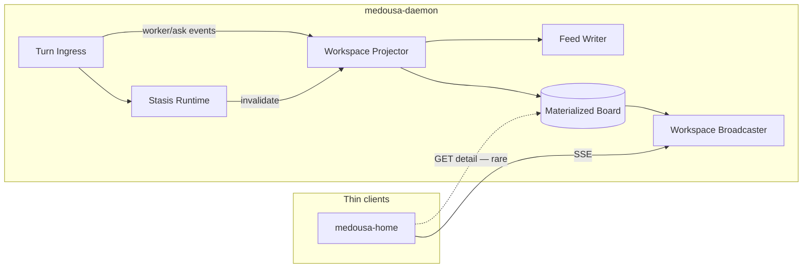

# Workspace projector — phased plan

> **Status:** Waves 1–3 shipped  
> **Date:** 2026-06-07  
> **Problem:** Work board and chat feel frozen under research/worker load despite low CPU/RAM — state is re-derived on every read instead of maintained as a materialized view.

## Diagnosis (short)

Low CPU/RAM means the machine is not starved. The daemon behaves like a distributed system **without a shared read model**: every `GET /workspace/cards/{id}` runs a full Stasis scan; workspace SSE runs that scan twice per second per client; Home refetches card detail on every SSE upsert. Research spawns workers → event rate climbs → amplification loop.

## Target architecture (one daemon, internal microservices)

**Rules**

1. One writer per aggregate — only the Projector mutates the board view.
2. Reads never trigger full rescans — `GET /cards/{id}` is O(1) lookup.
3. Events / invalidations drive refresh — not every HTTP handler.
4. Clients subscribe — SSE carries card summaries; detail fetch is on inspect only.

---

## Wave 1 — State hygiene (shipped)

**Status:** Shipped (2026-06-07)

**Goal:** Board and chat stay responsive during research; no full rescan per card fetch.

| Item | Change |
|------|--------|
| `WorkspaceHub` | Single projector task: debounced full scan + `apply_projection_to_store` |
| Read model | `Arc<WorkspaceReadSnapshot>` with `HashMap<card_id, ProjectedWorkItem>` + revision |
| `watch` channel | All SSE clients + HTTP reads share one snapshot |
| `WorkspaceService` | `get_card_detail`, `snapshot`, `list_cards` read from hub; `sync_runtime` → `trigger_refresh` |
| SSE (`feed.rs`) | Diff from `watch` updates; drop per-tick double `project_workspace_items` |
| Daemon init | `init_workspace_hub(composition)` at startup |
| Home UI | Skip redundant `cacheCardDetail`; debounce activity prefetch; respect cache on upsert |

**SLOs after Wave 1**

- Open Work: board from SSE snapshot, no prefetch storm
- Card inspect: one daemon lookup from read model
- Research running: projector coalesces bursts (1 scan per ~150ms max, not per upsert)

---

## Wave 2 — Async I/O boundary

**Status:** Shipped (2026-06-07)

**Goal:** Remove blocking disk from async handler paths.

| Item | Change |
|------|--------|
| `FeedWriter` actor | `src/workspace/persist.rs` — `mpsc` + `tokio::fs` |
| Feed + revision | Append JSONL and revision file async (immediate queue) |
| Snapshot files | `card_states.json`, `associations.json`, `ask_jobs.json`, `turn_workers.json` debounced 1.5s |
| Daemon boot | `init_persist_writer()` before workspace hub |
| Shutdown | `flush_persist_writer()` on graceful ctrl-c |
| Fallback | Sync disk write when writer not initialized (tests) |

**Next (Wave 3):** Incremental projection events.

---

## Wave 3 — Incremental projection

**Status:** Shipped (2026-06-07)

**Goal:** Cost scales with **active** work, not historical job count.

| Item | Change |
|------|--------|
| Typed events | `WorkspaceDomainEvent` — job/worker/ask/budget changes |
| Incremental projector | Single-card projection via `incremental.rs`; 50ms event coalesce |
| Visible reconcile | Generic invalidate re-projects board cards only (not full Stasis scan) |
| Full scan | Boot, `POST /v1/workspace/rebuild`, 60s safety reconcile, explicit `refresh_now` |
| Store hooks | Ask/worker/budget stores emit events on mutation; scheduler emits `StasisJobChanged` |

**Removed:** 1 Hz full Stasis scan from projector loop.

---

## Wave 4 — Distribute (optional)

Extract projector as sidecar or consume Stasis change feed. Same HTTP/SSE contracts; different deployment.

---

## Internal channel map (Rust)

| Channel | Producer | Consumer | Purpose |
|---------|----------|----------|---------|
| `mpsc<RefreshRequest>` | HTTP actions, turn complete, scheduler | `WorkspaceProjector` | Coalesced invalidation |
| `watch<Arc<Snapshot>>` | Projector | SSE hub, HTTP reads | Lock-free reads |
| `mpsc<PersistOp>` | Projector (Wave 2) | `FeedWriter` | Async disk |
| `broadcast` (existing) | Turn runtime | Interactive SSE | Unchanged |

---

## Key files

| Area | Path |
|------|------|
| Projector + read model | `src/workspace/projector.rs` |
| Incremental projection | `src/workspace/incremental.rs`, `src/workspace/domain_event.rs` |
| Async persist writer | `src/workspace/persist.rs` |
| Service (read API) | `src/workspace/service.rs` |
| SSE broadcaster | `src/workspace/feed.rs` |
| Feed / revision disk | `src/workspace/store.rs` |
| Daemon bootstrap | `src/bin/medousa_daemon.rs` |
| Home workspace store | `apps/medousa-home/src/lib/stores/workspace.svelte.ts` |
| Activity prefetch | `apps/medousa-home/src/lib/components/layout/ActivityPanel.svelte` |

---

## UX principles (“truly feel good”)

| Interaction | Target | Mechanism |
|-------------|--------|-----------|
| Open Work | Instant board | SSE snapshot, no mount prefetch storm |
| Worker column move | Live kanban | SSE upsert only |
| Inspect card | <100ms | Read model hit |
| Chat during research | Composer always works | Turn ingress independent of workspace |
| Reconnect | Short catch-up | `since_revision` + one snapshot if drift |

**Product line:** *The board is a live view of durable work, not a report generated on every click.*
