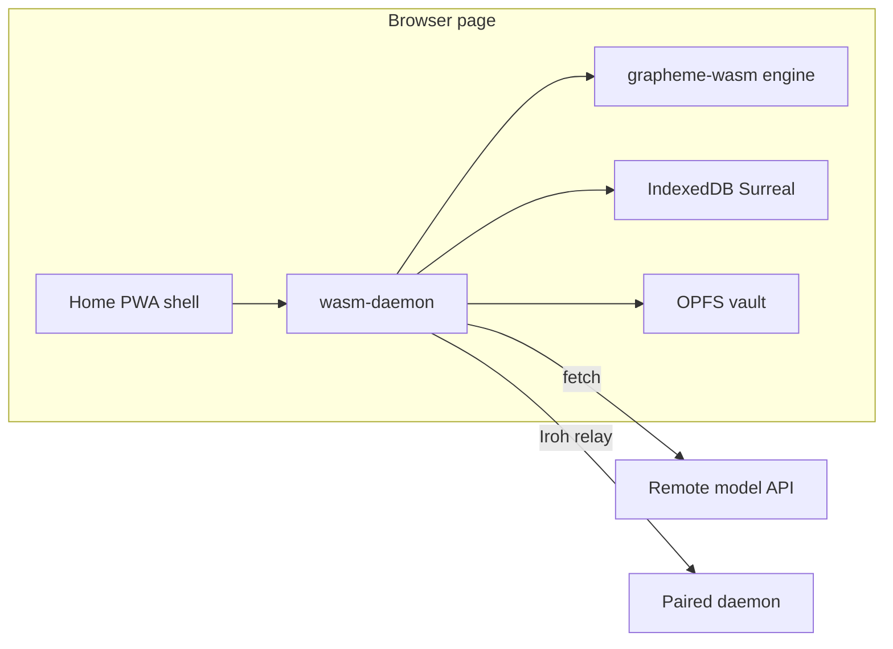

# Browser WASM workshop

> **Status:** Plan lock — compile profile, host adapters, and page shell
>
> **Target:** `wasm32-unknown-unknown` Personal workshop in a browser tab
>
> **Related:** [iOS daemon parity recovery train](ios-embedded-daemon-plan.md)
>
> **Date:** 2026-09-28

## Why this epic exists

The iOS plan already names browser WASM as the later deployment of
`medousa_daemon`. This epic is that follow-on. It does not add a second agent
loop, a second persistence model, or a slim product beside the daemon.

A tab boots its own Personal workshop. Chat, sessions, memory, notes, and
Grapheme scripts run in the page. Inference stays a remote API call. A full
`medousa://pair/2.0` invite pairs the tab as a portal: the same Ed25519
ceremony the phone runs, then Home's daemon calls go to that private daemon
over the Iroh relay. Compact LAN invites stay on the Medousa app. Forge,
Wasmer, Axum, process spawn, local model binaries, and SurrealKV stay on
native hosts.



## Product definition

`medousa_daemon` is the product. Full, embedded, and wasm are deployment
compositions of that one product. The user-facing app is Medousa. Home in a
browser is co-located with the wasm daemon’s origin-private storage: IndexedDB
for the Surreal workshop and OPFS for vault and script files. Folder pickers
and Reveal stay unavailable. Vault reads go through the daemon, as on mobile.

## Locked invariants

1. **One daemon.** `src/lib.rs` already treats full and embedded as
   compositions. `wasm-daemon` joins that set. Same schema order, DTOs, and
   turn entry as embedded (`EmbeddedDaemon::boot` / `start_turn`).
2. **Slim is a compile profile.** Embedded already refuses
   `RuntimeComposition::InMemory`. The browser workshop stays on
   `RuntimeComposition::Surreal`.
3. **Grapheme scripts stay.** Execute them with grapheme-wasm 0.7.1: compiler
   plus `RuntimeEngine` with default features off, stdlib feature `wasm`.
   Native Wasmer (`grapheme-runtime` `wasmer/sys`) stays on desktop and phone.
   Embedded runs scripts through `portable_grapheme_engine` and
   `grapheme_runtime`, both of which call `ForgeExecutionService`. That host
   is the piece this profile replaces, not the script language.
4. **Iroh stays.** `iroh` 1.0 already has a `wasm_browser` target: relay over
   `ws_stream_wasm`, native UDP and portmapper compiled out. The browser dials
   `medousa-http/1` through `crates/medousa-iroh-http`. `iroh-transport` still
   requires `full-daemon`. The wasm profile depends on the client crates
   without that flag. The phone already does this from the Tauri shell
   (`medousa-sdk-iroh`), not from inside `embedded-daemon`.
5. **No host filesystem.** `isCoLocatedWorkshop()` stays false in the browser
   so folder pickers and Reveal do not open. Origin-private vault I/O is the
   wasm daemon’s OPFS root.

## Persistence

Stasis 0.13 `RuntimeBackend` is `InMemory`, `SurrealMem`, `SurrealKv` (both
behind `surreal-native`), and `SurrealWs`. On `wasm32` without
`surreal-native`, `connect_surreal_any` rejects anything that is not `ws://`
or `wss://`. Locus already documents `indxdb://<name>` in
`locus_node_store_factory`. This profile opens `indxdb://medousa` with
`Surreal::<Any>::connect` and `RuntimeFactory::from_db`, then runs
`ensure_stasis_runtime_schema` and the workshop store init that follows the
Surreal arm. `SurrealKv` and `surreal-native` do not enter the wasm graph.
In-memory boot remains a hard error. Reopen after refresh must recover
sessions and notes from that IndexedDB database.

## Phases

**0. Plan lock.** This document, and a pointer from the iOS plan’s “Deferred
WASM work” section. No behavior change.

**1. Compile profile.** `wasm-daemon` beside `embedded-daemon`. Include the
portable module set (authority, the shared Stasis schema, sessions, turns,
memory, Grapheme). Exclude Axum, `tokio` fs/process/net, Wasmer, SurrealKV,
Forge, Detamu, image/PDF codecs, and MCP process hosting. Point Grapheme at
`grapheme-wasm` (compiler and runtime with default features off, stdlib
`wasm`). Split Iroh so the profile can enable `medousa-iroh-http` without
`full-daemon`. Gate:

```bash
cargo check -p medousa --target wasm32-unknown-unknown --no-default-features --features wasm-daemon --lib
```

**2. Host adapters.** Replace `tokio::fs`, `spawn_blocking`, and process-group
execution on this target with wasm-bindgen futures, OPFS for vault and script
files, and `fetch` for model calls. Clock and interval come from the browser.
Boot still calls the same ordered schema and store init once a Surreal handle
exists.

**3. IndexedDB workshop.** The wasm Surreal connect path accepts `indxdb://`.
Medousa boot passes `indxdb://medousa` instead of `runtime.surrealkv`. Locus
memory uses the same endpoint via the existing `indxdb://` factory.

**4. Page bridge.** Export boot, start turn, turn stream, session list,
Grapheme run, and Iroh ticket dial through `wasm-bindgen`, matching the
in-process client in `apps/medousa-home/src-tauri/src/embedded_daemon.rs`. No
Axum listener in the page. The cdylib is `crates/medousa-browser`. Its
dependencies are `wasm32`-only, so native workspace checks compile an empty
library and do not pull the browser graph.

**5. PWA shell.** Serve the existing static Home build with a web manifest and
service worker. The browser platform reuses the mobile shell and calls the
wasm exports where mobile uses Tauri `invoke`. Terminal, Siri, WhatsApp, and
computer-use panels stay off this host.

## Out of scope

Native shell and PTY, Forge and coder worktrees, local inference binaries,
Wasmer host modules, an Axum server inside the tab, and SurrealKV on disk.
