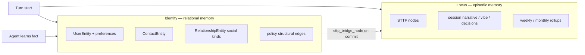

# Cognitive identity memory plan — relational world model for Medousa

> **Status:** Phase 0–1 in progress  
> **Date:** 2026-05-30  
> **Stasis baseline:** `stasis-rs` 0.4.0 (`IdentityContextMode`, `ContactEntity`, `UserEntity.preferences`, typed `RelationshipKind`)  
> **Related:** [worker-continuity-plan.md](worker-continuity-plan.md), [context-lanes-and-scratchpad-plan.md](context-lanes-and-scratchpad-plan.md), [agent-experience-gap-analysis.md](agent-experience-gap-analysis.md), [centralized-agent-runtime-roadmap.md](centralized-agent-runtime-roadmap.md)

## Executive summary

Medousa already uses the Stasis identity store for **policy and handoff** (persona, user, channel, autonomy scopes, MCP gatekeeping). That works well.

This plan adds a **cognitive layer** on the same graph: durable relational memory the operator expects an assistant to retain — preferences (“matcha not coffee”), people (“Mario is an engineer at Google”), colleagues, delegation lineage — without forcing the model to author STTP for every small fact.

**Principle:** Identity = relational world model. Locus = episodic reasoning memory. Different jobs, bridged on write, fused on read.

We implement in ordered phases with acceptance tests at each boundary. No “quick digest” shipped before migration, modes, write policy, and tool contracts are correct.

---

## Problem

Today the model sees identity at turn start as **metadata counts**, not memory:

```
persona_present=true relationships=4 policies=2 …
```

`cognition_identity_context` returns full JSON but is opt-in, low-level (`entity_type` + raw patch), and not steered for “remember this about me.” Operators must use Locus STTP for personal facts — heavy, wrong tier, and semantically mismatched.

Meanwhile Stasis 0.4.0 ships the data model we designed upstream:

| Capability | Stasis 0.4.0 |
|------------|----------------|
| User preferences map | `UserEntity.preferences: BTreeMap<String, Value>` |
| People | `ContactEntity` |
| Social / cognitive edges | `RelationshipKind::{Knows, Prefers, Colleague, Delegation}` |
| Policy vs cognitive recall | `GetIdentityContextRequest.mode: Full \| Policy \| Cognitive` |
| Contact hydration | `GetIdentityContextResponse.contacts` |

Medousa `Cargo.toml` pins 0.4.0, but application code still assumes 0.3 shapes (`relationship_kind: String`, no `mode`, no `ContactEntity`).

---

## North star

At turn start, Medousa injects a compact **relational memory digest** sourced from identity `Cognitive` mode. When the operator shares durable personal information, the agent uses a single high-level write tool that maps to native 0.4.0 entities. Commits optionally emit an STTP bridge node into Locus for audit and episodic trail — identity graph remains source of truth for structured recall.

**Success feels like:** “What does Mario do?” answered from turn context without a memory tool call. “Remember I like matcha” persists across sessions and channels (per `user_id`).

---

## Two memory systems



| Store | Holds | Recall path | Write path |
|-------|-------|-------------|------------|
| **Identity** | Preferences, people, social edges, delegation | `mode: Cognitive` + digest compiler | `cognition_identity_remember` (+ propose/commit for power users) |
| **Locus** | Session reasoning, operator feedback, architecture notes | `cognition_memory_context` / cheap recall | `cognition_memory_store` |

**Routing rule (prompt + tools):** durable facts about the operator’s world → identity. Session narrative, vibe, plans, code decisions → Locus.

---

## Data model (Stasis 0.4.0)

### User preferences

Scalar or small structured values on the user row:

```text
user:default.preferences.beverage = "matcha"
user:default.preferences.caffeine = false
```

Patch path `preferences.<key>` is **AutoCommit** tier in Stasis (not in approval list).

### Contacts

```text
ContactEntity {
  contact_id: "contact:mario",
  display_name: "Mario",
  aliases: ["mario@…"],
  status: "active"
}
```

### Social relationships

```text
UserEntity → ContactEntity
  relationship_kind: partner | colleague | knows | Legacy("dog")
  policy_tags: ["role:engineer", "employer:google"]
  last_transition_reason: "patch_applied"  # audit only — Stasis commit reason
  confidence, recency_score
```

Human-facing role labels come from **`relationship_kind`** (+ optional **`policy_tags`** nuance). Do not store operator prose in `last_transition_reason`.

Stasis 0.4.0 maps roles like `partner` and `dog` to `RelationshipKind::Legacy("…")`. Medousa's cognitive context loader keeps user↔contact legacy kinds visible (Stasis `is_social()` alone would drop them).

Preference-as-edge (when the target is not a contact):

```text
UserEntity → ConceptEntity (entity_ref only; no backing row required for v1)
  relationship_kind: prefers
  last_transition_reason: "patch_applied"  # audit only
```

Prefer **user.preferences** for simple key/value prefs; store the human statement in the preference value (or `policy_tags` on a `prefers` edge). Use **prefers** edges when the target is relational or needs tags/history.

### Delegation (worker continuity Phase B)

```text
relationship_kind: delegation
derived_from_relationship_id, transition_receipt_id
```

Aligns with [worker-continuity-plan.md](worker-continuity-plan.md) Phase B — same store, same mode machinery.

---

## Context modes — who requests what

| Consumer | `IdentityContextMode` | Why |
|----------|----------------------|-----|
| MCP policy / `mcp_policy.rs` | `Policy` | Autonomy scopes only; no preferences/contacts noise |
| `channel_policy_probe` | `Policy` | `proactive_allowed`, channel type |
| Turn-start relational digest | `Cognitive` | Social edges + preferences + contacts |
| `cognition_identity_context` (default) | `Cognitive` | Agent read of world model |
| Daemon inspect / CLI `identity context` | `Full` | Operator forensics |
| Stasis `load_identity_context_summary` | `Cognitive` (upstream) | Diagnostics counts — Medousa replaces with digest for prompts |

**Invariant:** Never use `Full` or default mode for prompt injection when `Policy` or `Cognitive` is intended.

---

## Operator decisions (locked for v1)

| Topic | Decision |
|-------|----------|
| Stasis version | **0.4.0** — no phantom-contact hacks; use `ContactEntity` |
| Inferred fact commits | **`user_direct` auto-commits**; `model_inferred` propose-only unless operator confirms (relationship_kind is `confirm_required` in Stasis) |
| Confidence floor | Keep `auto_commit_min_confidence: 0.85` for model_inferred when we add explicit confirm UX later |
| Multi-user | `MEDOUSA_IDENTITY_USER_ID` / per-channel user id via existing `resolve_identity_user_id` |
| Conflict handling | **Last-write-wins** on `preferences.<key>`; relationship updates bump `recency_score` and set audit `last_transition_reason` (e.g. `patch_applied`; history via `list_entity_history`). Semantic role changes go in **`relationship_kind`** and nuance in **`policy_tags`**. |
| Locus bridge | On identity commit with `sttp_bridge_node`, store to session `medousa-identity` (audit, not primary recall) |
| Digest budget | Max ~800 chars turn-start relational block; truncate lowest `recency_score` edges first |

---

## Phases

### Phase 0 — Stasis 0.4.0 migration (foundation)

**Goal:** Medousa compiles and runs correctly against 0.4.0 identity types. No new UX yet.

**Work:**

1. `relationship_kind: RelationshipKind::parse(...)` / enum variants in `identity_memory.rs` seed paths (`assistant_user`, `user_channel`).
2. All `GetIdentityContextRequest` sites pass explicit `mode` (default `Full` only where truly needed).
3. `UserEntity` construction includes `preferences: Default::default()`.
4. `parse_identity_entity_type` — add `contact` / `ContactEntity`.
5. `identity_store_ext.rs` — contact commit path; user `preferences` patch application; relationship commit delegation verified on Surreal + in-memory.
6. Surreal schema: rely on Stasis `ensure_schema` for `identity_contact`, `identity_user.preferences` (daemon restart on existing DB).
7. Tests: seeded store context loads; policy mode strips preferences; cognitive mode returns social edges (port or integration).

**Acceptance:**

- `cargo test` identity modules green.
- Daemon starts on populated Surreal DB without identity DDL wedge.
- `medousa_cli identity context --mode cognitive` (or equivalent) shows contacts/preferences fields when seeded.

**Files:**

- `src/identity_memory.rs`
- `src/identity_store_ext.rs`
- `src/identity_write_policy.rs`
- `src/identity_tools.rs`
- `src/agent_runtime/prompt_prep.rs`
- `src/mcp_policy.rs`
- `src/bin/medousa_daemon.rs`
- `src/identity_markdown.rs`

---

### Phase 1 — Relational memory compiler (read path)

**Goal:** Turn start injects human-readable relational memory from `Cognitive` context.

**Work:**

1. New module `src/cognitive_identity.rs` (or `src/identity_digest.rs`):
   - `load_cognitive_identity_context(store, user_id, policy_profile) -> Result<CognitiveIdentitySnapshot>`
   - `compile_relational_memory_digest(snapshot, budget) -> String`
2. Snapshot struct: preferences map, contacts indexed by id, social relationships with resolved contact names.
3. Digest format:

   ```text
   [MEDOUSA_RELATIONAL_MEMORY]
   status=ready
   preferences: beverage=matcha; caffeine=false
   people: Mario — engineer at Google (knows, conf=0.86)
   notes: …
   ```

4. Wire into `identity_context_probe` / `append_identity_context_hint` — **replace** count-only summary for prompt path; keep counts in `◈ identity_context` notice as diagnostics.
5. `channel_policy_probe` and MCP policy **unchanged** — stay on `Policy` mode via separate code path.
6. Unit tests: fixture `GetIdentityContextResponse` → expected digest strings; budget truncation.

**Acceptance:**

- Seeded test graph (Mario + matcha) appears verbatim in prepared turn prompt.
- Policy relationships never appear in digest.
- Empty cognitive graph → `status=empty` (not an error).

**Non-goals:** No new write tools in Phase 1.

---

### Phase 2 — Write contract and policy

**Goal:** Server-side mapping from operator facts to 0.4.0 entities with correct tiers and Medousa product policy.

**Work:**

1. Extend `IdentityProductConfig`:
   - `model_inferred_auto_commit_fields` prefix rules for `preferences.*`
   - Allow `policy_tags`, audit `last_transition_reason`, `recency_score`, contact `display_name`, `aliases`
2. `identity_write_policy.rs` — prefix match for nested preference paths; document deny rules for autonomy widen (unchanged).
3. Internal service `CognitiveIdentityWriter` (not necessarily public API):
   - `remember_preference(user_id, key, value, source, confidence, reason)`
   - `remember_contact(user_id, display_name, attributes, statement, source, …)` → upsert contact + `knows` edge
   - `remember_note(…)` → `prefers` edge or preference key
   - Uses existing propose → evaluate → commit pipeline
4. STTP bridge hook: after successful commit, if `sttp_bridge_node` present → `cognition_memory_store` to `medousa-identity` (config-gated `identity.bridge_to_locus: true`).
5. Tests: user_direct preference auto-commits; model_inferred relationship_kind propose-only; bridge store invoked once.

**Acceptance:**

- CLI / daemon propose+commit paths for contact + preference documented in plan checklist.
- No agent-facing tool yet — operators can seed via existing identity APIs.

---

### Phase 3 — `cognition_identity_remember` tool

**Goal:** One agent-facing tool the model can reliably call.

**Schema (draft):**

```json
{
  "fact_kind": "preference | person | note",
  "subject": "beverage | Mario",
  "statement": "User prefers matcha over coffee",
  "attributes": { "role": "engineer", "employer": "Google" },
  "source": "user_direct | model_inferred",
  "confidence": 0.9
}
```

**Behavior:**

- Maps to `CognitiveIdentityWriter` (Phase 2).
- Returns `{ committed, proposal_ids, digest_preview, sttp_bridge_stored }`.
- Register on host tool surface; research worker allowlist read-only until write policy reviewed.

**Prompt steering** (`system_prompt.rs` / turn policy appendix):

- When operator states durable personal fact → prefer `cognition_identity_remember` over `cognition_memory_store`.
- When operator says “remember” in a session-narrative sense → Locus.

**Acceptance:**

- Integration test: simulated tool loop stores preference + contact; next `prepare_turn_prompt` digest contains both.
- Worker lane cannot write unless explicitly allowlisted per intent.

**Files:**

- `src/identity_tools.rs` (or `src/cognitive_identity_tools.rs`)
- `src/tui/runtime_services.rs` (registration)
- `src/agent_runtime/system_prompt.rs`
- `src/tool_names.rs`

---

### Phase 4 — Export, CLI, and operator UX

**Goal:** Identity memory visible and editable outside the tool loop.

**Work:**

1. Upgrade `identity_markdown.rs` — `Cognitive` mode export: `USER.md` preferences section, `PEOPLE.md` or section in `IDENTITY.md` from contacts + edges.
2. CLI: `medousa identity remember …` wrapping same writer as agent tool.
3. Daemon API: optional `POST /identity/remember` for channel adapters (Telegram, etc.).
4. TUI observability: `◈ identity_remember` notice with subject + committed status.

**Acceptance:**

- Export after seed matches digest content.
- CLI remember → digest updates on next turn without restart.

---

### Phase 5 — Worker continuity and delegation integration

**Goal:** Same relational memory in workshop lane; delegation edges in graph.

**Work:**

1. [worker-continuity-plan.md](worker-continuity-plan.md) Phase B: commit `RelationshipKind::Delegation` on worker spawn (receipt + parent turn).
2. Phase C: worker handoff capsule includes `relational_memory_digest` (truncated) from host snapshot.
3. `cognition_identity_context` on worker allowlist (`mode: cognitive` default).
4. Synthesis re-entry (Phase E): mention delegated work + unchanged operator preferences.

**Acceptance:**

- Worker prompt contains relational digest when host had cognitive context.
- Delegation edge queryable in `Full` mode for operator inspect.

---

## Module map (target end state)

| Module | Responsibility |
|--------|----------------|
| `src/cognitive_identity.rs` | Snapshot load, digest compile, writer service |
| `src/identity_memory.rs` | Seed, resolve ids, 0.4.0 types |
| `src/identity_store_ext.rs` | Commit overlay (persona, user, contact, relationship) |
| `src/identity_write_policy.rs` | Product policy, field allowlists |
| `src/identity_tools.rs` | context / propose / commit / remember |
| `src/agent_runtime/prompt_prep.rs` | Probes, hint append, mode selection |
| `src/identity_markdown.rs` | Operator export |

---

## Testing strategy

| Layer | Tests |
|-------|-------|
| Unit | Digest compiler fixtures; write policy prefix; `RelationshipKind` seed |
| Integration | in-memory store: seed → cognitive context → digest → remember → digest |
| Parity | Surreal-backed store (if CI has surreal) — schema + one contact roundtrip |
| Prompt | `prepare_turn_prompt` snapshot test with `[MEDOUSA_RELATIONAL_MEMORY]` |
| Regression | MCP policy still denies/allows same actions with `Policy` mode |

---

## Observability

```text
◈ identity_context mode=cognitive contacts=1 preferences=2 relationships=1 digest_chars=142
◈ identity_remember fact_kind=person subject=Mario committed=true proposal_ids=[]
◈ identity_bridge locus_session=medousa-identity stored=true
```

Stderr mirrors for daemon forensics.

---

## Non-goals (v1)

- Embedding / semantic search over identity graph (Locus handles fuzzy episodic recall).
- Multi-tenant operator isolation beyond `user_id` (future channel-specific users only via existing resolver).
- Automatic fact extraction from every turn (explicit remember or high-confidence operator statements only).
- Replacing Locus weekly rollups with identity rollups.
- OpenClaw SOUL.md as source of truth (export is derived, not authoritative).

---

## Risks and mitigations

| Risk | Mitigation |
|------|------------|
| Existing Surreal DB missing `identity_contact` | Stasis schema bootstrap on daemon start; document one-time restart |
| Model writes junk facts | `model_inferred` propose-only; confidence floor; operator review CLI |
| Digest bloat | Char budget + recency-based truncation |
| Policy / cognitive bleed | Strict `mode` on every call site; tests per consumer |
| Duplicate memory in Locus + identity | Prompt routing rules + different tool names |

---

## Implementation order (strict)

1. **Phase 0** — migration (blocker for everything)
2. **Phase 1** — read digest (validates graph + modes)
3. **Phase 2** — writer + policy + bridge (no agent tool)
4. **Phase 3** — `cognition_identity_remember`
5. **Phase 4** — CLI / export / daemon
6. **Phase 5** — worker + delegation

Do not ship Phase 1 digest without Phase 0 mode migration. Do not ship agent remember tool before Phase 2 policy tests pass.

---

## Checklist before marking complete

- [ ] Phase 0: all `GetIdentityContextRequest` sites use explicit `mode`
- [ ] Phase 0: `RelationshipKind` typed throughout Medousa
- [ ] Phase 0: contact commit works on Surreal
- [ ] Phase 1: `[MEDOUSA_RELATIONAL_MEMORY]` in prepared prompt
- [ ] Phase 2: preferences + contact writer + optional Locus bridge
- [ ] Phase 3: tool registered + prompt steering + integration test
- [ ] Phase 4: markdown export + CLI remember
- [ ] Phase 5: worker digest + delegation edges
- [ ] architecture/README.md lists this document
- [ ] Operator smoke: Mario + matcha survives daemon restart

---

## References

- Stasis 0.4.0: `IdentityContextMode`, `ContactEntity`, `UserEntity.preferences`, `RelationshipKind`
- Stasis filter: `identity_context_filter.rs` — `apply_identity_context_mode`
- Stasis compiler: `identity_context_compiler.rs` — cognitive diagnostics
- Medousa identity tools: `src/identity_tools.rs`
- Medousa product policy: `src/product_config.rs` → `IdentityProductConfig`
- Worker continuity: [worker-continuity-plan.md](worker-continuity-plan.md) Phases B–C
