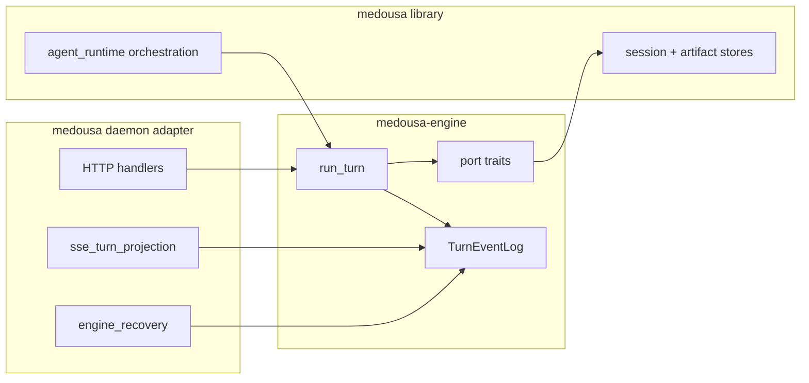

# Component: medousa-engine

## Role

[`crates/medousa-engine/`](../crates/medousa-engine/) is the **transport-free turn core** extracted from the daemon during engine hardening (Phase 5). It owns typed turn events, the durable spine, and port traits — not HTTP, SSE, or channel adapters.

Integrator streaming contract: [../docs/engine/interactive-streaming.md](../docs/engine/interactive-streaming.md)  
ADR: [../docs/architecture/decisions/adr-004-durable-turn-spine.md](../docs/architecture/decisions/adr-004-durable-turn-spine.md)

## Crate layout

| Module | Responsibility |
|--------|----------------|
| `turn_event` | `TurnEvent`, `TurnEnvelope`, `SequencedTurnEvent`, `Principal`, `TurnSurface` |
| `turn_event_log` | `TurnEventLog` — durable journal, `snapshot_since`, `project_turn_to_history`, `recover_uncommitted` |
| `engine` | `run_turn`, `EngineTurnHandle`, `TurnLifecyclePorts`, `TurnRunOutcome` |
| `ports` | `ToolSinkPort`, `TurnTicketPort`, `TurnStreamRegistryPort`, `TurnStorePort` |
| `stream_sink` | `AgentStreamSink` — outbound event sink trait used by orchestration |
| `scratch` | Per-turn scratchpad for worker delegation |
| `receipt` | Artifact receipt metadata |

## Turn lifecycle

1. Daemon handler enqueues a turn and wires concrete port implementations (`ChannelToolSink`, ticket registry, session store).
2. `run_turn` journals every `TurnEvent` to `TurnEventLog` on disk.
3. SSE handlers project sequenced events via `snapshot_since(since)` + live tail (`src/sse_turn_projection.rs`).
4. On startup, `engine_recovery::recover_uncommitted` replays incomplete turns from the spine.

## What stays in `medousa` (not the crate)

| Area | Location | Why |
|------|----------|-----|
| Tool loop orchestration | `src/agent_runtime/` | LLM, MCP, specialists, host/worker bus |
| HTTP/SSE | `src/daemon/interactive.rs`, `ingest.rs` | Wire format + auth |
| Comms | `src/comms/` | Transport pool, gateway hardening, route selection |
| Observability | `src/observability/` | Tracing, log rotation, dead-letter cap |
| Recovery wiring | `src/engine_recovery.rs` | Daemon startup adapter |

The daemon binary (`medousa_daemon`) remains a thin launcher: FD limits, global concurrency, tracing init, router mount.

## Port traits (extension points)

Daemon adapters implement:

- **`ToolSinkPort`** — emit tool-bus events into the spine
- **`TurnTicketPort`** — turn tickets and active-turn tracking
- **`TurnStreamRegistryPort`** — register live SSE subscribers per turn
- **`TurnStorePort`** — persist terminal history and artifacts

This keeps `medousa-engine` usable in tests and future binaries without pulling in axum or Iroh.

## Related docs

- [component-daemon.md](component-daemon.md) — HTTP API and process model
- [turn-runtime-and-lanes.md](turn-runtime-and-lanes.md) — FSM, lanes, host/worker bus (orchestration layer)
- [daemon-modules.md](../docs/architecture/daemon-modules.md) — handler module map
