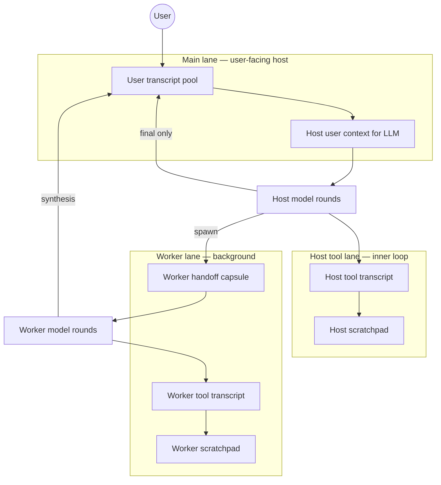

# Context lanes, scratchpad, and runtime event loop

> Created: 2026-05-31  
> Status: **Phase 1–2 implemented** (scratchpad + host user/tool lane split). Phase 3+ below remain planning.  
> Related: [turn-worker-bus-plan.md](turn-worker-bus-plan.md), [turn-ledger-phase0.md](turn-ledger-phase0.md), [tool-loop-interim-text-fix.md](tool-loop-interim-text-fix.md), [centralized-agent-runtime-roadmap.md](centralized-agent-runtime-roadmap.md)

## Summary

Medousa already has a strong **host bus + tool loop + ledger** stack. The remaining gap is not “more heuristics” but **clear context ownership**: what the user sees, what the model sees while calling tools, and what workers inherit—without one `messages` vector mixing all three.

This plan:

1. **Now (highest ROI):** tiered **context pools** + **turn scratchpad** for host and worker tool lanes.  
2. **Next:** sharper **turn classification** (which lane + which pools apply).  
3. **Later:** formal **event-loop runtime** (main lane vs worker “threads”).  
4. **Last (do it right):** **Locus-backed prompt versioning** via reserved `user_id` pools (“git for prompts”).

---

## Mental model: JS event loop + worker threads

| JS concept | Medousa analogue | Owns |
|------------|------------------|------|
| Main thread / UI | **Interactive lane** (user-facing host) | Session transcript the user cares about; final `agent_response`; delegation tickets |
| Worker threads | **Worker lane** (`cognition_spawn_turn_worker`) | Scoped tool loop; ritual execution; `prepare_final` → synthesis |
| Task queue | **Turn worker store** + ledger JSONL | `work_id`, status, errors, tool names |
| GC / references | **Context handles** (not memory GC) | Stable IDs pointing at scratch blobs, ledger slices, or Locus nodes—drop handles when turn/work completes |

The host should **never** need the full worker tool transcript in the user lane. The worker should **never** need the full user chat history—only a **handoff capsule** plus its own tool lane.



---

## Context tiers (your model, named for code)

### Tier A — User lane (persistent, user-visible)

**Purpose:** What the human reads in TUI/Telegram/history files.

**Contains:**

- User messages (committed per turn policy).
- **Final** assistant messages only (post–`prepare_final`, post-synthesis, failure-explanation pass, or deliberate interim if we ever choose to persist one).
- Optional short system-facing summaries **only if** product wants them visible (default: no raw tool JSON here).

**Does not contain:**

- Per-round tool call/response pairs.
- `[MEDOUSA_TURN_CONTROL]` lines.
- Streamed interim “let me check…” scratch (already excluded from `messages` in [tool-loop-interim-text-fix.md](tool-loop-interim-text-fix.md)—must stay excluded from **session append** too).

**Code anchor today:** `turn_services::build_prior_messages` → `prior_messages` in `execute_local_turn`; `session::append_turn` on completion.

---

### Tier B — Host tool lane (ephemeral, inner loop)

**Purpose:** Everything the **host** model needs to continue a tool sequence without “forgetting the thread.”

**Contains:**

- Full `ChatMessage` tool-call / tool-result chain for **this host turn only**.
- `[MEDOUSA_TURN_CONTROL]` + (new) `[MEDOUSA_SCRATCH]` injections each round.
- Rolling **tool-sequence digest** (compact list: round → tools → ok/error one-liner).

**Does not contain:**

- Entire session hot/cold history re-copied every round (today: `prior_messages` + user prompt are prepended once at loop start—good; avoid re-growing user lane inside this vec).

**Code anchor today:** `MedousaToolLoopPipeline::execute_internal` builds one `messages` vec = system + **prior_messages** + user prompt + loop growth. **Gap:** prior_messages are **user-lane** material; tool lane has no separate identity and no structured scratch.

---

### Tier C — Worker tool lane (ephemeral, per `work_id`)

**Purpose:** Worker ritual loop with the same “sequence memory” as host tools.

**Contains:**

- Worker system prompt + **handoff capsule** (from host) as initial user context.
- Worker-local tool transcript + scratch + round digests.
- No full parent chat unless capsule explicitly includes excerpts.

**Code anchor today:** `run_worker_turn` uses `append_tool_loop_policy` on `task_prompt` only; host tool trace is **not** passed. **Gap:** worker starts “cold” except task text; explains lost intent mid-ritual.

---

### Tier D — Scratchpad (structured, ephemeral “pointers”)

**Purpose:** Short, stable **working memory** so the model knows *what it was doing* between tools—without stuffing interim prose into Tier A or bloating Tier B.

Proposed scratch fields (versioned JSON, one object per turn/work):

| Field | Example | Updated when |
|-------|---------|----------------|
| `goal` | “Calibrate AVEC for session X” | Turn start / classifier |
| `phase` | `discover` \| `execute` \| `finalize` | Each tool round |
| `step` | 3 | Increment per tool round |
| `last_tools[]` | `["cognition_memory_schema","cognition_memory_calibrate"]` | After each round |
| `last_error` | optional one-liner | Tool `ok: false` receipt |
| `open_gaps[]` | “moods not run” | Checklist / gatekeeper |
| `delegate` | `{ work_id, intent }` | After spawn |

Injected as:

```
[MEDOUSA_SCRATCH]
goal=… phase=execute step=3
last_tools=…
open_gaps=…
```

**“Pointers”:** scratch may hold `ledger_ref:turn:42:round:3` or future `locus_node_id:…` instead of duplicating large tool outputs (GC = drop scratch when turn/work record closes).

---

## Why the model “loses the thread” today

| Issue | What happens | Tier confusion |
|-------|----------------|----------------|
| Single `messages` stack | User history + tool loop + control lines share one vec | B mixed into A-shaped `prior_messages` |
| Interim text | Streamed but not in transcript (correct)—awareness only via short preview | Scratch too weak vs tool receipts |
| Control without plan | `[MEDOUSA_TURN_CONTROL]` says budget/gaps but not **sequence** | No Tier D |
| Host → worker | `task_prompt` + `user_ack` only | C missing host tool digest |
| Session append | One assistant blob at end | Performer on **next** turn doesn’t see pending/work state in Tier A |
| Classification | Activation caps rounds (short turn, classifier, host bus) but not **lane mode** | Wrong pool sizes/heuristics for the actual job |

Recent fixes (recoverable tool errors, failure-explanation pass, high round caps) help **termination UX**; they don’t fix **in-loop orientation**.

---

## Classification (ROI #2 — after scratch v1)

Turn **lane mode** should be decided once per turn (heuristic + optional classifier), stored on orchestration state and ledger:

| Mode | Host tools | Worker | User lane on end |
|------|------------|--------|------------------|
| `converse` | off or 1 | no | single answer |
| `host_tool` | full host allowlist | no | answer + optional tool summary footnote |
| `host_delegate` | spawn + memory/catalog only | yes | `user_ack` then synthesis |
| `worker_only` | n/a (API) | yes | synthesis only |

Maps to existing pieces:

- `TurnActivationDecision` + `resolve_host_turn_profile` → extend with `TurnLaneMode` enum.
- `enforce_no_tools`, `host_bus_active`, `classifier_restricted_max_tool_rounds` → **policy table** keyed by mode (not independent hidden caps).

**Deliverable:** `decide_turn_lane_mode(prompt, session_meta, classifier_output) -> TurnLaneMode` + one notice `◈ lane_mode=host_delegate`.

---

## Phased roadmap

### Phase 1 — Scratchpad + tool-sequence digest ✅

**Goal:** Model always sees *where it is* in the tool story.

**Shipped:** `src/agent_runtime/turn_context.rs`, `[MEDOUSA_SCRATCH]` in tool lane, ledger `scratch` field, gatekeeper `open_gaps` on scratch.

| Task | Detail |
|------|--------|
| 1.1 | Add `TurnScratchpad` struct in `turn_ledger.rs` (or `turn_scratchpad.rs`) |
| 1.2 | Update each tool round in `medousa_tool_loop.rs`: refresh scratch, append `[MEDOUSA_SCRATCH]` after control line |
| 1.3 | Append compact `tool_round_digest` (names + ok/fail) to scratch |
| 1.4 | Gatekeeper / checklist write `open_gaps` into scratch |
| 1.5 | Persist scratch snapshot in ledger JSONL (`scratch` field on `tool_round` events) |

**Exit:** Ritual turns show monotonic `step` and `last_tools`; fewer “random” tool repeats.

**Non-goals:** Locus, worker handoff redesign.

---

### Phase 2 — Split host pools (user context vs tool context) ✅

**Goal:** Host LLM calls use explicit pools; user lane stays clean.

**Shipped:** `HostTurnContext` in `medousa_tool_loop` — `user_lane_prefix` + `tool_lane.messages`; optional tools footer on final response; failure explanation uses scratch not tool transcript.

| Task | Detail |
|------|--------|
| 2.1 | `HostTurnContext { user_lane: Vec<ChatMessage>, tool_lane: ToolLaneState }` |
| 2.2 | Build **model messages** as: `system` + `user_lane` (read-only prefix) + `tool_lane.messages` (mutable) |
| 2.3 | On finalize: copy **only** final text to Tier A (`append_turn`); optional one-paragraph `tool_summary` for user |
| 2.4 | Failure-explanation pass reads scratch + last error + user_lane—no tool transcript |

**Exit:** Tool loop can grow large without polluting what the *next* turn’s `prior_messages` would imply (tool lane truncated/discarded at turn end).

---

### Phase 3 — Worker handoff capsule + worker tool pool ✅

**Goal:** Workers inherit host intent and maintain their own sequence memory.

**Shipped:** `WorkerHandoffCapsule`, scheduler handoff snapshot, worker Tier C prompt (`[MEDOUSA_WORKER_HANDOFF]`), synthesis from handoff + worker scratch, ledger correlation fields.

| Task | Detail |
|------|--------|
| 3.1 | On `cognition_spawn_turn_worker`, build `WorkerHandoffCapsule` JSON: goal, scratch snapshot, last N tool digests, constraints, `session_id` |
| 3.2 | Worker loop uses Tier C only: system + capsule user message + tool growth |
| 3.3 | Synthesis prompt uses worker scratch + invocations summary—not parent chat |
| 3.4 | Ledger correlates `parent_turn_id` / `work_id` / host scratch hash |

**Exit:** Delegate path feels continuous; worker doesn’t “forget” why host spawned it.

---

### Phase 4 — Lane classification + policy table

**Goal:** One mode drives caps, allowlists, and which pools activate.

| Task | Detail |
|------|--------|
| 4.1 | `TurnLaneMode` + `decide_turn_lane_mode` |
| 4.2 | Replace scattered activation reasons with mode → `TurnLoopPolicy` |
| 4.3 | TUI settings: optional override `lane_mode=auto|…` for power users |
| 4.4 | Docs table in [tool-loop-interim-text-fix.md](tool-loop-interim-text-fix.md) |

**Exit:** Operators understand *why* rounds=1 vs 30; model gets mode-appropriate scratch templates.

---

### Phase 5 — Event-loop runtime (formalize what exists)

**Goal:** Explicit scheduler semantics—main lane never blocked on worker CPU; workers are tasks.

| Task | Detail |
|------|--------|
| 5.1 | `TurnRuntime` queue: `MainTurnTask`, `WorkerTask { work_id }`, `SynthesisTask` |
| 5.2 | Host returns on spawn (`worker_spawned`) by design; synthesis re-enters main queue |
| 5.3 | Structured bus events on `AgentStreamSink` (not only `notice` strings) |
| 5.4 | “GC”: on turn/work complete, drop scratch handles + truncate tool_lane from memory |

**Exit:** Same behavior as today, but testable state machine; adapters subscribe to one event enum.

---

### Phase 6 — Locus prompt pools (“git for prompts”) — **last**

**Goal:** Version worker/host system appendices in Locus under **reserved tenant IDs**; avoid colliding with end-user memory.

| Concept | Choice |
|---------|--------|
| Storage | STTP nodes in Locus (existing `cognition_memory_store` / ingest paths) |
| Tenancy | `user_id` = reserved pool id (documented list users must not use for personal data) |
| Proposed reserved ids | See table below—**finalize in docs before any write** |
| Versioning | Node metadata: `prompt_key`, `semver`, `parent_hash`, `lane` (`host_appendix` \| `worker_research` \| …) |
| Runtime | Load “current” pointer at worker spawn; optional pin in settings |

**Proposed reserved `user_id` values (draft—confirm before implementation):**

| `user_id` | Purpose |
|-----------|---------|
| `medousa-prompts-system` | Host bus appendix, tool policy templates |
| `medousa-prompts-worker-general` | Worker general + capability appendix |
| `medousa-prompts-worker-grapheme` | Grapheme playbook revisions |
| `medousa-prompts-worker-memory` | Locus ritual appendix revisions |

**Read path:** daemon/TUI `user_id` override only for internal prompt fetch tools—not mixed into user session recall.

**Write path:** CI or `medousa prompts publish` command; never from interactive user turns by default.

**Why last:** Requires schema, migration, multi-tenant docs, and conflict policy; wrong early coupling will fight Tier B/C scratch work.

---

## Easy wins (can ship inside Phase 1–2 without full split)

1. **Richer `[MEDOUSA_TURN_CONTROL]`** — include `round=N tools=[…] phase=execute` (not only budget).  
2. **Handoff one-liner on spawn** — return `handoff_summary` in spawn tool JSON for host’s next round.  
3. **Ledger → next-turn system line** — if `work_id` pending, inject `[MEDOUSA_PENDING_WORK]` into Tier A prefix (host only).  
4. **Worker spawn payload** — pass `host_tool_digest` string (last 3 rounds) until capsule exists.  
5. **Classification notice** — `◈ lane_mode=… effective_rounds=… pools=user+tool` for debugging.

---

## What we should not do

- Stuff full tool JSON into user-visible history “so the model remembers.”  
- Duplicate interim assistant messages into tool lane (re-introduces self-dialogue).  
- Store prompt git in user session `session_id` space.  
- Block Phase 1–3 on Locus or event-loop formalization.

---

## Success metrics

| Metric | Target |
|--------|--------|
| Repeat redundant tools same turn | ↓ visibly in ledger |
| “Forgot calibrate” after 5+ tool rounds | ↓ gatekeeper continues with scratch `open_gaps` |
| Delegate quality | Worker synthesis cites host goal without user re-explaining |
| User transcript size | Stable; tool growth isolated to inner lane |
| Operator debug | `lane_mode` + scratch in JSONL |

---

## Code anchors (implementation later)

| Area | File |
|------|------|
| Tool loop messages | `src/medousa_tool_loop.rs` |
| Control / ledger | `src/agent_runtime/turn_ledger.rs` |
| Orchestration | `src/agent_runtime/turn_orchestrator.rs` |
| Prior / user lane | `src/agent_runtime/turn_services.rs` |
| Worker run | `src/agent_runtime/turn_worker/run.rs` |
| Spawn tools | `src/agent_runtime/turn_worker_tools.rs` |
| Host routing | `src/agent_runtime/turn_worker/routing.rs` |

---

## Suggested implementation order

```
Phase 1 (scratch + digest) → Phase 2 (host pool split) → Phase 3 (worker capsule)
        ↘ Phase 4 (classification) in parallel once 1.1 exists
Phase 5 (event loop) → Phase 6 (Locus prompt git)
```

**You are ~85% there** on bus, ledger, host cap, recoverable errors, and failure explanation. The **15%** is almost entirely **Tier B + D for host and worker**, then classification—Locus prompt git is the capstone, not the foundation.
