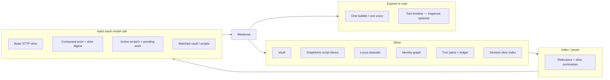

# Continuity-first redesign — one Medousa, indexed memory, runtime-owned limits

> **Status:** Approved plan (2026-06-07)  
> **Supersedes:** ad-hoc “Model 2” control-heavy flow as the default mental model  
> **Related:** [context-lanes-and-scratchpad-plan.md](context-lanes-and-scratchpad-plan.md), [worker-continuity-plan.md](worker-continuity-plan.md), [turn-loop-single-writer-plan.md](turn-loop-single-writer-plan.md), [identity-manuscripts-and-recall-plan.md](identity-manuscripts-and-recall-plan.md), [runtime-collaborator-voice.md](runtime-collaborator-voice.md), [interaction-and-state-model.md](interaction-and-state-model.md)

## Executive summary

Medousa already has the right **tools** (capabilities, vault, scratchpad, workers, manuscripts, Locus, identity). The product gap is **continuity**: the model and user should experience one continuous collaborator, not a host that forgets discovery, re-tools on follow-ups, and ends turns on plan prose.

**Thesis:** Reuse the stack; change how we **inject, prune, store, index, and expose** context. Runtime owns **limits and lane sandboxes**; the model owns **intent and capability choice**; durable stores own **learning** — never raw system-prompt surgery.

---

## Three mental models (history)

| Era | What worked | What broke | Root cause |
|-----|-------------|------------|------------|
| **1 — Verify & momentum** | Intent captured, output verified, user felt carried | Token furnace | Full context + verifier passes + weak pruning |
| **2 — Tools manage state** | Fast, grounded, nice receipts | Cold, self-fighting | Turn lifecycle exposed as control tools while cross-turn memory stayed prose-only |
| **3 — Continuity-first (this plan)** | Reuse tools; one voice; indexed recall | To build | Runtime carries momentum cheaply; model explores capabilities; workers are the same self |

Model 2 failed because we **externalized memory** to the user transcript and **externalized control** to the model (`finish`, `request_more_rounds`, spawn ceremony). Model 3 reverses that.

---

## North star

> **Seamless continuity for user and model.** The user only feels continuity when the runtime makes the model behave continuously.

One thread. One collaborator voice. Workshop execution is **her reaching into capabilities**, not a cold specialist mode. Heavy work may run async; receipts return to the same narrative.

---

## Locked principles

### 1. Intent via context and prompts

- Turn-start injection: ranked relational memory, ambient, continuation blocks, **composed prior turns** (not `content` alone).
- Mid-turn: scratchpad + tool lane (existing Tier B/D).
- Cross-turn: **slice-indexed tool history** (see below) — summaries by default, detail on demand.

### 2. State routing via capabilities, not “modes”

- **Mental model:** no host/worker *modes* for the operator or model.
- **Implementation:** lane allowlists and sandboxes remain (security, product). Prompts describe affordances (“workshop may run grapheme”) not personality splits.

### 3. Workers are Medousa

- Same STTP collaborator voice ([worker-continuity-plan.md](worker-continuity-plan.md)).
- Shared scratch pointers and spawn receipts in `task`.
- Synthesis pass-through when worker already delivered principal-ready prose (Phase 7C in [turn-loop-single-writer-plan.md](turn-loop-single-writer-plan.md)).

### 4. Runtime owns limits (invisible fuses)

- Round budgets, stuck continues, classifier caps → **operator config only** (`TurnLoopSettings`).
- Model does **not** set worker max rounds (already snapshotted at spawn from host settings).
- **Demote** `cognition_turn_request_more_rounds` from default surface; runtime auto-continues within config fuse, then one graceful wrap with scratch digest.
- Limits are **real** (not infinite); they are **silent** (no budget anxiety in every turn).

### 5. Learning through artifacts — not kernel edits

| Layer | Model may write | Injected how |
|-------|-----------------|--------------|
| Base STTP | Never | Repo / operator; small ranked slice |
| Session scratch | Auto each turn | `[MEDOUSA_SCRATCH]` |
| Vault notes | `cognition_vault_write` + tags | Ranked recall |
| Grapheme script library | `cognition_grapheme_script_*` (new) | Match by module/intent |
| Manuscript overlays | Propose or session-scoped working notes | Spawn / turn profile |
| **System prompt** | **Never direct mutation** | — |

Self-improvement = **typed, indexed, auditable artifacts**.

### 6. Actor loop, not control loop

- Turn ends when: principal is served, runtime fuse, or explicit user stop — **not** when model emits plan prose without action.
- Demote `cognition_turn_finish` as the default completion path; prefer complete prose or explicit finish when truly done.
- Host continues until spawn+receipt or fuse when user intent requires delegation (fixes re-discovery on “spin them up” follow-ups).

---

## Continuity pipeline

One pipeline, five operations:



| Operation | Today | Target |
|-----------|-------|--------|
| **Store** | `session_turn.content`, `parts` JSON string, ledger JSONL, scratch ephemeral | + per-turn **slice records**, grapheme script library, session scratch carry-forward |
| **Index** | Hot/cold char chop on prose | Per-slice tool summaries + refs; relevance-ranked vault/Locus |
| **Inject** | `build_prior_messages` → `turn.content` only | Composed priors + `[MEDOUSA_TOOL_SLICES]` digest + scratch |
| **Prune** | Tail truncation | Summary-first; detail only via tool or deep slice ref |
| **Expose** | One bubble + ROUND chips | Same voice; optional collapsed tool inspector |

---

## Slice-indexed tool history (core new mechanism)

### Problem

Full tool transcripts are garbage at scale. Prose-only priors cause amnesia. Dumping `compose_turn_markdown` for every prior turn into hot window will burn tokens again (Model 1).

### Idea

**Index tool usage per session slice** (aligned with existing hot/cold window: `slice_hot_window_turns`, `slice_cold_window_turns`). Each turn gets a compact **slice record**; the model sees **pointers and summaries** by default and **pulls detail** when needed.

### Slice record (per turn, persisted)

Stored alongside `session_turn` (Surreal) or derived at index time from `parts` + ledger:

```json
{
  "slice_id": "session:abc:turn:42",
  "turn_index": 42,
  "role": "assistant",
  "timestamp": "2026-06-07T…",
  "goal": "Resolve base-researcher; scope web research workers",
  "tool_summary": {
    "rounds": 3,
    "tools": [
      "cognition_manuscript_list",
      "cognition_manuscript_resolve×2",
      "cognition_capability_search"
    ],
    "outcomes": [
      "manuscript base-researcher resolved",
      "capability web_research available",
      "openshell offline — use grapheme path"
    ],
    "failures": []
  },
  "scratch_snapshot": { "phase": "execute", "delegate": null },
  "refs": {
    "parts_turn_id": "…",
    "ledger_correlation_id": "…"
  }
}
```

**Size target:** ~200–400 chars per slice summary (operator-tunable).

### What gets injected at turn start

**Always (hot window, last N turns):** one block, not full tool dumps:

```
[MEDOUSA_TOOL_SLICES]
turn 38 (user): asked for multi-topic research plan
turn 39 (assistant): rounds=3 tools=manuscript_list,manuscript_resolve,capability_search → base-researcher resolved; web_research ok; openshell offline
turn 40 (user): "spin them up"
turn 41 (assistant): rounds=4 … [pending: no spawn yet]
```

**Cold window:** one line per turn (existing cold summary pattern), tool names only:

```
turn 12 (assistant): tools=memory_store,vault_write rounds=2 ok
```

**Current turn scratch:** existing `[MEDOUSA_SCRATCH]` (unchanged).

### On-demand detail (model pulls, not pushed)

New read tools (names illustrative):

| Tool | Purpose |
|------|---------|
| `cognition_tool_history_summary` | High-level slices for last *k* turns (default 5); filter by tool name or keyword |
| `cognition_tool_history_detail` | Full tool run for one `slice_id` + optional round — from `parts` / ledger ref |
| `cognition_scratch_history` | Past scratch snapshots for a turn or work_id |

**Flow the model should learn:**

1. Turn start → read slice digest → “ah, I already resolved base-researcher.”
2. If unsure → `cognition_tool_history_detail(slice_id=turn:39, round=2)` → manuscript resolve receipt.
3. Act (spawn workers) without re-listing manuscripts.

This matches operator mental model: **skim index, drill when needed**.

### Index maintenance

| Event | Index action |
|-------|----------------|
| Turn finalized | Build slice from `TurnPartsAccumulator` + final scratch |
| Worker completed | Append worker slice linked to `work_id` + parent turn |
| Session load | Rebuild index from last M turns if missing (migration) |

**Code anchors (today → target):**

- Source: `turn_parts.rs` (`TurnPart::ToolRun`), `turn_context.rs` (`TurnScratchpad`), `turn_ledger.rs`
- Persist: `session_store.rs` (`parts`, new optional `slice_summary` field or side table)
- Inject: `turn_services.rs` `build_prior_messages` → compose priors + slice block
- Tools: new module `tool_history_tools.rs` or extend vault pattern

### Relationship to scratchpad

| Artifact | Scope | Lifetime |
|----------|-------|----------|
| `TurnScratchpad` | Current host/worker loop | Ephemeral; snapshot at end → slice |
| Slice index | Session | Persistent; summarized in priors |
| Vault / script library | Cross-session | Persistent; relevance-ranked |

Scratch = **now**; slices = **recent thread**; vault = **long-term workshop memory**.

---

## Grapheme script library (new store)

Mirror vault semantics for reusable grapheme workflows:

| Tool | Behavior |
|------|----------|
| `cognition_grapheme_script_save` | Save script + metadata (module tags, intent, version) |
| `cognition_grapheme_script_list` | List by tag/module |
| `cognition_grapheme_script_search` | Keyword / module search |
| `cognition_grapheme_script_load` | Return script body for run or edit |

Storage: `.medousa/grapheme-scripts/` or Surreal table (match vault product choice). Indexed into capability discovery (“you saved a similar script on turn 39”).

---

## Demote / hide from default model surface

| Today | Target |
|-------|--------|
| `cognition_turn_finish` as primary completion | Optional explicit done; prose completion + FSM |
| `cognition_turn_request_more_rounds` | Runtime auto-continue within fuse; settings flag to re-enable operator gate |
| Host vs worker personality split in prompts | One collaborator STTP + lane capability appendix |
| Plan prose → `EndTurn` (FSM) | Continue until spawn/receipt or fuse |
| Full tool transcript in `prior_messages` | Slice digest + on-demand detail tools |

---

## Phased roadmap

### Phase 8A — Composed priors + slice summaries ✅ shipped

| Task | Detail |
|------|--------|
| 8A.1 | `build_prior_messages`: `prior_turn_content` uses `compose_turn_markdown` when `parts` exist |
| 8A.2 | `TurnSliceSummary` on `session_turn`; computed at `append_turn` / `append_turn_with_scratch` |
| 8A.3 | `[MEDOUSA_TOOL_SLICES]` injected for hot window at turn start |
| 8A.4 | `session_scratch_seed_from_history` seeds host tool-loop scratch (goal + open_gaps + delegate) |

**Code:** `src/turn_slice.rs`, `turn_services.rs`, `session_store.rs`, `turn_orchestrator.rs`, `daemon_interactive_turn.rs`

### Phase 8B — Actor FSM + runtime limits ✅ shipped

| Task | Detail |
|------|--------|
| 8B.1 | `decide_after_tools_text_round`: `PendingDelegation` continue when spawn intent open and no `cognition_spawn_turn_worker` |
| 8B.2 | Quieter `[MEDOUSA_TOOL_POLICY]` + round budget control lines (only when ≤2 rounds left) |
| 8B.3 | Silent budget extend within `host_bus_max_tool_rounds`; operator gate via `MEDOUSA_TURN_BUDGET_OPERATOR_GATE=1` |

**Code:** `turn_completion_fsm.rs`, `turn_text_heuristics.rs`, `turn_ledger.rs`, `medousa_tool_loop.rs`, `turn_completion.rs`

### Phase 8C — On-demand tool history tools ✅ shipped

| Task | Detail |
|------|--------|
| 8C.1 | `cognition_tool_history_summary` / `cognition_tool_history_detail` over session `parts` |
| 8C.2 | Host allowlist + `[MEDOUSA_TOOL_POLICY]` drill hint |
| 8C.3 | Worker handoff: `relevant_slice_ids` + `HOST_TOOL_SLICES` excerpt |

**Code:** `src/tool_history_tools.rs`, `turn_slice.rs`, `turn_context.rs`, `turn_worker/run.rs`

### Phase 8D — Unified voice + synthesis pass-through ✅ shipped

| Task | Detail |
|------|--------|
| 8D.1 | Collapse host/worker prompt divergence to collaborator voice ✅ |
| 8D.2 | Phase 7C: skip host synthesis LLM when worker result is principal-ready ✅ |
| 8D.3 | UI: optional ROUND collapse in inspector ✅ |

**Code:** `system_prompt.rs` (`MEDOUSA_COLLABORATOR_VOICE`), `turn_worker/prompts.rs`, `turn_worker/run.rs` (`worker_synthesis_pass_through`), `apps/medousa-home/.../ToolRunChips.svelte`

### Phase 8E — Grapheme script library + learning artifacts ✅ shipped

| Task | Detail |
|------|--------|
| 8E.1 | Script library CRUD + index ✅ |
| 8E.2 | Vault tags for “runtime learnings”; ranked recall at turn start ✅ |
| 8E.3 | Manuscript overlay proposals (operator approve) — not kernel edit ✅ |

**Code:** `grapheme_script/`, `grapheme_script_tools.rs`, `learning_artifacts.rs`, `manuscript_overlay_tools.rs`, `turn_services.rs` (`[MEDOUSA_GRAPHEME_SCRIPTS]`, `[MEDOUSA_RUNTIME_LEARNINGS]`)

---

## Success metrics

| Signal | Before | After |
|--------|--------|-------|
| Re-tooling on follow-up | Same discovery tools repeated | Spawn or continue from slice |
| Turn ends on plan | Common | Rare; action or fuse |
| Token burn vs Model 1 | N/A | Slice digest ≪ full tool transcript |
| User continuity | “She forgot” | “She picked up where we left off” |
| Personality | Model 2 cold | Model 1 warmth, Model 2 speed |

---

## Non-goals (this plan)

- Raw system-prompt self-modification
- Removing worker lanes or allowlists (security)
- Infinite tool loops (fuses stay in config)
- Replacing Locus or identity graph — they complement slices
- Big-bang rewrite of tool registry

---

## Primary code anchors

| Area | Path |
|------|------|
| Prior messages | `src/agent_runtime/turn_services.rs` |
| Turn parts / compose | `src/turn_parts.rs` |
| Scratchpad | `src/agent_runtime/turn_context.rs` |
| FSM | `src/agent_runtime/turn_completion_fsm.rs` |
| Tool loop | `src/medousa_tool_loop.rs` |
| Session persist | `src/session_store.rs` |
| Worker spawn | `src/agent_runtime/turn_worker_tools.rs` |
| Slice hot/cold settings | `src/tui/settings.rs`, `turn_orchestrator.rs` |
| Vault pattern | `src/vault_handlers.rs`, cognition_vault_* tools |

---

## Discussion log (2026-06-07)

**Operator proposal:** Continuity-first; workers are her; capabilities not modes; grapheme script store; self-learning; runtime limits only.

**Engineering agreement:** Direction approved. Pushback incorporated: learning via artifacts not kernel edit; lanes stay as sandboxes; invisible limits not absent limits; reuse tools, change inject/prune/store/index/expose.

**Operator addition:** Index tool/scratch history **per slice** — high-level last *k* turns in context, detail on demand via tools. **Accepted** as Phase 8A/8C centerpiece.
