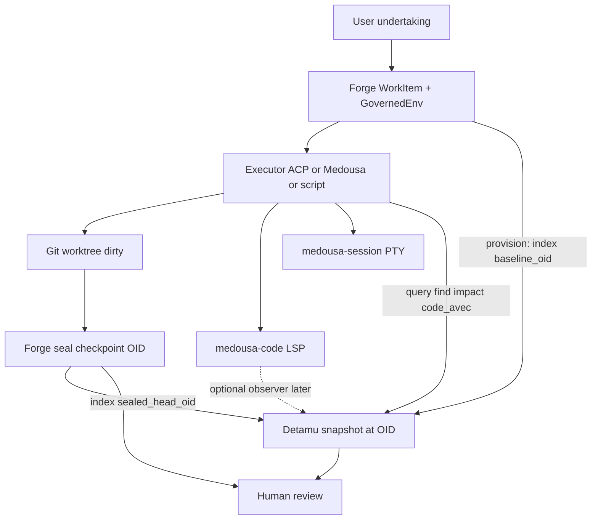

# Detamu × Medousa — fit map

> **Status:** Fit map ready; **path-dep host spike in progress** (2026-07).
> Detamu not yet on crates.io — Medousa depends on `../../detamu/crates/detamu`
> (+ `detamu-source-git`). Daemon opens SurrealKV at `{dataDir}/detamu`, exposes
> `/v1/world/*`, indexes on Forge provision/seal, and registers
> `cognition_detamu_status` / `cognition_detamu_files` (domain `detamu`, opt-in).
>
> Companion plans: [coding-engine-orchestrator.md](coding-engine-orchestrator.md),
> [coding-session-terminal.md](coding-session-terminal.md),
> [v0.8.0-forge-plan.md](v0.8.0-forge-plan.md).

Mental model and seam map for Detamu × Medousa. Detamu remains its own repo
(publishable crates); Medousa consumes it as an SDK. Medousa stays authoritative
for users and workflows — Detamu never auto-approves work; seal stays explicit
Forge HTTP.

## Authority split (do not blur)

```text
Medousa Home / chat     conversation, UI framing, Terminal WM
        │
Medousa daemon          host: AppState, HTTP, tools, ACP pump
   ├── Forge            custody of undertakings (leases, seal, review, disposition)
   ├── Agents           executors (native turns, Cursor/Codex ACP, script)
   ├── medousa-code     LSP Interoperability Orchestrator (keystroke path)
   ├── medousa-session  workshop PTY sessions (shared shell)
   └── Detamu (SDK)     versioned world-model of a repo *at an immutable revision*
```

| System | Owns | Does not own |
|--------|------|----------------|
| **Forge** | Work items, worktrees, leases, checkpoint evidence, human review, integrate/discard | Symbol graphs, Code AVEC, “what the code means” |
| **Detamu** | Snapshots, entities/relations, observations, coverage, versioned Code AVEC scores | Agent runtime, chat, review decisions, PTY, LSP process ownership |
| **medousa-code** | Live LSP sessions, doc sync, diagnostics fan-out | Durable world truth (Detamu), Forge custody |
| **medousa-session** | OS PTY per `session_id`, byte fan-out | VT rendering, world model, seals |
| **Agents** | Execution (edits, tools, prompts) | Durable custody (Forge) and durable world truth (Detamu) |

**Packaging (locked):** Detamu stays its own repo. Medousa depends on the
umbrella `detamu` crate (`features = ["code", "surreal"]` or `"full"`) via path
during spike, then published crates — same pattern as other external SDKs, **not**
a Forge submodule.

## Shared mental model



**One sentence:** Forge owns *the work*; Detamu owns *the world as observed at a
commit*; coding engine / session own *live interaction*; agents *change* the
worktree and *read* Detamu.

**Identity alignment:**

- Forge: `baseline_oid`, `sealed_head_oid`, repo identity from `git-common-dir`
- Detamu: snapshot keyed by repository + **commit OID**; branch/dirty are metadata only
- Never bind Detamu durable identity to a Forge branch name or a dirty worktree

## Critical naming: two AVECs

Medousa already runs **Locus AVEC** (`user_avec` / `model_avec` — stability,
friction, logic, autonomy, psi) as agent/memory posture.

Detamu ports **AVEC Code** — same dimensional family, applied to **code nodes**.

| Name in product | Domain | Consumer |
|-----------------|--------|----------|
| Locus AVEC / memory AVEC | Agent posture / calibration | Chat, memory tools |
| **Code AVEC** / Detamu AVEC | File/symbol risk & friction | Forge review, `cognition_detamu_*` |

**Rule:** never expose Detamu scores as bare `avec` in Medousa HTTP/tools.
Prefer `code_avec` or `detamu_score`. Already noted in
[`crates/medousa-code/src/detamu.rs`](../crates/medousa-code/src/detamu.rs).

## What is ready today

### Detamu consumer surface

- `Detamu::index` / `index_source` → `IndexReport` (entities, relations, coverage)
- SurrealKV store (`detamu-surreal`) for durable snapshots under `{dataDir}/detamu`
- `detamu-source-git` — commit-OID snapshots (aligned with Forge OIDs)
- `detamu-query-code` — `find`, location-at-line, reverse-dep impact, AVEC analysis-gap reporting
- Language depth: inventory + Tree-sitter Rust + optional rust-analyzer / Lizard;
  generic LSP host exists; richer semantic adapters continue on Detamu’s roadmap

### Medousa coding stack beside the Detamu stub

- **Forge** + ACP bind + command-log staging — custody plane
- **Coding engine** (`medousa-code`) — live LSP; stub Detamu observer hooks
  (`/v1/detamu/snapshot`, `/v1/detamu/handles`) and `NullDetamuObserver` — **not**
  the world-model host
- **Coding domain tools** — `cognition_code_*` + `cognition_shell_session_*`
  (opt-in); Detamu tools will be a **separate** domain, not merged into `coding`
- **Session terminal** — shared PTY; Detamu must not sit on the keystroke/PTY path

## Seam map

### 1. Daemon host (queued)

- Open Detamu at `{medousa_data_dir()}/detamu` (SurrealKV) beside `{dataDir}/forge`
- Hold `Arc<DetamuHost>` on `AppState` wrapping umbrella `detamu` + store path
- Boot: open store; **do not** auto-index all repos (on-demand / Forge lifecycle)
- Thin world-query HTTP on the **daemon** — use `/v1/world/...` (not
  `/v1/detamu/...`) to avoid colliding with orchestrator stubs
  `/v1/detamu/snapshot|handles` on `medousa-code`. Optionally rename orchestrator
  routes to `/v1/code/detamu/...` later.

### 2. Forge lifecycle hooks (queued)

| Forge moment | Detamu action | Why |
|--------------|---------------|-----|
| **Provision → Ready** | `index_source` at `baseline_oid` | Known world before agents run |
| **Executing** | Re-index only on demand; never treat dirty tree as durable commit snapshot | Dirty ≠ world truth |
| **Seal → AwaitingReview** | `index_source` at `sealed_head_oid`; stash `SnapshotId` on evidence/attempt detail | Review sees impact vs baseline |
| **Review UI** | Query find / impact / `code_avec` gaps beside `patch.diff` | Enrich, don’t replace Forge evidence |
| **Discard / Integrated** | Keep snapshots (audit); GC policy later | Custody trail independent of worktree |

Evidence bridge: pointers only (`detamu_baseline_snapshot`,
`detamu_sealed_snapshot`) on `EvidenceManifest` or attempt detail — Detamu
remains source of truth for the graph.

### 3. Agent cognition tools — domain `detamu` (queued)

First vertical (inventory-ready after host lands):

| Tool | Backed by |
|------|-----------|
| `cognition_detamu_status` | Store open + last IndexReport / coverage |
| `cognition_detamu_files` / find | `CodeQuery::find` |

As analyzers prove out:

| Tool | Backed by |
|------|-----------|
| `cognition_detamu_impact` | `CodeQuery` reverse-dep impact |
| `cognition_detamu_code_avec` | Scores + analysis-gap report (**named distinctly**) |
| `cognition_detamu_symbols` | When symbol graph coverage is trusted |

Gate like coding: manuscript / `work_id` / Settings — **not** default interactive
palette. Prefer Detamu over ad-hoc `cognition_code_search` when a snapshot exists
for the bound worktree OID.

ACP/Cursor can see the same tools via MCP gateway later; native Medousa gets
them under the Forge fence when bound.

### 4. Coding engine observer (queued, secondary)

`NullDetamuObserver` + orchestrator `/v1/detamu/snapshot|handles` stay stubs until
the world host exists and Detamu wants live-doc enrichment. Detamu must **not**
sit in the keystroke path; observers pull snapshots/handles offline for ingest,
never drive LSP.

### 5. Session terminal (explicit non-seam)

`medousa-session` / Home Terminal do **not** feed Detamu. Command-log staging on
Forge is evidence of *what ran*; Detamu indexes *what the tree meant at an OID*.

### 6. Home framing (after foundation)

- Undertaking detail: “World indexed at baseline / sealed”
- Review pane: Code AVEC + impact beside Forge diff
- Optional index-health / coverage diagnostics

## Layering (target)

```text
Home UI
  → /v1/forge          (custody)
  → /v1/sessions/shell (PTY)
  → /v1/code/*         (LSP orchestrator via daemon proxy)
  → cognition_detamu_* | /v1/world/*  (Detamu world queries)

Daemon AppState
  forge: Arc<Forge>
  coding_engine: Arc<CodingEngineHost>
  shell_sessions: Arc<ShellSessionHost>
  detamu: Arc<DetamuHost>    // wraps detamu crate + SurrealKV path

detamu (published)
  source-git → analyzers → scores → store
  query-code → find / impact / code_avec gaps
```

Bottom-up order: **SDK publish → daemon host → Forge lifecycle hooks → tools → Home**.

## Locked decisions

1. Detamu is a **consumer SDK in the daemon**, not folded into `medousa-forge` or `medousa-code`.
2. Durable Detamu identity = **commit OID** (Forge `baseline_oid` / `sealed_head_oid`).
3. **Code AVEC ≠ Locus AVEC** in every public Medousa name.
4. First vertical after publish: **provision index + seal re-index + status/files tools** before symbol/LSP observer depth.
5. Agents query Detamu; **seal remains explicit Forge**; Detamu never auto-approves.
6. Orchestrator Detamu routes and daemon world routes must not collide on path names (`/v1/world/*` vs `/v1/detamu/*` stubs).
7. Coding session / PTY is orthogonal — no Detamu on the terminal byte path.

## Queued / landed integration

| Spike | Status |
|-------|--------|
| **Host** | ✅ path-dep `detamu` + `DetamuHost` in `AppState` (`src/daemon/detamu_host.rs`); SurrealKV at `{dataDir}/detamu` |
| **HTTP** | ✅ `/v1/world`, `/v1/world/index`, `/v1/world/files`, `/v1/world/bindings/{work_id}` (orchestrator `/v1/detamu/*` stubs untouched) |
| **Forge hooks** | ✅ provision → baseline index; `complete_attempt` → sealed index; bindings sidecar JSON (not on EvidenceManifest) |
| **Tools** | ✅ `cognition_detamu_status` / `cognition_detamu_files`; domain `detamu` + `ensure_detamu_domain_for_session` |
| **Evidence** | ✅ SnapshotId pointers in `{dataDir}/detamu/bindings/{work_id}.json` |
| **Observer** | ⬜ `NullDetamuObserver` until live-doc enrichment is needed; keep off keystroke path |
| **crates.io** | ⬜ switch path deps to published versions when Detamu publish lands |

Dirty-worktree rule for examples: mid-attempt agent queries either (a) last
indexed OID, or (b) an explicit experimental “worktree observation” that never
writes a durable snapshot labeled as a commit.
