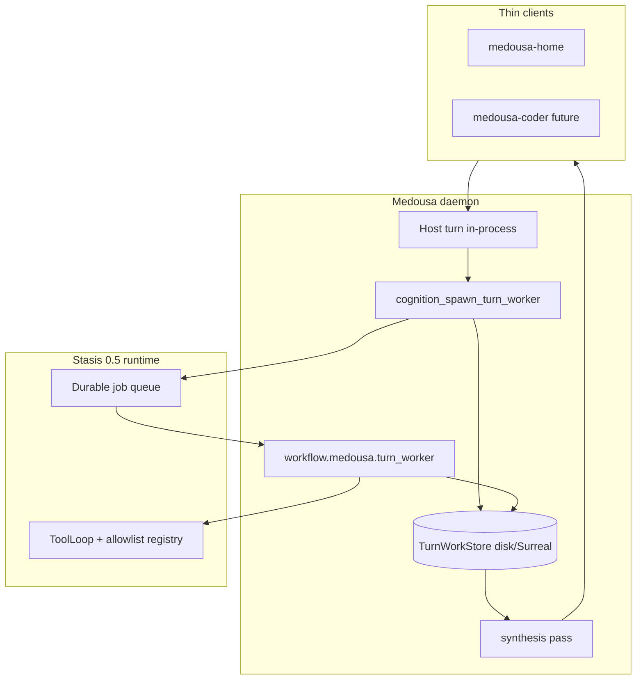

# Durable turn workers (Stasis 0.5 + restart continuity)

> **Status:** In progress — Phase 0–1 landing  
> **Date:** 2026-06-07  
> **Supersedes:** in-process-only execution described as end-state in [turn-worker-phase1.md](turn-worker-phase1.md)  
> **Related:** [turn-worker-bus-plan.md](turn-worker-bus-plan.md), [identity-manuscripts-and-recall-plan.md](identity-manuscripts-and-recall-plan.md), [dlq-replay-turn-continuation-plan.md](dlq-replay-turn-continuation-plan.md), [async-chat-tier3-plan.md](async-chat-tier3-plan.md)

## Product promise

**Medousa keeps working through restarts** — Windows update, daemon crash, laptop sleep. Delegated workshop tasks resume on the Stasis queue; synthesis delivers when complete even if the host SSE session is gone.

Marketing line: *download → works → update → still works*.

## Locked decisions

| Decision | Choice |
|----------|--------|
| Worker cardinality | **1 spawn = 1 worker** today; `branch_group_id` reserved for future fan-out |
| Durability | **Day 1** — Stasis job queue + persisted `TurnWorkRecord` |
| Model policy | **`StageRoutingMatrix` roles** by default; spawn + manuscript hints override |
| Clients | **Thin shells** on one daemon (Home, future Medousa Coder) |

## Problem (as-built before this plan)

- Workers run in `tokio::spawn` with **in-memory** `TurnWorkerStore` — lost on restart.
- Workers share the **host `AgentStreamSink`** — chat floods during execution.
- Ask jobs persist to disk but mark `Running` as **failed** on restart — wrong pattern for workers.
- Stasis 0.4 concurrent pattern was **prompt-only**; 0.5 adds **ToolLoop branches** + per-branch `model_hint` (we wire 0.5; workers use a dedicated Medousa handler).

## Target architecture



**Principle:** Daemon = durable brain. Clients = transport + presentation. Coder reuses the same worker bus with an orchestrator manuscript.

## Execution: `workflow.medousa.turn_worker`

Custom Stasis job handler (like `workflow.medousa.recurring_agent_turn`) wrapping existing `run_worker_turn`:

- Full `AllowlistToolRegistry` + manuscript allowlist
- Handoff capsule + continuity bundle
- Worker STTP + ledger events
- Synthesis on success (or pass-through on `cognition_turn_finish`)

**Not** raw Stasis concurrent jobs for v1 — one job = one worker. Payload shape stays compatible with future single-branch concurrent fan-out.

### Job identity

- `job.id` = `work_id` (e.g. `work-{uuid}`)
- `correlation_id` = `work_id`
- `job_type` = `workflow.medousa.turn_worker`

## Data model: `TurnWorkRecord`

Existing fields plus:

| Field | Purpose |
|-------|---------|
| `stasis_job_id` | Link to Stasis queue job (= `work_id`) |
| `parent_stream_turn_id` | Host stream turn for synthesis + ledger |
| `stage_role` | Resolved matrix role (`extractor`, `verifier`, …) |
| `model_hint` | Optional override (`provider:model` or bare model) |
| `manuscript_id` | Specialty pack id |
| `branch_group_id` | **Reserved** — future parallel fan-out |
| `thread_id` | **Reserved** — Stasis ThreadStore branch |

Persisted to `workspace/turn_workers.json` (same pattern as ask jobs). **Running workers are not failed on reload.**

## Model routing resolution order

1. Spawn arg `model_hint`
2. Manuscript `spec.worker.model_hint`
3. Spawn arg / manuscript `spec.worker.stage_role` → `StageRoutingMatrix`
4. Intent default role (`research` → `extractor`, `general` → `final_response`, memory intents → `summarizer`)
5. Host turn provider/model via `StageRoutingMatrix::default_for`

Spawn-time args override manuscript defaults. Multi-role orchestrator catalogs are deferred.

## Restart reconciliation (boot)

On daemon platform build, after handler registration:

1. Load persisted `TurnWorkRecord` map.
2. For each **incomplete** record (`Pending`, `Running`, or `Completed` with `!synthesis_delivered`):
   - **Pending / Running:** if Stasis job missing or terminal-failed → re-enqueue (idempotent `work_id`).
   - **Completed + pending synthesis:** run synthesis with session-persisting sink (no live SSE required).

Stasis scheduler ticks resume leased jobs across process restarts when using Surreal backend.

## Stream decoupling (Phase 2 — parallel track)

Durability ≠ clean chat. Still required:

| Item | Outcome |
|------|---------|
| `lane: "worker"` + isolated sink | Host chat stays clean |
| Fix `cognition_turn_worker_status` default session | Host sees active workers |
| Thread events → notifications | Mobile/home pairing |
| Terminal-only on parent stream | `user_ack` + synthesis bubble |

## Manuscript worker routing (Phase 3)

```yaml
spec:
  worker:
    intent: research
    stage_role: extractor   # StageRoutingMatrix role — validated at load
    model_hint: null        # optional provider:model override
    max_tool_rounds: 12
```

Validated roles: `orchestrator`, `chunker`, `extractor`, `summarizer`, `verifier`, `packer`, `final_response`.

## Phased delivery

| Phase | Work | Status |
|-------|------|--------|
| **0** | Stasis 0.5 `ConcurrentPatternJobHandler` wiring | Done in code |
| **1a** | Persist `TurnWorkRecord` + reload without failing Running | Done in code |
| **1b** | `TurnWorkerJobHandler` + enqueue on spawn | Done in code |
| **1c** | Boot reconciliation + synthesis resume | Done in code |
| **2** | Worker lane + stream decoupling | **Done in code** — worker rail, status default session, `[MEDOUSA_ACTIVE_WORKERS]` |
| **3** | Manuscript `stage_role` / `model_hint` + spawn args | **Done** — validate, catalog, handoff blocks, example YAML |
| **4** | *(reserved)* multi-role orchestrator catalogs | Deferred |
| **5** | `branch_group_id` + Stasis concurrent fan-out | Expansion hook only |

## Code map

| Path | Role |
|------|------|
| `src/agent_runtime/turn_worker/store.rs` | Persisted work records |
| `src/agent_runtime/turn_worker/model_routing.rs` | Matrix role + hint resolution |
| `src/agent_runtime/turn_worker/run.rs` | Spawn → enqueue; `run_worker_turn` |
| `src/agent_runtime/turn_worker_job.rs` | Stasis handler + reconcile |
| `src/runtime/stasis_wire.rs` | Stasis 0.5 handler registration |
| `src/runtime/platform.rs` | Handler register + boot reconcile |
| `src/identity_manuscript.rs` | Manuscript worker spec extensions |

## Verify

```bash
cargo check
cargo test turn_worker model_routing durable
```

## Non-goals (v1)

- Multi-branch concurrent spawn from one host call
- Full mid-stream SSE token replay after restart
- Replacing in-process host turns with Stasis agent-turn jobs
