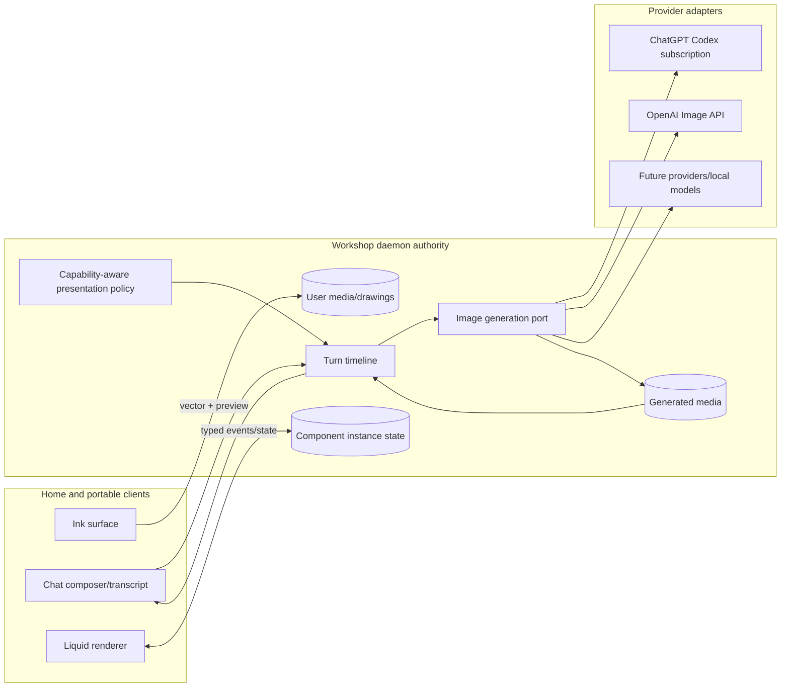

# Expressive Chat — generated media, ink, and interactive Liquid

> **Status:** Slices 0–4 implemented; stopped at Checkpoint B for validation (2026-09-11)
> **Scope:** Daemon-owned media generation, ink-first drawing, drawing in chat,
> and durable interactive Liquid experiences  
> **Checkpoints:** Stop for physical-device validation after Slices 2, 4, and 6  
> **Related:** [media-and-attachments-plan.md](media-and-attachments-plan.md),
> [inference-profiles-and-model-catalog-plan.md](inference-profiles-and-model-catalog-plan.md),
> [interaction-and-state-model.md](interaction-and-state-model.md),
> [sttp-native-prompt-and-chronological-turn-plan.md](sttp-native-prompt-and-chronological-turn-plan.md)

---

## North star

Medousa should be able to **make, mark up, and act through visual chat** without
turning chat into an unsafe mini-browser or drawing into a generic design tool.

This epic has three user-facing outcomes:

1. A user can ask Medousa to generate an image, see it arrive naturally in the
   transcript, save it, and refine it conversationally.
2. A user can draw with excellent pen feel on iPad/Apple Pencil and Android
   styluses, then select, move, erase, pan, zoom, and send the editable drawing
   through chat.
3. Medousa recognizes answers that benefit from interaction and presents them
   as useful Liquid experiences, including a recipe/procedure with durable
   step timers.

The umbrella epic is delivered as six implementation slices after this locked
planning slice. Slices 2, 4, and 6 are deliberate release chapters: implementation
stops at each one until the corresponding physical-device checklist passes.

---

## Product invariants

These are not implementation suggestions; they are acceptance constraints.

1. **The workshop daemon remains authoritative.** Remote Home clients never
   turn generated assets or drawings into a local upload workaround.
2. **Transcript references, bytes on disk.** Image and drawing payloads are
   stored under the daemon's session/vault authority and referenced from turns.
3. **Origins stay honest.** User media, user drawings, and generated media may
   share presentation components, but they remain distinct typed domain events.
4. **Ink first.** Shapes, text boxes, layers, and a general design-canvas model
   are not part of this epic.
5. **No model-authored executable UI.** Liquid components consume validated,
   inert schemas. The model does not provide JavaScript, handlers, or arbitrary
   HTML for recipe/timer behavior.
6. **Interaction does not silently become conversation.** Local UI actions such
   as pausing a timer or moving a stroke do not create model turns. Explicit
   prompt/actions may do so.
7. **Portable degradation is useful.** VS Code, Obsidian, exports, and older
   clients show meaningful static content when a full interactive component is
   unavailable.
8. **Old drawings remain readable.** Every accepted version-1 `draw` fence must
   migrate losslessly enough to preserve its visible ink.
9. **Mobile quality is a release gate.** Simulator-only validation cannot close
   a checkpoint that names Apple Pencil or Android stylus behavior.

---

## Locked decisions

| # | Decision |
|---|----------|
| 1 | One umbrella epic, three independently shippable pillars, and physical-device stops after S2/S4/S6. |
| 2 | Drawing remains a retained vector document; a raster preview is derived for chat/vision/export. |
| 3 | Pencil/stylus draws and one-finger touch pans by default when pen input is available; finger drawing remains an explicit option. |
| 4 | S2 selection is stroke/lasso selection with move/delete/duplicate. Scaling, rotation, shapes, text, and layers are deferred. |
| 5 | S2 includes pressure brushes, partial/path erasing, command undo/redo, pan, and pinch zoom. |
| 6 | Generated images are daemon-owned tool outputs represented by a dedicated generated-media turn part/event, not relabeled user uploads or HTML artifacts. |
| 7 | Image generation uses a provider-neutral daemon port. OpenAI ships first with two distinct credential lanes where supported. |
| 8 | ChatGPT subscription sign-in may power the `openai-codex` generation lane through ChatGPT's Codex backend; OpenAI API-key generation remains a separate usage-billed adapter and fallback. |
| 9 | The direct OpenAI Image API is the initial API-key implementation. Conversational edit lineage stays in Medousa's contract and may use Responses-based behavior inside an adapter later. |
| 10 | Today’s Settings label **Image** is renamed **Vision**; a separate **Image generation** role is added. |
| 11 | Liquid becomes baseline chat behavior. The orphaned experimental preference is removed unless implementation evidence finds a real renderer switch to restore. |
| 12 | Recipe timers use absolute deadlines and durable component instance state; they survive app suspension/reload and can schedule a local notification after permission is granted. |

### OpenAI authentication boundary

Official OpenAI documentation distinguishes:

- **Sign in with ChatGPT** for subscription-backed Codex access.
- **Sign in with an API key** for usage-billed API access.
- Built-in Codex image generation consumes general Codex usage limits, while
  larger/programmatic API generations use API-key billing.

Sources: [Authentication](https://learn.chatgpt.com/docs/auth) and
[Image generation](https://learn.chatgpt.com/docs/image-generation).

Medousa already routes `openai-codex` chat to the ChatGPT Codex Responses
backend and routes `openai` separately through API credentials. S4 must probe
and contract-test the subscription image path before advertising it. An
authenticated ChatGPT session alone is not proof that an arbitrary Platform
Image API request will accept that token.

---

## Current baseline

### Drawing

- `DrawDocument` version 1 stores strokes and optional normalized pressure in a
  base64url JSON `draw` fence.
- `DrawSurface.svelte` paints a constant-width SVG centerline, even when pressure
  exists.
- Input consumes one primary pointer and ordinary `pointermove` events.
- The eraser removes a whole stroke if any sampled point falls inside its radius.
- Undo/redo stores full document snapshots.
- There is no camera, pinch zoom, pan, hit-test index, selection, or transform.
- Chat/vault Markdown already hydrates a `draw` fence as a read-only drawing.

### Media and inference

- Session-scoped user media upload, persistence, extraction, and vision routing
  are shipped.
- Turn history has `UserMedia` and HTML-oriented `AttachmentRef` parts.
- The artifact store can hold a narrow PNG binary artifact, currently intended
  for browser/computer evidence, but the assistant transcript has no native
  generated-media segment.
- The capability catalog models input/output modalities and image unit pricing.
- Inference profiles stop at `main`, `vision`, and `stt`.

### Liquid

- All assistant messages render through the Liquid scene renderer.
- Markdown hydration supports a broad component catalog.
- The STTP presentation slice only says to structure when useful and otherwise
  default to prose; it does not provide a Liquid intent grammar.
- `cognition_ui_build` is typed but only builds prose, section, card, and action
  nodes.
- Non-turn scene events are buffered in Home memory; production submit/context
  flow does not drain the buffer into the daemon.
- There is no recipe/procedure or timer component.

---

## Target architecture



### Domain projections

The persisted domain should remain explicit even when Home unifies rendering:

```rust
enum TurnPart {
    UserMedia { /* existing */ },
    UserDrawing {
        media_id: String,
        preview_media_id: String,
        mime: String, // application/vnd.medousa.draw+json
        label: Option<String>,
        byte_size: Option<u64>,
    },
    GeneratedMedia {
        media_id: String,
        mime: String,
        label: String,
        width_px: Option<u32>,
        height_px: Option<u32>,
        generation_id: String,
        parent_generation_id: Option<String>,
    },
    // existing parts...
}
```

Exact wire names may change during implementation, but origin and editable
source must not be erased to save a client-side branch.

The UI may project both into one `ChatMediaItem`:

```ts
type ChatMediaItem = {
  id: string;
  origin: "user" | "drawing" | "generated";
  mime: string;
  label?: string;
  previewUrl: string;
  editableSourceId?: string;
  generationId?: string;
};
```

---

## Slice plan

### Slice 0 — plan and contract lock

**Outcome:** This document is committed and indexed as the execution baseline.

Deliverables:

- Locked product invariants, scope, and slice/checkpoint order.
- Current-state code anchors and target domain boundaries.
- Acceptance gates for S2, S4, and S6.
- Auth distinction between ChatGPT subscription generation and API-key
  generation.

Exit criteria:

- The plan is linked from `architecture/README.md` and `architecture/ROADMAP.md`.
- The worktree contains no implementation changes in the Slice 0 commit.

### Slice 1 — ink document and input foundation

**Outcome:** Drawing version 2 and a testable ink pipeline exist beneath the
surface without yet claiming the full Pencil experience.

Deliverables:

- Version-2 drawing decoder/encoder with version-1 migration.
- Brush/stroke metadata with stable defaults for migrated version-1 strokes.
- Points capable of pressure, time, tilt/angle when supplied, and input kind.
- Bounded sampling, simplification, and serialization-size protection.
- Pure input helpers that expand coalesced pointer events and normalize mouse,
  touch, and pen pressure.
- Pure brush geometry that produces a variable-width closed outline or
  equivalent retained vector representation.
- Command-based history primitives for add, erase/split, move, and batch edits.
- Pure camera transforms and stroke hit testing.

Required tests:

- Version-1 fixture migration and round trip.
- Pressure changes visible width; missing pressure has stable velocity/default
  behavior.
- Malformed/oversized documents remain bounded.
- Coordinate transforms round trip at multiple pan/zoom values.
- Hit testing and partial erase splitting preserve unaffected stroke sections.

### Slice 2 — ink engine v2 experience

**Outcome:** Full drawing notes and embedded note drawings deliver the scoped
high-quality ink experience.

Deliverables:

- Pen, pencil, marker, and highlighter presets with pressure response.
- Coalesced-event ingestion and animation-frame painting.
- Partial/path eraser plus explicit whole-stroke eraser mode.
- Lasso selection, selected-stroke bounds, move, duplicate, and delete.
- Two-finger pan/pinch zoom, one-finger pan policy, fit/reset controls.
- Palm-rejection/input arbitration while pen input is active.
- Undo/redo for every document mutation and one gesture per history command.
- Accessible controls and keyboard shortcuts where a keyboard exists.
- Existing full-note and embedded-note autosave behavior preserved.
- Drawing guide updated; static shapes/text promises removed from this epic.

#### Checkpoint A — physical ink validation

Stop after Slice 2. Do not start S3 until this gate is recorded as passing or
accepted with named follow-ups.

Devices:

- Current supported iPadOS device with Apple Pencil.
- At least one supported Android tablet/phone with an active stylus.
- Desktop mouse/trackpad and a touch-only mobile device.

Scenarios:

- Slow/light → fast/heavy pressure sweep visibly tracks expected width.
- Fast curves do not become visibly angular or lag materially behind the tip.
- Palm contact does not create ink or unexpectedly move the canvas.
- Pinch zoom and two-finger pan never create strokes.
- Switching pen/eraser/select mid-session is predictable.
- Partial erasing, selection move, duplicate, undo, and redo survive save/reload.
- Version-1 fixtures render the same visible strokes after migration.
- Background/foreground and interrupted pointer capture do not leave a stuck
  gesture.

Record device/OS/app build, pass/fail, latency/feel notes, and any WebView
capability gaps. Add a narrow native bridge only if the device evidence requires
one. Use the checked-in [Checkpoint A test record](expressive-chat-checkpoint-a.md)
for the physical-device pass; S3 remains closed until that record passes or has
explicitly accepted follow-ups.

### Slice 3 — drawing in chat and rich-media contracts

**Outcome:** A drawing can be authored in the composer, sent through the daemon,
seen by a vision model, replayed from history, and reopened for editing.

**Status:** Implemented.

Deliverables:

- **Draw** action in desktop/mobile composer menus.
- Composer drawing sheet/dialog reusing the S2 engine.
- Daemon import/storage of editable vector source plus raster preview.
- Typed user-drawing turn part/event and SDK/API schema updates.
- Vision projection uses the preview; transcript retains vector identity.
- Inline render, fullscreen view, reopen/edit, resend, save-to-vault, and export.
- Generated-media domain/event/storage scaffolding used by S4.
- Remote-workshop tests proving no client-local filesystem dependency.

### Slice 4 — generated images

**Outcome:** Medousa can generate and refine images as first-class daemon-owned
tool output in chat.

**Status:** Implemented; live-provider and device validation is tracked in
[Checkpoint B](expressive-chat-checkpoint-b.md).

Deliverables:

- `ImageGenerationPort` and provider-neutral request/result/error types.
- Dedicated `image_generation` inference profile and capability requirement.
- Settings role **Vision** plus new **Image generation** role and fallbacks.
- Typed `cognition_image_generate` tool with bounded count/size/quality/options.
- OpenAI API-key adapter using the Image API.
- Probed and contract-tested `openai-codex` subscription adapter when supported
  by the ChatGPT Codex backend; honest unsupported state otherwise.
- Dedicated generated-media persistence, transcript event/part, replay, fetch,
  retention, and deletion behavior.
- Inline progressive status, cancellation, failure UX, fullscreen, download,
  share, copy, save-to-vault, and conversational edit/variation lineage.
- Usage/cost receipt appropriate to the credential lane.

#### Checkpoint B — generated and chat media validation

Stop after Slice 4.

Validation record: [expressive-chat-checkpoint-b.md](expressive-chat-checkpoint-b.md).

Validate on desktop, iPad, Android, local workshop, and remote workshop:

- Generate through ChatGPT subscription sign-in where the backend probe says it
  is supported.
- Generate through OpenAI API key and confirm separately metered behavior.
- Missing/expired credentials and workspace restrictions fail honestly.
- Cancel, retry, fallback, reconnect, history replay, and session deletion.
- Large portrait, landscape, and transparent outputs fit chat and fullscreen.
- Generate → save to vault → attach/edit → generate revision preserves lineage.
- Composer drawing reaches vision and remains editable after reload.

### Slice 5 — Liquid activation and durable interaction loop

**Outcome:** Medousa knows when and how to use Liquid, and interactions have a
real typed return path rather than stopping in Home memory.

Deliverables:

- Capability-gated compact presentation grammar in STTP policy.
- Intent mapping for procedure, compare/decision, metrics, plan/timeline,
  choices/actions, and media.
- Typed discriminated component input for `cognition_ui_build`; existing simple
  verbs remain compatible during migration.
- Production scene-interaction envelope on interactive turns with bounded,
  sanitized, message-associated events.
- Explicit event dispositions: local state, context-only, submit-turn,
  navigation, and privileged action requiring existing authority.
- Daemon-owned component instance state keyed by session/message/node with
  optimistic revision handling.
- Remove or intentionally reconnect the experimental Liquid preference.
- Fix stale Liquid cookbook claims.
- Presentation eval set and observability for eligible-use rate, parse failures,
  interaction delivery, and fallback rendering.

### Slice 6 — recipe/procedure and durable timers

**Outcome:** A natural recipe request can become a polished, useful guided
experience with real timers rather than decorative cards.

Deliverables:

- Portable `recipe`/`procedure` schema with title, yield/servings, resources or
  ingredients, ordered steps, notes, and optional step durations.
- Reusable timer component with start, pause, resume, reset, completion, and
  accessible announcement behavior.
- Absolute-deadline timer engine resilient to app suspension and clock ticks.
- Durable instance state and state migration.
- Local notification scheduling after contextual user permission.
- Scaling/substitution/follow-up actions that intentionally create a new turn.
- Static portable rendering for VS Code/Obsidian/export surfaces.
- Prompt/builder recipes and evals that cause natural use without UI spam.

#### Checkpoint C — interactive Liquid validation

Stop after Slice 6.

Validate on desktop, iPad, Android, portable renderers, and remote workshop:

- Ordinary recipe prompt produces a recipe experience without naming Liquid.
- Start a timer, background/kill/reopen the app, and observe the correct
  remaining/completed state.
- Notification fires once when allowed and degrades cleanly when denied.
- Multiple timers in one message and timers across messages remain independent.
- Recipe scaling and substitution actions create coherent follow-up turns.
- Local timer/checklist events do not accidentally submit model turns.
- Interaction context reaches the daemon on the next relevant turn.
- Non-supporting clients retain complete readable steps and durations.
- Compare, plan, chart, decision, and action eval prompts demonstrate increased
  appropriate Liquid use without forcing structure onto simple answers.

---

## Ink v2 technical contract

The document remains a vector scene, but its point/stroke data becomes explicit
enough for pressure rendering and device diagnosis:

```ts
type DrawInputKind = "pen" | "touch" | "mouse" | "unknown";

type DrawPointV2 = {
  x: number;
  y: number;
  pressure?: number;
  elapsedMs?: number;
  tiltX?: number;
  tiltY?: number;
};

type DrawBrushV2 = {
  kind: "pen" | "pencil" | "marker" | "highlighter";
  size: number;
  thinning: number;
  smoothing: number;
  streamline: number;
  opacity: number;
};

type DrawStrokeV2 = {
  id: string;
  color: string;
  input: DrawInputKind;
  brush: DrawBrushV2;
  points: DrawPointV2[];
};
```

Migration maps version-1 `width` to `brush.size`, preserves color/points and
pressure, and selects a neutral pen preset. The decoder accepts supported older
versions; the writer emits only the current version.

Implementation should prefer pure, dependency-light geometry with golden tests.
If a freehand geometry library is adopted, it must be wrapped behind a Medousa
port so schema and hit testing are not library-owned.

The input layer uses Pointer Events first:

- `pointerType` for pen/touch/mouse policy.
- `getCoalescedEvents()` when available, then the dispatched event.
- normalized fallback pressure for hardware that reports the active-button
  default rather than real pressure.
- request-animation-frame visual batching without dropping retained samples.
- predicted events, hover, Pencil double-tap/squeeze, and barrel-button behavior
  are optional polish after the physical device gate; they are not required to
  close S2.

---

## Image generation port

```rust
pub struct ImageGenerationRequest {
    pub prompt: String,
    pub references: Vec<ImageInputRef>,
    pub mask: Option<ImageInputRef>,
    pub aspect: Option<ImageAspect>,
    pub size: Option<ImageSize>,
    pub quality: Option<ImageQuality>,
    pub background: Option<ImageBackground>,
    pub format: Option<ImageFormat>,
    pub count: u8,
    pub parent_generation_id: Option<String>,
}

pub struct ImageGenerationResult {
    pub generation_id: String,
    pub outputs: Vec<GeneratedImageBytes>,
    pub revised_prompt: Option<String>,
    pub provider_receipt: ImageProviderReceipt,
}

#[async_trait]
pub trait ImageGenerationPort: Send + Sync {
    async fn generate(
        &self,
        target: &InferenceTarget,
        request: ImageGenerationRequest,
        cancel: CancellationToken,
    ) -> Result<ImageGenerationResult, ImageGenerationFailure>;
}
```

Limits are enforced before provider calls and again before persistence. Provider
errors are normalized into auth, unsupported, policy, rate-limit, invalid-input,
provider-down, cancelled, and malformed-output categories. Raw provider payloads
do not enter transcript/model context.

---

## Liquid interaction contract

Every event receives an explicit disposition. Renderers cannot infer authority
from an arbitrary payload string.

```ts
type LiquidEventDisposition =
  | "local_state"
  | "context"
  | "submit_turn"
  | "navigate"
  | "privileged_action";

type LiquidInteractionEnvelope = {
  version: 1;
  sessionId: string;
  messageId: string;
  nodeId: string;
  instanceId: string;
  eventType: string;
  disposition: LiquidEventDisposition;
  payload?: unknown;
  occurredAt: string;
  expectedStateRevision?: number;
};
```

Timer state uses absolute instants:

```ts
type TimerState = {
  status: "idle" | "running" | "paused" | "complete";
  durationMs: number;
  deadlineAt?: string;
  remainingMsWhenPaused?: number;
  completedAt?: string;
  notificationId?: string;
  revision: number;
};
```

The UI derives display time from `deadlineAt - now`; it does not persist a
decremented value every second.

---

## Testing strategy

### Automated

- Rust unit/contract tests for new turn parts, inference profile, provider
  routing, generated-media persistence, deletion, and error normalization.
- Type schema generation/verification for daemon, SDK, and Home.
- Svelte/Vitest tests for gesture reducers, geometry, camera transforms,
  selection, chat projection, component schemas, timers, and interaction routing.
- Golden drawing fixtures for version migration and brush outlines.
- Fake clock tests for timer suspend/resume, pause, completion, time jumps, and
  multiple instances.
- Portable Liquid renderer fixtures for recipe/timer static fallback.
- Hermetic provider adapters with recorded structural fixtures, never live
  credentials in tests.

### Physical/device

Each checkpoint owns a checked-in or release-attached test record. Simulator
passes are useful diagnostics but do not replace named physical-device cases.

### CI at completion

Run the repository gates from `AGENTS.md`, with focused tests during each slice:

```text
cargo check / focused cargo tests
medousa-home typecheck and focused Vitest suites
generated schema verification when Rust wire types change
full repository CI before the final Slice 6 checkpoint handoff
```

---

## Documentation obligations

- S2 updates `docs/guides/drawing.md` and any vault editing references.
- S3 documents drawing creation and editing from chat.
- S4 adds end-user image generation, provider/auth, retention, and cost guidance;
  HTTP/SDK changes update `docs/engine/` and `docs/sdk/`.
- S5 corrects `docs/cookbook/liquid-markdown.md` and documents event/state
  semantics for integrators.
- S6 adds recipe/timer guidance and portable-renderer behavior.
- New guides are indexed in `docs/README.md` as required by repo policy.

---

## Risks and stop conditions

| Risk | Mitigation / stop condition |
|------|-----------------------------|
| iOS/Android WebView omits or degrades stylus data | Measure on hardware at Checkpoint A; add only the smallest native bridge proven necessary. |
| Coalesced points overflow Markdown payloads | Simplify/delta-bound during S1; enforce size before autosave and retain recoverable user feedback. |
| Snapshot history causes memory spikes | Replace with command history in S1/S2. |
| ChatGPT backend image contract differs from Platform API | Separate adapters and credentials; probe/contract-test; never send ChatGPT OAuth token to Platform endpoints. |
| Generated media is stored but not replayable/deletable | S4 cannot close without history reload and session-deletion tests. |
| Liquid becomes noisy | Capability gate plus eligible-intent evals; natural prose remains correct for simple answers. |
| Timer drifts or duplicates notifications | Absolute deadlines, one notification ID, fake-clock tests, and lifecycle validation at Checkpoint C. |
| Remote clients accidentally assume local paths | Remote workshop cases are required at Checkpoints B/C. |

---

## Explicit non-goals

- Static shape tools, text boxes, layers, blend modes, or a Figma-style canvas.
- Real-time collaborative drawing.
- Arbitrary third-party UI code in assistant messages.
- A generic workflow engine hidden inside Liquid components.
- Silent image generation or unbounded multi-image batches.
- Guaranteeing ChatGPT subscription image generation for workspaces where plan,
  RBAC, usage limits, or backend capability disable it.
- Shipping additional image providers before the provider-neutral boundary and
  first OpenAI implementations are stable.

---

## Completion definition

This epic is complete only when all three physical checkpoints pass, docs and
wire contracts are current, version-1 drawings remain compatible, generated
media survives history/reconnect/deletion flows, and natural recipe requests
reliably produce a durable interactive experience on capable Medousa clients
with useful static output everywhere else.
