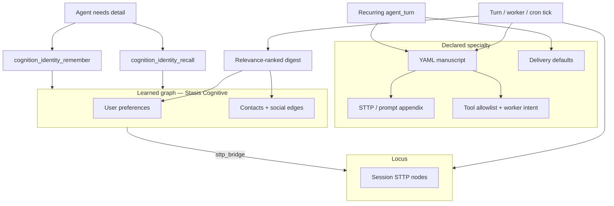

# Identity manuscripts, relevance-ranked recall, and specialized agents

> **Status:** Planned — supersedes naive Phase 4 sequencing in [cognitive-identity-memory-plan.md](cognitive-identity-memory-plan.md)  
> **Date:** 2026-05-30  
> **Related:** [cognitive-identity-memory-plan.md](cognitive-identity-memory-plan.md), [worker-continuity-plan.md](worker-continuity-plan.md), [recurring-delivery-roadmap.md](recurring-delivery-roadmap.md), [turn-worker-bus-plan.md](turn-worker-bus-plan.md), [context-lanes-and-scratchpad-plan.md](context-lanes-and-scratchpad-plan.md)

## Executive summary

Medousa now has the right **write path** (`cognition_identity_remember`) and a **read path** (`[MEDOUSA_RELATIONAL_MEMORY]` digest at turn start). Two gaps block scaling:

1. **Prompt injection dumps too much** — all preferences and all loaded relationships are rendered; truncation is tail-chop by char budget, not relevance ranking (the original plan’s `recency_score` rule is not implemented).
2. **No on-demand identity lookup** — the model must either rely on the digest or call low-level `cognition_identity_context` (full JSON). There is no `cognition_identity_recall` for “who is Mario?” mid-turn.

The **monster feature** (in a good way): **YAML identity manuscripts** — declarative specialty packs (persona overlay, tool surface, task template, delivery defaults) that compose with the Stasis identity graph and Locus episodic memory. Same manuscript can drive:

- interactive host turns (“morning brief mode”),
- workshop workers (`cognition_spawn_turn_worker`),
- scheduled agent turns (`execution_mode: agent_turn` on recurring),

with output routed through existing delivery lanes (Telegram, webhook, linked channel).

**Principle:** Manuscript = *declared specialty*. Identity graph = *learned world model*. Locus = *episodic trail*. Digest = *small always-on slice*. Recall tool = *pull the rest on demand*.

---

## Problem (current state)

### Digest compiler (`compile_relational_memory_digest`)

| Behavior today | Problem |
|----------------|---------|
| Renders **every** `user.preferences` key in one line | Bloats as prefs grow; no pinning |
| Renders **every** cognitive relationship returned (up to `relationship_limit`) | No score-based cap within limit |
| `truncate_to_budget` cuts the **tail** when over budget | Drops arbitrary content; **not** lowest-`recency_score` first |
| No signal from current user message | Same digest on “what’s for lunch?” and “what does Mario do?” |

`relationship_limit=8` on load is a coarse cap, not relevance.

### Recall gap

| Tool | Tier | Fit |
|------|------|-----|
| `cognition_memory_recall` | Locus STTP | Session narrative — wrong for “Mario engineer” |
| `cognition_identity_context` | Full JSON blob | Heavy, opt-in, not steered |
| `cognition_identity_remember` | Write | Correct tier, wrong direction |

Operators and models need **`cognition_identity_recall`** — keyword/subject lookup over preferences, contacts, and social edges.

### Phase 4 (original) — revisit

Export/CLI before relevance + recall ships **freezes the wrong UX**: markdown files that mirror a bloated digest. Phase 4 should produce **manuscript templates + graph-derived sections**, not a dump of every entity.

---

## North star



At turn start the operator sees a **small, ranked** relational slice. When the model needs more, it **recalls** identity on demand. When a **specialty** is active (manuscript), prompt + tools + delivery are **declared**, not improvised.

---

## Three layers (locked model)

| Layer | Holds | Authoring | Runtime load |
|-------|-------|-----------|--------------|
| **Manuscript** (YAML) | Specialty: voice, task template, tool policy, pins, delivery | Operator / repo `.medousa/manuscripts/` | Per turn, worker spawn, recurring tick |
| **Identity graph** (Stasis) | Learned prefs, people, edges | `cognition_identity_remember`, CLI | Cognitive mode + recall tool |
| **Locus** | Episodic reasoning, vibe, decisions | `cognition_memory_store` | `cognition_memory_context` / recall |

**Routing (unchanged, reinforced in prompt):**

- Durable personal/world facts → identity (`remember` / `recall`)
- Session narrative → Locus
- Specialty behavior → manuscript (overlays base STTP, does not replace graph)

---

## Phase 3b — Relevance-ranked digest (before Phase 4)

**Goal:** Turn-start `[MEDOUSA_RELATIONAL_MEMORY]` is a **best-effort summary**, not an entity dump.

### Scoring (v1 — no embeddings)

**Preferences**

- Manuscript `identity_pins.preferences: [beverage, timezone]` always included (if present).
- Remaining keys: include until budget; order by optional `preference_recency` when Stasis exposes it, else stable key order with cap **max 5 keys** in digest.

**People / relationships**

- Score: `recency_score * confidence` (both on `RelationshipEntity`).
- Exclude policy-structural edges (already filtered by `IdentityContextMode::Cognitive` upstream).
- Take top **K=5** edges for digest; drop lowest score first when over char budget.

**Query-aware rerank (optional v1.1)**

- Tokenize last user message (cheap); boost edges/contacts whose `display_name`, `policy_tags`, or `last_transition_reason` match.
- No vector DB in v1.

### Compiler changes

- Replace `format_preferences` all-keys join with ranked selection.
- Replace `format_people` sort-alpha with score-desc sort + iterative budget fill.
- Implement `truncate_lowest_score_first` instead of tail chop.
- Diagnostics: `digest_included_prefs=3 digest_included_people=2 digest_omitted=4`.

### Acceptance

- Fixture: 20 relationships → digest ≤800 chars includes highest recency, not alphabet-first.
- Pinned preference survives when budget tight.
- Tests in `cognitive_identity.rs`.

**Files:** `src/cognitive_identity.rs`, `src/agent_runtime/prompt_prep.rs`, `src/product_config.rs` (optional `digest_max_preferences`, `digest_max_people`).

---

## Phase 3c — `cognition_identity_recall`

**Goal:** On-demand identity lookup — parallel to `cognition_memory_recall`, not a second full context dump.

### Schema (draft)

```json
{
  "query": "Mario engineer",
  "fact_kind": "preference | person | note | any",
  "limit": 8
}
```

### Behavior

- Load cognitive snapshot (same as digest path).
- Rank hits: substring match on contact `display_name`, `aliases`, relationship `policy_tags`, `last_transition_reason`, preference keys/values.
- Return compact JSON:

```json
{
  "hits": [
    {
      "fact_kind": "person",
      "subject": "Mario",
      "statement": "Mario is an engineer at Google",
      "tags": ["role:engineer", "employer:google"],
      "score": 0.92,
      "entity_ref": { "type": "ContactEntity", "id": "contact:mario" }
    }
  ],
  "query": "Mario engineer",
  "total_candidates": 12
}
```

### Policy

- **Read-only** — host bus + worker allowlists (research, general, memory intents).
- **Not** on scheduled/heartbeat lanes unless manuscript explicitly allows.

### Prompt steering

- “If digest lacks detail, call `cognition_identity_recall` before claiming ignorance about people/preferences.”

### Acceptance

- Integration: seed Mario + matcha → recall `Mario` returns person hit; recall `matcha` returns preference hit.
- Worker research intent includes tool; digest stays small.

**Files:** `src/identity_tools.rs`, `src/cognitive_identity.rs` (search/rank helpers), `src/tool_names.rs`, `src/agent_runtime/turn_worker/policy.rs`, `src/tui/runtime_services.rs`, `src/agent_runtime/system_prompt.rs`.

---

## Phase 4 (revised) — Manuscript skeleton + export

**Goal:** Operator-visible identity **without** dumping every entity into prompts or flat markdown.

### 4a — Graph-derived export (narrow)

Upgrade `identity_markdown.rs` to export **ranked** cognitive slice (same compiler as digest), not raw entity enumeration. Files remain **derived**, not source of truth:

- `USER.md` — top preferences + pointer to recall tool
- `PEOPLE.md` — top people edges
- `IDENTITY.md` — persona + policy summary

CLI: `medousa identity export`, `medousa identity remember` (unchanged writer path).

### 4b — YAML manuscript format (v1)

Location (precedence):

1. `./.medousa/manuscripts/<id>.yaml` (project)
2. `~/.config/medousa/manuscripts/<id>.yaml` (user)

```yaml
apiVersion: medousa.dev/v1
kind: IdentityManuscript
metadata:
  id: morning-brief
  name: Morning Brief
  description: Daily operator summary with calendar and priorities
spec:
  persona:
    display_name: Medousa — Morning Brief
    voice_appendix: |
      Concise, proactive chief-of-staff. Lead with what changed overnight.
  prompts:
    system_appendix_sttp: optional/path.or.inline.yaml
    task_template: |
      Produce today's brief: weather, calendar, open threads from Locus weekly rollup.
  identity:
    pins:
      preferences: [timezone, beverage]
      contacts: []  # optional contact_ids always in digest when manuscript active
    recall_hints: [priorities, team]
  worker:
    intent: research  # maps to TurnWorkerIntent
    max_tool_rounds: 8
  tools:
    allow:  # optional narrowing; default = host bus or worker intent set
      - cognition_identity_recall
      - cognition_memory_context
      - cognition_capability_invoke
  locus:
    session_id: medousa-weekly  # optional pinned session for recall
  delivery:
    mode: linked_channel  # telegram | webhook | linked_channel | store_only
    on_complete: brief    # store_to_locus | brief | webhook_only
  schedule:  # optional — binds to recurring register
    cron: "0 7 * * *"
    execution_mode: agent_turn
```

**Validation:** `medousa manuscript validate <id>`, `medousa manuscript list`.

### 4c — Loader (no scheduling yet)

- `src/identity_manuscript.rs` — parse YAML, resolve paths, merge defaults.
- `ManuscriptContext` attached to `PrepareTurnPromptParams` when `manuscript_id` set.
- Prompt merge order:

  ```
  DEFAULT_SYSTEM_PROMPT
  → manuscript.spec.prompts.system_appendix
  → [MEDOUSA_RELATIONAL_MEMORY] (ranked + pins)
  → ambient / recall / scratch (unchanged)
  ```

**Acceptance**

- Load `morning-brief.yaml`; prepared prompt contains appendix + pinned prefs only.
- Invalid YAML fails validate with field paths.

---

## Phase 5 — Manuscript-aware workers

**Goal:** `cognition_spawn_turn_worker` accepts `manuscript_id`; worker gets specialty STTP + tool allowlist + ranked digest with pins.

### Spawn contract extension

```json
{
  "task": "...",
  "intent": "research",
  "manuscript_id": "morning-brief"
}
```

### Worker prompt

- Base: `WORKER_STTP_POLICY` + manuscript `voice_appendix` (or manuscript replaces worker STTP section when `spec.worker.override_sttp: true`).
- Continuity bundle: host digest replaced by **manuscript-ranked digest** (pins + top-K).
- Tools: intersection of worker intent allowlist and manuscript `tools.allow` (if set).

### Identity delegation (ties [worker-continuity-plan.md](worker-continuity-plan.md) Phase B)

On spawn with `manuscript_id`:

- Log `◈ worker_manuscript id=morning-brief intent=research`
- Phase B: `RelationshipKind::Delegation` edge with `policy_tags: ["manuscript:morning-brief"]`

**Acceptance**

- Spawn research worker with manuscript → worker tool surface excludes host-only tools, includes `cognition_identity_recall`.
- Synthesis mentions manuscript name when reporting completion.

**Files:** `src/agent_runtime/turn_worker_tools.rs`, `src/agent_runtime/worker_continuity.rs`, `src/agent_runtime/prompt_prep.rs`, `src/agent_runtime/turn_worker/run.rs`.

---

## Phase 6 — Scheduled specialty agents (cron monster)

**Goal:** Recurring `agent_turn` ticks run a manuscript end-to-end with delivery.

### Flow

```
Operator: medousa manuscript install morning-brief.yaml
         medousa recurring register --manuscript morning-brief --cron "0 7 * * *"

Each tick:
  session_id = recurring-{id}
  load ManuscriptContext
  run_agent_turn(task=render(task_template), manuscript=...)
  on complete → delivery lane (existing recurring_delivery store)
  optional → cognition_memory_store summary to manuscript.locus.session_id
```

### Daemon API

`POST /v1/recurring/prompt` gains optional `manuscript_id` (resolves YAML, validates delivery + tools for scheduled lane).

### Policy

- Scheduled lane: manuscript `tools.allow` **required** (no full host bus) — security gate.
- Deny `cognition_identity_remember` on unattended cron unless manuscript explicitly enables with `writes: identity` and operator approval profile.

### Acceptance

- Register morning-brief recurring with Telegram delivery; one tick runs agent turn, pushes message, stores brief node to Locus.
- Doctor shows `manuscript_id` on recurring row.

**Files:** `src/daemon_api.rs`, `src/recurring_delivery.rs`, `src/runtime_tools.rs`, workflow handler for `recurring_agent_turn`.

---

## Phase 7 — Catalog, composition, and “true monster”

Optional follow-ons once Phases 3b–6 are stable:

| Feature | Description |
|---------|-------------|
| **Manuscript catalog** | `cognition_manuscript_list` / `resolve` — like capability catalog for specialties |
| **Composition** | `extends: base-researcher` in YAML — inheritance for shared tool sets |
| **Markdown body refs** | `soul_md: ./researcher.md` for long prose; YAML stays machine-readable (OpenClaw-style) |
| **Channel adapters** | Telegram `/brief` → `manuscript_id=morning-brief` on ingest turn |
| **Multi-worker** | Parallel workers each with distinct `manuscript_id` (worker-continuity future) |
| **Semantic recall** | Embeddings over identity graph (explicit non-goal in v1; substring sufficient for now) |

---

## Comparison: Markdown manuscripts (other frameworks) vs Medousa YAML

| Aspect | SOUL.md / USER.md pattern | Medousa YAML manuscripts |
|--------|---------------------------|---------------------------|
| Authoring | Freeform markdown | Structured fields + optional markdown refs |
| Tool policy | External or implicit | `tools.allow` / worker intent in file |
| Scheduling | Often manual | Native `spec.schedule` → recurring agent_turn |
| Delivery | Varies | `spec.delivery` → existing Telegram/webhook/linked channel |
| Learned facts | Duplicated in files | Graph is source of truth; export is derived |
| Worker spawn | Rare | First-class `manuscript_id` on spawn |

**Coexistence:** Export generates markdown **views** of the graph; manuscripts **reference** pins and recall hints, not a full copy of the graph.

---

## Implementation order (strict)

| Order | Phase | Rationale |
|-------|-------|-----------|
| 1 | **3b** Ranked digest | Fixes prompt bloat immediately; pins prep for manuscripts |
| 2 | **3c** `cognition_identity_recall` | Complements lean digest; needed before export promises “find anything” |
| 3 | **4a** Narrow export + CLI remember | Operator UX without wrong semantics |
| 4 | **4b–4c** YAML loader + validate | Foundation for specialties |
| 5 | **5** Manuscript workers | Uses loader + ranked digest + recall |
| 6 | **6** Cron + delivery | Uses loader + `recurring_agent_turn` + delivery store |
| 7 | **7** Catalog / composition | Product polish |

Do **not** ship Phase 4 markdown export that lists all entities before 3b+3c land.

Update [cognitive-identity-memory-plan.md](cognitive-identity-memory-plan.md) Phase 5 worker items to reference manuscript ranked digest + recall allowlist.

---

## Risks and mitigations

| Risk | Mitigation |
|------|------------|
| Digest too sparse — model “forgets” Mario | Recall tool + prompt steer; pins in active manuscript |
| Manuscript tool sprawl on cron | `tools.allow` required on scheduled lane; deny identity writes by default |
| YAML vs graph drift | Graph = truth for facts; manuscript = behavior; export regenerated |
| Precedence conflicts (base STTP vs manuscript) | Document merge order; `override_sttp` explicit opt-in |
| Substring recall misses paraphrases | v1 acceptable; semantic search Phase 7 |

---

## Observability

```text
◈ identity_digest included_prefs=3 included_people=2 omitted=7 budget=800
◈ identity_recall query=Mario hits=1 top_score=0.92
◈ manuscript_load id=morning-brief source=~/.config/medousa/manuscripts/morning-brief.yaml
◈ worker_manuscript work_id=… manuscript=morning-brief intent=research
◈ recurring_tick recurring_id=… manuscript=morning-brief delivery=telegram chat_id=…
```

---

## Checklist

- [ ] 3b: score-based digest + lowest-score drop + tests
- [ ] 3c: `cognition_identity_recall` + worker allowlist + prompt steer
- [ ] 4a: ranked export + CLI remember/export
- [ ] 4b: YAML schema + validate + list CLI
- [ ] 4c: `ManuscriptContext` in `prepare_turn_prompt`
- [ ] 5: `manuscript_id` on spawn + worker prompt merge
- [ ] 6: recurring `manuscript_id` + delivery + Locus store on complete
- [ ] architecture/README.md entry
- [ ] Smoke: morning-brief cron → Telegram + Locus node

---

## References

- Digest compiler: `src/cognitive_identity.rs`
- Turn probe: `src/agent_runtime/prompt_prep.rs` (`identity_context_probe`)
- Identity tools: `src/identity_tools.rs`
- Worker policy: `src/agent_runtime/turn_worker/policy.rs`
- Recurring agent turns: [recurring-delivery-roadmap.md](recurring-delivery-roadmap.md) Phase 3
- Worker continuity: [worker-continuity-plan.md](worker-continuity-plan.md)
