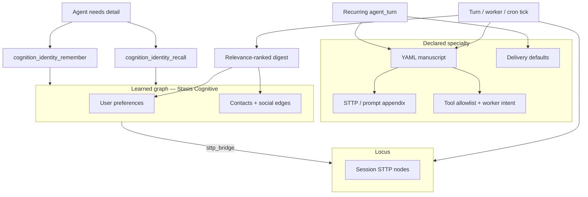

# Identity manuscripts, relevance-ranked recall, and specialized agents

> **Status:** **Mostly shipped** (2026-06) — Phases 3b–6 core landed; Phase 7 polish open  
> **Canonical runtime guide:** [turn-runtime-and-lanes.md](turn-runtime-and-lanes.md)  
> **Date:** 2026-05-30 (updated 2026-06)  
> **Related:** [cognitive-identity-memory-plan.md](cognitive-identity-memory-plan.md), [worker-continuity-plan.md](worker-continuity-plan.md), [recurring-delivery-roadmap.md](recurring-delivery-roadmap.md), [archive/turn-worker-bus-plan.md](archive/turn-worker-bus-plan.md), [context-lanes-and-scratchpad-plan.md](context-lanes-and-scratchpad-plan.md)

## Executive summary

Medousa ships a three-layer identity + specialty model:

1. **Ranked digest** — `[MEDOUSA_RELATIONAL_MEMORY]` at turn start (`compile_relational_memory_digest_with_options` in `cognitive_identity.rs`)
2. **On-demand recall** — `cognition_identity_recall` for mid-turn lookup
3. **YAML manuscripts (Specialists)** — declarative specialty packs for host turns, worker spawns, and recurring cron

Same manuscript drives interactive host turns, `cognition_spawn_turn_worker`, and scheduled `agent_turn` ticks — with delivery and Locus hooks.

**Principle:** Manuscript = *declared specialty*. Identity graph = *learned world model*. Locus = *episodic trail*. Digest = *small always-on slice*. Recall tool = *pull the rest on demand*.

**Product naming:** Home UI calls manuscripts **Specialists**; code uses `manuscript_id` and `IdentityManuscript`.

---

## Shipped vs open

| Phase | Topic | Status |
|-------|-------|--------|
| 3b | Relevance-ranked digest | ✅ |
| 3c | `cognition_identity_recall` | ✅ |
| 4a | Ranked identity export + CLI | ✅ |
| 4b | YAML schema + validate + list CLI | ✅ |
| 4c | `ManuscriptContext` in `prepare_turn_prompt` | ✅ |
| 5 | `manuscript_id` on spawn + worker prompt merge | ✅ |
| 6 | Recurring `manuscript_id` + Locus store on complete | ✅ (delivery polish ongoing) |
| 7 | Catalog tools, channel `/brief` adapters, semantic recall | ⬜ |

---

## North star



---

## Three layers (locked model)

| Layer | Holds | Authoring | Runtime load |
|-------|-------|-----------|--------------|
| **Manuscript** (YAML) | Specialty: voice, task template, tool policy, pins, delivery | Operator / repo `.medousa/manuscripts/` | Per turn, worker spawn, recurring tick |
| **Identity graph** (Stasis) | Learned prefs, people, edges | `cognition_identity_remember`, CLI | Cognitive mode + recall tool |
| **Locus** | Episodic reasoning, vibe, decisions | `cognition_memory_store` | `cognition_memory_context` / recall |

**Routing:**

- Durable personal/world facts → identity (`remember` / `recall`)
- Session narrative → Locus
- Specialty behavior → manuscript (overlays base STTP, does not replace graph)

---

## Historical problem (pre-3b — resolved)

Before ranked digest shipped, turn-start injection dumped all preferences/relationships and tail-chopped on budget. That behavior is replaced by score-based selection and lowest-score drop in `cognitive_identity.rs` (tests: `ranked_digest_prefers_high_recency_relationships`).

---

## Phase 3b — Relevance-ranked digest ✅

**Shipped in** `src/cognitive_identity.rs`:

- Manuscript `identity_pins.preferences` always included when present
- People ranked by `recency_score * confidence`; lowest score dropped first when over budget
- Query-aware rerank via `DigestCompileOptions.query_hints`
- Stats: `included_preferences`, `included_people`, `omitted_*`

---

## Phase 3c — `cognition_identity_recall` ✅

**Shipped in** `src/identity_tools.rs`, `src/cognitive_identity.rs` (`recall_identity_facts`):

- Read-only; on host bus + worker allowlists (`turn_worker/policy.rs`)
- Prompt steer in `system_prompt.rs`

---

## Phase 4 — Manuscript skeleton + export ✅

### 4a — Graph-derived export

`src/identity_markdown.rs` — ranked slice export; CLI `medousa identity-export`.

### 4b — YAML format

See `.medousa/manuscripts/morning-brief.yaml` for a live example. Supports `extends:` composition (e.g. `extends: base-researcher`).

### 4c — Loader

`src/identity_manuscript.rs` — parse, merge inheritance, validate, `build_manuscript_context`.

Prompt merge in `prepare_turn_prompt` (`turn_orchestrator.rs`):

```
DEFAULT_SYSTEM_PROMPT
→ manuscript appendix
→ [MEDOUSA_RELATIONAL_MEMORY] (ranked + pins)
→ ambient / recall / scratch
```

**CLI:** `medousa manuscript-list`, `manuscript-validate`, `manuscript-install`  
**HTTP:** `GET /v1/manuscripts`  
**Home:** Workshop → Specialists tab

---

## Phase 5 — Manuscript-aware workers ✅

`cognition_spawn_turn_worker` accepts `manuscript_id`, `stage_role`, `model_hint`.

- Worker STTP + tool allowlist from manuscript (`turn_worker/run.rs`)
- Manuscript-ranked identity summary at worker start
- Logs: `◈ worker_manuscript work_id=… id=…`

Identity delegation **graph edges** (Phase B of worker-continuity) — still open.

---

## Phase 6 — Scheduled specialty agents ✅ (core)

- `POST /v1/recurring/prompt` accepts `manuscript_id`
- `recurring_agent_turn.rs` runs `run_agent_turn` with manuscript context
- Optional Locus brief store on complete (`manuscript_wants_locus_store_on_complete`)
- Scheduled lane: `validate_manuscript_for_scheduled_lane` + required `tools.allow`

---

## Phase 7 — Catalog polish (open)

| Feature | Status |
|---------|--------|
| `GET /v1/manuscripts` catalog | ✅ |
| `extends:` composition | ✅ |
| `cognition_manuscript_list` tool | ⬜ |
| Channel `/brief` → manuscript on ingest | ⬜ |
| Semantic recall (embeddings) | ⬜ deferred |

---

## Checklist

- [x] 3b: score-based digest + lowest-score drop + tests
- [x] 3c: `cognition_identity_recall` + worker allowlist + prompt steer
- [x] 4a: ranked export + CLI remember/export
- [x] 4b: YAML schema + validate + list CLI
- [x] 4c: `ManuscriptContext` in `prepare_turn_prompt`
- [x] 5: `manuscript_id` on spawn + worker prompt merge
- [x] 6: recurring `manuscript_id` + Locus store on complete
- [x] architecture/README.md + [turn-runtime-and-lanes.md](turn-runtime-and-lanes.md)
- [ ] Smoke: morning-brief cron → Telegram + Locus node (operator QA)
- [ ] Phase 7 catalog tools + channel adapters

---

## Code references

| Area | Path |
|------|------|
| Digest + recall ranking | `src/cognitive_identity.rs` |
| Recall tool | `src/identity_tools.rs` |
| Manuscript loader | `src/identity_manuscript.rs` |
| Catalog HTTP | `src/manuscript_handlers.rs` |
| Prompt merge | `src/agent_runtime/turn_orchestrator.rs`, `prompt_prep.rs` |
| Worker spawn | `src/agent_runtime/turn_worker_tools.rs`, `turn_worker/run.rs` |
| Recurring ticks | `src/recurring_agent_turn.rs` |
| Example YAML | `.medousa/manuscripts/*.yaml` |

---

## References

- Turn runtime: [turn-runtime-and-lanes.md](turn-runtime-and-lanes.md)
- Worker continuity: [worker-continuity-plan.md](worker-continuity-plan.md)
- Durable workers: [durable-turn-worker-plan.md](durable-turn-worker-plan.md)
- Recurring delivery: [recurring-delivery-roadmap.md](recurring-delivery-roadmap.md)
