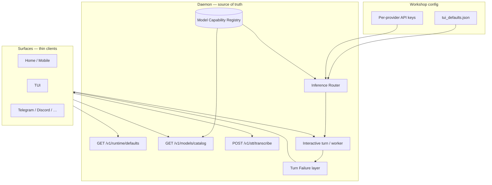

# Inference profiles, model catalog & turn failure UX

> **Status:** Ready to implement (2026-06-07)  
> **Scope:** Daemon-first — Home, mobile, TUI, and channels consume the same inference stack  
> **Depends on:** P5 attachments ([media-and-attachments-plan.md](media-and-attachments-plan.md)), existing stage routing  
> **Related:** [turn-runtime-and-lanes.md](turn-runtime-and-lanes.md), [component-daemon.md](component-daemon.md), [media-and-attachments-plan.md](media-and-attachments-plan.md) (P5b vision)

---

## Decisions (locked)

| # | Decision |
|---|----------|
| 1 | **Explicit operator choice** for main, vision, and STT profiles — no auto-pick of vision models from catalog |
| 2 | **Cross-provider fallbacks from day one** — each profile has 1 primary + 2 backup `{ provider, model }` targets (different providers allowed) |
| 3 | **Catalog refresh:** daemon boot + daily TTL + optional manual refresh (e.g. OpenRouter dropped a model mid-day) |
| 4 | **Stage routing and inference profiles are both kept** — different concerns (pipeline stages vs provider resilience) |

---

## North star

**One daemon inference stack.** Operators configure three capability profiles (main chat, vision, speech). The daemon resolves capabilities from live provider catalogs, routes calls through a fallback-aware router, and surfaces failures as operator-friendly errors — never raw API text in transcript or model context.



---

## Problems today

| Problem | Where | Impact |
|---------|--------|--------|
| Vision gate is hardcoded heuristics | `src/media_vision.rs` `supports_vision()` | OpenRouter / proxies fail even when model supports images |
| Model list APIs called but metadata discarded | `apps/medousa-home/src-tauri/src/providers.rs` `providers_list_models` | Only model IDs kept; no vision, context, pricing |
| Single API key remapped per active provider | `src/workshop_env.rs`, `src/session.rs` | Cross-provider fallbacks cannot authenticate |
| Raw API errors persisted as assistant turns | `agent_runtime/daemon_interactive_turn.rs` `agent_error` | Next turn’s model context includes HTTP errors |
| Failure “explanation” LLM fed raw `RUNTIME_ERROR` | `turn_orchestrator.rs` `deliver_tool_loop_failure_explanation` | User sees technical detail; model may echo it |
| STT config on disk but not in daemon `TuiDefaults` | `medousa_paths.rs` vs `session.rs` | Channels cannot share STT path; logic lives in Tauri only |
| `stage_routing.fallback_chain` is policy role names | `stage_routing.rs` | Not provider/model failover |

---

## Two layers — do not merge

### Stage routing (existing)

**What:** Which model runs each *pipeline stage* — orchestrator, chunker, extractor, summarizer, verifier, packer, `final_response`.

**Config:** `stage_routing` in `tui_defaults.json` → `StageRoutingMatrix`.

**Fallback chain today:** Role/policy names (`"verifier"`, `"safe-default"`) — **not** LLM provider failover.

**Keep as-is** for multi-stage prompt/workshop behavior. Do not overload it for API resilience.

### Inference profiles (new)

**What:** Which `{ provider, model }` runs each *capability class*, with cross-provider backup targets when the primary fails.

| Profile | Used for |
|---------|----------|
| **main** | Tool loop, text chat, final response (default LLM) |
| **vision** | Image attachments — multimodal user message assembly (P5b) |
| **stt** | Speech-to-text (composer mic, future channel voice) |

Each profile: **1 primary + 2 fallbacks** (explicit operator configuration).

---

## Model Capability Registry

### Purpose

Replace hardcoded `supports_vision()` and ad-hoc string matching with cached, provider-native metadata used by:

- Vision routing (`plan_turn_media`)
- Model picker (badges: Vision, context window, cost hint)
- Fallback router (skip targets that lack required capability)
- Char budget hints (context window from catalog)

### Storage

```
medousa/
└── model_catalog/
    ├── index.json              # last refresh, per-provider freshness
    ├── anthropic.json
    ├── openrouter.json
    ├── openai.json             # IDs + enriched overlay where API is thin
    └── …
```

### Refresh policy

| Trigger | Behavior |
|---------|----------|
| **Daemon boot** | Refresh stale providers (TTL exceeded) in background |
| **Daily TTL** | Default 24h; re-fetch provider catalog if `fetched_at + ttl` passed |
| **Manual** | `POST /v1/models/catalog/refresh` — operator-initiated; optional `?provider=` scope |
| **On demand** | Point lookup cache miss → single-model fetch if adapter supports it |

Manual refresh is **not forced** on every picker open — avoids hammering OpenRouter when idle.

### Provider adapters

Fetch from native APIs; normalize into `ModelCapabilityRecord`:

```rust
struct ModelCapabilityRecord {
    provider: String,
    model_id: String,
    display_name: Option<String>,
    input_modalities: Vec<Modality>,   // text, image, audio, file
    output_modalities: Vec<Modality>,
    max_input_tokens: Option<u64>,
    max_output_tokens: Option<u64>,
    supports_tool_calling: Option<bool>,
    supports_vision: bool,             // derived: image in input_modalities OR provider flag
    pricing: Option<ModelPricing>,     // per-token USD where available
    source: String,                    // e.g. "anthropic.models", "openrouter.models"
    fetched_at: DateTime<Utc>,
}
```

| Provider | API | Vision / modalities | Context / tokens | Pricing |
|----------|-----|---------------------|------------------|---------|
| **Anthropic** | `GET /v1/models` | `capabilities.image_input.supported` | `max_input_tokens`, `max_tokens` | Docs (not in list API) |
| **OpenRouter** | `GET /api/v1/models` | `architecture.input_modalities` | `context_length`, `top_provider.max_completion_tokens` | `pricing.prompt`, `pricing.completion`, `pricing.image` |
| **Mistral** | `GET /v1/models` | `capabilities.vision` | `max_context_length` | Docs |
| **Google Gemini** | `GET /v1beta/models` | Multimodal by family; `supportedGenerationMethods` | `inputTokenLimit`, `outputTokenLimit` | Docs |
| **OpenAI-compatible** | `GET /v1/models` | **Not in API** — enrich via OpenRouter slug match or curated overlay | Overlay / OpenRouter | Docs / OpenRouter |
| **Ollama** | `GET /api/tags` | Heuristic from model name + optional show output | Local limits | N/A |

OpenAI direct remains the weak link until their `/v1/models` gains capabilities ([openai-openapi#537](https://github.com/openai/openai-openapi/issues/537)). Mitigation: OpenRouter enrichment for slugs like `openai/gpt-4o-mini`, plus optional static overlay file versioned with daemon.

### Daemon module

| File | Role |
|------|------|
| `src/model_capability_registry/mod.rs` | Public API: `resolve()`, `list_catalog()`, `refresh()` |
| `src/model_capability_registry/adapters/` | Per-provider fetch + normalize |
| `src/model_capability_registry/cache.rs` | Disk cache + TTL |
| `src/bin/medousa_daemon.rs` | HTTP routes + boot hook |

---

## Inference profiles — config schema

Extend `tui_defaults.json` (and daemon `TuiDefaults` in `session.rs`).

```json
{
  "provider": "openai",
  "model": "gpt-4o-mini",
  "inference_profiles": {
    "main": {
      "provider": "openai",
      "model": "gpt-4o-mini",
      "base_url": null,
      "fallbacks": [
        { "provider": "openrouter", "model": "openai/gpt-4o-mini" },
        { "provider": "anthropic", "model": "claude-sonnet-4-6" }
      ]
    },
    "vision": {
      "provider": "openai",
      "model": "gpt-4o-mini",
      "base_url": null,
      "fallbacks": [
        { "provider": "openrouter", "model": "openai/gpt-4o-mini" },
        { "provider": "google", "model": "gemini-2.5-flash" }
      ]
    },
    "stt": {
      "provider": "openai",
      "model": "whisper-1",
      "base_url": null,
      "fallbacks": [
        { "provider": "groq", "model": "whisper-large-v3" },
        { "provider": "openrouter", "model": "openai/whisper-1" }
      ]
    }
  }
}
```

**Migration:** Flat `stt_provider`, `stt_model`, `stt_base_url` (already in Home `medousa_paths.rs`) map into `inference_profiles.stt` on load; write back unified shape on save.

**Validation on save:**

- All three profiles required before workshop is “inference-ready” (wizard / settings can warn, not auto-fill models)
- Each fallback entry must have non-empty `provider` + `model`
- Optional: warn if registry says fallback lacks vision when profile is `vision`

**Top-level `provider` / `model`:** Remain the default **main** profile for backward compat; kept in sync when main profile changes.

---

## Per-provider API key vault

Cross-provider fallbacks require **one key per provider**, not one key remapped at runtime.

```json
{
  "api_keys": {
    "openai": { "secret_ref": "keyring:medousa.providers.openai" },
    "anthropic": { "secret_ref": "keyring:medousa.providers.anthropic" },
    "openrouter": { "secret_ref": "file:secrets/api_key_openrouter" }
  }
}
```

| Piece | Change |
|-------|--------|
| `session.rs` | `load_provider_api_key(provider) -> Option<String>` |
| `workshop_env.rs` | Inject only the key for the **active attempt’s** provider |
| Home secrets UI | Per-provider rows (Settings → Models) |
| Legacy `api_key` | Maps to “default provider” until migrated |

Mobile companion: **read key status from daemon**, do not pretend phone keyring powers host turns.

---

## Inference Router

Central wrapper for all outbound model/STT calls.

```rust
enum InferenceProfileKind {
    Main,
    Vision,
    Stt,
}

struct InferenceTarget {
    provider: String,
    model: String,
    base_url: Option<String>,
}

async fn execute_with_fallbacks<T>(
    profile: InferenceProfileKind,
    required: CapabilityRequirement,  // e.g. Vision for image turns
    operation: impl Fn(InferenceTarget, ApiKey) -> Future<Output = Result<T>>,
) -> Result<InferenceExecution<T>>
```

### Attempt order

1. Primary profile target  
2. Fallback 1  
3. Fallback 2  

Skip a target when registry says it lacks `required` (e.g. vision profile fallback without `supports_vision`).

### Error classification

| Class | Examples | Action |
|-------|----------|--------|
| **Retry same target** | Timeout, 502/503, transient network | 1–2 retries with backoff |
| **Next fallback** | 401, 403, 404 model, 429 (after brief backoff), “model not found”, provider 5xx | Advance to next target |
| **Fail turn** | All targets exhausted, unclassified fatal | `TurnFailure` — no transcript pollution |

Log operator telemetry (engine details):  
`◈ inference profile=vision attempt=2/3 target=openrouter:openai/gpt-4o-mini reason=rate_limit`

### Wiring points

| Call site | Profile |
|-----------|---------|
| Tool loop / `final_response` pipeline | `Main` |
| `media_vision::plan_turn_media` + multimodal user message | `Vision` (when images attached) |
| STT transcribe endpoint | `Stt` |
| Worker synthesis / failure notify | `Main` (unless overridden by stage route — stage route picks model **within** main profile family; see below) |

**Stage route + profiles:** Stage routing continues to select `{ provider, model }` per role for pipeline stages. Those routes should reference models the operator configured, or inherit from **main** profile when unset. Fallback router wraps the **HTTP call**, not the stage-role indirection.

---

## Turn failure UX

### `TurnFailure` (structured)

```rust
struct TurnFailure {
    category: TurnFailureCategory,  // Auth, RateLimit, ModelNotFound, ProviderDown, Timeout, Unknown
    operator_message: String,       // Shown in UI / channels
    debug_message: String,          // Engine details / logs only
    attempted_targets: Vec<AttemptedTarget>,
    retryable: bool,
}
```

### Rules

| Layer | Do | Don’t |
|-------|-----|-------|
| **Session transcript** | Optional system-only audit row (excluded from model context) | Append raw API errors as `assistant` turns |
| **SSE / stream** | `event_type: "error"`, `operator_message`, `debug_message` | Put HTTP body in `final_text` |
| **Home** | Banner / inline error state (`streamError`) | Assistant bubble with `429 Too Many Requests` |
| **Channels** | Short friendly line | Forward provider JSON |
| **Failure explanation LLM** | Remove or pass **category + user prompt only** | Embed `RUNTIME_ERROR` in follow-up prompt |

### Stream event shape (additive)

Reuse existing operator/debug split from `interactive_turn_runtime.rs`:

```json
{
  "event_type": "error",
  "phase": "failed",
  "operator_message": "Couldn't reach the model right now. Try again in a moment.",
  "debug_message": "openai HTTP 429 …",
  "terminal": true
}
```

Home: on `error`, set `streamError` from `operator_message`, finish bubble without committing debug text to `content`.

---

## Daemon HTTP API

### New / extended routes

| Method | Path | Purpose |
|--------|------|---------|
| `GET` | `/v1/models/catalog` | Cached catalog for configured providers; query `?provider=&capability=vision` |
| `GET` | `/v1/models/capabilities` | Point lookup: `?provider=&model=` |
| `POST` | `/v1/models/catalog/refresh` | Manual refresh; body optional `{ "providers": ["openrouter"] }` |
| `GET` | `/v1/runtime/defaults` | **Extend** with `inference_profiles`, `catalog_freshness`, key status per provider |
| `POST` | `/v1/stt/transcribe` | Multipart audio → text via **stt** profile + fallbacks |
| `PUT` | `/v1/runtime/inference-profiles` | Persist profile edits (desktop host) |

### Deprecate (gradual)

| Today | Target |
|-------|--------|
| Tauri `providers_list_models` (IDs only) | Daemon catalog API |
| Tauri `composer_stt.rs` direct HTTP | Daemon `POST /v1/stt/transcribe` |
| `media_vision::supports_vision()` | `registry.supports_vision(provider, model)` |

Channels and mobile already proxy daemon via `workshop_http` — they get catalog + profiles for free once exposed on daemon.

---

## Home / settings UX (summary)

| Area | Change |
|------|--------|
| **Settings → Models** | Three sections: Main, Vision, STT — each primary + 2 fallbacks (provider picker + model picker) |
| **Model picker** | Badges from catalog: Vision, context, price hint |
| **Catalog** | “Refresh models” button → `POST /v1/models/catalog/refresh` |
| **Keys** | Per-provider key rows with validate |
| **Attachments** | If vision profile unset → block image send with clear CTA to configure vision |

Explicit operator choice: no “Auto vision model” default in v1.

---

## Implementation phases

### Phase 0 — Turn failure hygiene (~2–3 days)

- [x] Introduce `TurnFailure` + classification helper
- [x] Refactor `agent_error` — no raw content in assistant history
- [x] Stream errors via `operator_message` / `debug_message`
- [x] Home `chat.svelte.ts` — error events → `streamError`, not bubble content
- [x] Remove `deliver_tool_loop_failure_explanation` raw error injection
- [x] Channel sinks: friendly operator message only

**Acceptance:** Failed turn shows operator message; session history has no HTTP errors in assistant role; engine details still available when enabled.

### Phase 1 — Model Capability Registry (~1 week)

- [x] `model_capability_registry` module + disk cache
- [x] Adapters: Anthropic, OpenRouter, Mistral, Google, OpenAI-compatible, Ollama
- [x] Boot refresh + daily TTL + `POST /v1/models/catalog/refresh`
- [x] `GET /v1/models/catalog`, `GET /v1/models/capabilities`
- [x] Replace `supports_vision()` with registry lookup
- [x] Extend `GET /v1/runtime/defaults` with `catalog_freshness`

**Acceptance:** GPT 4o Mini via OpenRouter reports `supports_vision: true`; image turn logs `◈ vision active`; no hardcoded provider match in `media_vision.rs`.

### Phase 2 — Inference profiles config (~1 week)

- [x] `inference_profiles` in `TuiDefaults` + persistence
- [x] Migrate flat `stt_*` fields
- [x] `PUT /v1/runtime/inference-profiles`
- [x] Settings UI: main / vision / STT blocks (explicit required)
- [x] Wire **vision** profile into `plan_turn_media` / multimodal assembly
- [x] Wire **main** profile as canonical default for turns (replacing ad-hoc mobile/desktop drift)

**Acceptance:** Operator sets vision model explicitly; image attach uses vision profile, not main model gate.

### Phase 3 — Per-provider keys + Inference Router (~1 week)

- [x] Per-provider secret storage + `load_provider_api_key`
- [x] `execute_with_fallbacks` for LLM calls
- [x] Cross-provider failover with classification
- [x] Telemetry lines for attempts

**Acceptance:** Revoke primary provider key → turn succeeds on fallback provider; transcript never shows key errors.

### Phase 4 — STT on daemon (~3–4 days)

- [x] `POST /v1/stt/transcribe` using **stt** profile + fallbacks
- [x] Home composer calls daemon instead of Tauri `composer_stt.rs`
- [x] STT status endpoint or include in `runtime/defaults`

**Acceptance:** Mic transcription uses same profile/fallback stack as documented; mobile uses host daemon path.

### Phase 5 — Polish

- [x] Model picker catalog badges (vision, context, pricing from registry)
- [x] TUI exposure of profiles (read-only or edit via existing runtime commands)
- [ ] Channel attachment + vision path (deferred — channel media not shipped; `plan_turn_media` already uses vision profile)

---

## Acceptance criteria (epic)

1. **Catalog:** Operator can refresh model list manually; daemon refreshes on boot + daily TTL.
2. **Vision:** Image attach uses **vision** profile; capability from registry, not hardcoded strings.
3. **Fallbacks:** Main, vision, and STT each fail over across providers (1 + 2 backups).
4. **Errors:** No raw API errors in chat bubbles or model context.
5. **Surfaces:** Home, mobile, TUI, channels read profiles + catalog from daemon HTTP — not duplicate Tauri logic.
6. **Stage routing:** Unchanged semantically; documented as separate from inference profiles.

---

## Code anchors (today → target)

| Concern | Today | Target |
|---------|-------|--------|
| Vision gate | `src/media_vision.rs` | Registry + vision profile |
| Model list | `apps/medousa-home/src-tauri/src/providers.rs` | `src/model_capability_registry/` |
| API keys | `src/session.rs`, `src/workshop_env.rs` | Per-provider vault |
| Turn errors | `daemon_interactive_turn.rs` `agent_error` | `TurnFailure` layer |
| STT | `apps/medousa-home/src-tauri/src/composer_stt.rs` | `POST /v1/stt/transcribe` |
| Runtime defaults | `medousa_daemon.rs` `runtime_defaults` | + inference profiles |
| Stage routes | `src/stage_routing.rs` | Keep; document boundary |
| Attachments | `media-and-attachments-plan.md` P5b | Vision profile satisfies P5b routing |

---

## Related docs

- [media-and-attachments-plan.md](media-and-attachments-plan.md) — P5b vision consumes **vision** profile
- [turn-runtime-and-lanes.md](turn-runtime-and-lanes.md) — turn loop, stream events
- [component-daemon.md](component-daemon.md) — HTTP surface
- [interaction-and-state-model.md](interaction-and-state-model.md) — who owns workshop config

---

## Open questions (non-blocking)

- Pricing display in picker: show OpenRouter live pricing only, or static docs fallback for direct OpenAI?
- Should worker background jobs inherit **main** profile fallbacks or allow a fourth “worker” profile later?
- Catalog overlay file shipped with daemon releases for OpenAI until API catches up — who curates updates?
