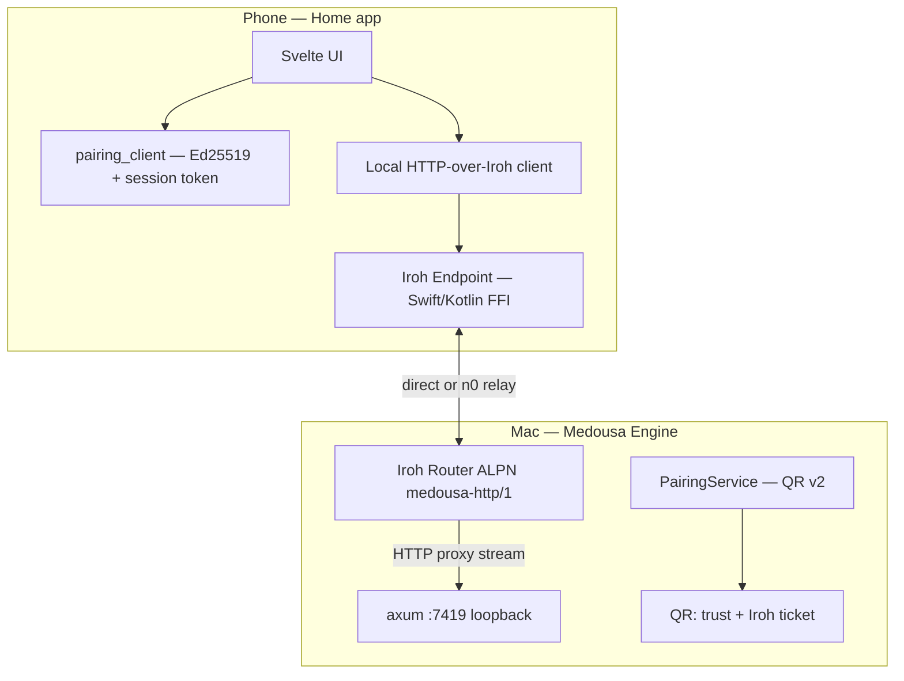

# Iroh P2P pairing — phased epic

> **Status:** Phase 0 code landed (smoke pending) · Phase 1 partial (`daemonPublicKey`) · Phase 2 mobile handshake wired  
> **Date:** 2026-06-07  
> **Supersedes:** deferred “Phase E cloud relay” transport story in [normie-onboarding-and-lan-pairing-plan.md](normie-onboarding-and-lan-pairing-plan.md) (relay layer only — cloud auth remains Phase E)  
> **Related:** [normie-onboarding-and-lan-pairing-plan.md](normie-onboarding-and-lan-pairing-plan.md), [CONNECTION-RELIABILITY.md](../apps/medousa-home/docs/CONNECTION-RELIABILITY.md)

## Product promise

**Scan once. Phone talks to your workshop anywhere.** The brain stays on your Mac; transport is encrypted P2P (direct when possible, relay when not). No port forwarding, no “same Wi‑Fi” gate, no Medousa Cloud required for reachability.

**Layering:** Pair for **trust** (existing Ed25519 ceremony). Iroh for **pipes** (QUIC, NAT, relay). Axum HTTP API unchanged — tunneled over Iroh.

---

## Current state (baseline)

| Layer | Shipped | Gap |
|-------|---------|-----|
| Trust | `src/pairing/` — QR v1, `/pair/init` + `/pair/verify`, encrypted store | Mobile app **never calls** init/verify — only parses `a=LAN:7419` |
| Discovery | mDNS `_medousa._tcp`, QR PNG, short code | LAN-only |
| Transport | Plain HTTP to `:7419` | No NAT traversal, no E2E on LAN |
| Capability bit | `relay_capable` reserved (bit 5) | Unused |

---

## Target architecture



**ALPN:** `medousa-http/1` — one bi-directional QUIC stream carries one HTTP/1.1 request/response (Phase 0); keep-alive later.

---

## QR v2 protocol (Phase 1)

Evolution of v1 — **v1 URLs remain valid** (LAN-only path).

```
medousa://pair/2.0?a=HOST:PORT&d=DEVICE_ID&t=TOKEN&s=SIG&n=NAME&k=TICKET
```

| Param | Required | Description |
|-------|----------|-------------|
| `a` | Yes (v2 hybrid) | LAN `host:port` — fast path hint |
| `d` | Yes | 8-char device id (SHA-256 prefix of long-term Ed25519 pk) |
| `t` | Yes | One-time QR session token (base64url) |
| `s` | Yes | Ed25519 sig of **v2 signing message** by long-term daemon key |
| `n` | No | URL-encoded peer display name |
| `k` | Yes (v2) | Iroh `EndpointTicket` string — off-LAN bootstrap |
| `e` | Optional | Workshop `EndpointId` hex — for persistence without full ticket |

**v2 signing message** (extends v1):

```text
{a}|{d}|{t}|{k}
```

If `k` absent (v1 compat), verify with v1 message `{a}|{d}|{t}` only.

**Phone flow after scan:**

1. Verify `s` (need daemon long-term pk — add `GET /pair/status` → `daemonPublicKey` in Phase 1).
2. Dial workshop via Iroh using `k` (works off-LAN).
3. Run `POST /pair/init` + `/pair/verify` over tunneled HTTP.
4. Persist `pairing_id`, `session_token`, `workshop_endpoint_id` — not raw IP.

---

## Phased delivery

### Phase 0 — Iroh spike *(code landed — smoke pending)*

**Goal:** Prove `GET /health` through Iroh before touching QR or mobile FFI.

| Task | Status |
|------|--------|
| `src/iroh_transport/` — ALPN `medousa-http/1`, HTTP proxy to upstream | ✅ |
| `medousa iroh workshop` — bind endpoint, print ticket, proxy to `--upstream` | ✅ |
| `medousa iroh curl <ticket> /health` — client smoke test | ✅ |
| `MEDOUSA_IROH=1` — daemon spawns gateway alongside axum | ✅ |
| Unit/integration test or documented manual smoke | Pending |

**Exit:** Two terminals — workshop prints ticket; curl returns daemon health JSON through Iroh.

**Key files:** `src/iroh_transport/`, `src/bin/medousa/iroh_cli.rs`, `src/bin/medousa_daemon.rs`

---

### Phase 1 — QR v2 + daemon ticket endpoint

**Goal:** Desktop QR encodes Iroh ticket; hybrid LAN + relay bootstrap.

- [ ] Stable workshop Iroh identity derived from `~/.medousa/identity/` seed (document KDF / domain separation)
- [ ] `GET /pair/iroh-ticket` — JSON `{ ticket, endpointId }`
- [ ] QR v2 URL builder in `PairingService` when Iroh gateway live
- [x] `GET /pair/status` exposes `daemonPublicKey` for mobile sig verify
- [ ] Set mDNS `pf` bit 5 (`relay_capable`) when Iroh enabled
- [ ] `medousa pair qr` prints v2 URL when available
- [ ] Docs + fixture tests for v2 signing message

**Exit:** Scan v2 QR on LAN; phone completes pairing over Iroh tunnel (Phase 2 client).

---

### Phase 2 — Mobile pairing handshake *(wired — sim test pending)*

**Goal:** Finish trust ceremony the daemon already implements.

- [x] Phone Ed25519 identity + `pairing_complete_from_qr` Tauri command
- [x] Wire wizard connect path (`pair` mode → init/verify)
- [x] Persist session token + pairing id in app secure storage
- [ ] `Authorization: Bearer` on mobile daemon requests (heartbeat in Phase 3)
- [x] Verify QR signature via `daemonPublicKey` on `/pair/status`

**Exit:** iOS simulator completes `/pair/init` + `/pair/verify` over LAN HTTP; device appears in Settings → Phone list.

**Key files:** `apps/medousa-home/src-tauri/src/pairing_client.rs`, `src/lib/utils/pairingClient.ts`

---

### Phase 3 — Phone transport over Iroh

**Goal:** Replace LAN HTTP as default when paired.

- [ ] Embed `iroh-ffi` in Tauri iOS/Android (Swift/Kotlin)
- [ ] Local loopback proxy in Home: `daemon.ts` → Iroh → workshop
- [ ] SSE streams over tunneled HTTP (validate `/v1/workspace/stream`, interactive SSE)
- [ ] Fallback: LAN `a=` hint when on same network
- [ ] Heartbeat `/pair/heartbeat` over Iroh with stored bearer

**Exit:** Phone on LTE reaches home Mac daemon; chat + workspace stream work.

---

### Phase 4 — Production hardening

**Goal:** Self-hosted without hassles — responsibly.

- [ ] Optional dedicated relay (self-host or Iroh Services managed) — env/config in Engine
- [ ] Public `n0` preset documented as dev/hobby; privacy copy in Settings
- [ ] Revoke/regenerate Iroh endpoint on “Forget phone”
- [ ] Connection diagnostics UI (direct vs relay, RTT) — optional Iroh Services metrics
- [ ] Remove manual IP entry from normie wizard (Advanced only)

**Exit:** Dogfood checklist passes on Wi‑Fi, LTE, and “Mac slept / woke”.

---

### Phase 5 — Polish & deprecation

- [ ] v1 QR generation optional (`MEDOUSA_PAIRING_QR_V1=1`)
- [ ] Architecture README + cookbook page “Pair phone anywhere”
- [ ] IANA / Bonjour convergence with Iroh local discovery (optional)

---

## Dependencies

| Crate / package | Version | Where |
|-----------------|---------|-------|
| `iroh` | 1.0 | `medousa` daemon |
| `iroh-tickets` | 1.0 | ticket mint/parse |
| `iroh-ffi` | 1.0 | Tauri mobile (Phase 3) |

**Rust MSRV:** iroh 1.0 requires Rust 1.91+ — bump CI/toolchain when enabling in release builds.

---

## Risks

| Risk | Mitigation |
|------|------------|
| SSE over HTTP tunnel buffers | Phase 3 soak test; dedicated stream ALPN if needed |
| Ticket QR size | Prefer `e=` + app-baked `N0` preset; or short URL + `GET /pair/iroh-ticket` |
| Public relay metadata | Document; offer self-host relay in Phase 4 |
| Identity key reuse (Ed25519 pairing + Iroh) | Explicit derive step in Phase 1 design doc |
| iroh MSRV vs project | Feature flag `iroh-transport` until toolchain bumped |

---

## Testing strategy

```bash
# Phase 0
medousa start daemon &
medousa iroh workshop --upstream http://127.0.0.1:7419
medousa iroh curl '<ticket>' /health

# Phase 2
# iOS sim: wizard pair link → device in GET /pair/status

# Phase 3
# Phone on LTE → chat turn + workspace SSE
```

---

## Manual smoke checklist (Phase 0)

- [ ] `cargo check` with iroh deps
- [ ] Workshop command prints ticket
- [ ] Curl returns `{"ok":true,...}` or equivalent health JSON
- [ ] Gateway survives 10 sequential curl requests
- [ ] Ctrl+C shuts down without panic
