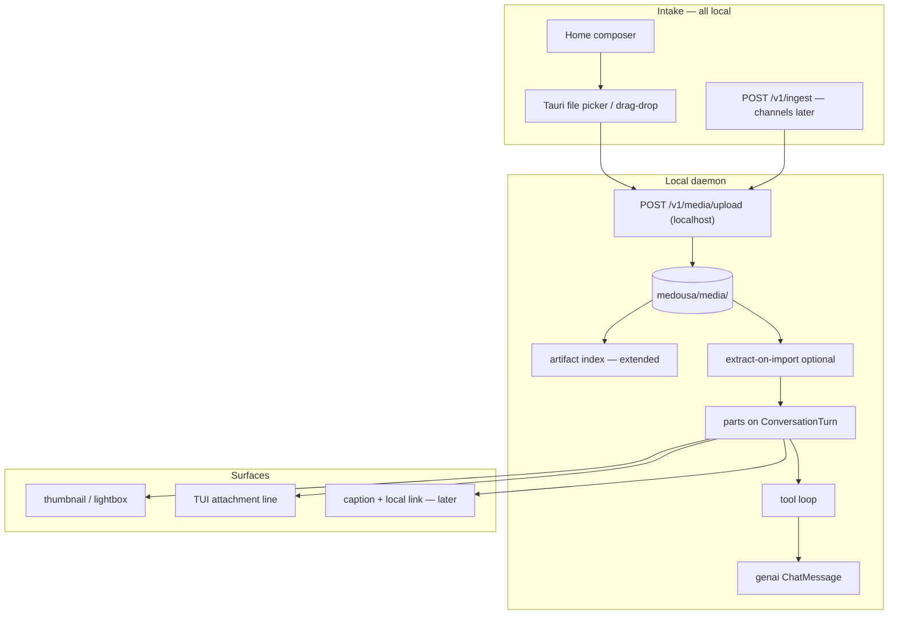

# Media & attachments — local-first plan (P5)

> **Status:** Ready to implement (2026-06-07)  
> **Scope:** User attachments in Home first; channels phased later  
> **Depends on:** P0–P4 complete ([presentation-and-envelope-plan.md](presentation-and-envelope-plan.md))  
> **Related:** [centralized-ingester-roadmap.md](centralized-ingester-roadmap.md), vault attachments (M8)

---

## Non-negotiable: fully local, no cloud dependency

**“Upload” in this plan means Home → local daemon over `localhost` — never S3, never a vendor blob bucket, never a network dependency for the operator.**

User files live under the same **`medousa` data directory** as sessions, vault, artifacts, and workspace:

```
~/Library/Application Support/medousa/   (macOS)
~/.local/share/medousa/                (Linux)
```

```
medousa/
├── artifacts/     ← tool JSON receipts (exists today)
├── media/         ← user attachments (P5a — copy-on-attach)
├── history/       ← session transcripts
├── vault/         ← notes
└── workspace/     ← cards, ask jobs
```

The transcript stores **references only** (`media_id`, mime, label) on `TurnPart` — never file bytes in `ConversationTurn.content` or session JSON.

---

## North star

**Blobs on disk. References in `parts[]`. Extract or vision at turn time.**



---

## What we already have (reuse, don’t reinvent)

| Piece | Location | P5 leverage |
|-------|----------|-------------|
| Local artifact tree | `artifact_store.rs` → `medousa/artifacts/` | Extend index + persistence pattern for binary MIME |
| Vault attachments | `vaultAttachments.ts`, frontmatter `path/label/mime` | Hybrid: ref vault paths; copy everything else |
| File picker | `vaultAttachmentPicker.ts`, Tauri dialog | Composer attach UX |
| Spreadsheet preview | `spreadsheetPreview.ts`, `xlsx` in Home | Port extract logic to daemon |
| Local file read | `external_desk.rs` | Read paths on desktop; not for web |
| Turn timeline | `turn_parts.rs` `parts[]` | Add `UserMedia`, `AttachmentRef` |
| Ingest attachments | `IngestAttachment` + `merge_attachments_into_prompt` | **Do not** extend for binary — use media refs |

---

## Storage strategy: copy vs reference

| Source | Strategy | Why |
|--------|----------|-----|
| Random file (Downloads, drag-drop) | **Copy** into `medousa/media/{session}/{media_id}` | Stable across refresh; daemon owns path |
| Already in vault / Garage pinned root | **Reference** normalized path (+ optional lazy copy) | No duplicate; user owns canonical file |
| Channel adapter (later) | Download → **copy** into `medousa/media/` | Same as desktop attach |

**Tauri v1:** `media_import` command copies (or registers vault ref) → returns `MediaRef[]` → turn sends `media_refs` on `InteractiveTurnRequest`.

**Browser dev:** multipart `POST /v1/media/upload` to local daemon (same as other API calls).

---

## Three capabilities — separate slices

| Capability | User expectation | Slice |
|------------|------------------|-------|
| **User attachments** (photo, PDF, xlsx) | “I attached a file; Medousa saw it” | P5a + P5a-text |
| **Vision** (photos, screenshots) | Model sees the image | P5b |
| **Voice STT** | Speak → text in composer | P5d (later) |
| **Generated images** | Tool output inline | P5c (later) |
| **Channel media** | Telegram photo → same pipeline | P5e (later) |

Do **not** bundle voice or channel media with file attach v1.

---

## Implementation slices

### P5a.0 — Envelope types (foundation) ✅ start here

- `TurnPart::UserMedia`, `TurnPart::AttachmentRef` in `turn_parts.rs`
- `MediaRef`, `MediaUploadResponse` in `daemon_api.rs`
- `InteractiveTurnRequest.media_refs: Vec<MediaRef>` (serde default `[]`)
- Home/Tauri TypeScript mirrors
- `compose_parts_markdown` renders attachment lines (no bytes)

**Effort:** ~1 day  
**Risk:** Low

### P5a.1 — Local media store + upload API

- `medousa/media/{session_id}/{media_id}.{ext}` on disk
- Extend artifact index: `provenance: user`, mime, byte_size, payload_path
- `POST /v1/media/upload` (multipart, session header) → `MediaUploadResponse`
- `GET /v1/media/{id}` (session-scoped, MIME, cache headers)
- Retention: align with existing artifact maintenance / settings TTL

**Effort:** ~3–5 days  
**Risk:** Medium (size caps, MIME allowlist, auth)

### P5a.2 — Turn wiring

- On interactive turn with `media_refs`: persist user turn with `parts: [UserMedia, Text?]`
- Stop using `merge_attachments_into_prompt` for binary kinds
- Session history API returns `parts` to Home (already partially there)

**Effort:** ~2–3 days  
**Risk:** Medium

### P5a.3 — Home composer UI

- Attach button (reuse picker patterns from vault)
- Pending uploads → local daemon upload → chips/thumbnails
- `ChatMessageList` / new `MediaPart.svelte` for bubbles
- Thumbnail via `GET /v1/media/{id}`

**Effort:** ~3–5 days  
**Risk:** Medium (mobile layout, Tauri vs web capability flags)

### P5a-text — Local extractors (no vision required)

Run at **import time**; store extracted text as sibling artifact or inline summary ref.

| MIME | Local technique |
|------|-----------------|
| csv, txt, md | Read + char cap |
| xlsx/xls | Rust crate or port Home `xlsx` logic → markdown table |
| pdf | `pdftotext` / Rust PDF extract, page cap |
| docx | ZIP/XML text extract (later) |

Inject bounded summary into turn context for **any text model**.

**Effort:** ~1 week  
**Risk:** Medium (PDF edge cases, scanned docs need OCR or vision later)

### P5b — Vision (current turn only)

> **Routing:** Vision model selection, live capability checks, and fallbacks live in [inference-profiles-and-model-catalog-plan.md](inference-profiles-and-model-catalog-plan.md) — explicit **vision** profile + registry, not hardcoded `supports_vision()`.

- Model capability gate (registry + **vision** inference profile)
- Multimodal `ChatMessage` for **active turn attachments only**
- Fallback copy when model cannot see images
- Prior turns: text summary only (not full image replay)

**Effort:** ~1.5–2 weeks  
**Risk:** High (provider variance, cost)

### P5c / P5d / P5e — Later

Generated images, voice STT, channel adapters — unchanged from prior draft; defer until P5a + P5a-text ship on Home.

---

## Recommended shipping order

1. **P5a.0** — types (enables parallel Home + daemon work)  
2. **P5a.1 + P5a.2** — local store + turn persistence  
3. **P5a.3** — composer UI (attach + preview + refresh survives)  
4. **P5a-text** — PDF/xlsx/csv extract (works on every model)  
5. **P5b** — vision for images  

**Credible v1:** steps 1–4 ≈ **3 weeks** for “attach my spreadsheet/PDF and ask questions” on a text model, fully local.

---

## MIME allowlist (v1 proposal)

`png`, `jpg`, `jpeg`, `webp`, `gif`, `pdf`, `csv`, `tsv`, `txt`, `md`, `xlsx`, `xls` — max **25 MB** per file, **5 attachments** per turn.

---

## API sketch (additive, localhost only)

```rust
struct MediaUploadResponse {
    media_id: String,
    mime: String,
    byte_size: u64,
    label: Option<String>,
}

struct MediaRef {
    media_id: String,
    kind: String,   // image | document | spreadsheet | audio
    mime: String,
    label: Option<String>,
}

struct InteractiveTurnRequest {
    // ... existing fields ...
    #[serde(default)]
    media_refs: Vec<MediaRef>,
}
```

Ingest evolution (P5e): adapter downloads platform file → local upload → `IngestAttachment.artifact_id` (deprecate inline `content` for binary).

---

## Risk register

| Risk | Don't | Do |
|------|-------|-----|
| Cloud dependency | S3 / presigned URLs | `medousa/media/` + localhost API |
| Inline base64 in prompts | Extend `merge_attachments_into_prompt` for images | Upload → media_id → `UserMedia` part |
| Bytes in transcript | Put files in `content` | Caption in `Text`; media in `parts[]` |
| Full vision history | Replay all images every turn | Current turn only |
| Unbounded disk | Infinite uploads | Size cap + retention job |
| Web vs Tauri parity | One code path | Capability flags; upload API for browser dev |

---

## Success criteria (Home v1)

- Attach PNG/PDF/xlsx in Home → refresh → thumbnail from `parts[]` + local GET (not re-upload).
- File bytes never appear in `ConversationTurn.content`.
- PDF/xlsx attach → model answers from extracted text on a non-vision model.
- All bytes under `medousa/media/` or explicit vault path refs — **zero cloud calls**.

---

## Code touch map

| Area | Files |
|------|-------|
| Envelope | `turn_parts.rs`, `session.rs`, `session_store.rs` |
| Media store | `media_store.rs` (new) or extend `artifact_store.rs` |
| API | `daemon_api.rs`, `daemon_handlers.rs`, `medousa_daemon.rs` |
| Tauri | `apps/medousa-home/src-tauri/` upload/import commands |
| Ingest | `session_mapping.rs` |
| Model | `turn_services.rs`, `turn_context.rs` (P5b) |
| Home | `ChatPanel.svelte`, `chat.svelte.ts`, `MediaPart.svelte` (new) |
| Extract | new `media_extract.rs` or tools (P5a-text) |

---

## Changelog

| Date | Note |
|------|------|
| 2026-06-07 | Initial draft (post P4). |
| 2026-06-07 | **Local-first rewrite:** no cloud; `medousa/media/`; copy-vs-ref hybrid; sliced P5a.0–P5a-text; approved to implement. |
