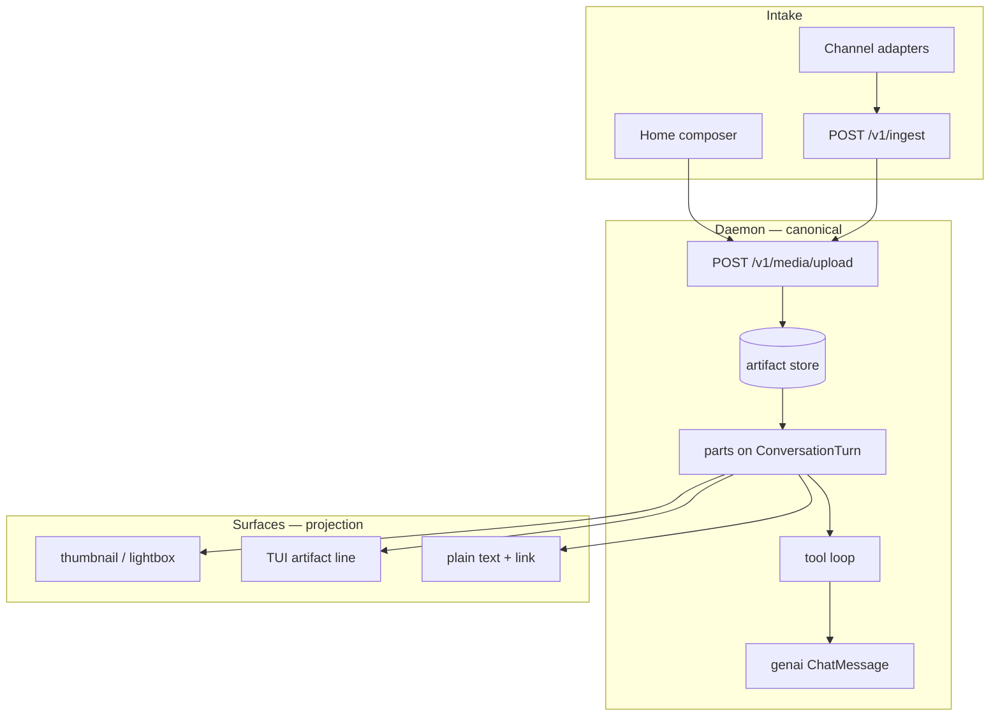
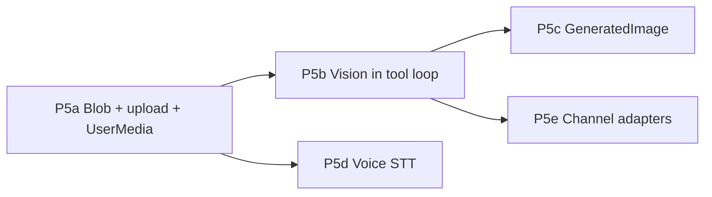

# Media & attachments — draft plan (P5)

> **Status:** Draft — saved for return after runtime bugfix  
> **Scope:** User attachments, generated images, voice (STT/TTS later); Home first, channels phased  
> **Depends on:** P0–P4 complete ([presentation-and-envelope-plan.md](presentation-and-envelope-plan.md))  
> **Related:** [centralized-ingester-roadmap.md](centralized-ingester-roadmap.md), [presentation-and-envelope-plan.md](presentation-and-envelope-plan.md) (envelope hooks), [interaction-and-state-model.md](interaction-and-state-model.md)

---

## Why this doc exists

Medousa does **text really well** — clean bodies, tool chips, `parts[]`, surface parity. **Media was never first-class:** no upload API, no multimodal model path, no composer attach UI, channel adapters always send empty attachments.

This draft captures an honest as-built audit, sizing, risks, and a phased rollout so P5 can start without re-litigating architecture or inlining blobs into prompts.

---

## North star

**Blobs live in artifact store. The transcript holds references only.**

Same principle as P0 (don’t pollute canonical markdown) and P3 (`parts[]` timeline). User photos, PDFs, generated images, and audio files are **artifact ids + MIME + label** on `TurnPart` variants — never base64 in `ConversationTurn.content` or session JSON.



---

## What P0–P4 already gave us

| Layer | Status | Media leverage |
|-------|--------|----------------|
| P0 clean canonical bodies | ✅ | Media never jammed into answer markdown |
| P1 structured tool SSE | ✅ | `tool_artifact_refs` on tool runs |
| P2 Obsidian markdown (Home) | ✅ | Captions in text parts; media beside prose |
| P3 session `parts[]` | ✅ | Timeline slots for `UserMedia`, `AttachmentRef`, `GeneratedImage` |
| P4 TUI alignment | ✅ | Same envelope; TUI can show artifact lines |
| Presentation profiles | ✅ | Rich Home vs plain channel dispatch |

**Envelope variants designed but not implemented** (from presentation plan):

```rust
// Target — extend turn_parts.rs additively
AttachmentRef {
    artifact_id: String,
    mime: String,
    label: String,
    byte_size: Option<u64>,
},
UserMedia {
    ingest_attachment_id: String,  // or artifact_id once unified
    kind: String,
},
GeneratedImage {
    artifact_id: String,
    prompt_excerpt: Option<String>,
},
```

SSE hook (future): `artifact_stored` with `artifact_id`, `mime`, `label`, `associations`.

---

## As-built audit (2026-06)

### Ingest attachments — API only, text merge

- `IngestAttachment { kind, content: String }` on `IngestRequest` (`daemon_api.rs`).
- `merge_attachments_into_prompt()` appends `[attachment:kind] content` into the ask string (`session_mapping.rs`).
- **All channel adapters** pass `attachments: Vec::new()` (Telegram, Discord, Slack, WhatsApp, CLI).
- Fine for pasted text snippets; **wrong for binary** (would base64 into prompt = context bomb, no refresh).

### Artifact store — tool JSON receipts, not user media

- `artifact_store.rs`: `persist_tool_artifact()` stores JSON under `artifacts/{session}/{tool}/{direction}/{hash}.json`.
- Triggered when tool I/O exceeds `DEFAULT_MAX_INLINE_BYTES` (8 KiB) via `payload_receipt.rs`.
- `content_type` effectively `application/json`; TUI persists from `ToolPayload` events.
- **No HTTP fetch-by-id** for Home chat rendering; workspace cards have `artifact_ids` associations (linking concept exists).

### Model path — text-only

- `build_prior_messages()` pushes `ChatMessage::user/assistant(bounded text)` from `turn.content` only (`turn_services.rs`).
- Host turn context: `ChatMessage::user(user_prompt)` string (`turn_context.rs`).
- **No multimodal message construction** anywhere; vision models would not see uploads today.

### Home composer — textarea only

- `ChatPanel.svelte`: text input + send; no attach, drag-drop, paste-image, or voice.
- `InteractiveTurnRequest` has no attachment / media_refs field.

### Generated images & voice — not in codebase

- No image-generation tool.
- “Voice” in docs = collaborator **tone** (`runtime-collaborator-voice.md`), not STT/TTS.
- No Whisper, audio MIME, or outbound TTS.

### TurnPart enum (shipped P3)

Implemented: `Text`, `Reasoning`, `ToolRun`, `Handoff`.  
**Not yet:** `AttachmentRef`, `UserMedia`, `GeneratedImage`.

---

## Three capabilities — separate products, shared foundation

| Capability | User expectation | Primary touch | Depends on |
|------------|------------------|---------------|------------|
| **User attachments** (photo, PDF, CSV) | “I attached a file; Medousa saw it” | Composer, upload API, user `parts[]`, vision models | Blob store v2 |
| **Generated images** | “Draw me…” → inline in chat | Tool + `GeneratedImage` part + lightbox | Blob store + SSE |
| **Voice (STT / optional TTS)** | Speak → text | Mic UI, STT provider, mobile permissions | Audio blobs + composer |

**Voice is the largest outlier** — do not bundle with “attach a PDF” in the first slice.

---

## Phased rollout

### P5a — Blob store + upload + UserMedia parts (Home)

**Goal:** Reference-only user media survives refresh; no model vision required yet.

1. Generalize `artifact_store`: binary MIME, provenance (`user` | `tool`), stable `artifact_id`.
2. `POST /v1/media/upload` (+ optional `GET /v1/media/{id}` with session auth).
3. Extend `TurnPart`: `UserMedia`, `AttachmentRef`.
4. Persist user turns with `parts: [UserMedia, Text?]` (not inline in `content`).
5. Home: attach button, pending uploads, thumbnail from fetch API.
6. Extend `InteractiveTurnRequest` with `media_refs: Vec<MediaRef>` (additive).

**Effort:** ~1.5–2.5 weeks  
**Risk:** Medium (storage, retention, MIME allowlist, size caps)

### P5b — Vision in tool loop

**Goal:** Model with vision sees **current turn** attachment(s).

1. Model capability matrix (`supports_vision` on stage routes or provider metadata).
2. Build multimodal `ChatMessage` for active user turn only (policy: don’t replay all images in history).
3. Graceful fallback when model can’t see images.
4. Update `build_prior_messages` / host context assembly — text summary for old turns with media.

**Effort:** ~1.5–2 weeks  
**Risk:** **High** (provider variance, cost, context limits)

### P5c — Generated images

**Goal:** Tool output → `GeneratedImage` part → Home lightbox + journal export.

1. Image-gen tool (provider API behind tool policy).
2. Tool loop writes blob + `GeneratedImage` part + optional `artifact_stored` SSE.
3. Home `MediaPart.svelte` (thumbnail + lightbox); reuse P5a fetch path.

**Effort:** ~1 week  
**Risk:** Medium (tool allowlist, storage quota)

### P5d — Voice (STT)

**Goal:** Speak into composer → text prompt (+ optional audio artifact).

1. STT path: browser Web Speech API and/or Whisper sidecar on daemon.
2. Audio upload as MIME in artifact store; optional `UserMedia { kind: "audio" }`.
3. Tauri/mobile mic permissions and capability detection.

**Effort:** ~2–4 weeks  
**Risk:** **High** (platform matrix, latency, privacy)

### P5e — Channel media

**Goal:** Telegram photo, Discord attachment, etc. → same upload pipeline → `UserMedia` parts.

1. Adapter downloads platform media → daemon upload → ingest with artifact refs.
2. Outbound: generated images / attachments via channel formatters (links, not inline binary where unsupported).

**Effort:** ~2–3 weeks per channel class  
**Risk:** High (platform limits, adapter complexity)



**Recommended first slice:** P5a → P5b on Home only (~3–4 weeks to credible “attach image and model sees it”).

---

## Risk register (foot-guns)

| Risk | Don’t | Do instead |
|------|-------|------------|
| Inline base64 in prompts | Extend `merge_attachments_into_prompt` for images | Upload → artifact id → `UserMedia` part |
| Blobs in `content` / markdown | `[image:data:…]` in chat body | Caption in `Text`; media in `parts[]` |
| Full vision history | Replay every image in `build_prior_messages` | Current turn only; text summary for older media |
| One model for all | Assume every route accepts images | Capability gate + user-visible fallback |
| Channel parity fantasy | Push binary into Telegram/WhatsApp bodies | `format_turn_for_channel()` → link + caption |
| Security | Unbounded uploads | Max size, MIME allowlist, session-scoped GET |
| Retention | Infinite user media | Quota / TTL aligned with artifact maintenance |
| Big-bang rewrite | New transcript type | Additive `TurnPart` + serde defaults |
| Tauri vs web | One composer code path | Capability flags for picker / camera / mic |

---

## Code touch map (when implementing)

| Area | Files / modules |
|------|-----------------|
| Envelope | `src/turn_parts.rs`, `src/session.rs`, `session_store.rs` |
| Blob store | `src/artifact_store.rs`, `src/payload_receipt.rs` (generalize MIME) |
| API | `src/daemon_api.rs`, `src/daemon_handlers.rs`, `apps/medousa-home/src-tauri/` |
| Ingest | `src/session_mapping.rs` (stop text-merge for binary; ref upload ids) |
| Model | `src/agent_runtime/turn_services.rs`, `turn_context.rs`, `turn_orchestrator.rs` |
| Stream | `interactive_turn_runtime.rs`, `tool_stream.rs` (`artifact_stored`) |
| Home | `ChatPanel.svelte`, `chat.svelte.ts`, `types/session.ts`, new media components |
| TUI | `event_reducer.rs`, `tui_presentation.rs`, `ui_render.rs` |
| Channels | `medousa_telegram.rs`, `medousa_discord.rs`, adapters |
| Presentation | `src/agent_runtime/presentation.rs` (channel media formatting) |
| Plan cross-ref | `presentation-and-envelope-plan.md` P5 section |

---

## Success criteria (P5 “done”)

- User attaches PNG in Home → refresh → thumbnail from `parts[]` + fetch API (not re-upload).
- Vision-capable model describes image; non-vision model gets clear guidance to switch or describe.
- Generated image is `GeneratedImage` part + lightbox, not markdown garbage.
- Session export / journal uses artifact refs (`compose_turn_markdown` / `compose_parts_markdown`).
- Telegram gets caption + link, not broken inline blob.
- **Zero** attachment bytes in `ConversationTurn.content` or polluted session rows.

---

## Open decisions (park here)

1. **Upload auth:** session_id header only vs signed upload tokens for Tauri.
2. **History policy:** current-turn vision only vs last N images vs never in history.
3. **Storage backend:** extend file artifact tree vs Surreal blob field vs object store (S3-compatible later).
4. **STT default:** browser API vs daemon Whisper vs hybrid.
5. **Image gen provider:** which tool + which models in allowlist.
6. **Retention:** per-session cap vs global quota vs align with existing artifact maintenance job.

---

## API sketch (additive)

```rust
// Upload response
struct MediaUploadResponse {
    artifact_id: String,
    mime: String,
    byte_size: u64,
    label: Option<String>,
}

// Interactive turn (additive)
struct InteractiveTurnRequest {
    // ... existing fields ...
    #[serde(default)]
    media_refs: Vec<MediaRef>,
}

struct MediaRef {
    artifact_id: String,
    kind: String,  // image | document | audio
    label: Option<String>,
}
```

Ingest evolution: `IngestAttachment` gains optional `artifact_id` after adapter upload; deprecate inline `content` for binary kinds.

---

## Relationship to presentation plan

| Presentation phase | Status | Media note |
|--------------------|--------|------------|
| P0–P4 | ✅ Shipped | Foundation for P5 |
| P5 (this doc) | Draft | Split into P5a–P5e above |

Update [presentation-and-envelope-plan.md](presentation-and-envelope-plan.md) § P5 to link here when implementation starts.

---

## Changelog

| Date | Note |
|------|------|
| 2026-06-07 | Initial draft saved from architecture review session (post P4). Return after runtime bugfix. |
