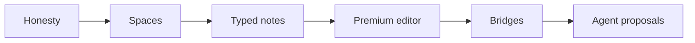

# Medousa Home — M7 Plan (The Garage)

> **Status:** **Sprint 7 (M7e) shipped** — Vault bridges · Sprint 8 next  
> **Date:** 2026-06-07  
> **Epic:** **M7 — Library as life garage**  
> **Related:** [medousa-home-plan.md](medousa-home-plan.md), [medousa-home-tauri-design.md](medousa-home-tauri-design.md), [medousa-home-m5-plan.md](medousa-home-m5-plan.md), [medousa-home-main-workspace-plan.md](medousa-home-main-workspace-plan.md), [continuity-first-redesign.md](continuity-first-redesign.md)

## North star

Chat is the **dance** between human and machine. Work is the **flow** of everyday execution. **Library is the garage** — where messiness lives, where the operator feels human, edits their own notes and numbers, and keeps what the machine helped produce without surrendering ownership.

**Mantra:** Not a file browser. Not Notion. A calm garage — Obsidian bones, 365 usefulness, one room at a time.

**Steve test (epic exit):** Open Library cold at 1280×800 with real data. Within five seconds you know *what kind of place this is*, you can capture or edit something meaningful, and nothing in the tree looks like QA debris.

---

## Product framing — three rooms

| Room | Surface | Operator feeling |
|------|---------|------------------|
| Dance | Chat | Conversation, delegation, approval |
| Flow | Work | Motion, blockage, batch review |
| Garage | Library | Ownership, mess, manual control |

M7 makes Library earn the third row in that table. M1 shipped the **filesystem**; M7 ships the **room**.

---

## Epic overview

| Phase | Name | Sprints | Theme | Exit criterion |
|-------|------|---------|-------|----------------|
| **M7a** | Honesty | 1 | Stop showing dev mess as product | Tree reads like a life, not a dump |
| **M7b** | Spaces | 1 | Journal / Projects / Finance / Inbox | Operator navigates by purpose, not path |
| **M7c** | Typed notes | 2 | Frontmatter kinds + templates | Open a note → UI knows what it is |
| **M7d** | Premium editor | 2 | Preview-first, wikilinks, autosave | No apology `<textarea>` keynote |
| **M7e** | Bridges | 1 | Vault ↔ Work ↔ Chat | Garage connects to shop |
| **M7f** | Agent proposals | 1 | Machine writes; human owns | Suggested edits with accept/discard |

**Total:** ~8 sprints (1–2 weeks each). Ship incrementally; each sprint is demoable.



---

## Sprint calendar

| Sprint | Phase | Goal | Ship signal |
|--------|-------|------|-------------|
| **S1** | M7a | Tree honesty + empty states | Screenshot-safe tree |
| **S2** | M7b | Spaces + new-note flows | “New daily” works end-to-end |
| **S3** | M7c.1 | Frontmatter `kind` + badges | Note shows type chip |
| **S4** | M7c.2 | Templates + ledger table view | Finance note editable as table |
| **S5** | M7d.1 | Split editor + wikilink click | Navigate `[[links]]` in preview |
| **S6** | M7d.2 | Autosave + keyboard polish | Save is invisible |
| **S7** | M7e | Work + Chat bridges | Card → note; note → ask |
| **S8** | M7f | Agent proposal strip | Accept/discard vault diffs |

---

## M7a — Honesty (Sprint 1)

*If we only do one sprint before showing Steve again, do this.*

### Problem

Library **infrastructure is fine** (M1: tree, search, CRUD, wikilinks, backlinks, card associations). The **presentation fails the pitch**: flat tree mixes journal, bugs, Ask logs, and `Link test` spam; empty editor; generic Edit/Save chrome.

### Work

| # | Problem | Fix | Touch |
|---|---------|-----|-------|
| A1 | Flat tree = chaos | **Space roots** in tree UI (group by first path segment); collapse `system/` and `.trash/` by default | `vaultTree.ts`, `VaultTreeNode.svelte`, `LibraryPanel.svelte` |
| A2 | Duplicate “Daily” rows | Enforce **M5 disambiguation** everywhere (tree, search hits, hero); date suffix from `modified_at_utc` | `formatVault.ts`, `VaultTree.svelte` |
| A3 | Ask/daemon noise in journal | **Hide rules**: paths matching `**/Ask ·*` or `**/medousa-daemon-*` under collapsible “System” unless Settings → “Show system notes” | `vaultTree.ts`, `vault.svelte.ts`, Settings (Library section) |
| A4 | Empty center | **Empty state** with three actions: New daily · Quick capture · Open last note | `VaultEditor.svelte`, `LibraryPanel.svelte` |
| A5 | `Link test` cemetery | **Archive affordance** (move to `.trash/` via existing `DELETE /v1/vault/notes/{path}`) + bulk “Archive selected prefix” dev tool in Settings | `vault.svelte.ts`, `daemon.ts`, optional Settings |
| A6 | No create from UI | **New note** dialog: pick space + title → `POST /v1/vault/notes` | `vault.svelte.ts`, new `VaultNewNoteDialog.svelte` |

### Exit criteria

1. Default tree shows ≤6 top-level space folders + System (collapsed).
2. No three identical “Daily” labels without disambiguator suffix.
3. Empty Library shows intent, not “Select a note from the tree.”
4. Operator can create `journal/YYYY-MM-DD.md` without CLI.

### Sprint 1 progress (2026-06-07)

| Item | Status |
|------|--------|
| A1 Space roots in tree | ✅ `vaultSpaces.ts`, `buildVaultTree` |
| A2 Disambiguation in tree/search | ✅ existing `buildVaultLabelMap` |
| A3 Hide system noise + toggle | ✅ `showSystemNotes` checkbox |
| A4 Empty state actions | ✅ `VaultEmptyState.svelte` |
| A5 Archive via delete API | ✅ `deleteVaultNote` + store helper |
| A6 New note from UI | ✅ `createVaultNote`, dialog, Daily/Capture |

### Out of scope (M7a)

- Block editor, databases, semantic search.

---

## M7b — Spaces (Sprint 2)

### Concept

**Spaces are navigation, not new storage.** Folder prefixes remain canonical on disk (`journal/`, `projects/`, `finance/`, `inbox/`). UI maps them to human labels and icons.

| Space | Prefix | Icon intent | Default template (S3) |
|-------|--------|-------------|------------------------|
| Journal | `journal/` | Book | Daily note |
| Projects | `projects/` | Folder | Project one-pager |
| Finance | `finance/` | Ledger | Expense table stub |
| Inbox | `inbox/` | Tray | Capture line |
| Bugs | `bugs/` | Bug | Bug report stub |
| System | `system/`, agent paths | Gear | Hidden by default |

### Work

| # | Work | Touch |
|---|------|-------|
| B1 | `SPACES` config in `$lib/config/vaultSpaces.ts` — prefix, label, icon, sort | new module |
| B2 | Tree renders **space headers** with counts; clicking header expands/collapses | `VaultTree.svelte`, `VaultTreeNode.svelte` |
| B3 | Search scoped by space (tabs or filter chips) | `LibraryPanel.svelte`, `vault.svelte.ts` |
| B4 | **Quick capture** → `inbox/{iso-timestamp}.md` one-liner body | `VaultEditor.svelte`, `vault.svelte.ts` |
| B5 | Persist last space + last note (`medousa-home-last-note` already exists; add space) | `vault.svelte.ts` |
| B6 | README + dogfood: migrate dev notes under `system/` or trash | ops / seed script optional |

### Exit criteria

1. Operator says “I’m in Journal” not “I’m in `journal/`.”
2. New daily note lands in Journal space in one click.
3. Inbox capture works without picking a path.

### Sprint 2 progress (2026-06-07)

| Item | Status |
|------|--------|
| B1 Space config + icons | ✅ `vaultSpaces.ts`, `vaultSpaceIcons.ts` |
| B2 Space headers + counts | ✅ tree icons, active highlight |
| B3 Search scoped by space | ✅ filter chips + client filter on hits |
| B4 Quick capture | ✅ (Sprint 1) |
| B5 Persist last space | ✅ `LAST_SPACE_KEY`, restore on load |
| B6 Space templates on create | ✅ project/finance/bug templates |

---

## M7c — Typed notes (Sprints 3–4)

### Design principle

**Same markdown files. Smarter skin.** No block editor. YAML frontmatter + kind-specific **views** — Notion usefulness without schema explosion.

### Frontmatter contract (V2)

Extend existing tag parsing in `src/vault/note.rs`:

```yaml
---
kind: daily | project | ledger | inbox | bug | note
title: Optional override
tags: [medousa]
---
```

| Kind | Primary view | Secondary |
|------|--------------|-----------|
| `daily` | Preview-first; “See [[weekly-review]]” prominent | Edit raw on toggle |
| `project` | Links block + linked Work cards (M7e) | Status line in frontmatter |
| `ledger` | **Table editor** for `\| Date \| Payee \| Amount \| Category \|` section | Export CSV copy |
| `inbox` | Single-line capture expand | Promote → journal/project |
| `bug` | Template sections ( repro / expected / actual ) | Link to Work card |
| `note` | Default markdown (current behavior) | — |

### Sprint 3 (M7c.1) — Kind detection + chrome

| # | Work | Touch |
|---|------|-------|
| C1 | Parse `kind:` in frontmatter (Rust index + TS client) | `vault/note.rs`, `$lib/utils/vaultFrontmatter.ts` |
| C2 | Expose `kind` on `VaultNote` / list API if not already indexed | `daemon_api.rs`, `vault/store.rs` |
| C3 | **Kind badge** in editor header + tree leaf icon | `VaultEditor.svelte`, `VaultTreeNode.svelte` |
| C4 | Kind-aware empty templates on create (B4/B6 flows) | `VaultNewNoteDialog.svelte`, `vaultTemplates.ts` |

### Sprint 3 progress (2026-06-07)

| Item | Status |
|------|--------|
| C1 Parse `kind:` in frontmatter | ✅ `vault/note.rs`, `vaultFrontmatter.ts` |
| C2 Expose `kind` on VaultNote API | ✅ `daemon_api.rs`, Tauri types, search hits |
| C3 Kind badge in editor + tree | ✅ `VaultKindBadge.svelte`, editor + tree + search |
| C4 Kind-aware create templates | ✅ frontmatter in `vaultTemplates.ts` |

### Sprint 4 (M7c.2) — Templates + ledger view

| # | Work | Touch |
|---|------|-------|
| C5 | Template library: daily, weekly, project, ledger, inbox, bug | `vaultTemplates.ts` |
| C6 | **LedgerTableEditor** — parse markdown pipe table, edit cells, serialize back | new `LedgerTableEditor.svelte`, `$lib/utils/markdownTable.ts` |
| C7 | Weekly review wikilink helper: “Link to this week’s review” inserts `[[Weekly Review · {date}]]` | `VaultEditor.svelte` |
| C8 | Promote inbox → journal/project (move path + frontmatter kind) | `vault.svelte.ts`, `POST` new + `DELETE` old |

### Sprint 4 progress (2026-06-07)

| Item | Status |
|------|--------|
| C5 Template library (daily, weekly, project, ledger, inbox, bug) | ✅ `vaultTemplates.ts`, New note dialog |
| C6 LedgerTableEditor + markdown table parse/serialize | ✅ `markdownTable.ts`, `LedgerTableEditor.svelte` |
| C7 Weekly review wikilink helper | ✅ daily editor toolbar + Weekly create button |
| C8 Promote inbox → journal/project | ✅ store + editor promote buttons |

### Exit criteria

1. Open `finance/expenses.md` → table view, not raw pipes by default.
2. Open `journal/daily.md` → preview-first with resolved wikilink labels.
3. Create note from template inserts valid frontmatter.

### API notes

- Prefer **client-side frontmatter** first (no API freeze bump).
- Optional **V2 index field** `kind` on `VaultNote` record when reindex is cheap — document in `vault-v1` addendum before shipping search-by-kind.

---

## M7d — Premium editor (Sprints 5–6)

### Problem

`<textarea>` + manual Save reads as weekend app. Chat and Work already feel premium.

### Sprint 5 (M7d.1) — Split + navigation

| # | Work | Touch |
|---|------|-------|
| D1 | **Split pane**: edit left, preview right (persist toggle in layout store) | `VaultEditor.svelte`, `layout.svelte.ts` |
| D2 | Preview uses shared `$lib/markdown` (callouts, tasks, mermaid — already in chat) | already wired; audit parity |
| D3 | **Click wikilink in preview** → `vault.openNote(resolvedPath)` | `markdown` link handler, `VaultEditor.svelte` |
| D4 | Backlinks panel in editor sidebar (not only Activity) when note selected | `VaultEditor.svelte`, `ContextPanel` patterns |
| D5 | Kind `daily` / `note`: default to preview-only on open; `e` to edit | `vault.svelte.ts` keyboard |

### Sprint 5 progress (2026-06-07)

| Item | Status |
|------|--------|
| D1 Split pane edit + live preview | ✅ `layout.svelte.ts`, SplitPane in `VaultEditor` |
| D2 Shared markdown renderer | ✅ `VaultMarkdownPreview`, frontmatter stripped |
| D3 Click wikilink → open note | ✅ `resolveWikilink.ts`, preview click handler |
| D4 Backlinks panel in editor | ✅ `VaultNoteLinksPanel.svelte` |
| D5 Preview-first daily/note + E key | ✅ default mode + keyboard hints |

### Sprint 6 (M7d.2) — Invisible save

| # | Work | Touch |
|---|------|-------|
| D6 | **Debounced autosave** (1.5s idle, `If-Match: content_hash`) | `vault.svelte.ts` |
| D7 | Cmd/Ctrl+S manual flush; dirty chip → “Saved” whisper | `VaultEditor.svelte` |
| D8 | Conflict UI on 412 — show diff chip + “Reload / Keep mine” | `vault.svelte.ts`, `vaultDiff.ts` |
| D9 | Mobile: reader mode stays preview-only (no regression) | `VaultEditor.svelte` `mobile` prop |

### Sprint 6 progress (2026-06-07)

| Item | Status |
|------|--------|
| D6 Debounced autosave (1.5s, If-Match) | ✅ `vault.svelte.ts`, `vaultSave.ts` |
| D7 Cmd+S flush + Saved whisper | ✅ header whisper, ghost Save now |
| D8 Conflict UI on 412 | ✅ `VaultConflictBar`, Reload / Keep mine |
| D9 Mobile preview-only | ✅ unchanged reader mode |

---

## M7e — Bridges (Sprint 7)

*Garage connects to the shop.*

| # | Work | Touch |
|---|------|-------|
| E1 | Work card inspector: **Open in Library** (existing `vault_paths`) | `CardInspector.svelte` |
| E2 | Library header: **Ask about this note** → chat with path + excerpt system hint | `VaultEditor.svelte`, `chat.svelte.ts`, `runSlashCommand` or composer API |
| E3 | Library header: **Send to Work** → enqueue ask with note context | `daemon.ts`, Work card create or ask |
| E4 | NOW / Activity rail: when selected note linked to in-motion card, show **“Linked work”** chip | `ActivityPanel.svelte`, `ContextPanel.svelte`, workspace store |
| E5 | Home hero: after blocked/in-motion, promote **last journal daily** (M5 priority preserved) | `HomeOverview.svelte` |

### Sprint 7 progress (2026-06-07)

| Item | Status |
|------|--------|
| E1 Work card → Open in Library | ✅ `CardInspector.svelte` |
| E2 Ask about this note → Chat | ✅ `VaultEditor`, `vaultNoteBridge.ts`, `chat.prefillDraft` |
| E3 Send to Work from Library | ✅ `workspace.submitAsk` + bridge |
| E4 Linked work chips in Activity/Editor | ✅ `ContextPanel`, `VaultEditor`, workspace lookup |
| E5 Journal daily hero priority | ✅ `HomeOverview`, mobile `PulsePanel` |

### Exit criteria

1. Card → note in one click from Work.
2. Note → Chat prefill in one click from Library.
3. Linked work visible without opening Work tab.

---

## M7f — Agent proposals (Sprint 8)

*Machine helps; human owns.*

| # | Work | Touch |
|---|------|-------|
| F1 | When agent `cognition_vault_write` touches open note, show **proposal bar**: agent text vs current | SSE `vault_note_updated` + session match |
| F2 | Accept → keep body; Discard → reload from server; Edit → merge in editor | `vault.svelte.ts`, `VaultEditor.svelte` |
| F3 | Activity feed: humanize `vault_note_updated` actor=Agent vs Operator | `ActivityPanel.svelte` |
| F4 | Optional: “Review agent notes” inbox filter (paths written by agent in last 24h) | `vaultTree.ts` filter |

### Exit criteria

1. Agent journal entry never silently overwrites operator mid-edit.
2. Accept/discard is one gesture.

### Depends on

- M6 turn awareness (SSE reliability) — soft dependency; degrade gracefully if stream misses.

---

## Backend / API deltas

| Change | Phase | Breaking? |
|--------|-------|-----------|
| `POST /v1/vault/notes` from UI create | M7a | No |
| Frontmatter `kind:` parsed in index | M7c | No — additive reindex |
| Optional `GET /v1/vault/notes?kind=ledger` | M7c | No — query addendum |
| `POST /v1/vault/notes/{path}/move` (promote inbox) | M7c | New — prefer POST+DELETE until freeze review |
| Agent proposal metadata on write events | M7f | No — `WorkspaceEvent` payload extension |

**Rule:** daemon remains source of truth; Tauri commands stay thin wrappers (`vault.rs`).

---

## Explicitly out of scope (M7)

Hold until post-M7 or separate epic:

| Item | Why deferred |
|------|----------------|
| Notion-style databases / views | Violates “garage not ERP” |
| Full Excel / spreadsheet engine | Ledger table is enough for v1 |
| Semantic / embedding search | Manual spaces first |
| Replacing manuscripts with vault | [medousa-home-plan.md](medousa-home-plan.md) defer |
| Project vault merge (user + repo overlay) | V3 — separate freeze |
| Grapheme IDE inside Library | TUI `/edit` stays power-user path |
| Collaborative editing | Single operator garage |

---

## Success metrics (epic)

| # | Metric |
|---|--------|
| 1 | **Tree test:** no ungrouped `Link test` or duplicate undifferentiated “Daily” in default view |
| 2 | **Capture test:** inbox note in &lt;10s from Library empty state |
| 3 | **Finance test:** edit one expense row in table view without raw markdown |
| 4 | **Graph test:** follow three wikilinks via preview click only |
| 5 | **Bridge test:** Work card → Library → Ask → back without copying paths |
| 6 | **Trust test:** agent vault write shows proposal when note is open |
| 7 | **Steve test:** demo Library for 60s without mentioning “it’s early” |

---

## Code anchors

| Layer | Path |
|-------|------|
| Vault HTTP | `src/vault_handlers.rs`, `src/vault/service.rs` |
| Note index / frontmatter | `src/vault/note.rs`, `src/vault/search.rs` |
| Cognition tools | `src/vault_tools.rs`, `cognition_vault_*` |
| Home store | `apps/medousa-home/src/lib/stores/vault.svelte.ts` |
| Tree / labels | `apps/medousa-home/src/lib/utils/formatVault.ts`, `vaultTree.ts` |
| Editor | `apps/medousa-home/src/lib/components/vault/VaultEditor.svelte` |
| Tauri bridge | `apps/medousa-home/src-tauri/src/daemon/vault.rs` |
| Work links | `CardInspector.svelte`, `workspace/card.rs` |

---

## Dependencies on other milestones

| Milestone | Relationship |
|-----------|--------------|
| M5 (shipped) | Title sanitizer, breadcrumbs — **required baseline** for M7a |
| M6 (in progress) | Turn/SSE awareness — soft dep for M7f |
| V1 vault API (shipped) | CRUD + search + backlinks — **no rewrite** |
| continuity-first | Vault = long-term workshop memory; M7e feeds chat context |

---

## Document history

| Date | Change |
|------|--------|
| 2026-06-07 | M7 epic from Steve Jobs garage pitch + Library audit |
| 2026-06-07 | **Sprint 1 started:** M7a honesty — spaces tree, empty states, create note |
| 2026-06-07 | **Sprint 1 shipped:** M7a complete |
| 2026-06-07 | **Sprint 2 started:** M7b space chips, icons, scoped search, templates |
