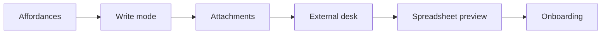

# Medousa Home — M8 Plan (The Real Garage)

> **Status:** **Sprint 5–6 (M8d) shipped** — External desk · Sprint 7 next  
> **Date:** 2026-06-07  
> **Epic:** **M8 — Library as *your* garage**  
> **Builds on:** [medousa-home-m7-vault-garage-plan.md](medousa-home-m7-vault-garage-plan.md) (M7 complete)  
> **Related:** [medousa-home-plan.md](medousa-home-plan.md), [media-and-attachments-plan.md](media-and-attachments-plan.md)

## North star

M7 built a **beautiful room for people who already think in markdown**. M8 builds a garage for people who think in **documents, spreadsheets, and life mess they already have**.

**Mantra:** Markdown underneath. Human on top. Your mess welcome — not just ours.

**Steve test (epic exit):** A non-developer opens Library, writes a daily note using toolbar buttons only (no `#` or `**`), links a PDF from disk, and never feels like they joined an engineering team.

---

## The critique M8 answers

| Steve says | M7 reality | M8 response |
|------------|------------|-------------|
| Why learn markdown? | Textarea + preview | Format bar + slash blocks; source mode optional |
| Where are the controls? | Split / Preview / bridges | Visible toolbar; kind-specific chrome |
| This is your mess | Bugs, agent notes, QA paths | Life-first empty state; external files lane |
| Where are my docs? | Vault `.md` only | Attach + preview PDF/DOCX/XLSX without migration |
| Excel/Word won on affordances | Ledger table only | Table for finance; preview for spreadsheets |

**Principle:** We do **not** become Notion or replace Excel. We become the **desk** that sits on top of plain files + linked externals — same portability M7 promised, human surface M8 delivers.

---

## Epic overview

| Phase | Name | Sprints | Theme | Exit criterion |
|-------|------|---------|-------|----------------|
| **M8a** | Affordances | 1 | Format without syntax | Bold/heading/list via buttons; `/` block menu |
| **M8b** | Write mode | 1 | Kind-default UX | Daily opens write-first; source is advanced |
| **M8c** | Attachments lane | 2 | Link files, don't re-type | PDF preview; file refs in frontmatter |
| **M8d** | External desk | 2 | Your existing work | Pin folder; index + open in OS |
| **M8e** | Spreadsheet preview | 1 | See the sheet | CSV/XLSX read-only preview in Library |
| **M8f** | Garage onboarding | 1 | What belongs here | Empty state + import wizard; hide dev noise by default |

**Total:** ~8 sprints. Ship incrementally; each sprint demoable.

---

## Sprint calendar

| Sprint | Phase | Goal | Ship signal |
|--------|-------|------|-------------|
| **S1** | M8a | Format bar + slash menu | Select text → Bold works; `/` inserts heading |
| **S2** | M8b | Write-first daily/journal | Daily opens editable; no raw pane by default |
| **S3** | M8c.1 | File references in notes | Link file → stored ref + chip in note |
| **S4** | M8c.2 | PDF preview pane | Open linked PDF inside Library |
| **S5** | M8d.1 | Pinned folders | Settings → pin `~/Documents` paths |
| **S6** | M8d.2 | External file browser | Sidebar "Your files" alongside vault tree |
| **S7** | M8e | CSV/XLSX preview | Finance note links sheet → table preview |
| **S8** | M8f | Onboarding + import | "Bring your mess" wizard; Steve empty state |

---

## M8a — Affordances (Sprint 1) ✅

*Word won because buttons advertise capability.*

### Work

| # | Work | Touch |
|---|------|-------|
| A1 | **Format bar**: bold, italic, H1–H3, bullet, numbered, link, code | `VaultFormatBar.svelte`, `vaultMarkdownEdit.ts` |
| A2 | Selection-aware apply + cursor restore | `VaultMarkdownEditor.svelte` |
| A3 | **Slash menu** at line start: heading, list, checkbox, link, divider | `VaultSlashMenu.svelte` |
| A4 | Toolbar visible in all markdown edit surfaces (split + single) | `VaultEditor.svelte` |
| A5 | Hint: "Select text to format · `/` for blocks" | format bar footer |

### Exit criteria

1. Operator formats daily note without typing `**` or `#`.
2. `/` at line start offers block inserts.
3. Markdown on disk unchanged in structure (still valid `.md`).

### Out of scope (M8a)

- WYSIWYG contenteditable, color pickers, font sizes.

---

## M8b — Write mode (Sprint 2) ✅

*Journal ≠ bug report UX.*

| # | Work | Touch |
|---|------|-------|
| B1 | `authoringMode`: `write` \| `source` (per note kind) | `vaultAuthoring.ts`, `vault.svelte.ts` |
| B2 | Daily / note / inbox default **write**: single pane, format bar, prose typography | `VaultEditor.svelte`, CSS |
| B3 | "Markdown" toggle for power users | header chip |
| B4 | Bug / ledger / project keep split/table defaults | `defaultAuthoringMode` |

### Exit criteria

1. New daily opens ready to type — no "Press E to edit".
2. Source mode one click away, not the default.

### Sprint 2 progress (M8b)

| Item | Status |
|------|--------|
| B1 authoringMode | ✅ |
| B2 Write surface + prose | ✅ |
| B3 Markdown toggle | ✅ |
| B4 Source kinds unchanged | ✅ |

---

## M8c — Attachments lane (Sprints 3–4) ✅

*Garage stores pointers to mess, not only copies.*

| # | Work | Touch |
|---|------|-------|
| C1 | Frontmatter `attachments:` array | `vaultAttachments.ts` |
| C2 | **Link file** → native file picker | `vaultAttachmentPicker.ts`, dialog plugin |
| C3 | Attachment chips + remove | `VaultAttachmentBar.svelte` |
| C4 | PDF / image inline preview | `VaultAttachmentPreview.svelte`, asset protocol |

### Exit criteria

1. Link a PDF from disk into a daily note without retyping.
2. Preview opens inside Library; **Open in app** for everything else.

### Sprint 3–4 progress (M8c)

| Item | Status |
|------|--------|
| C1 Frontmatter attachments | ✅ |
| C2 Link file picker | ✅ |
| C3 Attachment chips | ✅ |
| C4 PDF/image preview | ✅ |

---

## M8d — External desk (Sprints 5–6) ✅

*Meet my mess where it already is.*

| # | Work | Touch |
|---|------|-------|
| D1 | Pin up to 5 filesystem roots (localStorage) | `externalDesk.svelte.ts` |
| D2 | Index pinned roots via Tauri scan | `external_desk.rs` |
| D3 | Sidebar **Vault** \| **Your files** | `LibraryPanel.svelte` |
| D4 | Open in app + link to open note | `ExternalFilesBrowser.svelte` |
| D5 | Unified search (vault + pinned files) | `LibraryPanel.svelte` |

### Exit criteria

1. Pin `~/Documents` and browse files without import.
2. Link a file from Your files into the open note in one click.

### Sprint 5–6 progress (M8d)

| Item | Status |
|------|--------|
| D1 Pin folders | ✅ |
| D2 File index scan | ✅ |
| D3 Sidebar tabs | ✅ |
| D4 Open + link | ✅ |
| D5 Unified search | ✅ |

---

## M8e — Spreadsheet preview (Sprint 7) ← **NEXT**

*Excel usefulness without Excel engine.*

| # | Work | Touch |
|---|------|-------|
| E1 | Parse CSV → read-only table (reuse ledger renderer) | `spreadsheetPreview.ts` |
| E2 | XLSX first-sheet preview (light dep or Tauri convert) | `VaultSpreadsheetPreview.svelte` |
| E3 | Finance notes: "Link spreadsheet" template | `vaultTemplates.ts` |

**Rule:** preview + link only; no formula engine in M8.

---

## M8f — Garage onboarding (Sprint 8)

*Stop feeling like our workshop.*

| # | Work | Touch |
|---|------|-------|
| F1 | Empty state: "What belongs here" + "Link existing folder" | `VaultEmptyState.svelte` |
| F2 | First-run: hide `bugs/` and system paths until opted in | default `showSystemNotes: false` |
| F3 | Import wizard: pick folder → offer daily template + pin | onboarding flow |
| F4 | Demo seed separate from user vault (dev only) | settings flag |

---

## Backend / API deltas

| Change | Phase | Breaking? |
|--------|-------|-----------|
| Frontmatter `attachments:` | M8c | No — additive |
| `GET /v1/vault/external/roots` | M8d | No — new |
| `GET /v1/vault/external/list?root=` | M8d | No — new |
| File preview endpoint or Tauri-only | M8c/M8e | No |

**Rule:** canonical storage stays markdown + filesystem refs; no blob-in-markdown.

---

## Explicitly out of scope (M8)

| Item | Why deferred |
|------|----------------|
| Full WYSIWYG / Notion blocks | Violates portable `.md` contract |
| Excel formula engine | Preview-only in M8 |
| Cloud sync (Google Drive) | Local garage first |
| OCR / semantic search | Post-M8 |
| Replacing Word/Excel | Link + preview, not compete |

---

## Success metrics (epic)

| # | Metric |
|---|--------|
| 1 | **Format test:** bold + heading via toolbar on daily note |
| 2 | **Slash test:** `/` → heading without typing `#` |
| 3 | **Attach test:** link PDF; preview in Library |
| 4 | **Desk test:** open file from pinned `~/Documents` without import |
| 5 | **Sheet test:** linked CSV renders as table |
| 6 | **Steve test:** non-dev completes daily note without markdown syntax |
| 7 | **Trust test:** M7 agent proposals still work in write mode |

---

## Code anchors

| Layer | Path |
|-------|------|
| Format utilities | `apps/medousa-home/src/lib/utils/vaultMarkdownEdit.ts` |
| Editor chrome | `VaultFormatBar.svelte`, `VaultMarkdownEditor.svelte`, `VaultSlashMenu.svelte` |
| Vault store modes | `vault.svelte.ts` |
| Attachments (M8c) | `vaultFrontmatter.ts`, `VaultAttachDialog.svelte` |
| External desk (M8d) | Tauri `vault.rs`, new external index |
| Plans | this file, [M7 plan](medousa-home-m7-vault-garage-plan.md) |

---

## Depends on

| Dependency | Notes |
|------------|-------|
| M7 complete | Vault spaces, editor, bridges, proposals |
| Tauri file APIs | Attach + external desk |
| [media-and-attachments-plan.md](media-and-attachments-plan.md) | Align blob store long-term |

---

## Sprint 1 progress (M8a)

| Item | Status |
|------|--------|
| A1 Format bar | ✅ |
| A2 Markdown edit utils | ✅ |
| A3 Slash menu | ✅ |
| A4 Editor integration | ✅ |
| A5 Hint copy | ✅ |
