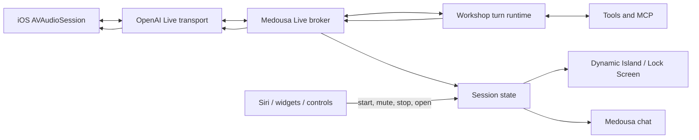

# Medousa Live on iOS

> **Status:** In progress / locked product direction  
> **Date:** 2026-09-15  
> **Owner:** Medousa platform

## Locked integration checkpoints — 2026-09-16

Live is a mode of the existing conversation, not a second assistant.

1. **Shared context + persistence:** daemon-built bounded policy, identity,
   recent history, relevant memory and work; finalized voice messages persisted
   without a second inference, stable IDs, ordering and interruption semantics.
2. **Unified conversation UI:** composer voice mode, shared message timeline,
   artifacts and tool activity; captions/mute/end; pin workshop/session ownership
   so changing the visible chat cannot reroute a running call.
3. **Execution/results + background hardening:** idempotent daemon execution,
   existing policy/approvals, progress and authoritative results back into Live;
   no double narration or speaking over the user; native state/control recovery.

Keep Siri intact. Local contract/unit/build checks are the development gates
while the phone is unavailable. Device qualification remains explicitly pending
for audio feel, interruptions, lock/background, network transitions and soak.
Do not claim background reliability from frontend tests alone.

## Decision

Medousa Live, not Siri, owns sustained voice conversations. The workshop daemon
continues to own session memory, tools, permissions, and durable work. iOS owns
the active audio route and presents session state through the app, Lock Screen,
Dynamic Island, widgets, and system controls. Siri remains a launcher and a
short one-shot surface; it is not the completion channel for long-running turns.

This matches the platform boundary we proved on device: an App Intent can hand
work off and a `LongRunningIntent` can keep that work alive, but Siri does not
offer a public API for resuming an expired spoken interaction after arbitrary
tool execution.

## Product contract

- A person explicitly starts Medousa Live from the app, Siri, a widget, Control
  Center, or the Action button.
- The native iOS audio session remains active while the conversation is active,
  including when Medousa is backgrounded or the phone is locked.
- Medousa Live supports interruption, mute, stop, and return-to-conversation.
- The Dynamic Island and Lock Screen show honest state: connecting, listening,
  thinking, using tools, speaking, waiting for approval, failed, or ended.
- Tool execution is delegated to the selected workshop daemon. The audio model
  never receives workshop credentials and never becomes a second tool runtime.
- Force-quit, reboot, and unattended automation do not promise an always-on
  microphone. Existing notification and Siri one-shot paths remain available.

## Architecture

### Trust boundary

Target production clients receive short-lived Live session credentials from a
Medousa broker. The current phone prototype bootstraps Realtime using the
iPhone's native secret authority; it does not yet have remote sideband ownership.
Long-lived OpenAI keys stay outside JavaScript and model context. A
trusted sideband connection lets the broker observe the Live session, dispatch
tool calls into the selected Medousa session, append bounded progress, and
return tool results. The mobile client never executes privileged tools directly.

### Native ownership

`MedousaLiveVoiceSessionManager` owns `AVAudioSession` using `.playAndRecord`
and `.voiceChat`. The Tauri webview controls it through a narrow Rust/C bridge.
This prevents webview suspension from owning microphone lifetime. The existing
ActivityKit bridge is reused for background-visible state.

## Delivery order

1. **Native lifecycle foundation** — audio category, permission, start/mute/stop
   status, Rust/TypeScript bridge, background-audio entitlement, and ActivityKit
   voice state. *(landed in this slice)*
2. **Live transport** — daemon-owned SDP exchange, WebRTC audio/data-channel
   vertical slice, interruption/barge-in, route changes, and reconnect. *(foreground
   webview transport landed; promote to a native engine if device qualification
   shows iOS suspends the peer in background; opt-in native WebSocket transport
   now has bounded PCM microphone conversion/playback, a Rust-to-Swift
   Keychain-backed bootstrap, and an explicit developer preference, pending
   device qualification)*
3. **Daemon sideband** — bind one Live session to one Medousa session; delegate
   tools, surface approvals, and project turn progress into conversational state.
   *(the opt-in native transport now bridges bounded server events to the existing
   foreground coordinator and accepts only validated thinking/commentary results;
   delivery uses a sequence/ack journal so webview suspension cannot erase an
   event before the coordinator receives it; scene-independent daemon execution
   remains next)*
4. **Production controls** — app voice surface, Dynamic Island and Lock Screen
   controls, widget/Control Center/Action button start, mute, stop, and resume.
5. **Siri launcher** — “Talk to Medousa” starts or resumes Medousa Live and
   returns immediately; existing one-shot and asynchronous Siri intents remain.
6. **Hardening** — interruption tests, Bluetooth/CarPlay routes, lock/background
   soak tests, network transitions, metering, privacy copy, and graceful quotas.

## Acceptance gates

- A 15-minute locked-screen conversation survives at least one tool call and a
  Wi-Fi/cellular transition without losing the Medousa session.
- Muting immediately stops upstream audio; stopping tears down audio, transport,
  sideband, and Live Activity.
- Tool requests use the same policy and approval path as typed Home turns.
- No long-lived provider credential is present in JavaScript, app-group defaults,
  logs, notifications, widget data, or Live Activity content.
- Every terminal state is recoverable from the app without creating a duplicate
  interactive turn.
# GPT-Live client-delegation trial — 2026-09-16

Trial the actual `/v1/live/sessions` WebRTC protocol, not a Realtime model rename.
The native credential broker supplies bounded identity/history and a small
voice prompt; the daemon remains the sole tool and permission authority.
Client delegations are opaque IDs plus timeline offsets, not generated request
arguments. Retain transcript fragments and reconstruct backend context;
caption grouping must never initiate tools. Verified results return with
`session.commentary.append`; no voice `response.create` turn triggers.

Keep explicit legacy retry during qualification. Initial slice uses a bounded
750ms context-collection delay, a short spoken result excerpt, and closure-time
caption persistence. These are trial limitations, not a production guarantee.
Validate MCP discovery, follow-up context, overlapping speech, late fragments,
background execution, correction/cancellation semantics, and graceful closure
on device before declaring migration complete.

Device follow-up: MCP execution succeeded, but result return did not. The active
chat map deletes settled interactive turns; it cannot serve as a completion
ledger. Live now polls the daemon's full turn records and waits for the exact
assistant message to finish streaming before returning a result. Track API
commentary acceptance separately from speech/playback. Show unacknowledged
results and unexpected session-closure reasons instead of silently disappearing.
Submit the actual speech request as the saved user message, with answer-style
hints in response-voice metadata, not an internal routing envelope in chat.

Interruption follow-up: voice acknowledgments must not become failed overlapping
daemon turns. A per-call work coordinator handles narrow acknowledgments without
execution and serializes genuine delegated follow-ups. Completed results remain
available independently of current speech and API acknowledgments. An explicit
Hear result control re-presents the stored result without repeating tool work;
it does not imply confirmed playback or automatic spoken cancellation support.

Device follow-up: a visible completed answer with no Hear result control means
the work observer has not captured a result, not merely a speech acknowledgment
failure. Saved transcript mapping changes display IDs and omits the streaming
turn ID. Capture exact terminal output at the normal stream's settlement boundary
in bounded scoped completion receipts, before deleting active turns. Live reads
these receipts independently of display reconciliation; no second stream or
inference is introduced. Keep full daemon-turn polling as a fallback.
