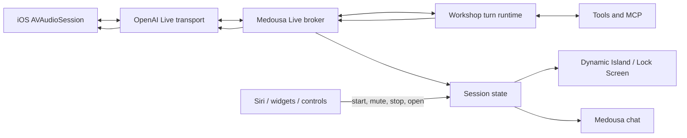

# Medousa Live on iOS

> **Status:** In progress / locked product direction  
> **Date:** 2026-09-15  
> **Owner:** Medousa platform

## Decision

Medousa Live, not Siri, owns sustained voice conversations. The workshop daemon
continues to own session memory, tools, permissions, and durable work. iOS owns
the active audio route and presents session state through the app, Lock Screen,
Dynamic Island, widgets, and system controls. Siri remains a launcher and a
short one-shot surface; it is not the completion channel for long-running turns.

This matches the platform boundary we proved on device: an App Intent can hand
work off and a `LongRunningIntent` can keep that work alive, but Siri does not
offer a public API for resuming an expired spoken interaction after arbitrary
tool execution.

## Product contract

- A person explicitly starts Medousa Live from the app, Siri, a widget, Control
  Center, or the Action button.
- The native iOS audio session remains active while the conversation is active,
  including when Medousa is backgrounded or the phone is locked.
- Medousa Live supports interruption, mute, stop, and return-to-conversation.
- The Dynamic Island and Lock Screen show honest state: connecting, listening,
  thinking, using tools, speaking, waiting for approval, failed, or ended.
- Tool execution is delegated to the selected workshop daemon. The audio model
  never receives workshop credentials and never becomes a second tool runtime.
- Force-quit, reboot, and unattended automation do not promise an always-on
  microphone. Existing notification and Siri one-shot paths remain available.

## Architecture

### Trust boundary

Production clients receive short-lived Live session credentials from a Medousa
broker. Long-lived OpenAI keys stay in the workshop's secret authority. A
trusted sideband connection lets the broker observe the Live session, dispatch
tool calls into the selected Medousa session, append bounded progress, and
return tool results. The mobile client never executes privileged tools directly.

### Native ownership

`MedousaLiveVoiceSessionManager` owns `AVAudioSession` using `.playAndRecord`
and `.voiceChat`. The Tauri webview controls it through a narrow Rust/C bridge.
This prevents webview suspension from owning microphone lifetime. The existing
ActivityKit bridge is reused for background-visible state.

## Delivery order

1. **Native lifecycle foundation** — audio category, permission, start/mute/stop
   status, Rust/TypeScript bridge, background-audio entitlement, and ActivityKit
   voice state. *(landed in this slice)*
2. **Live transport** — daemon-owned SDP exchange, WebRTC audio/data-channel
   vertical slice, interruption/barge-in, route changes, and reconnect. *(foreground
   webview transport landed; promote to a native engine if device qualification
   shows iOS suspends the peer in background)*
3. **Daemon sideband** — bind one Live session to one Medousa session; delegate
   tools, surface approvals, and project turn progress into conversational state.
4. **Production controls** — app voice surface, Dynamic Island and Lock Screen
   controls, widget/Control Center/Action button start, mute, stop, and resume.
5. **Siri launcher** — “Talk to Medousa” starts or resumes Medousa Live and
   returns immediately; existing one-shot and asynchronous Siri intents remain.
6. **Hardening** — interruption tests, Bluetooth/CarPlay routes, lock/background
   soak tests, network transitions, metering, privacy copy, and graceful quotas.

## Acceptance gates

- A 15-minute locked-screen conversation survives at least one tool call and a
  Wi-Fi/cellular transition without losing the Medousa session.
- Muting immediately stops upstream audio; stopping tears down audio, transport,
  sideband, and Live Activity.
- Tool requests use the same policy and approval path as typed Home turns.
- No long-lived provider credential is present in JavaScript, app-group defaults,
  logs, notifications, widget data, or Live Activity content.
- Every terminal state is recoverable from the app without creating a duplicate
  interactive turn.
