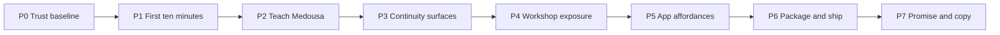

# Polish & Package — phased plan

> **Status:** Active (2026-06)  
> **Audience:** Non-dev, non-tech operators — *install, trust, feel held*  
> **Thesis:** Medousa’s **engine is shipped** (runtime, memory, vault, plugins, AVEC/STTP). The gap is **exposure, polish, and promise alignment** — not capability.  
> **Related:** [turn-runtime-and-lanes.md](turn-runtime-and-lanes.md), [identity-manuscripts-and-recall-plan.md](identity-manuscripts-and-recall-plan.md), [iroh-p2p-pairing-plan.md](iroh-p2p-pairing-plan.md), [media-and-attachments-plan.md](media-and-attachments-plan.md), [desktop-distribution-plan.md](desktop-distribution-plan.md), [archive/continuity-first-redesign.md](archive/continuity-first-redesign.md)

---

## Problem statement

Competitive review (OpenClaw, Hermes, Claude Cowork, Pi) surfaced a pattern:

| Category | Meaning | Example |
|----------|---------|---------|
| **Exposure** | Built in Rust/daemon; Home doesn’t surface it | Identity teach, Grapheme workshop, context provenance |
| **Polish** | Built; wiring or reliability rough | Sidecar auto-start, Iroh pairing, bundle updates |
| **Promise** | Marketing/README overshoots felt experience | “Remembers everything” vs ranked digest + recall |
| **Net-new** | Genuinely missing slice | Chat attachments (P5), optional managed adapter channel |

**Do not** treat MCP, OpenShell, Grapheme VM, Locus, identity graph, vault, or daemon-hosted runtime as backlog items — they are **product strengths to package**.

---

## North star

> **Anxiety → actionable structure, emotional resonance intact.**  
> Install in ~60 seconds. Brain runs invisibly. First real task leaves **stone** in the vault with **visible provenance** (work → note → thread). Operator never needs “daemon,” “host bus,” or “manuscript YAML.”

**Demo artifact (internal):** couples financial toolkit run — work cards → research workers → vault guides with human tone (`feed.jsonl` + `vault/finance/`).

---

## Principles

1. **Expose, don’t rebuild** — prefer Home Settings / Context / Vault UX over new subsystems.
2. **Continuity over capability** — every phase must improve *felt* thread (trust, recall, artifacts), not tool count.
3. **Normie language** — Specialists, Services, Memory, Workshop; hide lane/bus jargon in Advanced.
4. **Local-first unchanged** — polish must not imply cloud sync; pairing/Iroh is the multi-device story.
5. **Ship vertical slices** — each phase has a user-visible “done” moment, not a quarter of invisible refactors.

---

## Phase map

| Phase | Theme | Operator outcome |
|-------|--------|------------------|
| **P0** | Trust baseline | “It’s running; I’m not guessing.” |
| **P1** | First ten minutes | “I see why this is different from ChatGPT.” |
| **P2** | Teach Medousa | “She knows me; I can correct her.” |
| **P3** | Continuity surfaces | “I see where memory came from.” |
| **P4** | Workshop exposure | “I can extend her without terminal.” |
| **P5** | App affordances | “This feels like a real app.” |
| **P6** | Package & ship | “Download, update, phone just works.” |
| **P7** | Promise & copy | “Marketing matches what I feel.” |

---

## P0 — Trust baseline (engine invisible)

**Goal:** Sidecar bundle + daemon health feel **boringly reliable** before any feature polish.

| ID | Deliverable | Type | Acceptance |
|----|-------------|------|------------|
| P0.1 | Engine auto-start after wizard | Polish | Fresh `.app` install → chat works with **zero terminal**; doctor green |
| P0.2 | Home **Workshop health** chip | Exposure | Settings shows engine version, last turn, restart affordance |
| P0.3 | Fix known sidecar wiring bugs | Polish | Track in issues; smoke: sleep/wake, force-quit, relaunch |
| P0.4 | Iroh Phase 0 smoke + Phase 2 mobile | Polish | [iroh-p2p-pairing-plan.md](iroh-p2p-pairing-plan.md) — QR → `/health` over tunnel |
| P0.5 | Connection runbook in product | Exposure | Link Settings Diagnostics → [connection-reliability](../docs/runbooks/connection-reliability.md) |

**Code anchors:** `apps/medousa-home/src-tauri/` sidecar scripts, `prepare-engine-sidecar.sh`, `src/iroh_transport/`, Settings Diagnostics panels.

**Exit:** Operator never asks “is the daemon running?” after day one.

---

## P1 — First ten minutes (the differentiator moment)

**Goal:** Post-wizard path shows **continuity**, not Settings taxonomy.

| ID | Deliverable | Type | Acceptance |
|----|-------------|------|------------|
| P1.1 | Wizard epilogue screen | Exposure | After BYOK/offline: “Your workshop is ready” + **one** suggested first action (chat or quick capture) |
| P1.2 | **Guided first win** (optional skip) | Exposure | 3-step micro-flow: say something personal → see Context populate → save a vault note |
| P1.3 | Surface **Context map** entry | Exposure | Home nav hint: “Threads & memory” within first session |
| P1.4 | Hide Advanced jargon | Polish | Host bus charter → “When to bring in Specialists” with plain hints only |
| P1.5 | Profile switcher discoverability | Exposure | Work/home chip visible after second profile exists |

**Exit:** New user can articulate “it remembers and leaves notes” within 10 minutes (user test).

**Not in scope:** Rebuilding wizard state machine (shipped in archive first-run plan).

---

## P2 — Teach Medousa (identity exposure)

**Goal:** Everything `medousa identity-*` and `identity-remember` does — **from Home**, for normies.

| ID | Deliverable | Type | Acceptance |
|----|-------------|------|------------|
| P2.1 | **Memory & You** settings section | Exposure | View ranked digest preview; edit key prefs inline |
| P2.2 | **Teach Medousa** composer | Exposure | Free-text → `cognition_identity_remember` or daemon API; confirmation toast |
| P2.3 | People & relationships light editor | Exposure | List contacts/edges from identity drawer; add nickname/fact |
| P2.4 | Export identity markdown | Exposure | Button → same output as `medousa identity-export` to chosen folder |
| P2.5 | Import / hand-edit loop | Exposure | “Open export folder” + regenerate digest hint |

**Code anchors:** `src/identity_tools.rs`, `src/cognitive_identity.rs`, `src/identity_markdown.rs`, `IdentityDrawer.svelte`, `SettingsMemorySection.svelte`.

**Exit:** Operator never needs CLI to teach “Mario is my partner” or “timezone is …”.

---

## P3 — Continuity surfaces (provenance & recall)

**Goal:** Make the **top-tier memory stack** obvious — graph, vault links, session origin.

| ID | Deliverable | Type | Acceptance |
|----|-------------|------|------------|
| P3.1 | Context as **primary** nav tier | Exposure | Same weight as Chat/Work/Vault on desktop; Pulse links on mobile |
| P3.2 | **Unified search** | Exposure | One search: sessions (catalog) + vault + identity recall hits |
| P3.3 | Provenance on every artifact | Polish | Work card → vault → session; vault note → originating work/chat |
| P3.4 | “What Medousa used this turn” | Exposure | Optional chat inspector: digest + slices + active profile (read-only, plain language) |
| P3.5 | Thread ↔ chat deep links | Polish | Context recall “Echoes in your sessions” → open chat at session |

**Code anchors:** `ContextPanel.svelte`, `ContextMapView.svelte`, `ContextRecallDetail.svelte`, `session_catalog`, `turn_slice.rs`, `workHub.ts` provenance chips.

**Exit:** Operator answers “where did she get that?” without reading logs.

---

## P4 — Workshop exposure (plugins without terminal)

**Goal:** MCP + OpenShell + Grapheme + skills import — **discoverable**, not TUI-only.

| ID | Deliverable | Type | Acceptance |
|----|-------------|------|------------|
| P4.1 | **Services** tab polish | Exposure | MCP health, test connection, plain labels (already partial — finish empty states) |
| P4.2 | **Skills import wizard** | Exposure | Folder picker → Hermes/OpenClaw `SKILL.md` → manuscript install; progress + open specialty |
| P4.3 | Specialist gallery | Exposure | Shipped `.medousa/manuscripts` examples + user installs with one-line description |
| P4.4 | Grapheme **Workshop** (lite) | Exposure | List scripts/modules; run from Home; link “Open full workshop in Terminal” for TUI editor |
| P4.5 | OpenShell policy visibility | Exposure | Show active sandbox policy per skill; no raw YAML unless Advanced |
| P4.6 | WASM modules | Deferred | Document “future”; no false UI until hot-load exposed |

**Code anchors:** `SkillsPanel.svelte`, `McpServersPanel.svelte`, `src/identity_manuscript.rs`, `src/skill_ingest.rs`, `src/grapheme_*`, TUI script editor for power path.

**Exit:** README “bring your skills” is one Home gesture, not a doc hunt.

---

## P5 — App affordances (feels like a proper app)

**Goal:** Normie expectations — share, export, context actions — without changing core architecture.

| ID | Deliverable | Type | Acceptance |
|----|-------------|------|------------|
| P5.0 | **Chat attachments** | Net-new | [media-and-attachments-plan.md](media-and-attachments-plan.md) P5a — composer attach, local media |
| P5.1 | Vault context menu | Polish | Right-click / long-press: Share, Export PDF, Move, Ask Medousa, Send to Work |
| P5.2 | Chat message actions | Polish | Copy, Share, “Save to vault” on assistant turns |
| P5.3 | Transcript export | Exposure | Session → Markdown/PDF export |
| P5.4 | Profile backup | Exposure | Home → Export profile bundle (existing API); import on new machine |
| P5.5 | Note share sheet | Polish | Extend `share.ts` beyond work results to vault notes |

**Code anchors:** `VaultEditor.svelte`, `VaultNoteActionsMenu.svelte`, `vaultPdfExport.ts`, `profile_portability.rs`, `share.ts`.

**Exit:** No “I wish Obsidian/Notes could …” for basic share/export.

---

## P6 — Package & ship (distribution)

**Goal:** Download → install → update → phone, without engineering literacy.

| ID | Deliverable | Type | Acceptance |
|----|-------------|------|------------|
| P6.1 | Signed desktop CI | Polish | [desktop-distribution-plan.md](desktop-distribution-plan.md) — `.dmg` / `.msi` / AppImage on Releases |
| P6.2 | In-app **Check for updates** | Polish | Tauri updater or clear “new version” nudge + link |
| P6.3 | Engine + app version lockstep | Polish | Sidecar version matches app; doctor warns on mismatch |
| P6.4 | Optional **channel adapters** bundle | Polish | One-click enable Telegram/Discord docs + deep link to Settings (not separate downloads) |
| P6.5 | Iroh Phase 3–4 | Polish | Phone transport + relay hardening — primary multi-device path |

**Exit:** README “Download Medousa” → double-click → working brain (no GitHub tarball confusion).

---

## P7 — Promise & copy alignment

**Goal:** Marketing, wizard, and empty states match **ranked memory + recall + stone**, not omniscient chatbot.

| ID | Deliverable | Type | Acceptance |
|----|-------------|------|------------|
| P7.1 | README pass | Copy | “Remembers what matters; recalls the rest on demand” vs “everything” |
| P7.2 | Wizard privacy copy | Copy | Local-first accurate; no implied cloud sync |
| P7.3 | Empty states | Copy | Context, Vault, Work — continuity voice (garage, threads, Specialists) |
| P7.4 | Competitive one-pager | Exposure | Internal: capability vs exposure table (this plan §Problem) |
| P7.5 | Landing / store screenshots | Copy | Show vault + context provenance, not terminal |

**Exit:** Support questions shift from “what is a daemon?” to “how do I teach her X?”.

---

## Suggested implementation order

Strict priority for **normie continuity**:

1. **P0** — trust baseline (bundle + Iroh smoke)  
2. **P1 + P2** — first ten minutes + teach Medousa (parallel UI)  
3. **P3** — continuity surfaces (unified search is highest ROI)  
4. **P5.0** — chat attachments (life continuity gap)  
5. **P4** — workshop exposure (skills import before Grapheme lite editor)  
6. **P5.1–P5.5** — app affordances  
7. **P6** — distribution  
8. **P7** — copy (can start early, ship with P6)

**Parallel tracks:** Iroh (P0/P6) and P5 attachments can run beside P1–P3 without blocking.

---

## Explicitly not this epic

| Item | Why |
|------|-----|
| Rebuild agent runtime / host bus | Shipped — [turn-runtime-and-lanes.md](turn-runtime-and-lanes.md) |
| Ranked digest / manuscripts / recall tool | Shipped — [identity-manuscripts-and-recall-plan.md](identity-manuscripts-and-recall-plan.md) |
| Cloud sync / Medousa Cloud | Out of product thesis (local-first) |
| Multi-role orchestrator catalogs | Deferred — [durable-turn-worker-plan.md](durable-turn-worker-plan.md) Phase 4 |
| Worker continuity Ph B–E | Separate track — [worker-continuity-plan.md](worker-continuity-plan.md); polish P3.3 helps narrative |

---

## Checklist

### P0 Trust baseline
- [ ] P0.1 Sidecar smoke on clean install
- [ ] P0.2 Workshop health chip
- [ ] P0.3 Sidecar bug burn-down
- [ ] P0.4 Iroh smoke + mobile handshake
- [ ] P0.5 Diagnostics → runbook link

### P1 First ten minutes
- [ ] P1.1 Wizard epilogue
- [ ] P1.2 Guided first win
- [ ] P1.3 Context nav discoverability
- [ ] P1.4 Plain-language Advanced labels
- [ ] P1.5 Profile switcher UX

### P2 Teach Medousa
- [ ] P2.1 Memory & You section
- [ ] P2.2 Teach composer
- [ ] P2.3 People editor
- [ ] P2.4 Identity export button
- [ ] P2.5 Hand-edit loop

### P3 Continuity surfaces
- [ ] P3.1 Context nav tier
- [ ] P3.2 Unified search
- [ ] P3.3 Provenance everywhere
- [ ] P3.4 Turn context inspector
- [ ] P3.5 Thread ↔ chat links

### P4 Workshop exposure
- [ ] P4.1 Services polish
- [ ] P4.2 Skills import wizard
- [ ] P4.3 Specialist gallery
- [ ] P4.4 Grapheme lite
- [ ] P4.5 OpenShell visibility

### P5 App affordances
- [ ] P5.0 Chat attachments (P5a)
- [ ] P5.1 Vault context menu
- [ ] P5.2 Chat actions
- [ ] P5.3 Transcript export
- [ ] P5.4 Profile backup UI
- [ ] P5.5 Note share

### P6 Package & ship
- [ ] P6.1 Signed desktop CI
- [ ] P6.2 In-app updates
- [ ] P6.3 Version lockstep
- [ ] P6.4 Adapter bundle UX
- [ ] P6.5 Iroh Ph 3–4

### P7 Promise & copy
- [ ] P7.1 README pass
- [ ] P7.2 Wizard copy
- [ ] P7.3 Empty states
- [ ] P7.4 Internal competitive one-pager
- [ ] P7.5 Screenshot refresh

---

## Success metrics (qualitative)

| Signal | Target |
|--------|--------|
| Time to first vault artifact | < 15 min post-install (guided) |
| “Is it running?” support | Rare after P0 |
| CLI for identity teach | Optional, not required |
| Skills import | > 50% of power users use Home, not `manuscript-install` |
| Felt continuity (user interview) | “Same person in chat, work, and notes” |

---

## References

- Runtime (shipped): [turn-runtime-and-lanes.md](turn-runtime-and-lanes.md)
- Competitive / exposure analysis: conversation 2026-06 (internal)
- Continuity thesis: [archive/continuity-first-redesign.md](archive/continuity-first-redesign.md)
- Demo data: `~/Library/Application Support/medousa/workspace/feed.jsonl` (couples financial run)
