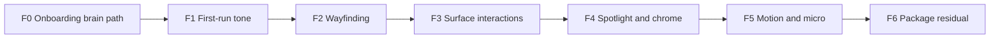

# Polish & Package — 0.6 felt polish

> **Status:** Active (2026-07) — rewritten for the 0.6.0 train  
> **Audience:** Operators who already have a working workshop  
> **Thesis:** Capability exposure is largely **done**. The gap is **felt quality** — language, wayfinding, micro-interactions, and first-run restraint — so a lost soul can find their place without the app oversharing intimacy on day one.  
> **Supersedes:** [archive/polish-and-package-plan-capability-era.md](archive/polish-and-package-plan-capability-era.md) (P0–P7 “expose the engine” era — mostly shipped)

---

## Reality check (why the old plan is obsolete)

The capability-era plan assumed Home still needed to *surface* vault, identity, workshop, attachments, health, share/export. On the **0.6.0** train those surfaces exist:

| Old theme | 0.6 reality |
|-----------|-------------|
| Trust / sidecar | Ensure-on-launch + resume recover + health chip + packaged runbook |
| First-run / teach / continuity | Wizard, Profiles, Context, Presence shipped |
| Workshop exposure | W0–W6 Scripts Workbench / Automations / Capabilities |
| App affordances | Attachments, menus, share, transcript, profile backup |
| Dynamic / mesh / shared | Separate 0.6 pillars — shipped or cut-ready |

What remains is not “add the feature” — it is **tone, friction, and motion**.

---

## North star

> A stranger can download Medousa, get a brain without being bounced to Settings, land in Chat/Library without embarrassment, and discover Scripts/Settings/Spotlight without reading a manifesto.  
> The app is warm **after** trust is earned — not on the first screen.

---

## Principles

1. **Restraint before intimacy** — no “we / she / partner / matcha” until the operator has chosen closeness (Profiles teach, later sessions).
2. **Never trap onboarding** — downloads and package installs run without blocking Ready; Skip always works.
3. **Do the work in place** — wizard installs Offline brain + starts model download; “Open Settings → Packages” is a fallback, not the happy path.
4. **Lost-soul wayfinding** — empty states, Presence, Spotlight, and rail labels answer “where am I?” in plain language.
5. **Polish the places people live** — Chat, Vault/Library, Scripts, Settings — micro-interactions and animations with intent, not noise.
6. **Ship vertical slices** — each F-phase has a user-visible “feels better” moment.

---

## Phase map (0.6 felt polish)

```mermaid
flowchart LR
    F0[F0 Onboarding brain path]
    F1[F1 First-run tone]
    F2[F2 Wayfinding]
    F3[F3 Surface interactions]
    F4[F4 Spotlight and chrome]
    F5[F5 Motion and micro]
    F6[F6 Package residual]

    F0 --> F1 --> F2
    F2 --> F3 --> F4 --> F5
    F5 --> F6
```

| Phase | Theme | Operator outcome |
|-------|--------|------------------|
| **F0** | Onboarding brain path | “It downloads for me; I can keep going.” |
| **F1** | First-run tone | “Helpful, not presumptuous.” |
| **F2** | Wayfinding | “I know where Chat / Notes / Scripts / Settings live.” |
| **F3** | Surface interactions | Chat, Vault, Scripts, Settings feel intentional. |
| **F4** | Spotlight + chrome | Spotlight finds the right thing; chrome doesn’t fight you. |
| **F5** | Motion + micro | Presence from motion; no fidget noise. |
| **F6** | Package residual | Signed updates / Iroh smoke only if still open — not the main story. |

---

## F0 — Onboarding brain path (non-blocking download)

**Status:** ✅ Done (2026-07)

**Goal:** Offline / recommended brain setup never says “go to Settings” as the primary path, and never traps Continue on a long download.

| ID | Deliverable | Acceptance | Status |
|----|-------------|------------|--------|
| F0.1 | In-wizard **install Offline brain** when `!engineAvailable` | Calls package install API; progress in wizard; no Settings bounce as happy path | ✅ |
| F0.2 | **Background model download** | Selecting recommended model starts download; Continue / Skip / Ready remain available | ✅ |
| F0.3 | Progress without trap | Ready (or discreet chip) shows download/load status; failure offers retry without trapping | ✅ |
| F0.4 | Copy pass on brain step | “Install & download” language; Settings Packages only as Advanced/fallback | ✅ |

**Code anchors:** `WizardWelcomeScreen.svelte`, `packagesApi.ts`, `localInferenceApi.ts` (`ensureLocalModelReady`), `wizard.svelte.ts`, `WizardCompletionScreen.svelte`.

**Exit:** Clean machine → Recommended path → brain installs + weights download → operator can reach Ready without opening Settings.

---

## F1 — First-run tone (earn intimacy)

**Status:** ✅ Profiles teach slice done (2026-07) — wizard ownership + Presence “we” **kept** by product decision

**Goal:** Day-one Profiles teach copy is identity + preferences — not invasive intimacy fishing.

| ID | Deliverable | Acceptance | Status |
|----|-------------|------------|--------|
| F1.1 | Retire overly familiar teach examples | No “Mario is my partner” / “I prefer matcha” as first teach hints | ✅ |
| F1.2 | Neutral placeholders | Add-person / teach placeholders stay generic (name, role, preference) | ✅ |
| F1.3 | Wizard restraint | Soften “This feels right”, “The desk is yours”, over-familiar completion lines | ⏸ **kept** — ownership voice is intentional |
| F1.4 | Presence empty state | Replace “What are we doing…?” with invitation that doesn’t assume “we” yet | ⏸ **kept** — collaborative “we” is intentional |
| F1.5 | Profiles / Context “she” pass | Prefer Medousa / you language on first surfaces; keep warmth where relationship is chosen | ⬜ later (teach/success flash already neutralized) |

**Code anchors:** `ProfilesTeachComposer.svelte`, `ProfilesAddPersonSheet.svelte` (this slice).

**Exit (this slice):** Teach / add-person examples read as identity + prefs without oversharing pressure.

---

## F2 — Wayfinding (lost soul finds a place)

**Status:** ✅ Bindings discoverability done (2026-07) — empty-state UI wayfinding next

**Goal (this round):** One discoverable keyboard-shortcuts reference that matches real binds; light conflict hygiene. **Next round:** empty states + surface reordering.

| ID | Deliverable | Acceptance | Status |
|----|-------------|------------|--------|
| F2.0 | **Keyboard shortcuts catalog + sheet** | `keyboardShortcutsCatalog.ts`; `Ctrl+; ?` / Spotlight / Basement open multi-section sheet; labels via `formatShortcut` | ✅ |
| F2.0b | Hotkey conflict hygiene | Skip zoom / toolbar summon on editable targets; Ctrl+B still global; unit + catalog snapshot tests | ✅ |
| F2.1 | Chat empty / Presence | One clear next action (type, or open Notes) | ⬜ next |
| F2.2 | Vault / Library empty | Bring files / start a note — no garage poetry that confuses | ⬜ |
| F2.3 | Scripts / Automations empty | What this surface is + one CTA | ⬜ |
| F2.4 | Settings IA labels | Plain nouns; Advanced stays advanced | ⬜ |
| F2.5 | Mobile More hub | Destinations describe place, not intimacy thesis | ⬜ |

**Exit (this round):** Lost souls can answer “what can I press?” in one place; binds match handlers.

**Exit (full F2):** New user can name Chat, Notes, Scripts, Settings without hunting.

---

## F3 — Surface interactions (Chat, Vault, Scripts, Settings)

**Goal:** Daily paths feel deliberate — focus, selection, menus, save/status, handoff.

| ID | Deliverable | Acceptance |
|----|-------------|------------|
| F3.1 | Chat | Composer, turn actions, permission/budget bars, ambient status |
| F3.2 | Vault / Library | Editor menus, save whisper, context menu, workshop fab coherence |
| F3.3 | Scripts Workbench | Tabs, run feedback, library ↔ flow links readable |
| F3.4 | Settings | Basement health, Packages, Diagnostics — calm density |

Burn down known friction as discovered; prefer small PRs per surface.

---

## F4 — Spotlight and shell chrome

**Goal:** Command Spotlight and shell chrome are reliable discovery, not a second Settings maze.

| ID | Deliverable | Acceptance |
|----|-------------|------------|
| F4.1 | Spotlight query relevance | Notes / go / export / settings hits ranked sanely |
| F4.2 | Spotlight copy | Labels match F1–F2 tone |
| F4.3 | Keyboard / focus | Open, run, escape; no stuck busy states |
| F4.4 | Shell chrome | Rail, tabs, drawers don’t steal focus mid-turn |

**Code anchors:** `CommandSpotlight.svelte`, `commands/registry.ts`, shell layout stores.

---

## F5 — Motion and micro-interactions

**Goal:** 2–3 intentional motions per primary surface; reduce decorative noise.

| ID | Deliverable | Acceptance |
|----|-------------|------------|
| F5.1 | Presence / dock | Purposeful enter/dock; no snap cancel |
| F5.2 | Chat stream | Content reveal and status whispers feel continuous |
| F5.3 | Vault / Scripts | Save, tab switch, panel open — short and readable |
| F5.4 | Reduced-motion | Respect `prefers-reduced-motion` |

---

## F6 — Package residual (optional track)

Not the main 0.6 polish story. Keep only if still product-blocking:

| ID | Note |
|----|------|
| F6.1 | Signed desktop CI / in-app updates — [desktop-distribution-plan.md](desktop-distribution-plan.md) |
| F6.2 | Iroh smoke (old P0.4) — [iroh-p2p-pairing-plan.md](iroh-p2p-pairing-plan.md) |
| F6.3 | README / store screenshots if marketing still overclaims |

---

## Suggested order

1. ~~**F0** — brain install + non-blocking download~~ ✅  
2. ~~**F1** — Profiles teach examples (ownership / “we” kept)~~ ✅  
3. ~~**F2** — bindings discoverability~~ ✅ → next: empty-state wayfinding  
4. **F3 + F4** — surface + Spotlight interactions (parallel)  
5. **F5** — motion pass once interactions settle  
6. **F6** — only as needed for ship

---

## Explicitly not this epic

| Item | Why |
|------|-----|
| Rebuilding ACP / MCP / mesh / shared mode | Separate 0.6 pillars — largely shipped |
| Re-exposing vault / identity / workshop as “new” features | Already in product |
| Capability-era P0–P7 checklist | Archived — [polish-and-package-plan-capability-era.md](archive/polish-and-package-plan-capability-era.md) |
| Cloud sync | Out of thesis |

---

## Checklist

### F0 Onboarding brain
- [ ] F0.1 In-wizard Offline brain install
- [ ] F0.2 Background model download
- [ ] F0.3 Non-blocking Ready progress
- [ ] F0.4 Brain-step copy

### F1 First-run tone
- [ ] F1.1 Teach examples
- [ ] F1.2 Placeholders
- [ ] F1.3 Wizard completion / personalize
- [ ] F1.4 Presence sublines
- [ ] F1.5 Profiles / Context restraint pass

### F2 Wayfinding
- [ ] F2.1–F2.5 Empty states + labels

### F3 Surfaces
- [ ] F3.1 Chat
- [ ] F3.2 Vault
- [ ] F3.3 Scripts
- [ ] F3.4 Settings

### F4 Spotlight
- [ ] F4.1–F4.4 Relevance, copy, focus, chrome

### F5 Motion
- [ ] F5.1–F5.4 Intentional motion + reduced-motion

### F6 Residual
- [ ] F6.x only if ship-blocking

---

## Success metrics (qualitative)

- First-run tester never says “it told me to go to Settings to get a brain.”
- First-run tester never winces at teach examples or Presence “we.”
- Lost-soul test: from cold open, find Chat, write a note, open Scripts, open Settings in under two minutes without help.
- Spotlight finds export / notes / settings without memorizing Advanced.
