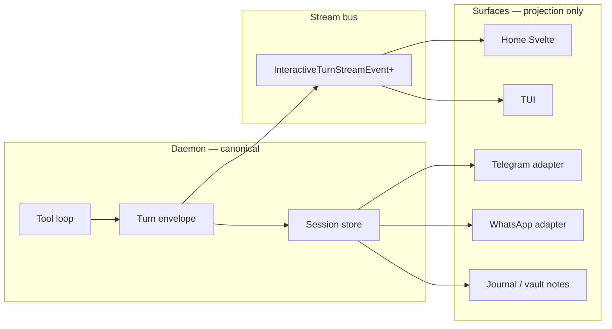

# Presentation layer & turn envelope — plan

> **Status:** Plan — design before implementation  
> **Scope:** Home first (tool UI + markdown); daemon contract stays channel-agnostic  
> **Related:** [interaction-and-state-model.md](interaction-and-state-model.md), [medousa-home-main-workspace-plan.md](medousa-home-main-workspace-plan.md), [outbox-channel-delivery-roadmap.md](outbox-channel-delivery-roadmap.md), [async-chat-unlock-plan.md](async-chat-unlock-plan.md)

---

## North star

**The daemon emits structured turn truth once. Each surface projects it for its capabilities.**

Telegram gets plain text and truncated tool footers. Home gets Obsidian-grade markdown, tool chips, and (later) artifact previews. The TUI gets a timeline + markdown pane. None of them should force the canonical transcript to look like a Telegram message.



---

## What hurts today (as-built)

| Issue | Where | Effect |
|-------|--------|--------|
| **Tool footer baked into answer body** | `TurnScratchpad::summarize_for_user_footer` → appended in `turn_orchestrator` before `agent_response` | Every surface gets `_Tools this turn: …_` markdown in `ConversationTurn.content` — great for Telegram, wrong for Home/TUI |
| **Lightweight markdown parser** | `apps/medousa-home/src/lib/utils/markdownPreview.ts` | Custom subset: headings, lists, fences, bold/italic, wikilinks. Missing tables, links, blockquotes, nested lists, task lists, horizontal rules, strikethrough — feels unlike Obsidian |
| **Tool metadata underused** | SSE `tool_names`; session `ConversationTurn.tool_names` | Home shows a mono `tool · tool · tool` line; rich tool events (`tool_invoked`, `tool_payload`) collapse to status strings on the wire |
| **Structured receipts dropped at sink** | `AgentStreamSink::tool_payload(..., ArtifactReceiptMeta)` | TUI stores artifacts in observability; Home SSE publishes `tool_payload={name}` only |
| **Channel formatting at wrong layer (partially)** | Telegram `MarkdownV2` escape is correctly at **delivery** (`channel_delivery.rs`) | Good pattern — but canonical content is already pre-dumbed by footers before delivery |
| **Journal uses same preview path** | Vault notes + ask journal bodies | Same markdown gaps as chat |

**Important nuance:** Telegram/WhatsApp adapters mostly receive **plain** `conversation` text via ingest delivery — they are not the main sanitizer. The **orchestrator footer** is the cross-surface leak.

---

## Target model — three layers

### 1. Canonical turn envelope (daemon-owned)

Persisted and streamed as the source of truth. Evolve incrementally; do not big-bang replace `ConversationTurn`.

```rust
// Conceptual — names TBD
pub struct TurnEnvelope {
    pub turn_id: String,
    pub role: TurnRole,
    pub parts: Vec<TurnPart>,      // ordered timeline
    pub tool_names: Vec<String>,   // denormalized index (keep for compat)
    pub answer_state: Option<String>,
    pub emitted_at: DateTime<Utc>,
}

pub enum TurnPart {
    Text { markdown: String },
    Reasoning { markdown: String },
    ToolRun {
        run_id: String,
        tool_name: String,
        status: ToolRunStatus,       // started | succeeded | failed
        input_summary: String,
        output_summary: Option<String>,
        artifact_refs: Vec<ArtifactRef>,
        started_at: DateTime<Utc>,
        finished_at: Option<DateTime<Utc>>,
    },
    Handoff {
        kind: HandoffKind,           // worker_ack | budget_approval
        text: String,
        work_id: Option<String>,
    },
    AttachmentRef {
        artifact_id: String,
        mime: String,
        label: String,
        byte_size: Option<u64>,
    },
    // Future — reserved shape, not implemented yet
    UserMedia { ingest_attachment_id: String, kind: String },
    GeneratedImage { artifact_id: String, prompt_excerpt: Option<String> },
}
```

**Migration strategy:** v1 session rows stay `{ content, tool_names }`. Daemon **also** writes `parts` when available. Surfaces prefer `parts`; fall back to legacy heuristics.

### 2. Stream events (incremental bus)

Extend `InteractiveTurnStreamEvent` additively (serde defaults). Today:

| Field | Used by Home |
|-------|----------------|
| `content_delta`, `final_text` | ✅ body |
| `reasoning_delta` | ✅ scratch |
| `tool_names` | ✅ flat list |
| `phase`, `message` | ✅ status whisper |
| `work_id`, `budget_request_id` | ✅ Tier 2–3 |

**Add (proposal):**

| `event_type` | Payload | Purpose |
|--------------|---------|---------|
| `tool_started` | `tool_run_id`, `tool_name`, `input_summary` | Chip → spinner |
| `tool_finished` | `tool_run_id`, `status`, `output_summary`, `artifact_refs[]` | Chip → done + expand |
| `artifact_stored` | `artifact_id`, `mime`, `label`, `associations` | Future blob/image/card link |

Keep emitting `tool_names` on terminal events for backward compatibility.

### 3. Surface presentation profiles

Each turn request already carries `TurnSurfaceContext` (`channel_surface: home-desktop | tui | telegram | …`). Use it to select a **presentation profile** at orchestration + delivery time.

```rust
pub struct PresentationProfile {
    pub markdown_in_body: MarkdownMode,     // none | full (canonical)
    pub tools_in_body: ToolsInBodyMode,     // omit | footer_plain | footer_markdown
    pub tools_structured: bool,             // emit ToolRun parts / SSE
    pub reasoning_visible: bool,
    pub max_body_chars: Option<usize>,
}

// Examples
home_desktop()  -> { full, omit, true,  true,  None }
tui()           -> { full, omit, true,  true,  None }
telegram()      -> { full, footer_plain, false, false, Some(4000) }
whatsapp()      -> { full, footer_plain, false, false, Some(4000) }
```

**Rule:** `tools_in_body = omit` for rich surfaces. `tools_in_body = footer_plain` only when `!tools_structured` (legacy path).

Channel adapters that read session history apply **`format_turn_for_channel(envelope, profile)`** at dispatch — not at write time.

---

## Home-specific UX (Phase 2 target)

### Tool chips

Per assistant message (or per turn timeline):

```
┌─────────────────────────────────────────────┐
│  cognition_capability_search   ✓   0.4s     │
│  cognition_mcp_invoke          ✓   1.2s     │
│  cognition_spawn_turn_worker   ↗ delegated  │
└─────────────────────────────────────────────┘
```

- Collapsed: icon + formatted name + status dot  
- Expanded: input/output summaries, artifact links (“Open receipt”, “View in workspace”)  
- Worker handoff chip links to workspace card (`work_id`)  
- Mobile: same chips, smaller typography; expand → bottom sheet (later)

Data source priority: `TurnPart::ToolRun` from stream → fallback `tool_names[]` → hide.

### Markdown (Obsidian-compatible subset)

Replace `markdownPreview.ts` with a spec-driven renderer:

| Feature | Priority | Notes |
|---------|----------|-------|
| CommonMark core | P0 | paragraphs, emphasis, links, code |
| GFM tables | P0 | frequent in agent output |
| Fenced code + language | P0 | already partial |
| Blockquotes | P1 | |
| Nested lists | P1 | |
| Task lists `- [ ]` | P1 | journal + agent checklists |
| Wikilinks `[[note]]` | P0 | vault integration — keep |
| Strikethrough | P2 | |
| Footnotes | P3 | |
| Mermaid | P3 | optional, sandboxed |
| Callouts `> [!note]` | P3 | Obsidian flavor |

**Implementation sketch:** `micromark` + GFM extensions + custom wikilink plugin; sanitize HTML output (`DOMPurify`). Single shared module: `@medousa/markdown` used by **chat**, **journal editor preview**, **CardInspector** excerpts.

**Canonical storage:** always raw markdown in session — never pre-rendered HTML in the ledger.

---

## Future expansions (design hooks now)

These are **not** Phase 1–2 work — but the envelope avoids painting us into a corner.

| Capability | Envelope hook | Home hook | Daemon hook |
|------------|---------------|-----------|-------------|
| **User photo / file intake** | `UserMedia` part on user turn; `IngestAttachment` already in ingest API | Composer attach button → upload → artifact id | Store blob; reference in turn |
| **Generated images** | `GeneratedImage` part + `artifact_id` | Inline thumbnail + lightbox | Tool output → artifact store |
| **CSV / blob artifacts** | `AttachmentRef` with mime | Download chip, “Open in inspector” | Existing `ArtifactReceiptMeta`, workspace associations |
| **Multi-part answers** | Ordered `parts[]` | Timeline UI (handoff + synthesis already two bubbles) | Worker bus synthesis as separate part |
| **Cross-surface continuity** | Same session envelope | Rehydrate from session + workspace | Already Tier 3 pattern |

**Principle:** blobs live in **artifact store**; transcript holds **references** only.

---

## Phased rollout

### P0 — Stop polluting canonical content (daemon, small) ✅

**Goal:** Home/TUI/API turns have clean markdown bodies; Telegram keeps tool visibility via formatter.

1. Add `presentation_profile_for_surface(surface)` helper  
2. Gate `summarize_for_user_footer` — only when profile says `tools_in_body != omit`  
3. Add `format_tools_footer_plain(tool_names)` for channel dispatch path (ingest + ask notify)  
4. Tests: home surface → no footer in content; telegram → footer present at format time  

**Touch:** `presentation.rs`, `turn_orchestrator.rs`, `medousa_daemon.rs` ingest sink  

**Shipped:** Canonical session/SSE bodies are prose-only; external push channels append plain `Tools: …` at dispatch.

---

### P1 — Structured tool stream events (daemon + Home store) ✅

**Goal:** Chips need lifecycle, not just names.

1. Publish `tool_started` / `tool_finished` on `InteractiveTurnStreamEvent`  
2. Include `tool_run_id`, summaries, optional `artifact_refs` from tool loop  
3. Home `ChatMessage.toolRuns` accumulated from SSE; `ToolRunChips` grouped by round  
4. Keep `message.tools` as denormalized fallback  

**Touch:** `tool_stream.rs`, `interactive_turn_runtime.rs`, `medousa_tool_loop.rs`, `chat.svelte.ts`, `ToolRunChips.svelte`

---

### P2 — Home tool UI + markdown engine (Home only) ✅

**Goal:** Operator-grade chat + journal rendering.

1. Shared markdown module (replace `markdownPreview.ts`) ✅  
2. `ToolRunChips.svelte` in `ChatPanel` ✅  
3. Style pass: chip colors by status (running / ok / failed / delegated) ✅  
4. Journal preview uses same renderer ✅  

**Touch:** `MarkdownContent.svelte`, new `ToolRunChips.svelte`, `ChatPanel.svelte`, vault preview if any  

**Risk:** Low–medium. Visual-only; fallback to current mono tool line.

**Shipped:** `$lib/markdown` (marked + DOMPurify + mermaid hydrate), Obsidian callouts/wikilinks/tables/tasks, wired in chat + vault preview.

---

### P3 — Session `parts[]` persistence (daemon) ✅

**Goal:** Survive refresh; enable attachment timeline.

1. Extend `ConversationTurn` with optional `parts: Vec<TurnPart>` ✅  
2. Sink writes parts as turn progresses ✅  
3. Home hydrates from `parts` when present ✅  
4. Export / journal compose from parts ✅  

**Touch:** `session.rs`, `daemon_api` types, Home `mapTurns`  

**Risk:** Medium. Migration: old rows synthesize `Text { markdown: content }` + tool names.

**Shipped:** `turn_parts.rs` accumulator on interactive + ingest sinks; Surreal/file JSON persistence; Home `toolRunsFromParts` on session load; `composeTurnMarkdown` / `compose_turn_markdown` for journal export.

---

### P4 — TUI presentation alignment ✅

Reuse envelope types in `event_reducer` — unify chat tool row with observability receipts. TUI already renders `tool_names` separately and has artifact storage in workers.

**Shipped:** `TurnPartsAccumulator` on TUI turns; `tool_started`/`tool_finished` SSE + local sink; round-grouped tool lines in conversation; handoff badges; session export via `compose_turn_markdown`; observability lines aligned with structured tool events.

---

### P5 — Media & attachments (much later)

Composer intake, image tools, blob inspector — only after P3 envelope is stable.

---

## API evolution rules

1. **Additive fields only** on SSE and session JSON (`#[serde(default)]`)  
2. **Surfaces ignore unknown** `event_type` values  
3. **Never strip structure at the sink** — if `tool_payload` has receipts, stream them  
4. **`TurnSurfaceContext` required** on interactive/turn and turn tickets — default `api` profile if missing  
5. **Journal is a surface** — same markdown engine, different layout  

---

## Open decisions (for you)

1. **Obsidian scope:** tables + wikilinks + task lists + callouts + mermaid in v1 — **confirmed**  
2. **Tool chip default:** grouped by round, clean summary with expand-to-dig — **confirmed**  
3. **P0 timing:** gate footer first, in order — **confirmed, shipped**  
4. **Session migration:** `parts[]` in P3 as planned — **confirmed**  

---

## Suggested first sprint (Home-focused, low debt)

| Step | Effort | Outcome |
|------|--------|---------|
| **P0** footer gating | ~1 day | Clean answer markdown in Home; Telegram unchanged |
| **P1** tool SSE events | ~2 days | Data for chips |
| **P2a** markdown engine swap | ~2 days | Obsidian-like chat + journal |
| **P2b** tool chips UI | ~1–2 days | Visible tooling polish |

Total ~1 week focused work before touching attachments.

---

## Key files (today → tomorrow)

| Concern | Today | Plan target |
|---------|-------|-------------|
| Tool footer in body | `turn_context.rs` `summarize_for_user_footer` | Profile-gated; channel formatter |
| SSE tool signal | `daemon_interactive_turn.rs` `tool_invoked` / `tool_payload` | Structured `tool_*` events |
| Home markdown | `markdownPreview.ts` | Shared spec renderer |
| Home tools UI | `ChatPanel.svelte` mono line | `ToolRunChips.svelte` |
| Surface hint | `TurnSurfaceContext` | `PresentationProfile` lookup |
| Artifacts | `payload_receipt.rs`, TUI workers | `TurnPart::AttachmentRef` + stream |
| Session | `ConversationTurn` | + optional `parts[]` |

---

## Success criteria

- Home chat renders a table, link, and fenced block exactly as written in Obsidian  
- Tool names never appear as markdown footer in Home session history  
- Telegram message still lists tools at the bottom (via formatter, not ledger pollution)  
- Refresh restores tool chip state from session or SSE reattach  
- Adding `AttachmentRef` later does not require rewriting chat store  
