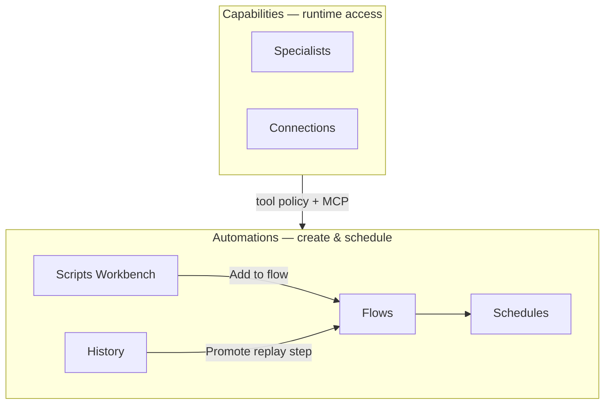

# Scripts Workbench — product & IA plan

> **Status:** Active (2026-06) — W6.0–W6.5 shipped in Home UI  
> **Audience:** Product + Home UI  
> **Supersedes (partially):** [workshop-and-automations-plan.md](workshop-and-automations-plan.md) § Workshop → Modules tab, Grapheme editor placement, and “Skills” as catch-all configure surface  
> **Builds on:** W5 Grapheme depth (editor, LSP, script library APIs, flow bridges — shipped)

---

## Why this doc exists

Home **W5–W5.7** shipped a capable Grapheme stack (editor, recipes, flows, history promotion) but the **information architecture** still mixes three different jobs:

| Job | What the user is doing | Current UI mistake |
|-----|------------------------|-------------------|
| **Learn** | “What can Grapheme do?” | Called “Modules”; mixed with WASM imports and script library |
| **Author** | “Let me write and run code” | Editor buried under Workshop tabs; run output in side pane |
| **Deploy** | “Make this run on a rhythm or pipeline” | Correctly under Automations, but disconnected from authoring |

Normie-friendly copy and recipe cards did not fix this — **wrong mental model**. This plan reframes surfaces around *purpose*, not engine nouns.

---

## Decided mental models

### Modules (catalog — not a top-level product area)

**Purpose:** Help someone unfamiliar with Grapheme learn what they can do and what works.

- Reference + discovery + insert-into-editor
- Native Grapheme module ops, manifests, examples, effects
- Lives **inside** the Scripts workbench (left rail), not as a sibling to Schedules

**Not:** automation, scheduling, or “settings.”

### Scripts Workbench (authoring)

**Purpose:** Write scripts, test runs, and do technical work without product chrome getting in the way.

- Primary surface feels like an **editor** (Cursor / VS Code mental model)
- Run output in a **bottom console**, not a decorative side card
- Optional **scoped Medousa chat** on the right — collaborator while you work (same pattern as Vault chat: environment tool, not main Chat)

**Naming:** Tab label **Scripts**; internal concept **Workbench** where we need a hint (“here is where you write code”).

### Script library (persistence)

**Purpose:** Save scripts you reuse, revisit, or co-edit with Medousa when building automations.

- Saved scripts list in the **left rail** of the Workbench
- Distinct from **Flows** (orchestration) and **History** (chat tool replay)

**Rule (artifact vs deployment):**

| Artifact | Meaning |
|----------|---------|
| **Script** | Saved, reusable Grapheme source (library entry) |
| **Flow step** | Inline source *or* reference to a saved script (target state) |
| **Flow** | Ordered steps + run/schedule metadata |
| **Schedule** | Cron/delivery binding on a recurring job or flow |

“Add to flow” from the Workbench = bridge from **authoring** → **Flows** tab, not magic duplication of concepts.

### Automations (deployment & operations)

**Purpose:** Create and schedule things that run on their own.

| Tab | Question it answers |
|-----|---------------------|
| **Scripts** | What did I write? (Workbench — see below) |
| **Flows** | How do steps chain together? |
| **Schedules** | When does it run? Where do results go? |
| **History** | What did Medousa already do in chat that I might promote to a flow? |

**History stays here** — chat tool replay is operational memory, not script authoring. Script run output + saved scripts cover script-side history; no change needed there.

### Capabilities (renamed from Workshop)

**Purpose:** Runtime **settings** for what Medousa and automations can access at all times — not where you write code.

| Keep | Remove / absorb elsewhere |
|------|---------------------------|
| **Connections** (MCP + capability map) | Grapheme **Modules** tab → Workbench left rail |
| **Specialists** (manuscripts, tool policy) | **Skills palette** / redundant Grapheme browse → Workbench or specialist detail |
| | Script library browse → Workbench left rail |
| | Grapheme editor → Automations → Scripts Workbench |

Capabilities answers: *“What is this workshop allowed to do, and who (specialist) does it?”*

Automations answers: *“What did I build, and when does it run?”*

---

## Scripts Workbench — desktop layout (decided)

Reference: **Cursor / VS Code** three-panel shell. Left and right **retract** so the center editor can go full width for manual work.

```
┌─────────────────────────────────────────────────────────────────┐
│  Automations › Scripts                                          │
├──────────┬──────────────────────────────────────┬───────────────┤
│  LEFT    │  CENTER                              │  RIGHT        │
│  (rail)  │                                      │  (collapsible)│
│          │  Editor (CodeMirror + LSP)           │               │
│  Icons:  │                                      │  Script-scoped│
│  · Saved │──────────────────────────────────────│  Medousa chat │
│    scripts│  CONSOLE — run / compile output     │  (Vault pattern)│
│  · Modules│                                      │               │
│    (native)│                                     │               │
│  · WASM   │                                      │               │
│    extensions│                                   │               │
└──────────┴──────────────────────────────────────┴───────────────┘
```

### Left rail sections

| Section | Content | Notes |
|---------|---------|-------|
| **Saved scripts** | Script library — open, new, rename, delete | File-explorer mental model |
| **Modules** | Native Grapheme catalog — search, manifest, ops, insert | Learner + lookup; **not** mixed with WASM |
| **WASM extensions** | User-dropped modules (`.dll` mental model) | Separate icon/section; dev-supplied runtime extensions |

### Center

| Zone | Behavior |
|------|----------|
| **Editor** | Always the hero when a script is open; empty state = welcome / starter recipes (optional, not full-page takeover) |
| **Console** | Run + compile output, errors, diagnostics tail — bottom dock like Terminal panel |

### Right panel — script-scoped chat

Same product pattern as **Vault chat**:

- Main **Chat** = conversation with Medousa driving
- **Script chat** = collaborator while you edit — context pinned to current script body, selection, last run, allowed modules, diagnostics
- Collapsible; editor-only mode when retracted

---

## WASM vs native modules (decided)

| | Native modules | WASM extensions |
|--|----------------|-----------------|
| **Origin** | Grapheme stdlib / shipped catalog | Dev drops module into runtime |
| **UI section** | Modules (left rail) | WASM extensions (left rail) |
| **User mental model** | “What the language can do” | “Plugins I installed” |

Do not merge lists. Today’s UI conflates native `module_id` entries with WASM paths — split is a **P0 UX fix** for the Workbench.

---

## Navigation (target IA)



**Top-level nav (desktop):**

| Item | Role |
|------|------|
| Chat | Main conversation |
| Work | Work cards |
| Vault | Files + Vault chat |
| **Automations** | Scripts · Flows · Schedules · History |
| **Capabilities** | Specialists · Connections |

Retire **Workshop** label. Retire **Modules** as a top-level or Capabilities tab.

---

## Cross-links (preserved from W5.7)

| From | To | Action |
|------|-----|--------|
| Workbench | Flows | Add to flow (prefill grapheme step) |
| Workbench left rail | Editor | Insert module op / snippet |
| History | Flows | Promote tool run → flow draft |
| Flows | Schedules | Attach cron + delivery |
| Specialist (Capabilities) | Schedules | Schedule with this specialist |
| Flow step picker | Workbench Modules rail | Pick op or saved script (future: script ref) |

---

## Guidance & normie path (without forced chrome)

Spatial flow replaces banner-heavy onboarding:

1. Open **Automations → Scripts**
2. Left: starter recipe or module → inserts into editor
3. Center: edit → **Run** → console shows output
4. Right (optional): ask Medousa to fix/explain
5. **Add to flow** → **Flows** tab → **Schedule**

Existing **Workshop guidance** setting (journey, recipes, friendly summaries) can apply lightly inside Workbench empty states — not as a permanent header strip.

---

## Mobile

**Deferred** until desktop Workbench is nailed.

Expect: script list → full-screen editor → bottom sheet for modules/console/chat — not a three-column layout.

---

## Implementation phases (proposed)

| Phase | Theme | Deliverables |
|-------|--------|--------------|
| **W6.0** | IA rename | Workshop → Capabilities (Specialists + Connections only); Automations gains **Scripts** tab shell |
| **W6.1** | Workbench shell | Three-panel layout, collapsible rails, saved scripts in left rail |
| **W6.2** | Editor + console | Move CodeMirror to center; run/compile output to bottom dock |
| **W6.3** | Module rail | Native catalog + WASM split; insert/snippet from left |
| **W6.4** | Script chat | Scoped Medousa panel (Vault chat pattern) |
| **W6.5** | Bridge polish | Add to flow, script ref in flow steps (if API ready), remove redundant Capabilities Grapheme UI |

**Out of scope for W6:** Mobile Workbench, Stasis dashboard changes, new runtime APIs (prefer reuse W5 endpoints).

---

## Open questions

| # | Question | Lean |
|---|----------|------|
| 1 | Flow step references saved script by `id` or always inline body? | Both — inline for v1 bridge; `script_id` ref when API supports |
| 2 | Script chat = new session type or scoped overlay on existing chat store? | Scoped overlay / sub-session (match Vault) |
| 3 | Capabilities **Skills** tab — delete or fold into specialist editor? | Fold into specialist detail + Connections |
| 4 | Recipes / starters — left rail section or empty editor only? | Empty editor + optional “Starters” in left rail |

---

## Related docs

- [workshop-and-automations-plan.md](workshop-and-automations-plan.md) — original W0–W5 plan (partially superseded by this doc)
- [ROADMAP.md](ROADMAP.md) — W6 tracking
- [interaction-and-state-model.md](interaction-and-state-model.md) — who owns script vs flow state
- [vault-editing-and-structured-notes-plan.md](vault-editing-and-structured-notes-plan.md) — Vault chat pattern reference

---

## Changelog

| Date | Note |
|------|------|
| 2026-06 | W6.0–W6.5 shipped — Capabilities rename, Scripts workbench IDE, script chat, flow library picker |
