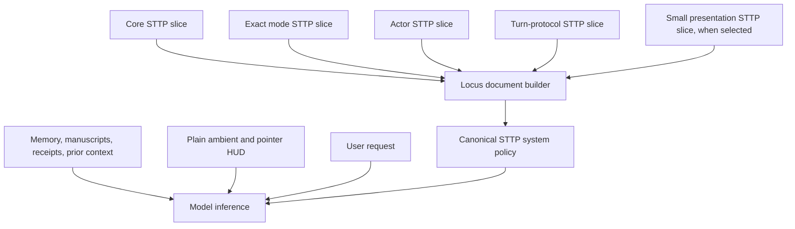
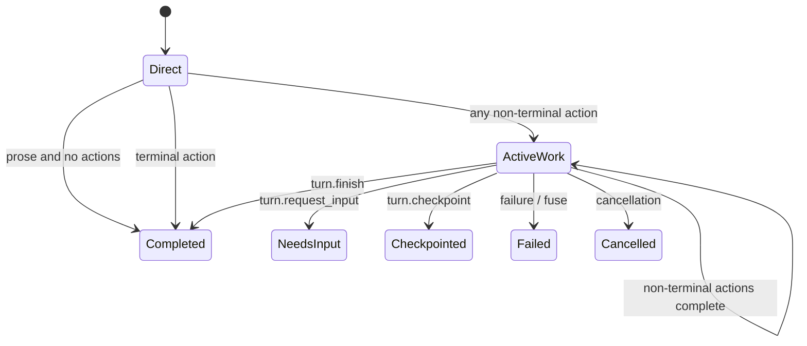

# STTP-native prompt and chronological turn runtime

> **Status:** Implemented (Phases 1–6 shipped 2026-08-25)
>
> **Scope:** System-prompt composition, agent modes, foreground tool-loop
> completion, streamed turn events, durable turn parts, replay, Medousa, and TUI
> presentation
>
> **Related:** [Agent runtime modes](agent-runtime-modes-plan.md),
> [Turn runtime and lanes](turn-runtime-and-lanes.md),
> [Bounded durable turn stream v2](hardening/03-turn-stream-v2.md),
> [Typed tool contracts](typed-tool-contract-runtime-plan.md), and
> [Worker continuity](worker-continuity-plan.md)
>
> **Supersedes as a target design:** PackHold and prose-completion guidance in
> [Turn loop — prose terminates](archive/turn-prose-terminates-plan.md), now
> retained only as implementation history.

## Decision

Medousa will use:

1. one small, canonical, **STTP-native policy document** compiled from a core
   slice and the exact slices selected for the turn;
2. plain, non-STTP HUD blocks for ambient state, pointers, and live runtime
   facts;
3. a chronological foreground loop in which every model-authored prose segment
   is delivered, persisted, and rendered where it occurred; and
4. explicit terminal actions after work begins instead of prose heuristics,
   PackHold, draft replacement, or a two-response completion rule.

The target visible shape is:

```text
user request

assistant prose
tool group
assistant prose
tool group
assistant prose
```

Prose is an answer surface, not scratch space. Tool receipts are part of the
same ordered turn, not a footer appended after a flattened final answer.

This is a replacement of the prompt and presentation contracts, not a rewrite
of provider inference or ordinary tool execution. The model-round executor,
tool registry, tool invocation machinery, bounded stream owner, and durable
turn spine remain the foundation.

## Product invariants

1. A model may answer a user directly and end its turn in one inference.
2. Once the model invokes a non-terminal action, the turn is an active work
   loop and prose alone no longer implies completion.
3. Every non-empty model-authored prose segment is delivered immediately in
   its original position. The runtime does not hold, erase, demote, merge, or
   replace it.
4. Tool starts and finishes remain visible in the position where they occur.
5. An active loop ends through a typed terminal outcome, cancellation, failure,
   or a bounded runtime fuse—not by classifying prose wording.
6. Live streaming, replay, persisted history, Medousa, and the TUI render the
   same semantic ordering.
7. `ConversationTurn.content` remains a compatibility/search projection;
   ordered `TurnPart` values are the presentation authority.
8. General and Coder are modes of one collaborator, not personas. A mode
   selects behavior and context; it does not inherit another mode's policy by
   string concatenation.
9. Workshop remains an internal execution actor in the first implementation.
   General may use environment and application tools directly.
10. STTP expresses stable model policy. Dynamic state and pointers remain a
    compact HUD and cannot redefine policy.

## Why STTP is the policy language

STTP is not a container for conventional system-prompt prose. Its purpose is
to exploit how language models reconstruct rich concepts from compact language
when relationships, order, salience, and anchors are clear.

The optimization target is:

> Maximum semantic density at minimum attention cost.

Shorter is useful only when the omitted meaning is recoverable from structure.
The prompt should contain compact semantic primitives with strong relational
meaning, not unexplained abbreviations or a handbook compressed into one line.

For example, the following is an illustrative semantic sketch, not literal
STTP source:

```text
work: tool_when_needed
prose: deliver_now
prose != terminal_after_work
terminal: explicit
```

Those primitives activate tool autonomy, immediate communication, loop
continuation, and explicit completion without repeatedly narrating their
implications.

### STTP authoring rules

1. **One concept, one owner.** A semantic invariant is defined in one slice.
   Other slices may relate to it but do not restate it.
2. **Structure before prose.** No sentence enters STTP if a field,
   relationship, weight, ordering, anchor, or known construct can carry the
   same meaning.
3. **Concepts over procedures.** Encode the smallest well-known construct from
   which the model can infer the procedure.
4. **Order is meaningful.** The model should encounter policy in this
   conceptual sequence:

   ```text
   identity
     -> relationship and authority
       -> truth and evidence
         -> action and tools
           -> turn physics
             -> expression
   ```

5. **Weights express precedence.** They are not decoration and do not replace
   a clear structural relationship.
6. **Anchors are stable retrieval points.** The same concept keeps the same
   name and symbol across modes. Synonym churn is avoided.
7. **Modes are deltas.** A mode slice contains only what differs from core.
8. **No encyclopedias.** Tool catalogs, rendering catalogs, schemas, and
   provider documentation live with their typed interfaces. STTP states the
   posture for using them.
9. **Compactness remains legible.** If structure does not make omitted meaning
   reliably recoverable, add the smallest clarifying relation—not a paragraph.
10. **Validate semantics as well as syntax.** Canonical parsing is necessary;
    prompt snapshots and behavioral evals determine whether the intended
    constructs unfold correctly.

### Prompt review questions

Every slice review asks:

- Can this field be removed without losing intended behavior?
- Does this slice repeat core or another selected slice?
- Is prose explaining something the structure already communicates?
- Does field order perform useful semantic work?
- Does every token establish identity, precedence, relationship, state, or
  action?
- Can the target models consistently unwind the compact representation into
  the intended behavior?
- Did a dynamic fact or untrusted context accidentally become policy?

Token counts are recorded per slice and for the compiled prompt. Initial work
does not lock an arbitrary hard token ceiling; Workshop and tool-schema sizing
will be decided from measured compiled prompts and model behavior after the
first implementation.

## Prompt planes

Prompt assembly has three planes with distinct authority:



### Policy plane

The system policy is one canonical STTP document. It is built from typed,
independently testable slices with unique top-level namespaces.

Initial slice set:

| Slice | Responsibility |
|---|---|
| `core` | Identity, principal relationship, authority boundaries, evidence integrity, tool autonomy, collaborator voice |
| `mode.general` | Broad collaboration and direct environment/application interaction |
| `mode.coder.setup` | Project selection, Forge binding, setup boundaries |
| `mode.coder.work` | Repository evidence, smallest-safe-change cycle, verification and residual-risk posture |
| `actor.host` | Principal-facing ownership and continuity |
| `actor.worker` | Bounded delegated scope, receipt integrity, return-to-host behavior |
| `turn.protocol` | Direct-answer versus active-work completion physics |
| `presentation` | Small rule for using structured presentation when it materially helps |

The host compiler selects exactly one mode phase and one actor. A worker may
retain the relevant mode slice when its task depends on that world model, but
it receives `actor.worker`, not a second full persona prompt.

Coder is never implemented as General plus Coder. Example compositions are:

```text
General host = core + mode.general + actor.host + turn.protocol
Coder setup  = core + mode.coder.setup + actor.host + turn.protocol
Coder work   = core + mode.coder.work + actor.host + turn.protocol
Coder worker = core + mode.coder.work + actor.worker + turn.protocol
```

The resolved mode snapshot is immutable for the turn and is selected before
policy compilation.

### Locus compilation contract

The implementation upgrades to:

- `locus-core-rs 0.5.1`;
- `locus-sdk 0.3.1`; and
- `stasis-rs 0.9.4`.

All direct pins, the portable runtime, lockfiles, and the iOS dependency probe
move together.

The compiler follows the new composition API:

```rust
let rendered = SttpDocumentBuilder::new(metadata)
    .merge(core_slice)?
    .merge(mode_slice)?
    .merge(actor_slice)?
    .merge(turn_protocol_slice)?
    .build()?
    .render_canonical();
```

Slice merges are shallow at the top level. Unique namespaces are therefore a
design requirement, and duplicate rejection is a policy-collision detector.
Nested values remain owned by their slice.

The rendered document must pass Locus tree-sitter validation and strict typed
IR round-trip validation. Medousa may add typed semantic checks before build,
but it will not maintain a parallel string validator or require obsolete
schema-1.0 / wrapper formatting.

### Evidence plane

Conversation history, retrieved memory, manuscripts, worker receipts, tool
receipts, and attached context are evidence. They may use typed STTP nodes when
provenance, confidence, temporality, or relationships benefit from STTP, but
they are not merged into the authoritative system-policy document.

Evidence has bounded size and explicit provenance. It cannot override core,
mode, actor, or turn-protocol policy.

### HUD plane

The HUD is compact, plain, non-STTP runtime context:

- current time and channel;
- connected workshop/client identity and capabilities;
- active workspace, pointer, selection, and canvas state;
- active workers and pending approvals;
- the action families actually visible this turn;
- current loop state and remaining round/budget bounds; and
- provenance-bearing resource pointers.

The HUD reports facts. It does not contain voice, routing, completion, tool-use,
or presentation policy. Canvas recipes and behavioral instructions move to
typed interfaces or STTP policy as appropriate.

The user request remains plain user-authored content.

## Modes, Workshop, and tools

### Modes

The initial user-facing modes remain:

- **General** — broad collaboration with direct use of available environment
  and application tools; and
- **Coder** — Forge-governed repository work with Setup and Work phases.

A mode changes the collaborator's working model, not its identity.

### Workshop

Workshop remains an internal execution actor/lane in the first migration. It
does not remain as policy geography inherited by General and is not introduced
as a third persona.

A future user-facing Workshop mode is explicitly deferred. If measurements and
product use justify it, its meaning will be hands-on environment/application
collaboration. Its prompt and tool-schema size will be evaluated after the
core migration rather than guessed now.

### Tool surface

Authorized action families are visible at turn start. Discovery becomes
introspection and dynamic capability lookup, not a hidden unlock ritual.

- Provider tool schemas remain typed tool interfaces, not prompt prose.
- The HUD lists the surface actually available to the turn.
- Capability search locates dynamic or specialized actions.
- A mode snapshot may deny or constrain tools, but policy and availability do
  not drift during a live turn.
- Large schema sizing and selective schema projection are a measured follow-up,
  not a blocker for the chronological/STTP migration.

## Foreground turn state machine

### States



### Direct state

Before any non-terminal action has been invoked:

- non-empty prose with no actions is committed and ends the turn;
- a terminal action ends with its typed outcome; and
- any non-terminal action enters `ActiveWork`.

This makes greetings, ordinary questions, and simple answers single-inference
turns.

### Active-work state

After a non-terminal action:

- every prose segment is committed and delivered;
- prose with no action does not end the turn;
- ordinary actions execute and the model receives their receipts;
- the runtime schedules another model round until a typed terminal outcome or
  bounded runtime condition occurs.

The loop does not inspect phrases such as “done,” punctuation, question marks,
or response length to decide completion.

### Terminal actions

`turn.finish` becomes an explicit control action with an optional compatibility
message:

| Model output | Visible result |
|---|---|
| prose + `turn.finish {}` | Prose is the final segment |
| no prose + `turn.finish { message }` | `message` becomes the final segment |
| prose + `turn.finish { message }` | Prose wins; message is not duplicated |

The preferred form is final prose and a silent `turn.finish {}` in the same
model response.

Special waiting-for-principal presentation uses a typed terminal action such
as `turn.request_input`, not a question-text classifier. `turn.checkpoint`
remains the typed resumable handoff. Delegation, approval, cancellation, error,
and round-budget exhaustion retain explicit outcomes.

A terminal action must not share a model response with ordinary tool calls. If
mixed, the runtime executes/adjudicates ordinary actions according to the
existing safe tool policy, rejects or ignores the premature terminal control
with a structured diagnostic, and keeps the loop active. It never claims
completion before those receipts exist.

`turn.update_user` remains an optional ephemeral status mechanism. It is not a
substitute for normal prose and does not create a persisted answer segment.

### Removed mechanics

The target runtime has no:

- `AssistantPackHold` or `ContinueReason::PackHold`;
- two-consecutive-prose completion rule;
- `prepare_final` action;
- scratch reset that clears or demotes visible prose;
- merge of held and terminal prose into one body; or
- wording-based completion/needs-input classification.

Round and budget fuses remain. Their names should reflect model/turn rounds
rather than implying that only tool invocations consume the bound.

## Chronological stream protocol

The semantic change receives a new stream schema version. Turn Stream V2
cannot represent multiple ordered prose segments without destructive buffer
semantics, so the target is Turn Stream V3 with a compatibility projection to
V2 during migration.

### V3 is V2, but honest

V3 preserves the useful shape and freedom of V2: a raw typed event envelope,
an observation cursor, durable replay, and a live tail. It does not introduce a
mandatory server-side fold, transcript layout, branch model, or client reducer.
Occurrence order is retained data, not a consumer constraint.

- `seq` means only "this turn fact was observed after the preceding sequence
  value." It is a replay and deduplication cursor, not event identity,
  causality, ownership, branch topology, or permission to interpret an event.
- Each event remains independently addressable and useful. Consumers may
  filter tools, select text segments, aggregate turns, fork context, build
  threads, or ignore presentation events without first reconstructing one
  canonical transcript.
- Fields and event shapes that were already honest in V2 remain unchanged.
  V3 adds identity only where V2 discarded it, and removes only mechanics that
  conceal, erase, or replace facts.
- V3 facts are created at the point where the runtime observes them. V3 must
  never be reconstructed from a lossy V2 event after PackHold, ScratchReset,
  or terminal replacement has already changed the meaning.
- The bounded pipeline assigns a cursor, journals one native V3 fact, and
  publishes that fact. A V2 compatibility event may be projected downstream
  from V3; V2 is never the semantic source of V3.
- Reconnect returns the raw facts after a cursor. The API does not require
  consumers to replay earlier facts or adopt Medousa's presentation reducer in
  order to use the returned events.

### Required semantic events

Names may follow repository conventions, but V3 must represent these facts:

```text
assistant_text_started(segment_id, model_round)
content_append(segment_id, text)
assistant_text_committed(segment_id)

tool_started(run_id, tool_round, ...)
tool_finished(run_id, ...)

turn_completed(outcome, aggregate_text)
```

`segment_id` is required. Model round alone is insufficient because provider
retries and future multi-part responses must not make presentation identity
ambiguous.

### Ordering and durability

1. The bounded turn pipeline remains the sole sequence-cursor owner and emits
   one native V3 event per journal record.
2. Pending content is flushed before segment commit, tool start, tool finish,
   attempt transition, approval, terminal, error, cancellation, or replay
   fence.
3. Tool finish updates the run identified by `run_id`; it does not append a
   second unrelated receipt.
4. Terminal events mark outcome and durability. They do not replace preceding
   segments with an authoritative flat body.
5. Replay plus live tail exposes the same raw facts in the same observation
   order as uninterrupted streaming. Consumers remain free to project those
   facts differently.
6. A committed visible segment remains part of history even if the later turn
   outcome is failure, cancellation, checkpoint, or fuse exhaustion.

`aggregate_text` is the visible prose segments joined with stable paragraph
separation. It exists for compatibility, search, title generation, and old
clients; it is not the new UI rendering source.

## Durable turn parts

`TurnPartsAccumulator` becomes an append-only ordered timeline with small
indexes for in-place updates:

- a text segment commits as `TurnPart::Text` at its current position;
- a tool start appends `TurnPart::ToolRun` at its current position;
- tool finish updates that part by `run_id`;
- an artifact appears or updates at its chronological position;
- handoff and terminal metadata retain their typed meaning; and
- reasoning/status presentation remains outside ordinary visible prose.

`TurnPart::Text` gains backward-compatible optional segment metadata such as
`segment_id` and `model_round`. Older parts without metadata remain valid.

Finalization no longer groups parts by variant. `compose_parts_markdown` and
exports iterate the stored order. Old history is rendered through a legacy
mapping; Medousa will not invent chronology that was not persisted.

## Client presentation

### Shared message model

Assistant messages gain ordered presentation segments:

```text
ChatSegment::Text
ChatSegment::ToolGroup
ChatSegment::Artifact
ChatSegment::Handoff
```

Reasoning, live status, approval state, and errors may retain dedicated chrome,
but they cannot reorder the visible response/tool timeline.

Compatibility fields such as `content`, `tools`, and `toolRuns` remain during
the migration and are derived from segments for new turns.

### Reducer behavior

- `assistant_text_started` creates the active text segment.
- `content_append` updates only that segment.
- `assistant_text_committed` closes it without clearing it.
- `tool_started` appends or opens a tool group at the current position.
- `tool_finished` updates the matching run in place.
- Later prose creates a later text segment.
- `turn_completed` settles the message; it does not replace the timeline.

Medousa and TUI reducers must pass the same golden event fixtures. Adapters that
cannot yet render V3 receive the compatibility projection until their migration
is complete.

## Migration plan

### Phase 0 — Contract fixtures and observability

- Add golden model-response, runtime-event, persisted-part, replay, and client
  scene fixtures for the target sequences.
- Record current compiled prompt size by constituent and model tokenizer.
- Record direct-turn inference count, work-loop round count, stream/replay
  parity, and reducer cost.
- Keep shipped behavior unchanged.

### Phase 1 — Locus compiler foundation

- Upgrade all Locus/Stasis pins and lockfiles together.
- Introduce typed core, mode, actor, turn-protocol, and presentation slices.
- Compile and validate canonical STTP in a shadow/test path.
- Remove the handwritten validator after parity and strict-IR coverage exist.
- Add snapshots proving General and Coder select different mode slices rather
  than concatenating full prompts.

### Phase 2 — Ordered persistence and Turn Stream V3

- Add segment-aware V3 types and generated client contracts.
- Make `TurnPartsAccumulator` chronological.
- Add V3 journal/replay/SSE/Tauri/adapter projections.
- Dual-project aggregate V2 terminal content for compatibility.
- Persist committed partial timelines for every terminal outcome.

### Phase 3 — Medousa and TUI segment clients

- Add ordered segments to the shared chat model.
- Replace flat-body/tool-footer rendering with chronological scene nodes.
- Update live reducers, reconnect, history mapping, artifacts, worker handoffs,
  and terminal settlement.
- Make both clients pass the same V3 golden fixtures.

### Phase 4 — Atomic behavior cutover

- Activate the STTP-native compiled system policy.
- Activate Direct/ActiveWork completion semantics.
- Make `turn.finish.message` optional and add/choose the explicit needs-input
  outcome.
- Stop emitting PackHold and destructive ScratchReset events for V3 clients.
- Preserve a bounded compatibility projection for old clients.

Prompt and loop physics cut over together so the model is never instructed to
follow semantics the runtime does not implement.

### Phase 5 — Policy and tool-surface cleanup

- Remove policy from ambient, canvas, context-compiler, scratch, host-bus, and
  worker HUD blocks.
- Remove General policy inheritance from Coder.
- Reduce presentation steering to the small STTP construct and typed schemas.
- Change progressive discovery from unlock mechanics to introspection.
- Verify worker resume and continuity use the same core/mode/actor model.

### Phase 6 — Legacy removal and canonical docs

- Remove PackHold types, events, reducer branches, checkpoints, and tests.
- Remove `prepare_final`, prose heuristics, held-fragment merging, and obsolete
  prompt appendices.
- Remove V2 compatibility projection after the supported client window.
- Update `turn-runtime-and-lanes.md` to shipped behavior.
- Update integrator stream/SDK docs and generated contracts.
- Archive the superseded prose-termination plan when no shipped path uses it.

## Acceptance fixtures

The following must produce identical semantic order live, after reconnect, and
from persisted history:

1. **Direct response**

   ```text
   text A -> completed
   ```

   One inference, no PackHold, no synthetic second response.

2. **Canonical chronological work**

   ```text
   text A -> tools 1/2/3 -> text B -> tools 4/5 -> text C + finish -> completed
   ```

3. **Naked prose inside active work**

   ```text
   tool 1 -> text A -> next model round -> tool 2 -> text B + finish
   ```

   `text A` is visible and durable but does not terminate the active loop.

4. **Parallel tool batch**

   All starts occupy one chronological group, finishes update by run id, and
   completion timing does not reorder the declared runs.

5. **Failure and recovery**

   A failed receipt stays in place; recovery prose and later tools follow it.

6. **Checkpoint / needs input / approval**

   The typed outcome preserves every earlier committed segment and restores
   correctly on resume.

7. **Cancellation / fuse / durability failure**

   Partial committed segments survive with an honest terminal outcome; no
   successful final is synthesized.

8. **Worker cohort and host resume**

   Receipts return as evidence, host synthesis follows the same chronological
   loop, and no two-prose instruction appears.

9. **Mode isolation**

   Coder snapshots contain no General/Chat/Workshop routing policy. Setup and
   Work select only their intended slices.

10. **Prompt authority isolation**

    HUD and retrieved evidence cannot override policy; duplicate slice fields
    fail compilation.

11. **Legacy history**

    Pre-V3 turns remain readable through the legacy layout without fabricated
    segment positions.

## Verification matrix

| Layer | Required verification |
|---|---|
| STTP | Locus parser, strict typed-IR round trip, duplicate-field rejection, canonical snapshots |
| Prompt semantics | Direct answer, tool autonomy, active-loop continuation, explicit finish, mode-isolation evals |
| Runtime | Completion FSM unit tests and golden scripted provider turns |
| Stream | V3 serialization, sequence fences, V3-to-V2 projection, replay/live-tail parity |
| Persistence | Ordered parts, in-place run completion, partial terminal outcomes, legacy deserialization |
| Medousa | Reducer and scene-order tests, reconnect, history hydration, artifact placement |
| TUI | Shared event-fixture reducer tests and terminal settlement |
| Workers | Bound worker, parallel cohort, host resume, checkpoint continuity |
| Portability | Default/no-default feature builds and iOS dependency probe |

## Deferred decisions

These are intentionally not blockers for the locked architecture:

1. Whether Workshop becomes a user-facing mode after the migration.
2. Exact Workshop slice size and whether it shares or specializes General's
   environment interaction constructs.
3. Tool-schema projection, compression, or on-demand schema loading beyond
   removing unlock-by-discovery behavior.
4. Final numeric token ceilings for each slice. Measurement precedes the
   ceiling.
5. Removal date for the V2 compatibility projection.

None of these may reintroduce mode-as-persona, hidden prose, prompt-policy
duplication, or non-chronological persistence.

## Non-goals

- Replacing the bounded durable turn pipeline or provider abstraction.
- Exposing private chain-of-thought as chronological prose.
- Treating every dynamic context item as system policy.
- Translating the existing giant prompt sentence-for-sentence into STTP.
- Making Workshop a user-facing product concept during the first migration.
- Fabricating order for historical turns that were stored in flattened form.
- Solving final tool-schema token optimization before measuring the new prompt.

## Initial code anchors

| Concern | Current anchors |
|---|---|
| Host/worker policy | `src/agent_runtime/system_prompt.rs`, `src/agent_runtime/turn_worker/prompts.rs` |
| Mode selection/concatenation | `src/agent_runtime/modes.rs` |
| HUD/context assembly | `src/agent_runtime/ambient_context.rs`, `src/engine_context.rs`, `src/agent_runtime/prompt_prep.rs` |
| STTP validation | `src/agent_runtime/sttp.rs` |
| Loop/FSM | `crates/medousa-runtime/src/completion_fsm.rs`, `crates/medousa-runtime/src/tool_loop.rs` |
| Control actions | `src/turn_api.rs`, `src/turn_control_tools.rs` |
| Stream schema/projection | `crates/medousa-types/src/turn_stream.rs`, `src/sse_turn_projection.rs` |
| Stream sink/persistence | `src/agent_runtime/daemon_interactive_turn.rs`, `src/turn_parts.rs` |
| Durable parts | `crates/medousa-types/src/turn.rs` |
| Medousa reducer/model | `apps/medousa-home/src/lib/stream/transcriptReducer.ts`, `apps/medousa-home/src/lib/types/chat.ts` |
| Medousa rendering | `apps/medousa-home/src/lib/liquid/surfaces/chat/messageToScene.ts` |
| TUI projection/reducer | `src/bin/medousa_tui/agent_runtime.rs`, `src/bin/medousa_tui/event_reducer.rs` |

## Definition of done

This plan is complete when:

- one validated canonical STTP policy is built from core plus exact selected
  slices;
- Coder no longer inherits General and HUD blocks contain state rather than
  behavioral policy;
- direct prose ends in one inference before work;
- every active-work prose segment is immediately visible, durable, and
  non-terminal until an explicit outcome;
- tools and prose render in true order across live stream, replay, history,
  Medousa, and TUI;
- PackHold, destructive ScratchReset, `prepare_final`, and prose classifiers no
  longer participate in supported turn physics;
- old history remains readable and compatibility fields remain honest; and
- integrator docs describe the shipped V3 contract after implementation.
