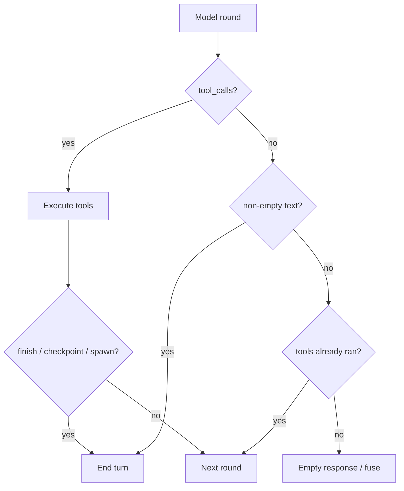

# Turn loop — prose terminates

**Status:** Phase 1–5 shipped (2026-06-25)  
**Related:** [turn-runtime-and-lanes.md](turn-runtime-and-lanes.md), [archive/turn-loop-single-writer-plan.md](archive/turn-loop-single-writer-plan.md), [archive/tool-loop-interim-text-fix.md](archive/tool-loop-interim-text-fix.md)

---

## Problem

After tools run, the tool loop still **continues** on prose-only model rounds (`AwaitingTools`, `PendingDelegation`, `MissingReceipts`). Each continue:

1. Appends interim assistant text to the tool-lane transcript (`append_assistant_draft_to_tool_lane`)
2. Resets streamed UI (`scratch_reset`)
3. Burns another model round

Interim prose is **not** persisted to session history (by design), but the loop reinjects it into the working transcript while the UI keeps wiping — agents spin, users lose partial output, tokens burn.

**Between-tool-round loss:** Even with prose-terminates, `scratch_reset` on round 2+ cleared `streamed_markdown` and Home/TUI bubble content. Good interim prose vanished before the final answer.

---

## Decision

> **One rule:** A model round with **no tool calls** and **non-empty assistant text** is a **terminating turn**.

| Need | Mechanism |
|------|-----------|
| Progress / status | `cognition_turn_begin_work` → `turn_progress` (tool, not prose) |
| Streamed draft between tool rounds | Archived to `TurnPart::Progress` + `turn_progress` before draft buffer clears |
| Final answer after tools | `cognition_turn_finish` (preferred) or terminating prose |
| Mid-task handoff | `cognition_turn_checkpoint` |
| Delegate background work | `cognition_spawn_turn_worker` |
| Plain chat (no tools) | Prose-only round ends immediately |

**Product tradeoff (accepted):** Occasionally the model says it will do something and the turn ends — user follows up. Preferable to silent loops, wiped streams, and token burn recovering lost output.

---

## Runtime contract

**Empty text after tools:** Not terminating output — one more round with `[MEDOUSA_TURN_CONTROL]` nudge only (no assistant draft appended).

**Scratch reset (between tool rounds):** Archive streamed prose → `TurnPart::Progress` + `turn_progress` event → clear in-flight draft only (status line / obs preserved in UI).

---

## Phases

### Phase 1 — Core rule ✅

**Files:** `src/medousa_tool_loop.rs`, `src/agent_runtime/turn_completion_fsm.rs`, `src/turn_control_tools.rs`

- `decide_after_tools_text_round`: non-empty draft → `EndTurn` (`prose_requires_finish` after Phase 5; stub body)
- Empty draft after tools → `ContinueLoop` with control message only
- No prose continues; no `append_assistant_draft_to_tool_lane` on continue

### Phase 2 — Stream preservation ✅

**Files:** `src/turn_parts.rs`, `crates/medousa-types/src/turn.rs`, `src/agent_runtime/daemon_interactive_turn.rs`, `apps/medousa-home/src/lib/stores/chat.svelte.ts`, `src/bin/medousa_tui/event_reducer.rs`

- New `TurnPart::Progress` for between-round prose slices in persisted timeline
- `archive_progress_note()` on `TurnPartsAccumulator`
- `scratch_reset`: archive stream → `turn_progress` → clear draft buffer (no reasoning wipe)
- Home: `scratch_reset` promotes draft to `statusLine` instead of deleting
- TUI: `scratch_reset` pushes draft to obs before clearing bubble

### Phase 3 — Prompt / STTP ✅

**Files:** `src/agent_runtime/turn_ledger.rs`, `src/agent_runtime/system_prompt.rs`, `src/agent_runtime/turn_worker/prompts.rs`, `src/agent_runtime/turn_context.rs`, `src/tool_bootstrap.rs`, `src/turn_control_tools.rs`

- Shared `[MEDOUSA_TURN_RUNTIME]` block in `TURN_RUNTIME_BOUNDARY_APPENDIX` (tool policy + host/worker prompts)
- Host bus appendix + STTP `turn_finalize` / worker `step_2_finalize` aligned with prose-terminates
- Worker constraints and bootstrap tool blurbs reinforce `begin_work` vs naked prose

### Phase 4 — Cleanup ✅

- `ContinueReason` collapsed to `EmptyAfterTools` only
- Removed dead `append_assistant_draft_to_tool_lane` and gatekeeper ledger helpers
- [turn-runtime-and-lanes.md](turn-runtime-and-lanes.md) rules table updated

### Phase 5 — Stricter commit ✅

**Files:** `src/agent_runtime/turn_completion_fsm.rs`, `src/medousa_tool_loop.rs`, `src/turn_control_tools.rs`, prompts

- After tools: `prose_requires_finish` replaces naked prose with `PROSE_REQUIRES_FINISH_STUB`
- Clarifying questions after tools still commit prose (`clarifying_question`)
- Workshop `prepare_final` path unchanged

---

## Success criteria

- [x] No text-only `ContinueLoop` after tools (except empty draft nudge)
- [x] Ledger shows `prose_requires_finish` for post-tool naked prose
- [x] Between-round streamed prose archived to `TurnPart::Progress` and visible via status line / obs
- [x] `scratch_reset` clears draft buffer without deleting preserved progress
- [x] `begin_work` used for progress; prompt/STTP reinforces prose-terminates rule
- [x] Docs table in turn-runtime-and-lanes.md matches behavior
- [ ] Session reload shows progress parts + final answer in timeline

---

## Key files

| Area | Path |
|------|------|
| Tool loop | `src/medousa_tool_loop.rs` |
| FSM | `src/agent_runtime/turn_completion_fsm.rs` |
| Control tools | `src/turn_control_tools.rs` |
| Stream commit | `src/agent_runtime/daemon_interactive_turn.rs` |
| Turn timeline | `src/turn_parts.rs`, `crates/medousa-types/src/turn.rs` |
| Home reducer | `apps/medousa-home/src/lib/stores/chat.svelte.ts` |
| Ledger | `src/agent_runtime/turn_ledger.rs` |
