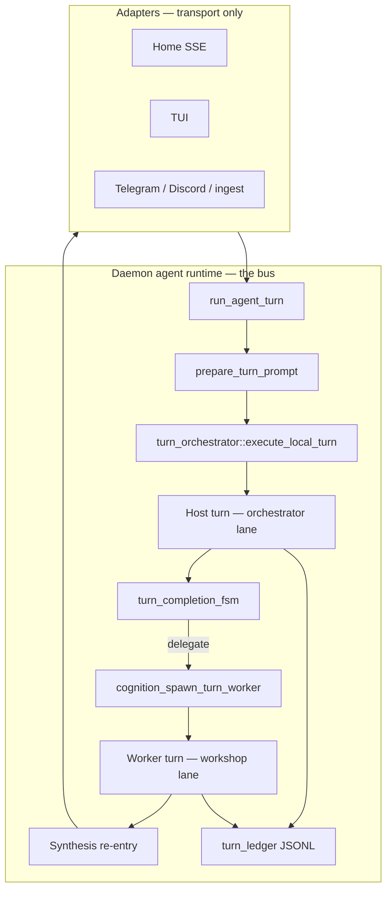
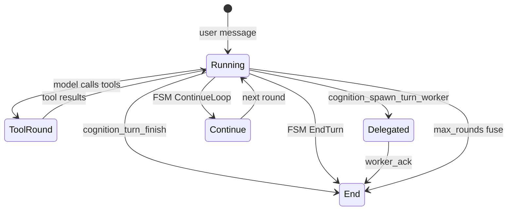

# Turn runtime, host/worker bus, and lanes

> **Status:** Living document (2026-06) — describes **shipped** runtime behavior  
> **Code version:** `AGENT_RUNTIME_VERSION = "centralized-v1"` (`src/agent_runtime/mod.rs`)  
> **History:** [archive/turn-state-machine-plan.md](archive/turn-state-machine-plan.md), [archive/turn-worker-bus-plan.md](archive/turn-worker-bus-plan.md)

This is the canonical guide for how a Medousa turn runs: orchestration, completion FSM, host vs worker roles, context lanes, and specialists (YAML manuscripts).

**Related:** [component-daemon.md](component-daemon.md), [identity-manuscripts-and-recall-plan.md](identity-manuscripts-and-recall-plan.md), [durable-turn-worker-plan.md](durable-turn-worker-plan.md), [context-lanes-and-scratchpad-plan.md](context-lanes-and-scratchpad-plan.md), [worker-continuity-plan.md](worker-continuity-plan.md)

---

## Terminology

| Term in product UI | Term in code / architecture | Meaning |
|--------------------|----------------------------|---------|
| **Specialist** | **Manuscript** (`IdentityManuscript` YAML) | Declared specialty: voice, tools, task template, worker defaults |
| **Specialist bus** | **Host bus** (`MEDOUSA_TURN_HOST_BUS`) | Slim orchestrator lane — delegates heavy work to workers |
| **Workshop** | **Worker lane** | Background tool loop after `cognition_spawn_turn_worker` |
| **Lead / Extractor / …** | **Stage role** | Entry in `StageRoutingMatrix` — picks provider/model per phase |

One runtime, multiple names. Home Settings → Workshop uses **Specialists** and **Host bus charter**; Rust and older plans say **manuscript** and **host bus**.

---

## Architecture overview



**Principle:** The daemon owns the turn engine. Adapters submit prompts and render stream events — they do not run separate tool loops.

All interactive paths call the same stack:

| Route | Entry |
|-------|--------|
| `POST /v1/interactive/turn` | Home, TUI (daemon-primary) |
| `POST /v1/ingest` (EnqueueAsk) | Telegram, Discord, CLI |
| `POST /v1/jobs/ask`, `/v1/jobs/report` | API clients |
| Recurring `agent_turn` ticks | Cron + manuscript specialties |

Centralization history: [centralized-agent-runtime-roadmap.md](centralized-agent-runtime-roadmap.md) (Phases 0–4 ✅).

---

## Turn lifecycle

### 1. Accept and prepare

1. Adapter sends `InteractiveTurnRequest` (session, prompt, routing, optional `manuscript_id`, …).
2. `run_agent_turn` → `prepare_turn_prompt` builds probes: context pack, ranked identity digest, memory recall, manuscript appendix, ambient blocks.
3. `assemble_local_turn` chooses pipeline, prior messages, budgets, continuity bundle for possible worker spawn.

### 2. Host tool loop

`execute_local_turn` runs `MedousaToolLoopPipeline` with:

- **Stage routing** — `StageRoutingMatrix` picks provider/model per role
- **Host profile** — inline vs delegate route; host bus slim registry when active
- **Turn completion FSM** — decides EndTurn vs ContinueLoop each text-only round
- **Control tools** — `cognition_turn_begin_work`, `finish`, `request_more_rounds`
- **Scratchpad** — progress/status separate from terminal user-visible body (single-writer rule)

### 3. Delegation (optional)

Host calls `cognition_spawn_turn_worker` with:

- `task`, `user_ack`, `intent` (memory / research / general)
- Optional `manuscript_id`, `stage_role`, `model_hint`

Host turn ends with `user_ack`; worker runs asynchronously (in-process or durable Stasis job `workflow.medousa.turn_worker`).

### 4. Worker + synthesis

Worker gets handoff capsule + continuity bundle + manuscript context. On success, a **synthesis** pass publishes the final answer on the parent stream/session.

---

## Turn completion FSM

Implemented in `src/agent_runtime/turn_completion_fsm.rs`. Replaces legacy gatekeeper heuristics on the hot path.



**Rules (prose-terminates, shipped 2026-06):**

| Situation | Outcome |
|-----------|---------|
| Zero tool calls + non-empty prose | **EndTurn** (`no_tools_prose` or `prose_terminates`) |
| Zero tool calls + clarifying question | **EndTurn** (`clarifying_question`) |
| After tools + non-empty prose (no tools this round) | **EndTurn** (`prose_requires_finish` — stub body unless clarifying question) |
| After tools + empty prose (no tools this round) | **ContinueLoop** (`EmptyAfterTools` — control nudge only) |
| `cognition_turn_finish` | **EndTurn** (terminal commit) |
| `cognition_spawn_turn_worker` | **EndTurn** (delegated; host ends with ack) |
| Max tool rounds | **EndTurn** (`max_rounds_fuse`) |

**Progress:** Use `cognition_turn_begin_work` (tool), not interim chat prose. Between tool rounds, streamed draft is archived to `TurnPart::Progress` before the next round.

**Single writer:** Terminal chat body from `cognition_turn_finish` after tools have run; plain prose before any tools or clarifying questions after tools may commit directly. Stream deltas alone are not final.

See [turn-prose-terminates-plan.md](turn-prose-terminates-plan.md).

History: [archive/turn-loop-single-writer-plan.md](archive/turn-loop-single-writer-plan.md), [archive/turn-state-machine-plan.md](archive/turn-state-machine-plan.md).

---

## Host bus (orchestrator lane)

When **host bus** is active, the host turn uses a **slim tool registry** — orchestrator tools only (spawn, status, cancel, turn control, identity recall, …). Heavy execution moves to workers.

**Env:** `MEDOUSA_TURN_HOST_BUS`

| Value | Behavior |
|-------|----------|
| `auto` (default) | Slim host when route is `delegate:*` |
| `force` / `1` | Slim host every tool turn |
| `off` / `0` | Full host registry; spawn still available |

Home Settings maps this to **Host bus charter**: When needed / Always / Direct.

**Routing:** `resolve_host_turn_profile` in `turn_worker/routing.rs` classifies prompts into `handle_inline` vs `delegate:research`, `delegate:memory.*`, etc.

**Max rounds:** Host bus caps orchestrator rounds (`HOST_BUS_MAX_TOOL_ROUNDS_DEFAULT = 8`); workers get their own budget.

---

## Worker bus (workshop lane)

| Tool | Role |
|------|------|
| `cognition_spawn_turn_worker` | Start background worker; host ends with `user_ack` |
| `cognition_turn_worker_status` | List/fetch `TurnWorkRecord` |
| `cognition_turn_worker_cancel` | Best-effort cancel |

**Worker intents** (`turn_worker/policy.rs`):

| Intent | Typical use |
|--------|-------------|
| `memory.avec_calibrate` | AVEC / calibrate rituals |
| `memory.context` | Memory read/write without calibrate |
| `research` | Web, capabilities, MCP, OpenShell skills |
| `general` | Broader worker surface |

Each intent has a filtered allowlist intersected with manuscript `tools.allow` when set.

**Durability:** `turn_worker_job.rs` enqueues `workflow.medousa.turn_worker` Stasis jobs; records persist in `workspace/turn_workers.json`. See [durable-turn-worker-plan.md](durable-turn-worker-plan.md).

**Continuity:** Phase A ships `HostContinuityBundle` → `WorkerHandoffCapsule` at spawn ([worker-continuity-plan.md](worker-continuity-plan.md)).

---

## Specialists (manuscripts)

YAML files declare **specialties** — same pack can drive host turns, worker spawns, and cron ticks.

**Locations:**

1. `./.medousa/manuscripts/<id>.yaml` (project)
2. `~/.config/medousa/manuscripts/<id>.yaml` (user)

**Examples:** `.medousa/manuscripts/morning-brief.yaml`, `openshell-researcher.yaml`, `echo-skill.yaml`

**Surfaces:**

| Surface | How manuscript attaches |
|---------|-------------------------|
| Interactive turn | `manuscript_id` on `InteractiveTurnRequest` |
| Worker spawn | `manuscript_id` arg on `cognition_spawn_turn_worker` |
| Recurring cron | `manuscript_id` on `POST /v1/recurring/prompt` |
| Catalog | `GET /v1/manuscripts` |
| CLI | `medousa manuscript-list`, `validate`, `install` |
| Home | Workshop → Specialists; Skills panel; Cron panel |

**Merge at prompt prep:**

```
DEFAULT_SYSTEM_PROMPT
→ manuscript STTP appendix + voice
→ [MEDOUSA_RELATIONAL_MEMORY] (ranked + pins)
→ ambient / recall / scratch
```

**Worker spawn resolution order:** spawn args → manuscript `spec.worker.*` → intent defaults → `StageRoutingMatrix`.

Full specialty model: [identity-manuscripts-and-recall-plan.md](identity-manuscripts-and-recall-plan.md).

---

## Lanes (two meanings)

### Context lanes (what the model sees)

Tiered pools — do not mix user transcript, host tool transcript, and worker handoff in one vector.

| Lane | Holds | Persisted to session? |
|------|-------|------------------------|
| **User lane** | Final assistant answers, user messages | Yes |
| **Host tool lane** | Tool call/result pairs, scratch, turn control | No (inner loop) |
| **Worker lane** | Handoff capsule + worker tool transcript | No |

Implemented: scratchpad + host user/tool split (Phases 1–2). Formal event-loop runtime (Ph 3+) still planned — [context-lanes-and-scratchpad-plan.md](context-lanes-and-scratchpad-plan.md).

### Policy lanes (where tools may run)

Execution lane on the engine: `interactive`, `scheduled`, `worker`, …

- MCP gateway: `allowed_lanes` per server
- Capabilities: lane bindings in `capabilities.toml`
- Scheduled turns: manuscript `tools.allow` **required** (security gate)

---

## Identity at turn start

| Mechanism | Role |
|-----------|------|
| `[MEDOUSA_RELATIONAL_MEMORY]` | Ranked digest at turn start (`cognitive_identity.rs`) |
| `cognition_identity_recall` | On-demand lookup mid-turn |
| Manuscript `identity.pins` | Always-on prefs/contacts when specialty active |
| `cognition_identity_remember` | Write path to identity graph |

---

## Code map

| Concern | Path |
|---------|------|
| Turn entry | `src/agent_runtime/daemon_interactive_turn.rs` — `run_agent_turn` |
| Orchestration | `src/agent_runtime/turn_orchestrator.rs` — `execute_local_turn`, `prepare_turn_prompt` |
| FSM | `src/agent_runtime/turn_completion_fsm.rs` |
| Tool loop | `src/medousa_tool_loop.rs` |
| Host bus routing | `src/agent_runtime/turn_worker/routing.rs` |
| Worker run | `src/agent_runtime/turn_worker/run.rs` |
| Spawn tools | `src/agent_runtime/turn_worker_tools.rs` |
| Durable jobs | `src/agent_runtime/turn_worker_job.rs` |
| Ledger | `src/agent_runtime/turn_ledger.rs` |
| Manuscripts | `src/identity_manuscript.rs` |
| Continuity | `src/agent_runtime/worker_continuity.rs` |
| Prompts / STTP | `src/agent_runtime/system_prompt.rs` |
| Identity digest + recall | `src/cognitive_identity.rs`, `src/identity_tools.rs` |

---

## Still open (not blockers)

| Item | Doc |
|------|-----|
| Identity delegation graph edges at spawn | [worker-continuity-plan.md](worker-continuity-plan.md) Phase B |
| Worker lite `prepare_turn_prompt` | Phase C |
| Structured spawn task schema | Phase D |
| Synthesis continuity framing | Phase E |
| Context lanes Phase 3+ event loop | [context-lanes-and-scratchpad-plan.md](context-lanes-and-scratchpad-plan.md) |
| Multi-role orchestrator catalogs | [durable-turn-worker-plan.md](durable-turn-worker-plan.md) Phase 4 |
| External channel worker notify | [archive/channel-worker-notify-plan.md](archive/channel-worker-notify-plan.md) |
| Agent runtime Phase 5 hardening | [centralized-agent-runtime-roadmap.md](centralized-agent-runtime-roadmap.md) |
