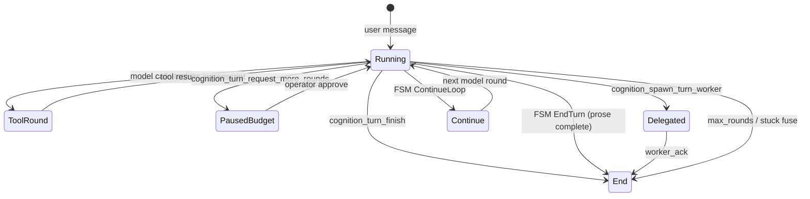

# Turn completion state machine

Replace implicit loop gates (gatekeeper, interim heuristics, scratch reset) with an **explicit turn FSM**. Runtime caps and validates obligations; the model declares completion via tools and prose.

Async chat unlock is **unblocked for Tier 1+ evaluation** now that FSM owns completion ([async-chat-unlock-plan.md](async-chat-unlock-plan.md)).

---

## Problem

When the model returns **text with zero tool invocations**, the loop always continued:

- `should_finalize_on_text_only_response` returned `false` for `invocations_len == 0`
- Draft streamed to user but **not** kept in `tool_lane.messages`
- `reset_scratch` + `[MEDOUSA_TURN_CONTROL]` + another LLM round → amnesia, spam, token burn

Gatekeeper rarely ran on that path because it only engaged when `heuristic_would_finalize` was already true (requires prior tool calls).

---

## Design principles

| Principle | Meaning |
|-----------|---------|
| **Explicit states** | Every text-only round resolves to `EndTurn` or `ContinueLoop` via one FSM entry point |
| **Transcript integrity** | On `ContinueLoop`, append assistant draft to tool lane **before** the next model call |
| **No tool debt → default end** | Zero invocations + non-interim prose → end turn (no hidden loop manager) |
| **Tool debt → receipts later** | After tools ran, continue only for receipts / prepare_final / fuse (Phases 2–3) |
| **Model tools win** | `cognition_turn_finish`, `prepare_final`, `request_more_rounds` bypass FSM prose path |

Intent classifier and round **caps** stay. Gatekeeper model is **removed from the hot path** in Phase 3, not patched in Phase 1.

---

## Target FSM (full)

---

## Phased rollout

### Phase 1 — FSM foundation + no-tool-debt ✅ Done

**Goal:** One module owns text-only round outcomes for the **no tool debt** case; transcript integrity on every continue.

**Deliverables:**

- ✅ `src/agent_runtime/turn_completion_fsm.rs` — `TurnRoundAction`, `decide_no_tool_debt_text_round`, `append_assistant_draft_to_tool_lane`
- ✅ `medousa_tool_loop.rs` — zero-invocation text routed through FSM (no heuristic interim spam on that path)
- ✅ On **any** continue in tool loop, append assistant draft before next round (FSM, gatekeeper, heuristic paths)
- ✅ Unit tests for FSM policy (6 tests)
- ✅ Gatekeeper doc points here for migration context

**Policy (no tool debt):**

| Condition | Action |
|-----------|--------|
| `prepare_final` pending + non-empty draft | EndTurn |
| At max tool rounds | EndTurn (fuse) |
| Interim phrasing (“let me…”) | ContinueLoop (awaiting tools) |
| Clarifying question | EndTurn |
| Otherwise (normal prose answer) | EndTurn |

**Out of scope:** Gatekeeper removal, post-tool receipt-only continue (Phase 2–3).

---

### Phase 2 — Post-tool text through FSM ✅ Done

**Goal:** One FSM entry point for tool-debt prose; receipt checklist drives continues; gatekeeper model off the hot path.

**Deliverables:**

- ✅ `decide_after_tools_text_round` in `turn_completion_fsm.rs`
- ✅ Post-tool text in `medousa_tool_loop.rs` routed through FSM (gatekeeper + heuristic finalize path removed)
- ✅ `max_gatekeeper_calls: 0` on Interactive lane (Scheduled still 1 for legacy fallback in `resolve_turn_completion`)
- ✅ Unit tests for post-tool policy (5 tests)

**Policy (tool debt):**

| Condition | Action |
|-----------|--------|
| Workshop lane + `prepare_final` + non-empty draft | EndTurn |
| At max tool rounds | EndTurn (fuse) |
| Missing AVEC/calibrate receipts | ContinueLoop (MissingReceipts) |
| `prepare_final` + interim phrasing | ContinueLoop (PrepareFinalInterim) |
| `prepare_final` + non-interim draft | EndTurn |
| Substantive final answer | EndTurn |
| Clarifying question | EndTurn |
| Interim phrasing | ContinueLoop (AwaitingTools) |
| Otherwise | EndTurn |

**Out of scope:** Remove dead heuristic continue scaffolding (Phase 3), prompt updates (Phase 4).

---

### Phase 3 — Loop integration cleanup ✅ Done

**Goal:** Single FSM continue path, correct scratch UX, ledger aligned with `ContinueReason`.

**Deliverables:**

- ✅ Unified `apply_fsm_continue_loop` in `medousa_tool_loop.rs` (no duplicated continue blocks)
- ✅ `reset_scratch` at **next model round start** (`rounds_executed > 1`), not on FSM continue
- ✅ `continue_control_message` centralized in FSM; ledger uses `TextOnlyContinue` / `ReceiptMissing` by reason
- ✅ Removed `developer_message_for_heuristic_interim_continue`; legacy heuristic tests moved to `turn_text_heuristics`
- ✅ Scheduled lane `max_gatekeeper_calls: 0` (all lanes)

**Out of scope:** Host prompt updates (Phase 4).

---

### Phase 4 — Prompts and docs ✅ Done

**Goal:** Collaborator environment across prompts; FSM-aligned turn completion guidance; deprecate gatekeeper model doc.

**Deliverables:**

- ✅ Host/workshop STTP reframed (principal, runtime environment — preserve warm host tone)
- ✅ Tool loop policy, FSM control messages, turn control tools — factual not dictatorial
- ✅ Host bus / worker appendices — workshop vs host lanes
- ✅ Channel fallbacks unified (`LIGHTWEIGHT_CHANNEL_SYSTEM_PROMPT`, Home/TUI/CLI/daemon)
- ✅ [runtime-collaborator-voice.md](runtime-collaborator-voice.md) — voice principles
- ✅ [turn-completion-gatekeeper.md](turn-completion-gatekeeper.md) — model layer deprecated; receipt checklist remains in FSM

---

### Phase 5 — Single writer & explicit loop entry 🚧 In progress

**Goal:** Tool call = loop; prose-only = EndTurn; `cognition_turn_begin_work` replaces interim heuristics.

See [turn-loop-single-writer-plan.md](turn-loop-single-writer-plan.md).

**Deliverables:**

- ✅ `cognition_turn_begin_work` + `turn_progress` bus event
- ✅ FSM: remove interim `ContinueLoop` paths
- ✅ Drop `final_pending` body injection on `prepare_final`
- ✅ Disable continuation synthesis on principal interactive channels
- ✅ Home/TUI reducer alignment for `turn_progress`
- 🚧 Deprecate `prepare_final` fully in prompts (partial — host prompt updated)

---

## Module map (target)

| Module | Role |
|--------|------|
| `turn_completion_fsm.rs` | **Single entry** for text-only round decisions (Phase 1+) |
| `turn_completion.rs` | Receipt checklist, gatekeeper (Phase 2 demote, Phase 3 remove) |
| `turn_text_heuristics.rs` | Pure text classifiers (`looks_like_interim`, etc.) — no loop policy |
| `turn_control_tools.rs` | Model-declared terminal / pause |
| `medousa_tool_loop.rs` | Executes FSM actions, caps, tool batches |

---

## Key files

| Area | Path |
|------|------|
| FSM (Phase 1) | `src/agent_runtime/turn_completion_fsm.rs` |
| Tool loop | `src/medousa_tool_loop.rs` |
| Legacy gatekeeper | `src/agent_runtime/turn_completion.rs` |
| Text classifiers | `src/turn_text_heuristics.rs` |
| Control tools | `src/turn_control_tools.rs` |

---

## Decision log

| Question | Decision |
|----------|----------|
| Patch `should_finalize`? | No — FSM owns policy; heuristics stay pure functions |
| Phase 1 touch gatekeeper? | No — post-tool path unchanged until Phase 2 |
| Async chat unlock? | Unblocked for Tier 1+ evaluation after Phase 3 (FSM owns all text-only paths) |
