# Typed tool contracts and mode-aware runtime

> **Status:** Planned; repository audit complete
> **Parent:** [Agent runtime modes](agent-runtime-modes-plan.md)
> **Related:** [Coder cognitive runtime](coder-cognitive-runtime-plan.md),
> [Coder durability, worktree memory, and dynamic tools](coder-durability-memory-and-tool-surface.md),
> and [Turn runtime and lanes](turn-runtime-and-lanes.md)

## Product decision

Every first-party Medousa tool will have one typed contract and one typed
handler. JSON Schema, provider descriptions, Stasis adaptation, mode-specific
call metadata, catalog membership, and runtime policy will be compiled from or
attached to that contract instead of being reimplemented inside each tool.

Medousa will prove a stateful typed-tool attribute macro locally, use it to
migrate the real tool catalog, and contribute the generic macro behavior
upstream to Stasis. The local implementation is a proving ground, not a
permanent fork or a Medousa-only replacement for Stasis.

The macro owns generic tool mechanics. Medousa owns product policy:

| Generic and upstreamable | Medousa-specific |
|---|---|
| Typed input/output contract | Agent modes and immutable mode snapshots |
| Stateful handler adaptation | Coder's required operational `intent` |
| Schema and description generation | Forge authority, leases, attempts, and review metadata |
| Boundary serialization and error mapping | Tool domains, visibility, capabilities, and effect policy |
| Stasis `StasisTool` implementation | Activity ledger, claims, evidence, and mode lifecycle hooks |

This boundary is deliberate. A Stasis contribution must not know what Coder,
Forge, Locus, a Medousa lane, or a Medousa tool domain is.

## Why this is necessary

The current implementation maintains the same contract in several forms:

1. a tool struct and `StasisTool` implementation;
2. a hand-built JSON input schema;
3. hand-written `Value::get` parsing and conversion;
4. name constants and global name arrays;
5. host and worker bootstrap/domain catalogs;
6. mode-specific allowlists and Coder visibility packs;
7. separate one-line descriptions for prompt hints; and
8. custom Coder and MCP definitions outside the Stasis registry.

The audit baseline is:

| Surface | First-party definitions | Current form |
|---|---:|---|
| Manual Stasis tool implementations | 147 across 35 files | Manual `StasisTool`, description, schema, and `Value` parsing |
| Stateless manual tools | 48 | Compatible with today's function-form Stasis macro in principle |
| Stateful manual tools | 99 | Cannot use today's zero-sized generated Stasis tool |
| Coder runtime definitions | 13 | Manual `Tool::new(...).with_schema(json!(...))` |
| Standalone Medousa MCP server | 6 | Manual `ToolSpec` and JSON schema |
| Existing typed macro pilot | 1 | A no-effect turn-control ping |

The 147 manual Stasis implementations alone devote approximately 3,276 lines
to description and input-schema methods. Including static Coder and MCP
definitions raises the contract-construction total to roughly 3,600 lines.
The larger cost is semantic drift rather than line count.

Known audit findings that the baseline phase must resolve or explicitly
classify include:

- `REGISTERED_COGNITION_TOOLS` contains 106 names while 147 concrete manual
  `StasisTool` implementations exist. Some difference is intentional because
  tools live on different registries, but that distinction is not represented
  by the type system and the list claims to be complete.
- the host discovery catalog declares the `presentation` domain twice;
- `cognition_turn_update_user` is advertised in bootstrap policy but is not
  registered by the assembled Stasis registry; and
- Coder adds `intent` and hidden authority by rewriting untyped JSON, so a
  schema or binder change can drift from the downstream parser silently.

## Goals

- Make first-party tool input and output typed from the provider boundary to
  the domain handler.
- Generate Stasis adaptation, JSON Schema, and boundary serde once.
- Support stateful tools without globals, service locators, or dependencies in
  model-authored input.
- Preserve Coder `intent` as required, typed, model-visible operational
  metadata used by Forge, activity, causal history, and code review.
- Keep runtime-owned authority typed and hidden from the model.
- Give General, Coder, and future modes independent typed metadata and policy
  without duplicating the underlying tools.
- Replace stringly internal catalog and policy decisions with typed tool ids,
  domains, effects, capabilities, and exposure rules.
- Keep tool authority immutable during a turn while allowing deterministic,
  mode-specific visibility changes already authorized by that turn.
- Preserve all existing names, wire shapes, policy boundaries, and behavior
  during mechanical migration unless a separate reviewed change says
  otherwise.
- Produce a generic, tested Stasis macro contribution after the local vertical
  proof succeeds.

## Non-goals

- Do not rewrite tool domain behavior while converting its contract.
- Do not put Forge, Locus, event senders, runtime composition, or turn scope in
  model-visible input types.
- Do not make JSON Schema the sole runtime validator. Serde validates shape;
  domain newtypes and validation still enforce semantic bounds and policy.
- Do not make externally registered client or discovered MCP tools statically
  typed. Their contracts are supplied at runtime and remain an explicit
  dynamic boundary.
- Do not use a linker inventory as hidden registration. Registration remains
  explicit and testable.
- Do not couple the upstreamable macro to Medousa mode or catalog types.
- Do not change General or Coder tool exposure as an incidental result of a
  schema migration.

## Invariants

1. **Serde exists only at external adapters.** Model/provider, Stasis, MCP,
   and external-client boundaries necessarily exchange JSON. Tool handlers do
   not manually traverse `serde_json::Value`.
2. **One base contract per first-party tool.** The handler's typed input and
   output are the source of schema truth.
3. **Mode metadata is separate from tool input.** A mode may add model-visible
   metadata without changing the shared tool type.
4. **Runtime authority is never model input.** Work ids, attempt ids, leases,
   roots, session identity, and capability grants are bound by the runtime.
5. **State stays on the tool or behind a port.** Stateful tools retain their
   constructors and injected dependencies.
6. **Descriptions live beside behavior.** Handler documentation is the
   canonical full description; field documentation is the canonical property
   description.
7. **Internal identity is typed.** Strings are accepted and emitted only at
   protocol boundaries, then resolved to `ToolId`, `ToolDomainId`, mode types,
   Forge id types, and other domain newtypes.
8. **Exposure is policy, not capability.** Hiding a tool does not revoke its
   immutable turn authority, and discovering a tool cannot grant authority.
9. **A migration cannot silently tighten input.** Unknown-field behavior,
   aliases, defaults, clamps, and accepted legacy forms remain compatible
   until intentionally deprecated.
10. **Dynamic tools are visibly dynamic.** Opaque external schemas and payloads
    use explicit types rather than pretending to have a static first-party
    contract.

## Data boundaries

Coder makes the required separation concrete:

| Data class | Examples | Model-visible | Owner |
|---|---|---:|---|
| Tool input | path, query, line, action, change-set id | Yes | Typed tool contract |
| Mode call metadata | Coder operational `intent` | Yes | Typed mode adapter |
| Runtime invocation metadata | call id, agent, session, turn, timestamps | No | Runtime |
| Authority | Forge work/attempt/lease, root, policy, capabilities | No | Mode/runtime binder |
| Tool state | runtime, stores, clients, event sender, turn scope | No | Tool constructor / ports |
| Result | typed domain observation or receipt | Returned | Typed tool contract |

Coder `intent` is not private reasoning and is not hidden authority. It is a
short, outcome-oriented declaration supplied with each model tool call. The
mode adapter validates it before execution and retains it on planned,
completed, failed, and policy-rejected activity. The underlying domain handler
receives its typed base input; activity, Forge, causal history, and review
middleware retain the typed intent separately.

## Target hexagonal architecture

```mermaid
flowchart LR
  Provider["Model / provider JSON"]
  MCP["MCP and client adapters"]

  subgraph Runtime ["Medousa runtime adapters"]
    StasisAdapter["Generated Stasis / JSON adapter"]
    ModeAdapter["Mode-bound registry and call metadata"]
    Catalog["Typed tool catalog and exposure policy"]
    Activity["Activity, claims, evidence, review hooks"]
  end

  subgraph Domain ["Typed tool domain"]
    Contract["ToolContract<Input, Output>"]
    Handler["Stateful typed handler"]
    Ports["Forge / Locus / runtime / vault / browser ports"]
  end

  subgraph Infra ["Infrastructure adapters"]
    Forge["Forge + Git"]
    Locus["Locus"]
    RuntimeSvc["Stasis runtime"]
    Other["Filesystem, browser, MCP, clients"]
  end

  Provider --> ModeAdapter
  MCP --> ModeAdapter
  Catalog --> ModeAdapter
  ModeAdapter --> StasisAdapter
  ModeAdapter --> Activity
  StasisAdapter --> Contract
  Contract --> Handler
  Handler --> Ports
  Ports --> Forge
  Ports --> Locus
  Ports --> RuntimeSvc
  Ports --> Other
  Activity --> Forge
```



The typed handler is the application port. Generated Stasis and JSON code is
an inbound adapter. Forge, Locus, Stasis runtime services, filesystem, browser,
and MCP clients remain outbound ports/adapters. Mode policy decorates a call;
it does not become part of the tool's domain behavior.

## Local typed-tool macro

### Crate and support layout

The local proving implementation uses one required proc-macro crate and a
small runtime support module:

| Path | Responsibility |
|---|---|
| `crates/medousa-tool-macros/` | Parse and validate the attribute; generate typed contract and Stasis bridge code |
| `src/typed_tools/contract.rs` | `TypedTool`, `ToolContract`, schema normalization, explicit opaque boundary types |
| `src/typed_tools/catalog.rs` | `ToolId`, registration, traits/placement, catalog validation |
| `src/typed_tools/mode.rs` | Mode metadata composition and mode-bound registry contracts |
| `src/typed_tools/stasis_adapter.rs` | Shared Stasis error/schema/serde boundary helpers |

The proc-macro crate contains no Medousa runtime logic. Expansion paths are
configurable so the generic implementation can move into `stasis-rs-macros`
without rewriting the parser or signature validation.

### Handler form

The local attribute is provisionally named `#[medousa_tool]`. It decorates an
inherent implementation so the existing struct, state, constructors, and
dependency injection remain intact:

```rust
pub struct CognitionVaultReadTool {
    event_tx: mpsc::Sender<TuiEvent>,
}

#[derive(Debug, Deserialize, JsonSchema)]
pub struct VaultReadInput {
    /// Repository-relative vault path.
    pub path: VaultRelativePath,
}

#[derive(Debug, Serialize, JsonSchema)]
pub struct VaultReadOutput {
    pub path: VaultRelativePath,
    pub content: String,
}

#[medousa_tool(id = COGNITION_VAULT_READ)]
impl CognitionVaultReadTool {
    /// Read one note from the bound workshop vault.
    async fn invoke_typed(
        &self,
        input: VaultReadInput,
    ) -> stasis::prelude::Result<VaultReadOutput> {
        // Existing domain behavior, now using typed values.
    }
}
```

The macro does not generate or replace the tool struct. This is the critical
difference from Stasis 0.1's current function form, which generates a
zero-sized `Copy + Default` tool and therefore cannot retain state.

### Generated behavior

For each annotated implementation, the macro generates:

- a `TypedTool` implementation with associated `Input` and `Output` types;
- a static `ToolContract` projection with typed id, canonical description,
  normalized input schema, and output schema;
- the `StasisTool` bridge using the existing stateful struct;
- exactly one input deserialization at the Stasis boundary;
- exactly one output serialization at the Stasis boundary;
- consistent Stasis error mapping with the typed tool id; and
- compile-time trait assertions for input and output.

The handler may be called directly with typed input in tests and internal code.
Direct domain tests do not serialize through JSON unless they are specifically
testing a boundary contract.

### Compile-time contract

The initial macro accepts:

- one inherent implementation for a concrete, non-generic tool type;
- exactly one `async fn invoke_typed(&self, input: Input) -> Result<Output>`;
- immutable `&self`; shared tool state must remain safe for concurrent calls;
- `Input: DeserializeOwned + JsonSchema + Send + 'static`;
- `Output: Serialize + JsonSchema + Send + 'static`; and
- `id = TOOL_ID_CONSTANT`, where the constant is a typed id or a supported
  static name during the compatibility phase.

The macro rejects multiple handlers, `&mut self`, missing input/output types,
unsupported generics, and non-`Result` output at compile time. `trybuild` UI
tests cover every accepted and rejected signature.

### Descriptions and schemas

- The handler doc comment is the canonical full tool description.
- Input/output type and field doc comments feed Schemars descriptions.
- Typed enums replace manual string `enum` arrays.
- Existing domain id types are reused; missing ids receive bounded newtypes.
- Defaults and accepted aliases use serde attributes.
- Schema bounds use Schemars attributes or a custom `JsonSchema`
  implementation on a reusable validated newtype.
- A central schema normalizer removes unsupported root metadata, normalizes
  references, and preserves the provider-compatible object shape expected by
  `genai` and Stasis.

The macro must not infer semantic validation from advertised schema alone.
Serde checks typed shape and enum variants. Newtypes, custom deserialization,
and existing domain validation enforce lengths, ranges, paths, authority, and
cross-field invariants.

### Explicit dynamic escape hatch

First-party handlers do not use raw `Value` as an undocumented shortcut.
Genuinely opaque external data uses explicit wrappers such as `ExternalJson`
or `OpaqueToolPayload`. Those wrappers document why the payload cannot be
statically modeled and provide an auditable migration metric.

External client registrations and discovered MCP definitions remain dynamic
because their schema is runtime input. They enter through a separate
`ExternalToolContract`, never the first-party typed macro.

## Typed catalog

### Contract versus placement

Tool behavior and product exposure are different records:

```text
ToolContract
  id
  full description
  input schema
  output schema
  typed handler adapter

ToolPlacement
  effect class
  capability requirements
  eligible lanes and surfaces
  discover domains
  bootstrap eligibility
  mode-policy overrides
  approval / concurrency traits
```

`ToolContract` is generated from the handler. `ToolPlacement` is explicit
Medousa policy registered beside the tool. The macro does not embed Coder,
lane, UI, or Forge policy and therefore stays upstreamable.

### Typed identities

First-party names resolve at registration into `ToolId`, a static newtype.
Domain, effect, capability, exposure, and mode references likewise use typed
ids or enums. Strings remain only in provider/MCP/client wire representations.

The catalog distinguishes:

- `FirstPartyToolId`, known at compile time and backed by a typed contract;
- `ExternalToolId`, validated and namespaced at runtime; and
- aliases used only at protocol boundaries.

Existing constants are reused during migration. They become typed constants
incrementally rather than being duplicated in macro literals.

### Explicit registration

Registration stays explicit. A `ToolRegistrar` records the generated contract
and placement while registering the Stasis adapter. During migration it also
supports an allowlisted `register_legacy` path.

No linker inventory is introduced. The runtime catalog is therefore the exact
set of instances that were actually assembled, including alternate Coder
setup and client-specific registries. Tests can compare policy references to
the real catalog instead of a hand-maintained approximation.

### Presentation metadata

The full handler description is canonical. A concise prompt/UI summary defaults
to its first sentence and may have one typed presentation override when the
short form genuinely differs. Domain summaries remain domain metadata.
The current global `tool_one_liner` match is removed only after parity tests
prove the generated/overridden summaries are equivalent.

## Mode-aware tool calls

### Base input and mode metadata

A shared tool has one base input. A mode may add a flat, model-visible metadata
envelope without editing that input:

```rust
#[derive(Debug, Deserialize, JsonSchema)]
pub struct CoderCallMetadata {
    /// One short outcome-oriented sentence explaining this call.
    pub intent: ToolIntent,
}
```

The provider continues to see the ergonomic flat object:

```json
{
  "intent": "Locate the definition before changing its callers",
  "path": "src/runtime.rs",
  "line": 84,
  "character": 12
}
```

The mode adapter composes the base input schema with the metadata schema,
rejects reserved-field collisions, parses metadata centrally, and passes only
the typed base input to the generated tool adapter. Tool handlers never strip
`intent` themselves.

### Mode adapter contract

Each mode supplies a typed adapter with:

- its model-visible call metadata type;
- deterministic tool selection over the immutable resolved mode snapshot;
- schema composition and reserved fields;
- pre-invocation validation and authorization hooks;
- typed runtime authority binding;
- planned/completed/failed activity hooks; and
- post-result evidence and completion hooks.

General uses empty call metadata and preserves its existing contract. Coder
uses `CoderCallMetadata { intent: ToolIntent }`. A future mode adds its own
metadata and policy without changing any shared tool input.

### Coder ordering

Coder preserves the existing causal contract:

1. resolve the string wire name to typed `ToolId`;
2. parse and validate typed Coder intent;
3. allocate a stable call id and record planned activity;
4. validate visibility, authority, claims, and hazardous resources;
5. bind typed Forge/worktree authority outside model input;
6. parse the typed base tool input through generated code;
7. invoke the typed handler;
8. record completed or failed activity with the same call id and intent; and
9. emit Forge/evidence/review metadata and memory boundaries.

Policy and validation failures retain intent and a failed/rejected lifecycle.
The domain handler never receives model-authored work ids, attempt ids, lease
tokens, absolute roots, or authority flags.

### Future modes

Mode expansion occurs by adding a mode adapter and immutable selection policy,
not by cloning the catalog. Mode rules select typed ids, traits, capabilities,
or domains from the same catalog. A mode can:

- add its own typed call metadata;
- choose bootstrap and discoverable subsets;
- override a presentation summary when behavior differs materially;
- add stricter authorization or completion hooks; and
- bind mode-owned authority and evidence sinks.

It cannot mutate the base tool schema or handler semantics ad hoc. Any mode
transformation is centralized, typed, schema-tested, and immutable for a live
turn.

## Reuse plan

| Existing component | Decision |
|---|---|
| Stasis `StasisTool` and `ToolRegistry` | Keep as the provider/runtime port; generate implementations and progressively decorate the registry |
| `InMemoryToolRegistry` | Keep during migration; typed registrar feeds it and the new catalog together |
| Serde and Schemars | Keep as the single source for boundary parsing and schemas |
| Existing tool structs and constructors | Keep; the impl-form macro is designed around their state |
| Existing handler/domain logic | Move behind typed DTOs without behavioral refactors |
| Tool name constants | Reuse, then wrap as typed ids instead of copying string literals |
| Mode registry and immutable snapshots | Keep; change tool selections from strings to typed catalog references incrementally |
| `CoderBoundToolRegistry` | Use as the first mode adapter; extract generic mode behavior only after typed parity |
| Coder intent, activity, claims, evidence, and memory hooks | Keep their semantics; replace JSON extraction with typed metadata |
| Forge/Locus/runtime/vault/browser clients | Keep behind existing or refined outbound ports |
| Client tool registry | Keep dynamic and namespaced; do not force remote schemas through static types |
| MCP discovery | Keep dynamic; only first-party MCP server commands receive local typed request contracts |
| Existing tests | Reuse as behavior fixtures and add contract snapshots around them |

Migration commits do not combine typing with domain rewrites. If a migration
uncovers a behavior bug, the fix is isolated in a preceding or following
commit with its own test.

## Migration inventory

The 147 manual Stasis contracts divide into these families:

| Family | Count | Examples / risk |
|---|---:|---|
| Runtime, orchestration, bridge, and controls | 50 | Jobs, recurring workflows, MCP/capability bridge, worker spawn, turn control; mostly stateful and high-impact |
| Memory, identity, context, and history | 18 | Locus, identity writes, pointer/history reads; stateful and privacy-sensitive |
| Code, shell, Detamu, intelligence, and setup | 20 | Forge-bound reads/writes, shell sessions, LSP, project binding; authority-sensitive |
| Vault, artifacts, calendar, manuscripts, and scripts | 27 | Mixed reads and durable writes; mostly stateful |
| Environment, layout, feeds, UI, and browser | 25 | Complex unions, arbitrary presentation data, side effects, and client capability gates |
| OpenShell, shared shell, and skills | 7 | Execution and policy-sensitive |

Separate surfaces add 13 Coder definitions and six first-party MCP server
definitions. Dynamic external client/MCP definitions are measured but excluded
from the static migration denominator.

## Delivery phases

### Phase 0 — contract baseline and drift resolution

- Add a normalized snapshot of every assembled first-party tool contract:
  id/name, description, input schema, output-schema presence, registry/surface,
  and placement.
- Add valid and invalid invocation fixtures for aliases, defaults, enums,
  nested inputs, and bounds that schema alone does not enforce.
- Compare actual assembled registries with bootstrap, domain, mode, worker, and
  Coder policy references.
- Resolve or explicitly classify the registered-name mismatch, duplicate host
  presentation domain, and unregistered `cognition_turn_update_user`.
- Record the legacy manual contract allowlist used by later CI.

Acceptance:

- Every policy reference resolves to an actual tool or an explicitly declared
  external/conditional tool.
- Duplicate catalog ids/domains fail tests.
- The baseline can detect a changed name, required field, enum, description,
  or surface before a migration merges.
- No runtime behavior or model-visible surface changes in this phase except
  separately reviewed corrections to proven catalog drift.

### Phase 1 — macro and typed support kernel

- Create `medousa-tool-macros` and `src/typed_tools/` support modules.
- Implement the stateful impl-form `#[medousa_tool]` contract.
- Generate typed contract, Stasis bridge, input/output schemas, and boundary
  serde/error mapping.
- Implement schema normalization and explicit opaque external payload types.
- Add compile-pass and compile-fail `trybuild` coverage.
- Add typed `ToolId` compatibility around existing name constants.

Acceptance:

- A stateful tool retains constructor-injected dependencies and implements
  `StasisTool` without a manual trait implementation.
- Input and output are typed in direct tests and serialize only in the adapter.
- The macro accepts a typed id constant and doc-derived description.
- Unsupported signatures fail with targeted compiler diagnostics.
- The support kernel contains no Coder, Forge, Locus, or mode-specific logic.

### Phase 2 — three-shape vertical proof

Migrate a deliberately mixed pilot:

- stateless: the three utility tools (time, weekday, and UUID);
- stateful: one bounded read tool such as tool-history summary or vault list;
- mode-bound: engineering pointers through Coder's required typed intent
  envelope; and
- remove the no-effect `cognition_turn_control_ping` pilot once real typed
  tools are registered.

Acceptance:

- Old and new normalized names, descriptions, schemas, valid outputs, and
  invalid-input classes match.
- The stateful tool uses its existing injected service without globals.
- Coder rejects a call without intent, records the same intent through its
  lifecycle, and does not pass intent into the base handler.
- No runtime-owned Coder authority appears in the advertised schema or model
  input DTO.
- General exposure and behavior remain unchanged.

The generic macro is proposed upstream to Stasis after this phase. The local
implementation remains the proven source until an upstream release is adopted.

### Phase 3 — typed catalog and mode adapter

- Add explicit typed registration of contract plus placement.
- Introduce typed domains, effects, capability requirements, and exposure
  references while accepting legacy strings at outer boundaries.
- Make General and Coder compile tool surfaces from the same catalog.
- Move Coder intent schema composition/parsing into the mode adapter.
- Replace catalog-wide one-line description matching with canonical
  descriptions plus typed presentation overrides.
- Preserve immutable authority and monotonic within-turn Coder visibility.

Acceptance:

- The actual registered catalog is the authority for availability tests.
- General and Coder surface snapshots are unchanged from the corrected Phase 0
  baseline.
- A future test mode can add typed call metadata and select a subset without
  editing any tool handler or cloning a schema.
- Schema composition rejects base-input collisions with reserved mode fields.
- String tool ids do not cross from registry adapters into policy/domain code.

### Phase 4 — remaining stateless tools

- Migrate the remaining 45 stateless tools in domain-sized commits.
- Order work from read-only leaf tools to governed/mutating tools:
  manuscripts and status observations; Detamu and code intelligence; layout
  and environment observations; coding mutations/shell; then turn controls.
- Replace manual string enums with typed enums and repeated ids/paths with
  existing or new domain newtypes.

Acceptance per batch:

- No manual `StasisTool`, description, schema, or `Value::get` parsing remains
  for migrated tools.
- Existing direct behavior tests use typed handlers.
- Boundary fixtures prove wire compatibility.
- Mode, lane, discovery, and authorization snapshots do not change.

### Phase 5 — stateful tools

- Migrate the remaining stateful tools by risk rather than file size.
- First wave: read/list/status/catalog/history/browser-observation tools.
- Second wave: bounded storage and update tools for vault, artifacts,
  calendars, memory, identity, and environment.
- Final wave: runtime jobs/workflows, worker orchestration, shell/OpenShell,
  browser actions, UI composition, and external side effects.
- Retain injected dependencies on tool structs or move them behind focused
  outbound ports when that is independently justified.

Acceptance per batch:

- No dependency is moved into model input or a process-global singleton.
- Side-effect, approval, concurrency, and idempotency behavior is unchanged.
- Aliases, defaults, clamps, and error categories remain compatible.
- Stateful tools remain safe when held behind `Arc<dyn StasisTool>` and invoked
  concurrently according to existing policy.

### Phase 6 — Coder runtime and hidden authority

- Convert the remaining 12 Coder runtime definitions to typed contracts.
- Type memory kinds/relations, causal workflows, experiment candidates,
  semantic actions, change-set ids, evidence ranges, pointer/history queries,
  and discovery domains.
- Replace manual Coder `Tool::new(...).with_schema(json!(...))` definitions
  with generated contracts.
- Replace JSON insertion of work/attempt/lease/session/root values with a typed
  bound invocation context or stateful bound tool adapter.
- Replace string dispatch in Coder with catalog-owned erased typed handlers.
- Preserve intent in Forge commands, activity/evidence receipts, causal traces,
  checkpoints, and review projections.

Acceptance:

- All Coder model-visible arguments, including intent, are typed and schema
  generated.
- All runtime-owned authority is typed and absent from public DTOs/schemas.
- The visible-pack checkpoint and dynamic discovery behavior remain unchanged.
- Every planned/completed/failed/rejected call retains one typed tool id, call
  id, and operational intent.
- Semantic change sets and causal tools retain their current replay and
  authority protections.

### Phase 7 — first-party MCP and external boundaries

- Give the six standalone Medousa MCP server commands typed request/response
  DTOs and schema generation from the same contract support.
- Reuse domain request types where the daemon and MCP wire semantics are
  actually identical; use adapters where they differ.
- Keep client-registered and discovered MCP tool contracts dynamic,
  namespaced, validated, and explicitly marked external.

Acceptance:

- No first-party MCP `ToolSpec` contains a hand-built schema.
- MCP and daemon adapters share types only when authority and semantics match.
- External schemas cannot collide with first-party typed ids or gain first-
  party placement metadata.

### Phase 8 — enforcement and local-macro retirement

- Remove legacy manual contract paths and the shrinking migration allowlist.
- Add CI that rejects new first-party manual `input_schema` methods,
  `.with_schema(json!(...))` definitions, and undocumented raw `Value` handler
  inputs.
- Track typed coverage by registry and surface.
- Adopt the released upstream Stasis macro/support and delete the equivalent
  local generic implementation.
- Retain only Medousa's typed catalog, mode adapter, placement, and product
  policy layers.

Acceptance:

- All static first-party tools are typed; only declared external contracts are
  dynamic.
- The local macro crate is removed after upstream parity is verified.
- General, Coder, host, worker, setup, MCP, and client surfaces pass catalog
  completeness and collision tests.
- Adding a new mode requires a mode adapter/policy and optional typed metadata,
  not copied tool definitions or schemas.

## Per-tool migration checklist

1. Identify the current wire fields, aliases, defaults, bounds, and hidden
   runtime fields.
2. Define typed input/output DTOs using existing domain newtypes first.
3. Move property descriptions to field docs and full behavior description to
   the typed handler docs.
4. Add enum/newtype validation and retain cross-field domain validation.
5. Apply `#[medousa_tool]` to the existing stateful or unit struct.
6. Register its generated contract with typed placement.
7. Compare normalized contract and valid/invalid fixtures with the Phase 0
   baseline.
8. Verify every General/worker/Coder/client-capability surface that can expose
   the tool.
9. Delete the manual `StasisTool`, schema, description, and `Value` parser.
10. Remove the tool from the legacy allowlist and record typed coverage.

## Compatibility and security gates

Every migration must prove:

- canonical external tool name and alias stability;
- equivalent required/optional fields and enum values;
- equivalent unknown-field, alias, default, and nullable behavior;
- provider-compatible normalized schema with no accidental `$ref`, title, or
  unsupported keyword changes;
- equivalent effect, approval, concurrency, and lane policy;
- unchanged bootstrap and discoverable visibility for each mode/surface;
- no runtime ids, roots, secrets, tokens, or authority in model-visible schema;
- bounded error messages without secret or absolute-path leakage;
- typed outputs do not expose more payload than the existing bounded result;
- Coder intent remains required and retained downstream; and
- dynamic external tool schemas cannot be mistaken for first-party authority.

Schema snapshots are necessary but not sufficient. Invocation fixtures and
domain tests remain authoritative because JSON Schema does not enforce every
semantic invariant used by the runtime.

## Upstream Stasis contribution

The upstream PR is prepared after the three-shape proof and contains only:

- impl-form, state-preserving `#[stasis_tool]` support;
- typed input and output trait assertions;
- const/path tool-name support;
- doc-derived descriptions;
- normalized input/output schema generation where accepted by Stasis;
- one generated serde/error boundary; and
- compile-pass/fail and registry-compatibility tests.

It does not contain Medousa `ToolId`, placement, modes, Coder intent, Forge
authority, activity hooks, or discovery policy. If Stasis prefers a companion
`TypedStasisTool` trait or adapter instead of extending the existing attribute,
the local macro expansion is reshaped at the generic seam without changing
Medousa handlers.

Medousa continues using its local proven macro until the upstream change is
released and dependency parity tests pass. The replacement commit changes the
macro import/support path only; it does not remigrate domain tools.

## Completion definition

This epic is complete when:

- every static first-party tool has typed input, typed output, generated schema,
  generated boundary serde, and a catalog contract;
- no first-party handler manually parses JSON except a documented external
  opaque adapter;
- all tool and domain policy uses typed identity after the wire boundary;
- Coder and future modes compose typed call metadata without cloning base
  contracts;
- runtime-owned authority is never represented as model input;
- actual registration, catalog, and exposure policies are mutually validated;
- General and Coder behavior remain compatible with the corrected baseline;
- the generic macro implementation has moved upstream to Stasis or has an
  accepted upstream replacement; and
- adding a tool or mode creates one obvious compile-checked maintenance path
  instead of synchronized schema, parser, catalog, and policy edits.
