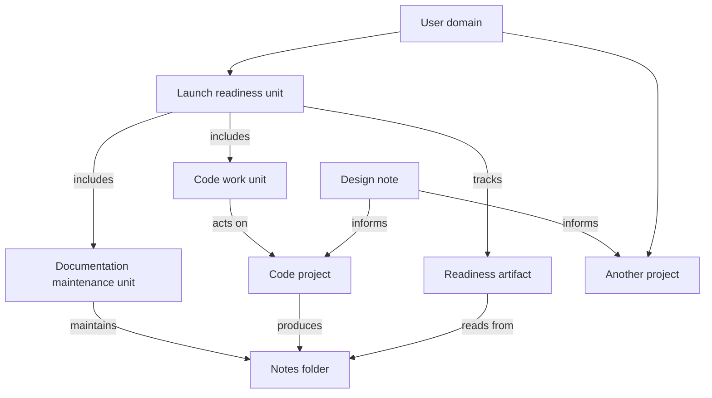

# User domain graph and composable work units

> **Status:** Implementation started — storage and intent foundation; execution integration pending
>
> **Date:** 2026-10-02
>
> **Related:** [Assistant ownership foundation](assistant-ownership-foundation-plan.md),
> [identity memory](cognitive-identity-memory-plan.md),
> [conversation context](conversation-context-addressing-and-derivation-plan.md),
> [Bots and remote execution](bots-and-authorized-remote-execution-epic.md),
> [runtime worlds](runtime-owned-worlds-epic.md), and
> [interaction and state](interaction-and-state-model.md)

## Product intent

The user is the domain. Notes, vault folders, projects, artifacts, feeds,
conversations, agents, and execution records describe relationships within that
domain. Any understood responsibility with a proper scope can be a goal, and
several responsibilities can compose into a larger unit of work.

Medousa must recognize and retain these responsibilities through ordinary
interaction. The runtime manages agent execution, continuity, dependencies, and
recovery. The user expresses intent, changes direction, and makes decisions
when needed through the surfaces they already use.

This epic establishes a shared graph of resource relationships and durable work
scopes over existing systems. It preserves the current UX and UI except where a
specific interaction needs a useful indication, result, or control. A Goals tab,
graph editor, agent management console, or manual orchestration workflow is not
required to use the capability.

For example, a vault folder can support an entire code project; that project can
produce several note folders; one design note can inform multiple projects; and
an artifact can track their combined progress. A conversation can establish work
over any of those resources. Closing that conversation does not end the work.

## Product decisions

1. **The user domain anchors meaning.** Domain membership comes from durable
   authenticated identity and explicit sharing, never the currently selected
   profile, a display name, or an inferred match across workshops.
2. **Resources remain themselves.** Notes stay notes, Coder projects keep their
   existing structure, and artifacts keep their existing surfaces and feeds.
   Linking resources does not move, upload, or duplicate their content.
3. **Relationships are explicit and navigable.** The runtime exposes typed links,
   inverse queries, provenance, and current resolution state. Agents do not have
   to reconstruct these facts from conversation prose on every turn.
4. **Work units compose.** A unit can include other units and existing resources.
   Composition records its own intent and completion or maintenance conditions.
5. **A session is an attachment.** It can originate, discuss, or execute work;
   the work identity and responsibility survive individual turns and sessions.
6. **The runtime retains responsibility.** An authorized agent, Bot, external
   provider agent, or service can initiate, coordinate, execute, review, or report
   work. Medousa Assistant is one participant, not the mandatory coordinator.
7. **Scope and authority remain distinct.** Relationships explain relevance;
   authenticated grants and destination policy determine permitted actions.
8. **Existing execution engines remain authoritative.** Forge, Stasis, turn
   workers, ACP, provider adapters, and delivery services retain their native
   execution records. The graph connects them and the work scope governs their
   coordination.
9. **Contact is independent of execution.** The initiator, coordinator, reviewer,
   reporting agent, and delivery channel may differ. Suppressing outreach does
   not cancel coordination or erase its results.
10. **Existing interfaces are the default.** New chrome must solve a demonstrated
    problem in understanding, steering, or resolving work. Users should not
    have to organize the AI before it can act on their intent.

These are proposed target decisions. Existing mode ceilings and admission
contracts continue to apply until the corresponding implementation ships.

## Reference scenarios

### Work through several agents and workshops

The user talks to Prox through Grok Bot on a remote daemon connected by a portal
to a local workshop and says:

> Send this change to codex-mini, then have Muse review the work. Let Prox tell
> me when it is ready.

The runtime resolves the exact project and requested executor configuration,
records the accepted intent and dependencies, and admits execution on the
workshop that owns the project. Prox may coordinate while Codex implements and
Muse reviews the exact resulting revision. Existing authorization can permit
the entire requested sequence; an absent grant produces a concrete blocker.
No participant needs to keep the original model turn running.

Changing the contact preference to Medousa voice, Instinct, Dots, or silence
updates the same responsibility. It does not reconstruct the plan or move the
project. Missing provider, model, review, or contact capabilities remain explicit
and are never silently substituted.

### Relationships across vault resources and projects

The user links a research folder to a project. An implementation later produces
documentation and test-notes folders. A shared design note informs that project
and a second project. All resources remain independently addressable, and the
runtime can answer both forward and inverse relationship queries.

If the user also asks to keep the documentation current, that establishes a
maintenance responsibility with relevant change triggers. Merely linking the
research folder supplies context; it does not request every possible action on
its contents.

### A larger responsibility over existing work

The user asks to keep a launch ready. The accepted scope includes a code change,
a maintained release note, and an artifact that summarizes readiness from feeds.
Each component has its own lifecycle. The aggregate evaluates a saved readiness
condition against their current evidence rather than treating every linked
object as a task that must terminate.

The same note or result may support several responsibilities. Reading shared
evidence does not launch duplicate work, and cancelling one responsibility does
not cancel executions owned by another.

## Existing foundations and current gaps

The following anchors were inspected for this proposal. They establish useful
primitives; they do not establish an end-to-end user domain graph or generic
work-unit runtime.

| Foundation | Current code | Gap addressed by this epic |
|---|---|---|
| User identity and relational memory | [identity_memory.rs](../src/identity_memory.rs), [identity_store_ext.rs](../src/identity_store_ext.rs), [user_profiles.rs](../src/user_profiles.rs) | Connect resource and work references to the user domain without duplicating learned identity or conflating semantic links with policy relationships |
| Vault metadata and backlinks | [note.rs](../src/vault/note.rs), [links.rs](../src/vault/links.rs), [contracts.rs](../src/vault/contracts.rs), [mutation.rs](../src/vault/mutation.rs) | Note links use paths; generalized resource identity, folder identity, cross-kind links, and move reconciliation are needed |
| Code work and project UX | [Forge model](../crates/medousa-forge/src/model.rs), [project explorer](../apps/medousa-home/src/lib/components/lme/explorers/LmeCodeExplorer.svelte), [undertaking bindings](../apps/medousa-home/src/lib/stores/undertakings.svelte.ts), [agent handoff](../apps/medousa-home/src/lib/utils/undertakingWorkspace.ts) | Repository groups, Forge work threads, attempts, and chat attachments need precise graph mappings; the repository grouping and the work item are distinct |
| Artifact lineage and feed relationships | [artifact_store.rs](../src/artifact_store.rs), [environment types](../crates/medousa-types/src/environment.rs), [feed_store.rs](../src/feed_store.rs), [recurring_feed.rs](../src/recurring_feed.rs) | Artifact/session lineage and component/feed bindings are separate contracts; they need shared references and explicit maintenance semantics |
| Assignment projections | [assignment types](../crates/medousa-types/src/assistant_assignment.rs), [assistant_assignments.rs](../src/assistant_assignments.rs), [ledger store](../crates/medousa-acp-client/src/coordination/store/assistant_ledger.rs) | One assignment binds a native execution; a composable responsibility above assignments and independent of a source session is missing |
| Durable events and continuation | [coordination types](../crates/medousa-types/src/coordination.rs), [owner inbox](../crates/medousa-acp-client/src/coordination/store/owner_inbox.rs), [continuation host](../src/daemon/coordination/host.rs), [owner intake](../src/daemon/coordination/owner_intake.rs) | Owner events require an owner session; the host admits peer-terminal continuation and blocks unsupported wake sources; generic work-scoped intake is needed |
| Context discovery and exact provenance | [pointer index](../src/context_pointer_index.rs), [session references](../crates/medousa-types/src/session.rs), [context derivation](../src/context_derivation.rs) | Ranked breadcrumbs and transcript manifests need a bounded graph neighborhood and work-scoped context manifest |
| Provider conversations | [external conversations](../src/daemon/external_conversations.rs), [external access](../src/daemon/external_conversations/access.rs), [provider types](../crates/medousa-types/src/external_conversation.rs) | Grok callbacks and Muse/Instinct/Dots messages need normalized assignment correlation, participant admission, and durable event subscriptions |
| Federation and contact | [peer coordination](../src/peer_coordination_mesh.rs), [completion delivery](../src/peer_completion_delivery.rs), [peer policy](../src/peer_execution_policy.rs), [channel delivery](../src/channel_delivery.rs), [Home notifications](../src/home_notifications.rs), [Live](../src/live_handlers.rs) | Work-scoped graph federation and contact decisions across reporters/transports are needed; existing return paths are not generic voice outreach |

The [Assistant ownership foundation](assistant-ownership-foundation-plan.md)
already plans durable continuation, placement, bounded dependencies, and contact
policy. This epic generalizes its target assumption that one Assistant session
owns coordination. Its ledger, receipts, grants, and recovery work should be
extended, with outstanding correctness gates retained. This proposal does not
retroactively mark those gates complete or change shipped behavior.

## Domain model

The names below describe proposed contracts, not frozen API schemas.

| Contract | Responsibility |
|---|---|
| UserDomainRef | Stable domain identity and authenticated membership or mapping across authorities |
| ResourceRef | Resource kind, authority, and stable native or daemon-issued identity; locator and revision are separate |
| RelationshipRecord | Source and target refs, relation kind, domain, owning authority, revision, provenance, and validity or tombstone state |
| WorkUnit | Accepted intent, authoritative coordinator daemon, scope revision, lifecycle policy, aggregate budget, and durable decision history |
| WorkScope | Explicit resource refs, child-unit refs, bounded selectors, dependency conditions, and context manifest |
| ParticipantBinding | Authenticated actor, adapter, role, permitted actions, exact executor/model constraints, and optional conversation attachment |
| WorkEventSubscription | Work or resource selector, event kinds, revision/generation, replay cursor, recipient binding, and admitted reaction policy |
| WorkDecision | Event evidence, deciding actor, scope revision, resulting command refs, and completion or blocker evidence |
| ContactDecision | Work/result refs, reporting participant, recipient, transport, contact preference revision, attempts, and receipts |

The user domain is the semantic root, not a claim that one daemon owns every
resource or that one global profile id is sufficient. Shared resources may be
visible in several user domains. Their native owner and governing authority
remain exact and must be rechecked on resolution and execution.

### Stable identity and resolution

Use authority-qualified references consistently with `SessionRef` and existing
workshop identity. Equal native ids on two workshops must never identify the
same resource. Keep display labels, filesystem paths, transport endpoints, and
current revisions separate from identity.

Forge work, repository groups, artifacts, feeds, and conversations have different
native identity rules. Register mappings through adapters rather than deriving
them from matching titles or incidental UI groups. Feed-backed components and
stored artifact payloads are distinct resource kinds even when one renders the
other.

Notes and folders need durable identity mappings tied to the vault root and
source class. A managed move can preserve identity; an externally observed move
must be reconciled from evidence and may remain ambiguous. Equal content hashes
do not prove identity. Deletion records a tombstone; a later file at the same
path does not silently inherit the deleted object's relationships. The identity
mapping must not require rewriting every note or replacing normal markdown.

### Relationship meaning and composition

Initial relation kinds should cover `contains`, `part_of`, `informs`, `documents`,
`produced_by`, `reads_from`, `depends_on`, and participant bindings such as
`executes`, `reviews`, and `reports`. Define direction and inverse query semantics
for each. Preserve exact source evidence for native facts and actor attribution
for declared links.

Semantic relationships can be many-to-many and cyclic. The admitted work-unit
composition and execution-dependency projection must reject cycles that would
make lifecycle evaluation or scheduling recursive without a bound. Iterative
fix/review loops are explicit bounded rounds, not unrestricted dependency cycles.

A unit is a saved scope and responsibility over part of the graph. Membership
does not include all transitively reachable resources. Folder selectors must
state whether they select current members or track future members, which event
kinds matter, and what limits apply. Changes to graph membership do not silently
expand the authority or context of an already admitted execution.

The proposed graph can represent both composition and shared context:

Work admission supplies the lifecycle conditions, triggers, and effective
authority associated with these relationships.

Parents retain their own success conditions. A completed child does not complete
its parent, and an ongoing child can satisfy a readiness condition without being
terminated. Shared child units and assignments expose whether a parent may
observe, steer, or cancel them; composition alone grants none of these rights.

## Graph storage and agent access

Expose one logical relationship contract with forward and inverse indexes.
Each relationship has one authoritative writer and revision history. Resource
metadata and backlinks are projections of that contract, not independently
editable copies that must happen to agree.

The graph references existing source stores. It does not become another store
of note bodies, repository state, provider transcripts, execution truth, or
learned identity. Bridge the existing identity graph through typed adapters;
validate support for resource kinds before deciding which records belong in
Stasis identity storage. Do not encode the entire work graph in user preferences
or treat arbitrary cognitive-memory edges as executable authority.

Commit native source facts before publishing graph observations. If a source
commit succeeds and indexing fails, retain a repairable observation or replay
marker and expose incomplete coverage. Relationship writes need revision
preconditions and durable mutation receipts. Rebuilding an index cannot invent
work intent, execution grants, or historical ownership.

Agent queries must support exact resolution, forward/inverse relationships,
responsibility membership, participants, current status, pending dependencies,
and the evidence behind a conclusion. Responses include bounded pages, stable
cursors, source revisions, provenance, and coverage or unavailable reasons.
Denied resource identities and labels must not leak through relationship counts
or inverse queries.

At turn admission, compile a small relevant graph neighborhood with exact refs
and current responsibilities. Agents can pull additional authorized context as
needed. Neither the full user graph nor raw journals belong in every prompt.
An inferred association can guide discovery; it is not a committed relationship
or an instruction until admitted through the appropriate runtime command.

## Recognizing and admitting work

Ordinary user intent can create, join, revise, or conclude work. The reasoning
agent identifies the requested outcome and relevant references; the runtime
validates and records an attributable acceptance before dispatching effects.
The user does not need to fill out a goal form or maintain an agent plan.

Admission binds the user domain, work authority, intent, scope revision,
participants, effective grants, completion or maintenance policy, contact
preference, and limits. An exact command key retries the same intent; a changed
intent is a revision or a new command, not a retry. Concurrent requests that
claim the same resource need explicit reconciliation rather than heuristic
merging based on topic similarity.

Existing project bindings, explicit resource references, and durable request
associations can join known work. Similar titles and a model's recollection are
not sufficient. If ambiguity affects which resource will be changed or what
responsibility is accepted, resolve that concrete ambiguity through the current
interaction. Avoid asking the user to manage agents or confirm routine work
already covered by their request and existing authorization.

Reading a note, rendering a feed, or linking resources does not by itself accept
a background maintenance obligation. When the user requests ongoing work, save
its trigger, freshness condition, stop condition, and limits. A completed refresh
is an occurrence of the ongoing unit; it does not finish the responsibility.

Proposed lifecycle states distinguish accepted, active, waiting, needs attention,
paused, satisfied, failed, and cancelled. Native unknown, unavailable, and
interrupted evidence remains visible in the projection. Final state names and
transitions must be defined with existing assignment lifecycle contracts in
Phase 0. Terminal execution, fulfilled intent, and successful delivery are
separate facts.

## Coordination and durable event hooks

Persist event subscriptions and dependency decisions before execution can
produce a result. Combine command admission and subscription registration in
one durable boundary, or use a recoverable outbox plus replay from an exact
source cursor. A completion racing registration must still reach its intended
recipient without relying on an in-memory callback.

Existing jobs, workflows, recurrence, turn workers, ACP sessions, and provider
conversations expose normalized events through adapters. Preserve each native
attempt, receipt, and uncertainty state. Provider transport acceptance is not
task completion. Uncorrelated messages remain messages until an admitted adapter
can establish the exact work/assignment association.

Normalize events into durable work-scoped intake. Serialize state-changing
coordination decisions by work authority and generation, while allowing distinct
executor sessions to run concurrently. Keep session serialization when a
decision also writes to a conversation. Coordinator handoff increments a fencing
generation; stale coordinators cannot issue further commands.

A reaction may advance a deterministic dependency, wake an authorized reasoning
participant, request input, or record evidence. Event data and model-written
instructions cannot mint authority. Agents can register admitted reactions and
delegate within their effective scope; each destination still validates its
own grants, adapter capabilities, and Forge leases.

Persist decision and command identities before effects, and consume the event
only after durable result correlation. Repeated or reordered events must not
regress terminal facts or relaunch an uncertain command. Recovery reconciles
started decisions from committed evidence. Missing process-local tickets or
provider custody cannot justify a replacement execution.

Apply aggregate limits for cost, elapsed time, wake rate, concurrency, retries,
causal depth, review rounds, and graph/event fan-out. Child units receive bounded
allocations under their governing responsibility. Shared execution has one
accounting identity and explicit budget attribution; observing it from another
unit does not dispatch or charge it again. Exhaustion leaves an inspectable
blocker rather than an endless chain of agents waking each other.

## Federation and authority

Every work unit has one authoritative coordinator daemon and an explicit user
domain association. Resources and assignments may belong to other workshops.
Graph reads use authenticated mappings and permission-filtered projections;
commands use existing signed mesh/portal transport and destination admission.

A portal attachment does not silently relocate the unit, copy its resources, or
merge workshop identities. Explicit custody transfer, if supported, requires a
durable fenced handoff and acknowledgment. Otherwise the original authority
retains coordination custody through reconnect and restart.

Expose incomplete graph coverage and unavailable authorities. Distinguish a
deleted resource, denied resolution, and an offline source without leaking
private metadata. Do not report an offline workshop as an empty graph or infer
work failure from a lost connection.

Filesystem authority follows the workshop daemon. Home remains a window into
that daemon's disk, with local folder pickers, Reveal, and local file conversion
only when co-located. Linking a vault resource to a remote project establishes
a reference and separately admitted access, not an upload pipeline.

## Contact and existing surfaces

Persist contact preference independently from coordinator and execution roles.
Support meaningful changes, completion, required decisions, or silence, with
an explicit reporting participant and authorized route. Resolve later changes
against the current preference revision before sending. Contact attempts and
receipts remain associated with the work outcome.

Reuse existing channel delivery, outbox, notifications, and provider send paths.
Normalize external reporting as an attributable participant action rather than
impersonating the user or pretending Medousa wrote another agent's reply.
Uncertain sends require native reconciliation; they do not authorize a duplicate
message. Mute, snooze, or unavailable delivery does not stop accepted work.

Voice contact is an adapter milestone with explicit capability and receipt
semantics. A Live invitation, an accepted in-app voice call, and PSTN/SIP calling
are different capabilities. Start with existing Live entry points where suitable;
implement actual outbound calling separately if required for the supported
product promise. Never represent an invitation or notification as a completed
voice call. Voice transport ends independently of ongoing work.

Surface results through the current conversation, project phase/review,
note updates, artifact/feed state, and activity or notification channels. Add a
small relationship or work-context affordance only where the existing surface
cannot explain relevant state. Preserve the current navigation, project/thread
vocabulary, composer, and agent selection unless a specific phase demonstrates
why a change is necessary.

## Delivery phases

### Phase 0 Contract and source audit

Map stable identities, native revisions, ownership, visibility, events, and
recovery limits for each resource and executor. Define relationship semantics,
work lifecycle transitions, aggregate completion, user-domain mappings, and
single-writer authority. Select the storage boundaries after auditing Stasis
identity capabilities and existing persistence interfaces.

**Exit gate:** executable contract fixtures cover many-to-many links, composition,
finite and ongoing work, shared evidence, cross-authority identity, and native
uncertainty. Every proposed record has an owner and replay strategy; no phase
assumes that an existing process-local guarantee is durable.

### Phase 1 Resource identity and relationship store

Implement typed resource refs, native adapters, canonical relationship writes,
forward/inverse indexes, bounded resolution, provenance, revisions, tombstones,
and repair. Start with vault notes/folders, repository and Forge work refs,
sessions, artifacts/components, and feeds. Bridge identity and existing links
without migrating content or overwriting their native stores.

**Exit gate:** one note links to several projects, a project links to several
folders, and inverse reads agree after restart. Managed rename preserves identity;
ambiguous external moves, path reuse, index failure, and revoked visibility are
handled explicitly. Queries cannot leak another user domain.

### Phase 2 Accepted work scopes and composition

Persist work units above existing assignments, with explicit intent, resource
membership/selectors, child units, lifecycle conditions, aggregate budgets, and
conversation attachments. Add idempotent create/join/revise/pause/cancel/inspect
commands through current typed tool and authenticated service boundaries.

**Exit gate:** a conversation creates one accepted responsibility; a later session
joins it by exact reference. A combined code/note/artifact unit evaluates saved
readiness correctly. Shared children, dependency cycles, scope revisions, and
cancellation cannot create duplicate work or unintended cascades.

### Phase 3 Work intake and execution adapters

Generalize the assignment ledger and owner inbox into work-scoped observation
and decision paths. Normalize native executors and provider events. Add durable
subscription registration, command fences, replay, coordinator generations,
bounded wakes, and restart reconciliation using existing Stasis scheduling.

**Exit gate:** implement/review/fix runs in distinct sessions against exact
revisions and stops at its saved bounds. Completion racing subscription, duplicate
callbacks, busy conversations, crashes around every commit/effect boundary, and
lost native custody cannot silently drop work or relaunch uncertain effects.

### Phase 4 Any authorized participant and federated coordination

Expose admitted graph/work commands and subscriptions to Medousa agents, Bots,
ACP peers, and provider agents through their supported authenticated adapters.
Extend narrow external-agent scopes deliberately; do not grant ambient admin
access. Implement work-scoped federation, source associations, exact execution
constraints, and coordinator handoff where required.

**Exit gate:** Prox through Grok Bot coordinates Codex on a portal-connected
workshop and an exact Muse review, while the originating conversation is closed.
Provider adapters must prove real send/receive and work correlation. A deterministic
adapter test is necessary but does not replace live acceptance evidence. Offline
targets, revoked grants, lost responses, and stale coordinator generations remain
recoverable without silent model/provider substitution.

### Phase 5 Maintenance and event propagation

Bind explicit note/folder maintenance and artifact/feed responsibilities to
selected native changes, schedules, freshness conditions, and occurrences.
Bound event coalescing and fan-out; fence feedback from generated updates so
the runtime does not create infinite self-triggering maintenance loops.

**Exit gate:** a maintained note updates on relevant admitted changes, unrelated
linked resources do not wake work, an artifact consumes attributable results,
and ongoing status remains truthful across missed events, cursor retention gaps,
restart, pause, and changed membership. A retention gap reconciles a snapshot;
it never claims complete unseen event history.

### Phase 6 Contact policy and useful presentation

Persist contact decisions above existing transports, including reporter choice,
silence, preference revisions, retries, and receipts. Integrate work context only
into existing surfaces that need it. Deliver and validate voice contact as an
explicit adapter capability rather than assuming Live already provides outreach.

**Exit gate:** the same work can return through Prox, Muse, Instinct, Dots, or
Medousa using a verified route, and can run silently. Changing contact preference
does not restart execution. Duplicate events, uncertain sends, expiry, and offline
recipients do not produce misleading delivery claims or duplicate logical contact.
The ordinary request requires no new goal-management workflow.

### Phase 7 Compatibility and operational closeout

Audit legacy mappings, rebuilds, retention, repair diagnostics, capability
advertisement, SDK contracts, documentation, and performance. Preserve current
single-session and project behavior while rolling out supported graph/work
capabilities incrementally.

**Exit gate:** legacy sessions, vaults, projects, artifacts, and recurring work
remain usable; migration is idempotent; supported capabilities have scenario and
live acceptance evidence; unsupported adapters remain explicit. Run repository
CI parity before the implementation PR is ready.

## Acceptance matrix

| Scenario | Required evidence |
|---|---|
| Folder supports a project | Exact bidirectional relationship; content stays on its native authority |
| Project produces several folders | Each folder has independent identity and an attributable production relation |
| Note informs multiple projects | One note identity, several links, no duplicated content or execution |
| Unit combines other units | Saved aggregate condition; child progress cannot falsely complete the parent |
| Prompt becomes work | Durable acceptance before effects; no mandatory goal form or new navigation |
| Another session continues work | Same work ref and scoped context, independent of the initiating session |
| Any admitted agent delegates | Exact participant and effective scope; existing destination checks still apply |
| Codex completes and Muse reviews | Result/revision-bound dependency and a correlated provider review receipt |
| Restart during handoff or execution | Reconciliation from durable evidence; no replacement for uncertain effects |
| Coordinator changes | New fencing generation; old coordinator cannot dispatch |
| Resource is renamed or recreated | Evidence-based identity continuity or explicit ambiguity/tombstone |
| Shared work is cancelled by one parent | Ownership rules preserve unrelated consumers and independently owned work |
| Note or artifact is maintained | Admitted triggers, freshness and occurrence evidence, bounded feedback |
| User requests silence | Coordination proceeds and results persist with no unsolicited contact |
| Reporter or contact route changes | Same unit, latest admitted preference, attributable delivery attempts |
| Remote authority is offline | Incomplete coverage and waiting/unavailable evidence, never invented emptiness |
| User visibility or grant is revoked | Reads and actions recheck scope; no leaked relationship metadata |

## Compatibility and rollout

Legacy records retain their native ids and behavior. Import only relationships
supported by exact existing bindings or source facts. A session id, matching
title, wikilink, or related feed does not retroactively establish an accepted
background obligation. Older work without sufficient provenance stays inspectable
as legacy work rather than receiving invented ownership or continuation grants.

Keep graph metadata outside ordinary note content by default; optional portable
metadata must use the same authoritative contract. Retention and deletion must
preserve the minimal evidence needed by active responsibilities, or produce a
visible unresolved reference. Removing a view or conversation is not implicit
cancellation. Existing visibility/deletion policy still applies to referenced
content and may block further use until resolved.

Ship graph inspection and linking before broad autonomous execution. Then add
finite work composition and the provider review reference flow, followed by
maintenance and contact adapters. Capabilities advertise only composed, verified
support. Do not claim Phase 4 is complete because internal ACP coordination works
without a verified external-provider path.

As each implementation lands, update [engine coordination](../docs/engine/coordination.md),
[external conversations](../docs/engine/external-conversations.md), relevant
`docs/engine/` and `docs/sdk/` contracts, generated API parity, and user guides
indexed in `docs/README.md`. This architecture proposal is not documentation of
currently shipped behavior.

## Implementation constraints and exclusions

Use existing persistence admission and `ForgeExecutionService` for blocking
Forge, filesystem, Git, and process work in async paths. Windows background
spawns use `detach_new_session` and `CREATE_NO_WINDOW`. Optional adapters are
installed through Settings → Packages under the existing binary-resolution
rules. Never claim a missing package or unavailable adapter is ready.

This epic does not require a new scheduler, wholesale graph database migration,
replacement identity or memory system, vault upload flow, project UX redesign,
autonomous scope expansion, agent marketplace, or automatic compute provisioning.
Publishing, merging, deployment, and unrelated mutations require their own
accepted intent and authority. Supporting voice contact does not imply every
telephony transport ships in the first increment.

## Decisions to resolve before implementation

- Select the graph persistence port and backend after the Phase 0 source audit;
  retain one canonical relationship writer and a repairable projection model.
- Specify note/folder identity placement, portable metadata behavior, and the
  evidence required to reconcile moves outside Medousa.
- Define authenticated user-domain mappings for portal and peer workshops,
  including shared resources and revoked membership.
- Define typed work commands, scope revision semantics, and aggregate budget
  accounting using the existing tool/admission contracts.
- Establish the provider completion/correlation capabilities needed for Muse,
  Instinct, Dots, and Grok Bot; unverified transport is an acceptance blocker for
  that adapter, not proof that the whole runtime is unavailable.
- Choose the first supported voice-contact adapter and distinguish invitation,
  acceptance, call connection, and call completion receipts.

## Progress

### First implementation slice — 2026-10-02

Stasis 0.13's identity model provides people, contacts, channel/policy profiles,
and identity relationships; its typed entity writes do not provide the native
resource/work records required here. Keep those identity entities authoritative
and bridge their authenticated user IDs with an authority-qualified
`UserDomainRef`. Do not encode projects or work scopes in user preferences.

Added `medousa-types::work_unit` contracts and a dependency-light `medousa-work`
store over the existing capability-confined `medousa-store` primitives. Each
domain has one bounded snapshot and a cross-process writer lock. Revision checks,
idempotent commands, immutable intent events, and atomic publication retain scope
and receipts together. LocalApp uses the identity frozen at turn admission;
bound principals use their authenticated owner. No active-profile fallback occurs
at graph query/write time, and no remote identity mapping is inferred.

The full daemon composes the store and exposes `work.graph`, `work.get`, and
`work.record` through its existing runtime tools and schema catalog. The current
UI is unchanged. Models register unresolved resource claims; available native
facts and revisions remain adapter-owned. Scope, composition, lifecycle, and
contact preferences are retained without execution or delivery side effects.

Executable fixtures cover restart and exact replay, many-to-many links and inverse
reads, locator changes and tombstones, path reuse, shared children, mixed
composition/dependency cycles, domain/authority isolation, cursor conflicts,
competing writers, bounded commands, corruption, symlink substitution, and
publication failures before/after rename. Locator fixtures exercise the registry
contract; they do not claim that the vault managed-move adapter has shipped.

This slice does **not** satisfy the full Phase 0–2 exit gates. Native resource
identity adapters and repair, bounded native resolution, aggregate budgets and
mixed maintenance readiness, subscriptions, coordinator decisions/generations,
provider federation, and contact delivery remain outstanding. Shipped behavior
and current limits are recorded in [the engine guide](../docs/engine/work-units.md).

Validation for this slice: 14 `medousa-work` storage tests, 3 admitted-host tests,
6 runtime action/schema tests, and 56 shared-type tests passed. The daemon library
and binary compile check, strict clippy over all targets of `medousa`,
`medousa-work`, and `medousa-types`, strict docs verification, and diff whitespace
checks passed. The full workspace/hermetic CI matrix and frontend checks have not
been run for this slice; no frontend files changed and no PR has been opened.

### Phase exit gates

- [ ] Phase 0 — contract and source audit
- [ ] Phase 1 — resource identity and relationship store
- [ ] Phase 2 — accepted work scopes and composition
- [ ] Phase 3 — work intake and execution adapters
- [ ] Phase 4 — any authorized participant and federated coordination
- [ ] Phase 5 — maintenance and event propagation
- [ ] Phase 6 — contact policy and useful presentation
- [ ] Phase 7 — compatibility and operational closeout

Phase completion requires the corresponding exit evidence; implemented storage
contracts alone do not establish autonomous execution or live provider acceptance.
