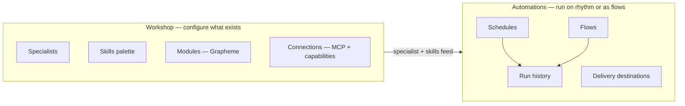
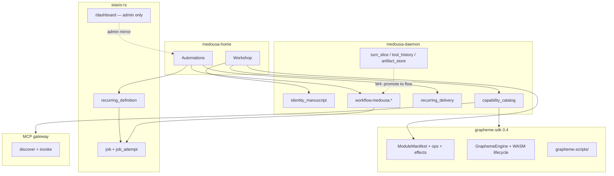
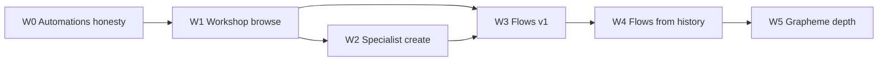

# Workshop & Automations — product plan

> **Status:** Active (2026-06)  
> **Audience:** Product + Home UI + daemon API owners  
> **Thesis:** Medousa’s **Grapheme + Stasis + MCP stack is shipped**. Home exposes a thin **Cron list** and **Skills browser** while the engine already runs agent turns, workflows, module manifests, delivery bindings, and receipt-grade tool history. This plan replaces those surfaces with a paired **Workshop** (configure what exists) and **Automations** (run it on a rhythm or as a flow).  
> **Evolution (2026-06):** Product review aligned on **Scripts Workbench** under Automations (IDE layout), **Capabilities** rename (Specialists + Connections only), and module catalog inside the Workbench left rail — see **[scripts-workbench-plan.md](scripts-workbench-plan.md)**. W0–W5.7 shipped; W6 implements the IA refactor.
> **Related:** [polish-and-package-plan.md](polish-and-package-plan.md) (P4 supersedes), [identity-manuscripts-and-recall-plan.md](identity-manuscripts-and-recall-plan.md), [recurring-delivery-roadmap.md](recurring-delivery-roadmap.md), [turn-runtime-and-lanes.md](turn-runtime-and-lanes.md), [component-daemon.md](component-daemon.md), [component-mcp-gateway.md](component-mcp-gateway.md)

---

## Problem statement

Operators report the same cluster of failures — not because the engine is broken, but because **Home does not surface what the engine already does**:

| Symptom | Root cause (engine vs UI) |
|---------|---------------------------|
| Cron ran; nothing visible in app | Output in job diagnostics, delivery channel, or Locus — **Cron UI shows timestamps only** |
| Scheduled job can’t use expected tools | Home defaults to `prompt` mode without a specialist; scheduled lane filters tools — **not explained in UI** |
| Channels feel opaque | `delivery` binding exists on register — **Home always sends `null`** |
| No per-schedule run history | Stasis stores attempts with `correlation_id = recurring_id` — **no list API or UI** |
| Skills feel like a dead catalog | Manuscripts, Grapheme modules, MCP, workflows, tool history are **agent/TUI-only** |
| Grapheme VM unused in product | Rich `ModuleManifest` metadata + script library + Stasis workflow builder — **not in Home** |
| Can’t turn “what Medousa did” into automation | `TurnPart::ToolRun` + artifact store exist — **no index or replay → workflow path** |

**Category:** Exposure + product IA — not net-new runtime capability (except tool-replay workflows in Phase W4).

---

## Product mental model (decided)

### Specialists, skills, and automations

| Term | Meaning | Engine mapping |
|------|---------|----------------|
| **Specialist** | A curated worker — persona, task template, tool policy, optional schedule defaults | `IdentityManuscript` YAML (`kind: IdentityManuscript`) |
| **Skill** | A capability a specialist may use — Grapheme module op, MCP tool, cognition tool, OpenShell script | `spec.tools.allow`, capability bindings, module manifests |
| **Automation** | Something that runs on its own — on a schedule, as a multi-step flow, or both | Stasis `recurring_definition`, `workflow.medousa.*`, delivery bindings |
| **Flow** | A multi-step automation (Grapheme / MCP / prompt steps; later tool-replay steps) | `WorkflowRunRequest`, Stasis workflow handlers |

**Rule:** A **specialist has a curated set of skills**. Skills are not standalone “workers.” The Workshop is where you configure specialists and the skill palette; Automations is where you run them.

### Execution default

| Decision | Rationale |
|----------|-----------|
| **Default `agent_turn`** for new automations | A single LLM prompt with no tools feels wrong for a product named around agency; scheduled work should use specialist tool policy |
| **`prompt` mode** | Advanced / “quick answer only” — explicit opt-in, not Home default |

### Grapheme vs OpenShell

| Path | Position |
|------|----------|
| **Grapheme** | Default — typed modules, capability bridge, Stasis job execution, normie-safe |
| **OpenShell** | Advanced — shell scripts, industry-standard escape hatch; visible on specialist detail under Advanced, not primary Workshop path |

### Stasis dashboard

| Surface | Audience |
|---------|----------|
| **`{daemon}/dashboard`** | Enterprise / team admin — infra-style inspect, streams, DLQ replay, workflow draft |
| **Home Workshop + Automations** | Operator product UI — same data, product language, no HTMX debug chrome |

Keep dashboard for corps running a shared daemon; never require normies to open it.

---

## Navigation & information architecture (decided)

**Retire:** isolated **Cron** nav item (odd, alone, underpowered).

**Promote:** **Automations** — primary nav tier, **adjacent to Workshop** (same weight as Chat / Work / Vault).

### Workshop (replaces / expands today’s “Skills” view)

| Tab | Purpose |
|-----|---------|
| **Specialists** | Browse, import, edit-lite manuscripts; run in chat; “Use in automation” |
| **Skills** | Curated capability palette — which tools/modules/MCP bindings this workshop exposes (not synonymous with specialists) |
| **Modules** | Grapheme module catalog — manifests, ops, effects, examples, script library |
| **Connections** | MCP servers + capability map (merge today’s Tools + Services tabs) |

Workshop answers: *“What can my workshop do, and who (specialist) does it?”*

### Automations (replaces Cron + future Workflow surface)

| Tab | Purpose |
|-----|---------|
| **Schedules** | Recurring jobs — cron, timezone, linked specialist, delivery |
| **Flows** | Multi-step workflows — compose, run, schedule |
| **History** | Per-automation run timeline (jobs by `correlation_id`) |

Automations answers: *“What runs on its own, when, and where do results go?”*

**Cross-links:**
- Specialist row → **Schedule with this specialist** → Automations create prefilled
- Schedule detail → **Edit specialist** → Workshop
- Flow step picker → Modules / Connections from Workshop catalog
- Successful run → Work card / vault / channel (per delivery)

---

## Stack map — what each layer provides

---

## Unified delivery model (“where results go”)

One vocabulary across Automations create/edit and list rows:

| Destination | User language | Engine path |
|-------------|---------------|-------------|
| **Here** | Show in Medousa | Work card + Automations run history |
| **Message me** | Send to Telegram / Slack / … | `recurring_delivery_store` → outbox webhook |
| **Remember** | Store in memory | Manuscript `delivery_on_complete: locus` → Locus brief |
| **Vault** | Save a note | Ask-style `complete-actions` / journal (future) |
| **Quiet** | Run without surfacing | Valid for maintenance; explicit choice |

Every schedule and flow list row shows **destination chips**. Create wizard ends with delivery picker — fixes channel confusion.

---

## Built vs exposed — gap matrix

| Capability | Engine | Home today | Target surface |
|------------|--------|------------|----------------|
| Recurring register + list | ✅ | Partial list | Automations → Schedules |
| Run history by `recurring_id` | ✅ (Stasis jobs) | ❌ | Automations → History tab |
| `delivery` on register | ✅ | Always null | Automations create/edit |
| `agent_turn` default | ✅ | `prompt` without manuscript | Automations default |
| Manuscript import | ✅ CLI | ❌ | Workshop → Specialists |
| Manuscript schedule/delivery YAML | ✅ | Not shown | Workshop detail + Automations defaults |
| Grapheme module manifests | ✅ SDK | ❌ | Workshop → Modules |
| Grapheme script library | ✅ disk | ❌ | Workshop → Modules |
| Capability / MCP catalog | ✅ | Partial toggles | Workshop → Connections |
| Workflow run/schedule | ✅ agent tools | ❌ | Automations → Flows |
| Stasis workflow builder UI | ✅ `/dashboard` | ❌ | Port to Home Flows editor |
| Tool history slices | ✅ session | ❌ | Flows “from chat” + W4 replay |
| WASM module hot-load | ✅ SDK | ❌ deferred | Workshop Modules (W5) |
| Scheduled tool allowlist | ✅ manuscript | ❌ | Workshop specialist editor |

---

## Workshop — surface specification

### Specialists tab

**List:** search, filters (Runnable, Sandbox, Imported), scope grouping.

**Detail / editor-lite:**
- Display name, description, task template
- **Skills attached** — checkbox grid from workshop skill palette (maps to `spec.tools.allow`)
- Schedule defaults from YAML (`spec.schedule.cron`, `execution_mode`)
- Delivery defaults (`spec.delivery`)
- OpenShell policy summary — **Advanced** section only
- Actions: Run in chat, Use in automation, Export, Duplicate, Open YAML (Advanced)

**Import wizard (P4.2):** folder picker → Hermes / OpenClaw / Cursor `SKILL.md` → `medousa skill-import` equivalent via Tauri.

### Skills tab (palette — not specialists)

Workshop-level **skill palette**: which capabilities exist in this installation.

- Cognition tool groups (discover/unlock model — plain language)
- Enabled Grapheme module ops (from `capabilities.toml` + overlay)
- Enabled MCP bindings (from gateway catalog)
- Effect badges: Network, Secrets, IoT, etc.

Specialists **subset** this palette in their editor. Automations inherit specialist allowlist when a specialist is linked.

### Modules tab (Grapheme)

- Browse `ModuleManifest`: id, version, ABI, exported ops, effect class, limits
- Per-op detail + curated examples
- Script library: list / search / load from `{data_dir}/grapheme-scripts/`
- Run in sandbox → Stasis `workflow.grapheme.run` (daemon proxy API)
- Template runner: `research_report`, `http_poll`, `csv_digest`
- **W5:** WASM attach via `activate_module_generation` when daemon wires SDK

### Connections tab

- MCP servers panel (polish P4.1 — health, test connection)
- Capability map: intent → Grapheme op | MCP tool
- Binding enable/disable (existing overlay)
- “Used by specialists” reverse links

---

## Automations — surface specification

### Schedules tab (replaces Cron)

**List row:**
- Title (`display_name` or prompt / specialist name)
- Next / last run
- **Last outcome** chip (success / failed / never)
- **Destination** chips
- Linked specialist (if any)
- Origin: Specialist / Chat / Manual

**Detail — tabs:**

1. **Schedule** — cron (7-field hint), timezone, enabled, specialist link, execution mode (default agent_turn)
2. **Runs** — timeline: materialized jobs for this `recurring_id`
   - Expand: status, duration, output preview, tool summary (agent_turn)
   - Actions: open full result, share, save to vault
3. **Delivery** — destination picker + channel-specific fields

**Create wizard:**
1. What — prompt or pick specialist
2. When — cron builder; prefill from specialist YAML
3. How — agent turn (default) vs quick prompt-only (Advanced)
4. Where — delivery destination

### Flows tab

**List:** active / succeeded / failed workflow runs (`workflow_id` = correlation).

**Editor** (port Stasis dashboard workflow builder — product chrome):
- Step types: **Grapheme**, **MCP**, **Prompt** (engine today)
- Step picker pulls from Workshop Modules + Connections
- Run now / Save / Schedule (promote to recurring with flow payload)

**Entry paths:**
1. Blank compose
2. NL plan → `cognition_runtime_workflow_plan` → edit → run
3. **From chat** (W4) — promote turn slice → draft flow

### History tab (optional aggregate)

Cross-automation feed: recent runs across schedules + flows, filter by outcome. Per-item drill-down links to schedule/flow detail.

---

## Daemon API — new / extended routes

Priority order for implementation:

| Route | Purpose | Phase |
|-------|---------|-------|
| `GET /v1/recurring/{id}/runs` | Jobs filtered by `correlation_id`, paginated | W0 |
| `GET /v1/recurring/{id}/delivery` | Read delivery binding | W0 |
| `PATCH /v1/recurring/{id}` | Extend: `prompt`, `manuscript_id`, `delivery`, `display_name`, `execution_mode` | W0 |
| `POST /v1/recurring/prompt` | Home sends `delivery`, default `execution_mode: agent_turn` | W0 |
| `GET /v1/grapheme/modules` | Proxy `discover_module_manifests()` or CLI | W1 |
| `GET /v1/grapheme/modules/{id}/ops` | Module op detail | W1 |
| `GET /v1/grapheme/scripts` | Script library index | W1 |
| `POST /v1/grapheme/run` | Inline source → `workflow.grapheme.run` | W1 |
| `GET /v1/workflows` | List in-memory + recent workflow jobs | W3 |
| `POST /v1/workflows/run` | Execute `WorkflowRunRequest` | W3 |
| `POST /v1/workflows/plan` | Wrap workflow_plan | W3 |
| `GET /v1/tool-history/slices` | Cross-session index (new store) | W4 |
| `POST /v1/workflows/from-slice` | Promote slice → draft flow | W4 |
| `POST /v1/grapheme/modules/load` | WASM hot-load (SDK) | W5 |
| `GET /v1/grapheme/lsp/workspace` | LSP workspace root (script library) | W5.6 |
| `WS /v1/grapheme/lsp` | `grapheme-lsp` JSON-RPC bridge | W5.6 |

Existing routes to keep using:
- `GET /v1/jobs/{job_id}/result`, `/report`
- `GET /v1/manuscripts`, `GET /v1/capabilities`, MCP gateway Tauri commands
- `GET /v1/stats`, `GET /v1/delivery/status`

---

## Phase plan — order of execution

### W0 — Automations honesty (vertical slice #1)

**Goal:** Replace Cron with Automations shell; operator sees **what ran** and **where results go**.

| ID | Deliverable | Acceptance |
|----|-------------|------------|
| W0.1 | Nav: **Automations** replaces Cron; adjacent to **Workshop** | No orphan Cron nav |
| W0.2 | `GET /v1/recurring/{id}/runs` | Returns job ids, status, `output_text` preview, timestamps |
| W0.3 | Schedule detail **Runs** tab | Timeline per recurring id |
| W0.4 | Delivery on create/edit | Picker: Here / Message / Remember / Quiet; persists binding |
| W0.5 | Default `execution_mode: agent_turn` | Quick prompt-only under Advanced |
| W0.6 | `display_name` on register + list | Scannable rows |
| W0.7 | Rename store/panel: `automations.*`, `AutomationsPanel` | Cron code deprecated alias |

**Exit:** Operator schedules a job, sees last run output in app, knows delivery target — no Telegram mystery.

**Code anchors:** `recurring_handlers.rs`, `recurring_delivery.rs`, `CronPanel.svelte` → `AutomationsPanel.svelte`, `recurring.svelte.ts`, `medousa_daemon.rs` job list by correlation.

---

### W1 — Workshop browse (vertical slice #2)

**Goal:** Surface Grapheme + script library + polished Connections — “see what’s possible without chat.”

| ID | Deliverable | Acceptance |
|----|-------------|------------|
| W1.1 | Rename Skills nav → **Workshop**; tab IA per spec | Specialists / Skills / Modules / Connections |
| W1.2 | `GET /v1/grapheme/modules` + detail | Module list with ops + effect badges |
| W1.3 | Modules tab UI | Browse, examples, run sandbox |
| W1.4 | Script library API + list UI | Search saved `.grapheme` scripts |
| W1.5 | Connections tab polish | MCP health, capability map, binding toggles |
| W1.6 | Skills tab = palette | Workshop-level enablement distinct from specialist subset |

**Exit:** Operator browses HTTP/websearch/sql modules and MCP servers without agent turn.

**Code anchors:** `grapheme-sdk` discover helpers, `grapheme_script/`, `capability_catalog.rs`, `McpServersPanel.svelte`, `SkillsPanel.svelte` → `WorkshopPanel.svelte`.

---

### W2 — Specialist create & edit

**Goal:** Import and configure specialists from Home — no terminal.

| ID | Deliverable | Acceptance |
|----|-------------|------------|
| W2.1 | Import wizard | Folder → SKILL.md → manuscript on disk |
| W2.2 | Specialist editor-lite | Task template, skills subset, schedule/delivery defaults |
| W2.3 | Scheduled allowlist preview | Show which skills work on schedule vs interactive-only |
| W2.4 | OpenShell Advanced block | Policy summary; Grapheme marked default |
| W2.5 | “Use in automation” handoff | Opens Automations create prefilled |

**Exit:** README “bring your skills” = one Home gesture.

**Code anchors:** `skill_import.rs`, `identity_manuscript.rs`, `validate_manuscript_for_scheduled_lane`, `WorkshopPanel.svelte`.

---

### W3 — Flows v1

**Goal:** Multi-step automations in Home — port Stasis workflow builder value without dashboard UX.

| ID | Deliverable | Acceptance |
|----|-------------|------------|
| W3.1 | Automations → **Flows** tab | List workflow runs |
| W3.2 | `POST /v1/workflows/run`, `GET /v1/workflows` | HTTP parity with agent tools |
| W3.3 | Flow composer UI | Add Grapheme / MCP / Prompt steps from Workshop catalogs |
| W3.4 | NL → plan → edit | `workflow_plan` wrapper |
| W3.5 | Schedule a flow | Recurring registration with flow job type or wrapper |
| W3.6 | Run history for flows | Same job result pattern as schedules |

**Exit:** Operator builds “fetch → summarize → MCP post” without agent chat.

**Code anchors:** `workflow.rs`, `workflow_plan.rs`, `runtime_tools.rs`, Stasis `dashboard/handlers.rs` (reference only).

---

### W4 — Flows from tool history (differentiated bet)

**Goal:** Turn receipt-grade tool I/O into reusable automation — Medousa-specific moat.

| ID | Deliverable | Acceptance |
|----|-------------|------------|
| W4.1 | Tool slice index | Persist searchable `TurnPart::ToolRun` metadata (session, tool, args hash, time) |
| W4.2 | Chat / Work “Save as flow step” | Promote slice → draft step |
| W4.3 | `WorkflowStepSpec::ToolReplay` (or equivalent) | Re-invoke with stored params |
| W4.4 | Secret redaction policy | MCP args sanitized at index + replay requires re-auth where needed |
| W4.5 | Flow from conversation wizard | Multi-select slices → ordered flow |

**Exit:** “Do again what you did Tuesday” becomes a flow without re-describing in NL.

**Code anchors:** `turn_parts.rs`, `turn_slice.rs`, `tool_history_tools.rs`, `artifact_store.rs`, `payload_receipt.rs`.

---

### W5 — Grapheme depth

**Goal:** Normie-grade script workshop; WASM when ready.

| ID | Deliverable | Acceptance | Status |
|----|-------------|------------|--------|
| W5.1 | In-app script editor | Save to script library | ✅ |
| W5.2 | Module allowlist editor | Workshop + per-specialist; daemon enforces on run | ✅ (workshop allowlist) |
| W5.3 | WASM module attach | `activate_module_generation` via daemon; UI shows lifecycle events | ✅ |
| W5.4 | AOT / compile hints | Advanced compile path for repeat runs | ✅ |
| W5.5 | Script editor shell | Vault-style chrome, tab strip, status bar, metadata drawer | ✅ |
| W5.6 | LSP authoring | `grapheme-lsp` via daemon WebSocket; CodeMirror diagnostics/completion/hover | ✅ |
| W5.7 | Workshop bridges | Run/save/allowlist/compile in editor; Add to flow; module insert | ✅ |

**Exit:** Grapheme replaces OpenShell for typical automation users.

**Editor thesis (W5.5–W5.7):** TUI discipline (dirty buffer, status line, run/save policy) + vault product chrome + **`grapheme-lsp`** as the authoring brain. Multi-script **tabs** for flow-building workflows. Not a general IDE — no debugger/git/extensions host.

**Code anchors:** `grapheme-sdk`, `grapheme-lsp`, `grapheme_workshop.rs`, `grapheme_script/store.rs`, `GraphemeScriptEditorPanel.svelte`, `grapheme_lsp_bridge.rs`, TUI `editor_runtime.rs`, `VaultEditor.svelte`.

**API additions (W5.6):**

| Route | Purpose |
|-------|---------|
| `GET /v1/grapheme/lsp/workspace` | Script library root URI for LSP initialize |
| `GET /v1/grapheme/lsp` (WebSocket) | JSON-RPC ↔ `grapheme-lsp` stdio bridge |

---

## Home rename / migration checklist

| Old | New |
|-----|-----|
| Nav `Cron` | Nav `Automations` |
| Nav `Skills` | Nav `Workshop` |
| `CronPanel.svelte` | `AutomationsPanel.svelte` |
| `SkillsPanel.svelte` | `WorkshopPanel.svelte` |
| `recurring.svelte.ts` | `automations.svelte.ts` (keep recurring API names internally) |
| `cron.svelte.ts` draft store | `automationDraft.svelte.ts` |
| Mobile “Schedule” | “Automations” |
| Product copy “Skills” for manuscripts | **Specialists** |
| Product copy “Skills tab” | **Skills palette** (capabilities) |

Deprecation: keep `cron` surface id as alias one release if deep links exist.

---

## Relationship to polish-and-package P4

| P4 item | Absorbed here |
|---------|----------------|
| P4.1 Services polish | W1 Connections |
| P4.2 Skills import wizard | W2.1 |
| P4.3 Specialist gallery | W2 + Workshop Specialists |
| P4.4 Grapheme Workshop lite | W1 Modules + W5 |
| P4.5 OpenShell visibility | W2.4 Advanced |
| P4.6 WASM deferred | W5.3 |

Update [polish-and-package-plan.md](polish-and-package-plan.md) P4 section to point at this doc when implementing.

---

## Success metrics (internal)

| Metric | Target |
|--------|--------|
| Post-schedule “where’s my result?” support burden | ↓ after W0 |
| % automations with explicit delivery | ↑ after W0 |
| Specialists created via Home vs CLI | ↑ after W2 |
| Flows run without chat | > 0 weekly internal dogfood after W3 |
| Flows promoted from chat slices | > 0 after W4 |

---

## Open questions (defer, not block W0)

1. **Flows job type on schedule** — recurring wraps `workflow.medousa.sequential` payload vs dedicated recurring workflow type.
2. **Work card materialization** — auto-create Work card on every successful automation run vs only when delivery = Here.
3. **Team/shared specialists** — multi-workshop manuscript sync (see [themes-and-multi-daemon-plan.md](themes-and-multi-daemon-plan.md)).
4. **Flow versioning** — edit published flow while schedules reference it.

---

## Code anchor index

| Area | Path |
|------|------|
| Manuscripts / specialists | `src/identity_manuscript.rs`, `src/manuscript_handlers.rs`, `src/skill_import.rs` |
| Recurring + delivery | `src/recurring_handlers.rs`, `src/recurring_delivery.rs`, `src/recurring_agent_turn.rs` |
| Workflows | `src/workflow.rs`, `src/workflow_plan.rs`, `src/runtime_tools.rs` |
| Grapheme | `src/tools.rs`, `src/bridge_tools.rs`, `src/grapheme_script/`, `src/grapheme_workshop.rs`, `src/grapheme_lsp_bridge.rs`, `src/runtime/stasis_wire.rs` |
| Tool history | `src/turn_slice.rs`, `src/turn_parts.rs`, `src/tool_history_tools.rs`, `src/artifact_store.rs` |
| Capabilities + MCP | `src/capability_catalog.rs`, `adapters/medousa-mcp-gateway/`, `src/mcp_daemon_handlers.rs` |
| Stasis admin dashboard | `stasis-rs` `dashboard/handlers.rs` (mounted in `src/bin/medousa_daemon.rs`) |
| Home UI | `apps/medousa-home/src/lib/components/skills/`, `components/grapheme/`, `stores/graphemeScriptEditor.svelte.ts`, `cron/`, `stores/recurring.svelte.ts` |
| Tauri bridge | `apps/medousa-home/src-tauri/src/daemon/recurring.rs`, `catalog.rs`, `mcp_gateway.rs` |

---

## Summary

**Workshop** configures specialists and the skill/module/MCP palette. **Automations** runs them on schedules and flows with visible history and explicit delivery. Default to **agent turns**, **Grapheme first**, **OpenShell advanced**, **Stasis dashboard for admins only**. Ship **W0** first — run history + delivery — then **W1** module browse, then specialist creation and flows. That sequence turns the shipped engine into the product operators already believe they have.
