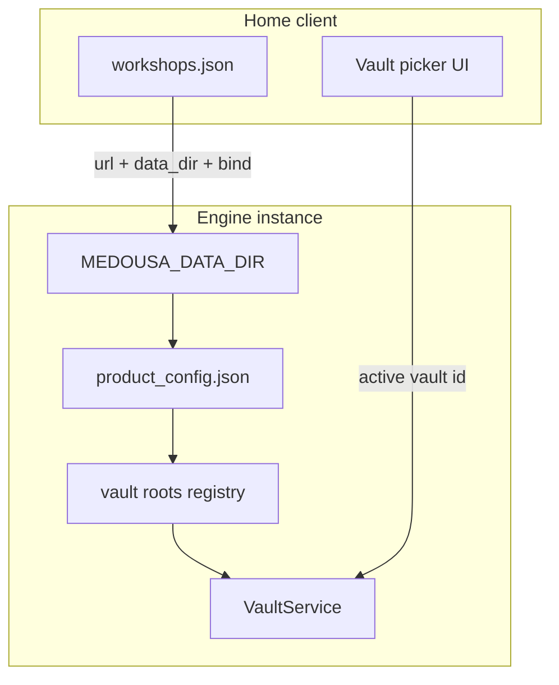

# Data directory, multi-engine, and multi-vault plan

> **Status:** Active — Phase 3 shipped (2026-06-07)  
> **Audience:** Contributors, power users  
> **Related:** [configuration-reference.md](../configuration-reference.md), [ADR-003 multi-workshop](./decisions/adr-003-multi-workshop-connections.md)

Three features stack cleanly: configurable engine storage, multiple engines on one machine, and multiple markdown vault folders per engine.

---

## Current state (gaps)

| Area | Today | Gap |
|------|--------|-----|
| **Data dir** | Hardcoded `{data_local_dir}/medousa` in 15+ places | `MEDOUSA_DATA_DIR` documented but not read |
| **Multi-engine** | Workshop registry switches URLs only | One local daemon on `:7419`; spawn does not pass data dir |
| **Vault** | Single `{data_dir}/vault/` + optional project overlay | No registry, no UI to pick a folder |

---

## Architecture overview



---

## Phase 1 — Wire `MEDOUSA_DATA_DIR` (foundation)

**Resolution order:**

1. `MEDOUSA_DATA_DIR` env (absolute path) — scripts, CI, multi-daemon spawn
2. **Bootstrap redirect** — `{default_data_dir}/medousa/data_dir` (one-line file) so Settings can relocate storage without shell env
3. Default — `dirs::data_local_dir()/medousa`

**Implementation:**

- `Medousa/src/paths.rs` — `medousa_data_dir()`, `medousa_config_dir()`, redirect helpers
- Replace duplicated helpers across engine + Home Tauri
- `spawn_daemon_background()` passes `MEDOUSA_DATA_DIR` to child process
- `medousa doctor` prints resolved paths + source label
- Settings: show paths (existing); “Change data directory…” UI deferred

**Bootstrap note:** `product_config.json` lives *inside* the data dir. Redirect file lives in the **default** location so the resolver can find a custom dir before loading product config.

---

## Phase 2 — Multi-engine on one PC

Extend local workshop registry entries:

```json
{
  "id": "work",
  "label": "Work engine",
  "url": "http://127.0.0.1:7420",
  "kind": "local",
  "dataDir": "/Users/me/AcmeWork/.medousa-engine",
  "bind": "127.0.0.1:7420"
}
```

**Behavior:**

- **Personal** workshop → default data dir, `:7419`
- **Additional local workshops** → own data dir + bind port
- Home spawns/stops daemons per workshop; registry stores pid/log path
- On `selectWorkshop()`: reconnect + refresh vault, sessions, workspace (fix known stale-vault gap)

Isolated engines on one machine: separate Locus, sessions, vault roots, secrets.

---

## Phase 3 — Multiple vaults (markdown folders)

Extend `product_config.vault` (or `vaults.json` in data dir):

```json
{
  "vault": {
    "active_root_id": "personal",
    "roots": [
      { "id": "personal", "label": "Personal", "path": null },
      { "id": "work", "label": "Work notes", "path": "/Users/me/WorkVault" }
    ]
  }
}
```

`path: null` → `{data_dir}/vault` (backward compatible).

**Engine:**

- `user_vault_root()` → `active_vault_root()`
- API: `GET /v1/vault/roots`, `PUT /v1/vault/active`
- Project overlay (`MEDOUSA_PROJECT_ROOT/.medousa/vault`) remains optional read-only layer

**Home UI:**

- Vault switcher in library sidebar
- Per-workshop vault list
- Fix `vaultFilesystem.ts` to use active engine vault root from API (not always local `{dataDir}/vault`)

---

## Recommended sequence

| Phase | Delivers | Status |
|-------|----------|--------|
| **1** | `MEDOUSA_DATA_DIR` + central paths + daemon spawn + doctor | **Shipped** (2026-06-07) |
| **2** | Per-workshop `dataDir` + bind + multi-daemon spawn | **Shipped** (2026-06-07) |
| **3a** | Vault roots registry + API | **Shipped** (2026-06-07) |
| **3b** | Home vault picker + remote vault path fix | **Shipped** (2026-06-07) |

Phase 1 unblocks 2 and 3. Phase 2 and 3 can run in parallel after 1.
