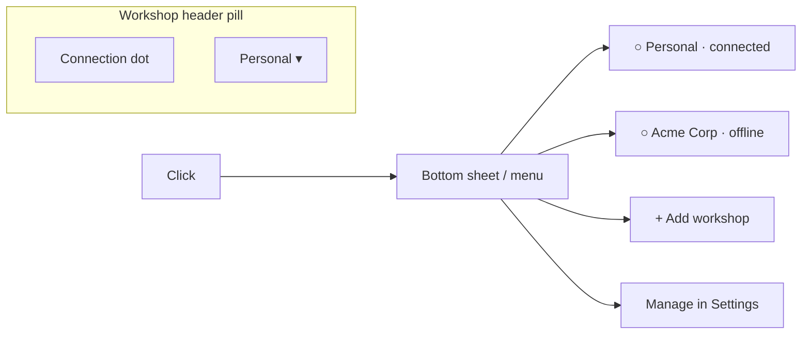
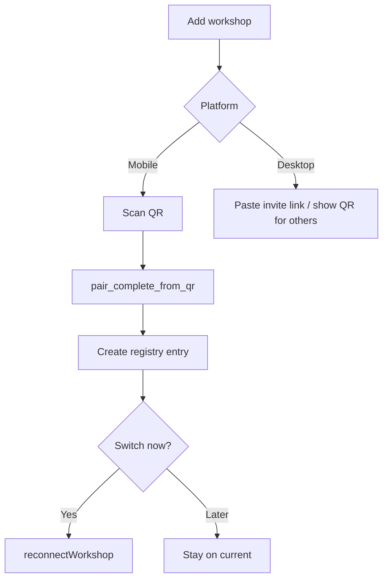
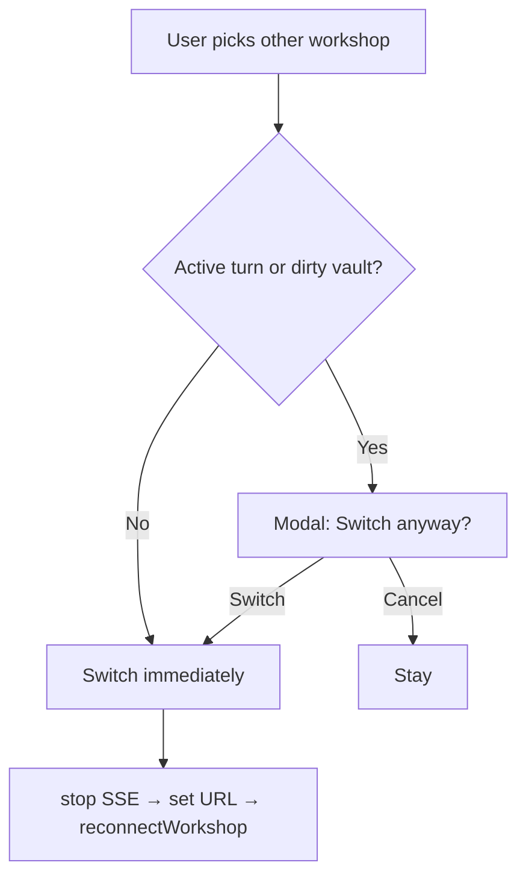

# ADR-003: Multi-workshop connections (Slack-style servers)

**Status:** Accepted (2026-06) — M0 design lock  
**Supersedes:** nothing (extends single-URL assumptions documented in [themes-and-multi-daemon-plan.md](../../../architecture/themes-and-multi-daemon-plan.md))  
**Related:** [ADR-002 user profiles](./adr-002-user-profiles.md), [iroh-p2p-pairing-plan.md](../../../architecture/iroh-p2p-pairing-plan.md), [archive/first-run-and-lan-pairing-plan.md](../../../architecture/archive/first-run-and-lan-pairing-plan.md)

## Context

Medousa Home today connects to **exactly one** Medousa Engine at a time:

- Tauri `DaemonState` holds a single `daemon_url` (`home_daemon_url.txt`).
- Mobile stores one `pairing_credentials.json` + one keychain session token.
- `connectWorkshop` / `reconnectWorkshop` tear down SSE and reload stores for that URL.

Operators want a **product story beyond personal profiles**: join a **team workshop** (company engine) from the same app — scan a QR, pick “Acme Corp” in a switcher, same shell different brain. This is **not** a new profile on their home daemon; it is a **second engine**.

Profiles (ADR-002) remain identity lanes **within** one engine. Workshops are **which engine**.

## Decision

### 1. Vocabulary

| Term | Meaning |
|------|---------|
| **Workshop / server** | One Medousa Engine instance (HTTP API + SSE + vault + profiles registry) |
| **Workshop registry** | Client-side list of known workshops + active selection |
| **Active workshop** | The single engine Home is connected to right now |
| **Profile** | Identity context on the **active** engine only (`user:{slug}`) |

UI copy: prefer **“Workshop”** in product surfaces; **“server”** ok in settings/diagnostics.

### 2. v1 connection model — one active workshop

- Home maintains a **persisted registry** of N workshops.
- **Exactly one** active workshop at a time (Slack-like switch, not multi-pane).
- Switching workshop:
  1. Confirm if destructive (mid-turn — see UX).
  2. `set_active_workshop(id)` → persist → `set_daemon_url(url)` → `reconnectWorkshop()`.
  3. Reload profiles, sessions, vault, workspace from **new** engine.
- **One workspace SSE** + interactive SSE set scoped to active workshop only.
- **Defer** background health polling on inactive workshops to M5.

### 3. Workshop kinds

| Kind | Typical URL | Pairing | Example |
|------|-------------|---------|---------|
| `local` | `http://127.0.0.1:7419` | None | Desktop personal engine |
| `paired` | LAN hint + Iroh fallback | QR v2 ceremony | Phone → Mac, or join team engine |

`local` workshops may use Tauri autostart (`daemon_service.rs`). `paired` workshops use [`medousa-sdk-iroh`](../../../crates/medousa-sdk-iroh/) `WorkshopTransport` (LAN probe → Iroh + session token).

### 4. Persistence

**Registry file** (canonical):

```
{data_local_dir}/medousa/workshops.json
```

Schema: `WorkshopRegistry` v1 — see `apps/medousa-home/src/lib/types/workshopRegistry.ts` and `workshops.schema.json`.

**Per-workshop pairing credentials** (paired kind only):

```
{data_local_dir}/medousa/workshops/{workshop_id}/pairing.json
```

Migrates today’s monolithic `pairing_credentials.json` into the active paired workshop entry on first load (M1).

**Legacy files** (deprecated after migration):

| Legacy | M1 migration |
|--------|----------------|
| `home_daemon_url.txt` | Seed `personal` local workshop URL |
| `pairing_credentials.json` | Import into paired workshop or sole `paired` entry |

**Keychain session tokens:** account suffix by `workshop_device_id` (not global singleton). Format: `medousa.pairing` / `session_token.{workshop_device_id}`.

**Reserved workshop id:** `personal` — default local workshop created on first run (desktop). Never deleted; may rename label only.

### 5. Transport & security

- Pairing establishes **trust** (existing Ed25519 + session token). Unchanged ceremony.
- Iroh provides **reachability** when off-LAN. Unchanged.
- Switching workshops **must** call `workshop_transport::invalidate_workshop_route_cache()`.
- Team QR join does **not** imply SSO or org auth in v1 — copy must say “connect to this operator’s engine.”

### 6. Profiles vs workshops (hard rule)

- Profile APIs (`/v1/identity/profiles*`) are called against **active workshop URL only**.
- Profile switcher UI is **nested under active workshop** — never lists profiles across workshops.
- Export/import profile bundles are scoped to active workshop.
- Vault paths, sessions, workspace cards, Locus memory — all **workshop-local**.

### 7. Client-only state

Stored in registry `clientState` or localStorage keyed by `workshop_id`:

- Last chat session id (optional, M3)
- Preferred color theme override (T4, optional)

Not synced across devices in v1.

## UX (M0 wireframes)

### Workshop switcher (header pill — mirrors profile switcher)



- **Dot:** green = health ok, amber = degraded, gray = offline (active only in v1).
- **Desktop:** pill near connection status or vault header (TBD in M1 — reuse `ProfileSwitcherCompact` layout).
- **Mobile:** sibling to profile pill or combined “context” row if crowded.

### Add workshop



- Desktop “join team” path: paste `medousa://pair/2.0?...` or enter base URL + scan from camera (future).
- After pair: default label = QR `n=` peer name or “Workshop {device_id prefix}`.

### Switch with mid-turn guard



Reuse patterns from profile switch “new chat” nudge — stronger for workshop switch (data is on another engine).

### Settings → Basement → Workshops

Replace single URL field with:

- List of workshops (label, URL, kind, last connected)
- Edit label / remove paired workshop (not `personal`)
- Advanced: manual URL override per workshop (ops)

## Implementation map (M1+)

| Layer | M1 work |
|-------|---------|
| **Types** | `workshopRegistry.ts` (done M0) |
| **Tauri** | `workshops.json` read/write; `list_workshops`, `set_active_workshop`, migrate legacy |
| **Tauri** | `DaemonState` continues single URL — set from active registry entry |
| **Tauri** | Multi pairing files + keychain account per `workshop_device_id` |
| **JS** | `workshops.svelte.ts` store; `selectWorkshop(id)` wraps `reconnectWorkshop` |
| **UI** | `WorkshopSwitcherCompact.svelte` (fork profile switcher) |
| **UI** | Settings workshops section; Add workshop flow |

## Consequences

- **Breaking:** none for existing single-URL users after transparent migration to `personal` workshop.
- **Testing:** matrix of local-only, paired-only (mobile), local + paired switch, mid-turn cancel.
- **Marketing:** M2 QR join demo requires M1 registry + switcher only; no daemon-side multi-tenancy changes.
- **Out of scope v1:** cross-workshop search, unified inbox, multi-active SSE, org admin portal.

## Code anchors (current baseline)

| Area | Path |
|------|------|
| Single URL | `apps/medousa-home/src-tauri/src/daemon/mod.rs` |
| Reconnect | `apps/medousa-home/src/lib/workshopConnection.ts` |
| Pairing creds | `apps/medousa-home/src-tauri/src/pairing_client.rs` |
| Transport | `apps/medousa-home/src-tauri/src/workshop_transport.rs` |
| Profile switcher UX | `apps/medousa-home/src/lib/components/mobile/ProfileSwitcherCompact.svelte` |
| Connection settings | `apps/medousa-home/src/lib/components/settings/SettingsBasementSection.svelte` |

## Open questions (resolve in M1, not blockers)

1. Desktop workshop switcher placement — vault header vs global status bar.
2. Max workshops soft cap (suggest 10) with UI warning.
3. Whether `personal` local workshop hides URL edit on normie path.
