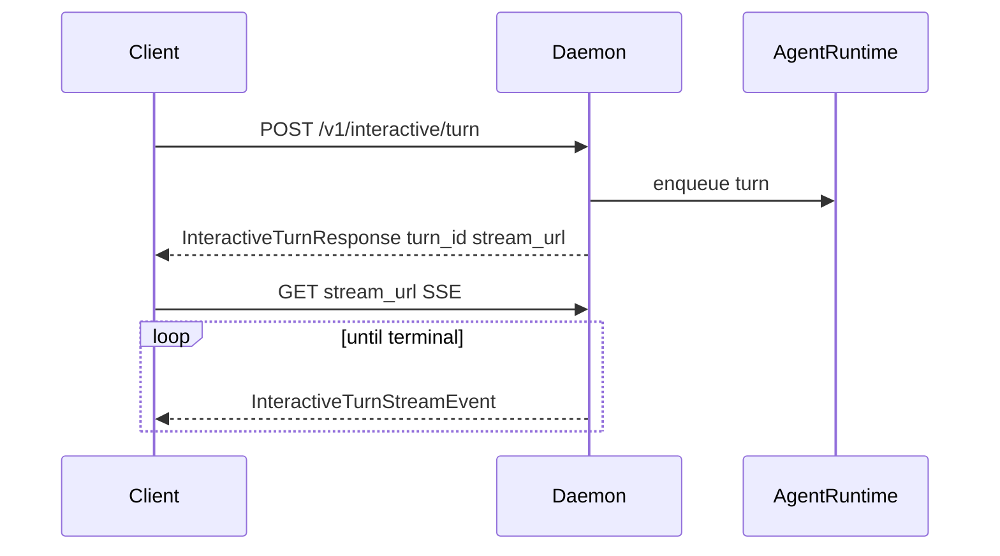

# Interactive streaming

**Audience:** integrator

Medousa interactive chat uses a **two-step** contract: start a turn via POST, then open a **separate SSE** stream.

Deep internals: [turn-runtime-and-lanes.md](../../architecture/turn-runtime-and-lanes.md)

---

## Flow

1. **POST** [`/v1/interactive/turn`](http-api.md) with `InteractiveTurnRequest` (session, prompt, surface context, attachments).
2. Response `InteractiveTurnResponse` includes `turn_id` and **`stream_url`** (typically `/v1/interactive/turn/{turn_id}/stream`).
3. **GET** `stream_url` with `Accept: text/event-stream`.
4. Parse each SSE data line as `InteractiveTurnStreamEvent` until `terminal: true`.

SDK: [`docs/sdk/interactive-streaming.md`](../sdk/interactive-streaming.md)

---

## Cancel

**POST** `/v1/sessions/{session_id}/active-turn` cancels the in-flight interactive turn for that session.

SDK gap: use `client.http().post_empty(...)` or add a wrapper. Tauri: `session_cancel_active_turn`.

---

## Event schema (`InteractiveTurnStreamEvent`)

| Field | Purpose |
|-------|---------|
| `event_type`, `phase`, `message` | High-level status |
| `content_delta`, `reasoning_delta` | Streaming text |
| `final_text` | Completed assistant message |
| `tool_names`, `tool_run_id`, `tool_name`, `tool_status` | Tool bus |
| `tool_input_summary`, `tool_output_summary` | Tool summaries |
| `ui_artifact` | New inline/panel/fullscreen HTML artifact |
| `previous_artifact_id`, `root_artifact_id` | Artifact revision (`artifact_updated` semantics) |
| `budget_request_id`, `requested_rounds` | Turn budget pause |
| `work_id` | Workspace card handoff |
| `terminal` | Stream complete when `true` |
| `operator_message`, `debug_message` | UI whispers |

Types: `medousa_types::daemon_api::InteractiveTurnStreamEvent`

---

## Reattach & reliability

If the SSE connection drops before `terminal`, poll `GET /v1/sessions/{session_id}/active-turn` and re-open the stream URL if the turn is still running.

Runbook: [connection-reliability.md](../runbooks/connection-reliability.md)

---

## Surfaces

Set `TurnSurfaceContext` in `InteractiveTurnRequest` so the runtime knows channel capabilities (e.g. `supports_ui_artifacts` for HTML presentations).

App reference: `apps/medousa-home/src/lib/stores/chat.svelte.ts`
