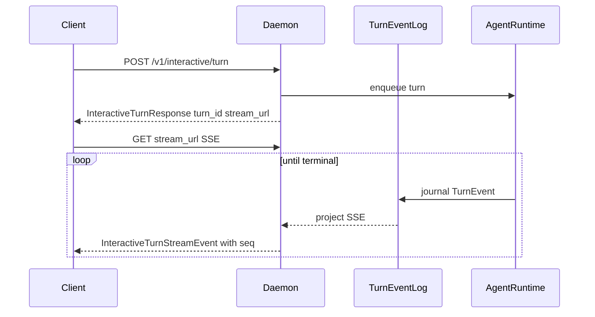
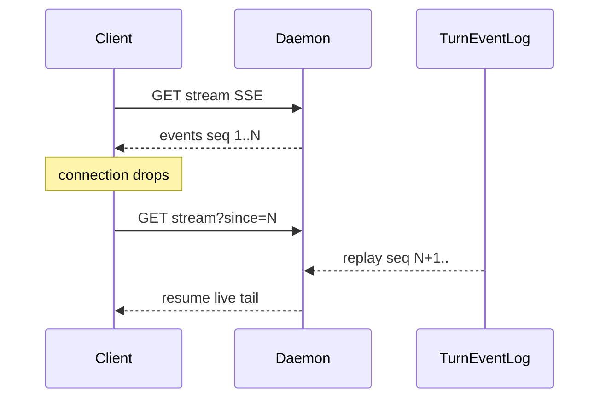

# Interactive streaming

**Audience:** integrator

Medousa interactive chat uses a **two-step** contract: start a turn via POST, then open a **separate SSE** stream.

Deep internals: [turn-runtime-and-lanes.md](../../architecture/turn-runtime-and-lanes.md) · durable spine ADR: [adr-004-durable-turn-spine.md](../architecture/decisions/adr-004-durable-turn-spine.md)

---

## Flow


```mermaid
sequenceDiagram
  participant Client
  participant Daemon
  participant Spine as TurnEventLog
  participant Runtime as AgentRuntime

  Client->>Daemon: POST /v1/interactive/turn
  Daemon->>Runtime: enqueue turn
  Daemon-->>Client: InteractiveTurnResponse turn_id stream_url
  Client->>Daemon: GET stream_url SSE
  loop until terminal
    Runtime->>Spine: journal TurnEvent
    Spine-->>Daemon: project SSE
    Daemon-->>Client: InteractiveTurnStreamEvent with seq
  end
```

1. **POST** [`/v1/interactive/turn`](http-api.md) with `InteractiveTurnRequest` (session, prompt, surface context, attachments).
2. Response `InteractiveTurnResponse` includes `turn_id` and **`stream_url`** (typically `/v1/interactive/turn/{turn_id}/stream`).
3. **GET** `stream_url` with `Accept: text/event-stream` for the legacy v1 DTO, or explicitly negotiate the typed v2 envelope as described below.
4. Track **`seq`** on every event. For v1, parse each SSE data line as `InteractiveTurnStreamEvent` until `terminal: true`.
   `worker_ack` and `workshop_ack` are non-terminal host handoff boundaries:
   release the host composer there, then follow the background result through
   the stream or session history rather than holding the composer until the
   workshop synthesis arrives.

SDK: [`docs/sdk/interactive-streaming.md`](../sdk/interactive-streaming.md)

---

## Cancel

**POST** `/v1/sessions/{session_id}/active-turn` cancels the in-flight interactive turn for that session.

Rust/Python SDK: `client.interactive().cancel(session_id)`. Tauri: `session_cancel_active_turn`.

Accepted cancellation interrupts provider and tool waits at the execution
boundary. Parallel tool invocations retain the same turn authority and are
aborted with their batch owner. Model-stream pumps are drained on normal
completion and aborted if the turn or inference attempt is dropped, preventing
late detached deltas from outliving the cancelled turn.

---

## Event schema (`InteractiveTurnStreamEvent`)

| Field | Purpose |
|-------|---------|
| `seq` | Monotonic per-turn sequence — **reconnect cursor** (`?since=<last_seq>`) |
| `event_type`, `phase`, `message` | High-level status |
| `content_delta`, `reasoning_delta` | Streaming text |
| `final_text` | Completed assistant message |
| `tool_names`, `tool_run_id`, `tool_name`, `tool_status` | Tool bus |
| `tool_input_summary`, `tool_output_summary` | Tool summaries |
| `ui_artifact` | New inline/panel/fullscreen HTML artifact |
| `previous_artifact_id`, `root_artifact_id` | Artifact revision (`artifact_updated` semantics) |
| `budget_request_id`, `requested_rounds` | Turn budget pause |
| `work_id` | Workspace card handoff |
| `terminal` | Stream complete when `true` |
| `operator_message`, `debug_message` | UI whispers |

Types: `medousa_types::daemon_api::InteractiveTurnStreamEvent`

### Typed v2 negotiation

The existing stream URLs also serve the typed v2 contract. Request it explicitly:

```http
Accept: text/event-stream; medousa-version=2
```

The response repeats that media type in `Content-Type` and includes
`Vary: Accept`. An unsupported explicit `medousa-version` returns `406 Not
Acceptable`. Missing version negotiation remains v1 for compatibility.

Each v2 SSE message uses `event: turn_stream_v2`; its `data` is a
`TurnStreamEnvelopeV2` with `schema_version`, `turn_id`, monotonic `seq`,
`emitted_at_utc`, and a required tagged `event`. Terminality comes from the
typed event variant instead of a separate boolean. Live delivery and
`?since=` replay use the same sequenced journal projection.

Types: `medousa_types::turn_stream::{TurnStreamEnvelopeV2, TurnStreamEventV2}`

---

## Reattach & reliability

The daemon journals every turn event to a **durable spine** (`TurnEventLog` on disk). SSE is a projection of that journal — not an in-memory-only buffer.

**Primary reconnect path:** re-open the same `stream_url` with `?since=<last_seq>`:

```
GET /v1/interactive/turn/{turn_id}/stream?since=42
Accept: text/event-stream; medousa-version=2
```

The server replays events with `seq > 42`, then continues live. Dedupe any duplicate `seq` client-side after replay.


```mermaid
sequenceDiagram
  participant Client
  participant Daemon
  participant Spine as TurnEventLog

  Client->>Daemon: GET stream SSE
  Daemon-->>Client: events seq 1..N
  Note over Client: connection drops
  Client->>Daemon: GET stream?since=N
  Spine-->>Daemon: replay seq N+1..
  Daemon-->>Client: resume live tail
```

**Fallback** when `turn_id` is unknown: poll `GET /v1/sessions/{session_id}/active-turn`, then open the returned stream URL with `?since=`.

SDK helpers: `stream_reconnecting` / `stream_turn_reconnecting` (Rust and Python). Home app: [`reconnect.ts`](../../apps/medousa-home/src/lib/stream/reconnect.ts).

Runbook: [connection-reliability.md](../runbooks/connection-reliability.md)

---

## Surfaces

Set `TurnSurfaceContext` in `InteractiveTurnRequest` so the runtime knows channel capabilities:

| Flag | Promise made by the client |
|------|----------------------------|
| `supports_liquid_markdown` | Parses and hydrates Medousa Liquid Markdown embeds in replies. Enables Liquid authoring guidance only. |
| `supports_ui_artifacts` | Presents sandboxed HTML/scenes and may expose UI-artifact tools. It is not required for Liquid Markdown. |
| `supports_browser_host` | Can run Agent Browser through a local host or client WebView. |

Capability flags are independent. In particular, Markdown-capable extensions should set
`supports_liquid_markdown=true` while leaving `supports_ui_artifacts=false` unless they
also implement the artifact runtime.

App reference: `apps/medousa-home/src/lib/stores/chat.svelte.ts`
