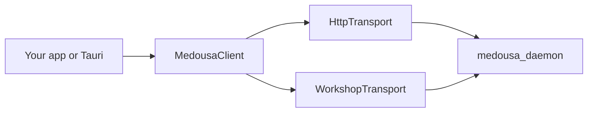

# Medousa SDK

Shared client libraries for talking to **medousa_daemon** without duplicating HTTP paths or serde types.

**Docs:** [API reference](api-reference.md) · [Python SDK](python.md) · [Interactive streaming](interactive-streaming.md) · [Transports](transports.md) · [Artifacts](artifacts.md) · [Examples](examples/README.md)

## Packages

| Package | Role |
|---------|------|
| [`medousa-types`](../../crates/medousa-types/) | Serde DTOs for daemon API (`daemon_api`, `session`, `local`, …) |
| [`medousa-sdk`](../../crates/medousa-sdk/) (Rust) | `MedousaClient` + `HttpTransport` + reconnecting SSE |
| [`medousa-sdk`](../../python/medousa-sdk/) (Python) | Async `MedousaClient`, SSE streaming, reconnecting SSE, `MedousaClientSync` |
| [`medousa-sdk-iroh`](../../crates/medousa-sdk-iroh/) | `WorkshopTransport` — pooled LAN + route cache + optional Iroh hook |
| [`medousa-host`](../../crates/medousa-host/) | Spawn `medousa_local`, binary resolution, bind probes |

## Quick start (async)

```rust
use std::sync::Arc;
use medousa_sdk::{HttpTransport, MedousaClient};

let client = MedousaClient::with_transport(
    Arc::new(HttpTransport::new()),
    "http://127.0.0.1:7419",
);

let health = client.health().get().await?;
let sessions = client.sessions().list(20).await?;
```

## `MedousaClient` accessors

| Accessor | Purpose |
|----------|---------|
| `health()` | Liveness |
| `http()` | Generic GET/POST/PUT/PATCH/DELETE |
| `ingest()` | Channel ingest |
| `local_models()` | Local inference probe & downloads |
| `jobs()` | Headless ask |
| `recurring()` | Cron prompts |
| `sessions()` | Session history & append |
| `interactive()` | Start streaming turn |
| `runtime()` | Artifacts, config, stage-route commands |
| `capabilities()` | Capability catalog |
| `mcp_gateway()` | Gateway status |
| `budget()` | Turn budget approve/deny |
| `vault()` | Multi-root notes library |
| `calendar()` | Personal calendar (vault `.ics`) |
| `workspace()` | Work board cards & feed |

Full method table: [api-reference.md](api-reference.md) · contract: [`../../sdk-contract/manifest.yaml`](../../sdk-contract/manifest.yaml)

## Transport diagram



See [transports.md](transports.md).

## Tauri desktop & medousa-home

`apps/medousa-home/src-tauri/src/daemon/sdk.rs` builds a [`medousa-sdk-iroh`](../../crates/medousa-sdk-iroh/) `WorkshopTransport` (pooled LAN clients + route cache; mobile adds `TauriIrohHook` for Iroh tickets). JSON daemon calls route through [`workshop_http.rs`](../../apps/medousa-home/src-tauri/src/daemon/workshop_http.rs).

Interactive/workspace SSE in the webview uses Tauri event bridges plus [`reconnect.ts`](../../apps/medousa-home/src/lib/stream/reconnect.ts) for `?since=<seq>` replay — there is no published `@medousa/sdk` npm package for Tauri. Multipart uploads still use legacy `workshop_transport` byte helpers.

Artifact routes use typed `client.runtime().artifact_*()`.

Spawn offline brain via `medousa_host` — **not** `POST /v1/local/engine/load` (removed; daemon is probe-only).

## Types

Rust: `medousa_types`. Python: `medousa.types` (generated — see [python.md](python.md)).

```rust
use medousa_types::{ArtifactFetchRequest, ArtifactListUiRequest};

let list = client.runtime().artifact_list_ui(&ArtifactListUiRequest {
    session_id: None,
    limit: 50,
    query: None,
}).await?;
```

## Sync clients

`BlockingMedousaClient` (Rust) and `MedousaClientSync` (Python) mirror the same accessors without SSE.

## Channel adapters & TUI

Telegram/Discord/Slack bins use `client.ingest().post()`. TUI uses `MedousaClient` in `src/bin/medousa_tui/daemon_commands.rs`.

## Contributing

When adding SDK methods, update [`sdk-contract/manifest.yaml`](../../sdk-contract/manifest.yaml), [api-reference.md](api-reference.md), and [../engine/http-api.md](../engine/http-api.md).
