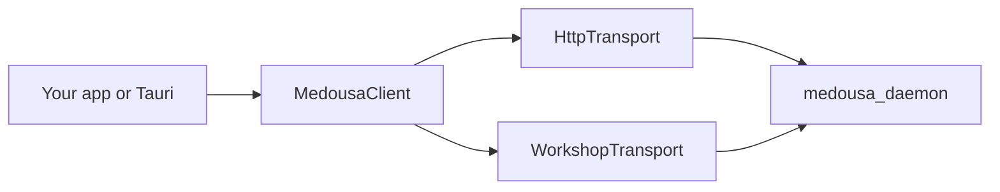

# Medousa SDK

Shared client libraries for talking to **medousa_daemon** without duplicating HTTP paths or serde types.

**Docs:** [API reference](api-reference.md) · [Python SDK](python.md) · [Interactive streaming](interactive-streaming.md) · [Transports](transports.md) · [Artifacts](artifacts.md) · [Examples](examples/README.md)

Coder tool contracts and local diagnostics: [Usage attribution and batch edits](../engine/coder-efficiency.md).

Human project shells use the native-only `sessions.workspace_shell.post`
operation and the selected workshop's `AdminExecute` authority. Its folder
context does not grant a Forge execution lease or produce sealed task evidence;
see [Coding engine integration](../engine/coding-engine.md#daemon-routes).

Assistant ownership queries and signed paired-workshop completion retrieval:
[Coordination contracts](../engine/coordination.md). The peer-only completion
query requires the exact saved proposal association and signed mesh envelopes;
an ordinary bearer-only SDK request does not supply that authority.

Full-daemon assistant handoffs expose typed sender responsibility, completion,
callback and contact policy. Direct admission is tied to the current human
request; proposal admission remains available. Inbox records carry optional
`PeerHandoffSummary` metadata, and sender review requires the exact terminal receipt.
See [Sender-owned handoffs](../engine/coordination.md#sender-owned-local-handoffs).

Project Markdown images use `forge.items.by_work_id.source.get` with query
`path=<project-relative-image>&image=true`. The JSON response is
`{path,mime,bytes_base64}` instead of the text source response. PNG, JPEG, GIF,
WebP, SVG, and AVIF reads are capped at 2 MiB and remain scoped to the governed
workshop working copy, including symlink and `.git` restrictions. Omitting
`image` preserves the existing source response. See [Forge routes](../engine/forge.md).

Admitted assistant turns can use `work.create_project` to create an owned
undertaking in an existing workshop Git repository, including one with no
commits. Creation returns native graph references and a Forge work ID without
binding the assistant chat or launching an executor. See
[Undertaking creation](../engine/work-units.md#undertaking-creation-from-an-admitted-turn).

Work-scoped native execute/review uses runtime actions `work.coordinate` and
`work.coordination`. Provider participants access owner-domain work through
`POST /v1/work/query` and `POST /v1/work/mutate` using scoped, revocable credentials.
Registration accepts exact native proposal IDs and each stage waits for its
existing grant. Registered proposal dispatch can return the existing nullable
`binding` while queued. See [Work scopes and native coordination](../engine/work-units.md#native-executor--reviewer-coordination)
and [Provider work participant adapters](../engine/external-conversations.md#work-participant-adapters).

Work event inboxes use `work.events` plus explicit actor-bound acknowledgment.
Provider sends can attach exact `work` scope metadata, and current self Work
credentials report outcomes through
`external_conversations.by_id.work_events.post`. These callbacks retain exact
request/result association and qualified revision-bound review evidence without
automatically satisfying work. See [Correlated work callbacks](../engine/external-conversations.md#correlated-work-callbacks).

## Packages

| Package | Role |
|---------|------|
| [`medousa-types`](../../crates/medousa-types/) | Serde DTOs for daemon API (`daemon_api`, `session`, `local`, …) |
| [`medousa-sdk`](../../crates/medousa-sdk/) (Rust) | `MedousaClient` + `HttpTransport` + reconnecting SSE |
| [`medousa-sdk`](../../python/medousa-sdk/) (Python) | Async `MedousaClient`, SSE streaming, reconnecting SSE, `MedousaClientSync` |
| [`medousa-sdk-iroh`](../../crates/medousa-sdk-iroh/) | `WorkshopTransport` — pooled LAN + route cache + optional Iroh hook |
| [`medousa-host`](../../crates/medousa-host/) | Spawn `medousa_local`, binary resolution, bind probes |
| [`@medousa/client`](../../packages/medousa-client/) | Dependency-free TypeScript client for external surfaces (VS Code, Neovim, Obsidian) |

## Quick start (async)

```rust
use std::sync::Arc;
use reqwest::header::{AUTHORIZATION, HeaderMap, HeaderValue};
use medousa_sdk::{HttpTransport, MedousaClient};

let bearer = std::env::var("MEDOUSA_TOKEN")?;
let mut headers = HeaderMap::new();
let mut authorization = HeaderValue::from_str(&format!("Bearer {bearer}"))?;
authorization.set_sensitive(true);
headers.insert(AUTHORIZATION, authorization);
let http = reqwest::Client::builder().default_headers(headers).build()?;
let client = MedousaClient::with_transport(
    Arc::new(HttpTransport::with_client(http)),
    "http://127.0.0.1:7419",
);

let health = client.health().get().await?;
let sessions = client.sessions().list(20).await?;
```

The bearer is required for protected routes even on loopback. External clients
should obtain a paired credential and store it in an OS secret store; do not
reuse Medousa's private first-party local credentials.

## `MedousaClient` accessors

| Accessor | Purpose |
|----------|---------|
| `health()` | Protected runtime health and contract identity |
| `http()` | Generic GET/POST/PUT/PATCH/DELETE |
| `ingest()` | Channel ingest |
| `local_models()` | Local inference probe & downloads |
| `jobs()` | Headless ask |
| `recurring()` | Cron prompts |
| `sessions()` | Session history & append |
| `interactive()` | Start streaming turn |
| `runtime()` | Artifacts, config, stage-route commands |
| `capabilities()` | Capability catalog |
| `mcp_gateway()` | Gateway status |
| `budget()` | Turn budget approve/deny |
| `vault()` | Multi-root notes library |
| `calendar()` | Personal calendar (vault `.ics`) |
| `workspace()` | Work board cards & feed |

Full method table: [api-reference.md](api-reference.md) · contract: [`../../sdk-contract/openapi.json`](../../sdk-contract/openapi.json)

Provider-hosted Muse and Grok Bot conversations currently use the generic authenticated
`http()` transport. See the [external conversation HTTP contract](../engine/external-conversations.md)
for endpoints, event IDs, and callback authentication.

## Transport diagram


```mermaid
flowchart LR
  App[Your app or Tauri]
  SDK[MedousaClient]
  Http[HttpTransport]
  Workshop[WorkshopTransport]
  Daemon[medousa_daemon]

  App --> SDK
  SDK --> Http
  SDK --> Workshop
  Http --> Daemon
  Workshop --> Daemon
```

See [transports.md](transports.md).

## Tauri desktop & medousa-home

`apps/medousa-home/src-tauri/src/daemon/sdk.rs` builds a [`medousa-sdk-iroh`](../../crates/medousa-sdk-iroh/) `WorkshopTransport` (pooled LAN clients + route cache; mobile adds `TauriIrohHook` for Iroh tickets). JSON daemon calls route through [`workshop_http.rs`](../../apps/medousa-home/src-tauri/src/daemon/workshop_http.rs).

Interactive/workspace SSE in the webview uses Tauri event bridges plus [`reconnect.ts`](../../apps/medousa-home/src/lib/stream/reconnect.ts) for `?since=<seq>` replay — there is no published `@medousa/sdk` npm package for Tauri. Multipart uploads still use legacy `workshop_transport` byte helpers.

Artifact routes use typed `client.runtime().artifact_*()`.

Spawn offline brain via `medousa_host` — **not** `POST /v1/local/engine/load` (removed; daemon is probe-only).

## Types

Rust: `medousa_types`. Python: `medousa.types` (generated — see [python.md](python.md)).

```rust
use medousa_types::{ArtifactFetchRequest, ArtifactListUiRequest};

let list = client.runtime().artifact_list_ui(&ArtifactListUiRequest {
    session_id: None,
    limit: 50,
    query: None,
}).await?;
```

## Sync clients

`BlockingMedousaClient` (Rust) and `MedousaClientSync` (Python) mirror the same accessors without SSE.

## Channel adapters & TUI

Telegram/Discord/Slack bins use `client.ingest().post()`. TUI uses `MedousaClient` in `src/bin/medousa_tui/daemon_commands.rs`.

## Contributing

When adding SDK methods, register them on `DeclaredRouter` / `ContractRouter` and regenerate `sdk-contract/openapi.json` with `UPDATE_API_CONTRACT=1 cargo test -p medousa --lib daemon::contract::tests::checked_in_contract_artifacts_match_generation`.
